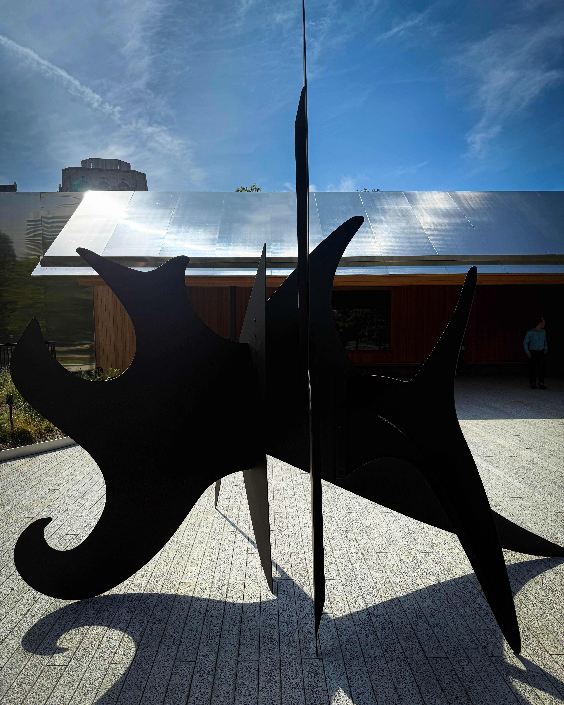
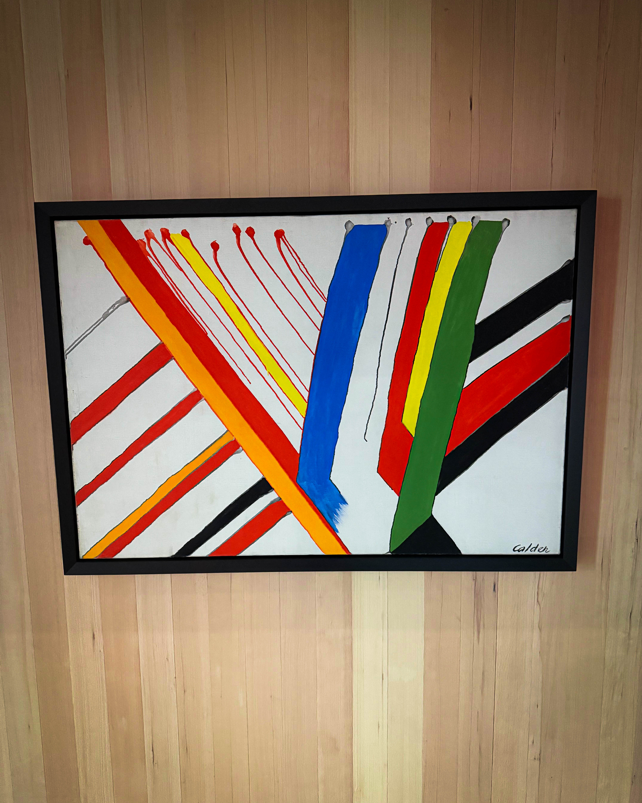
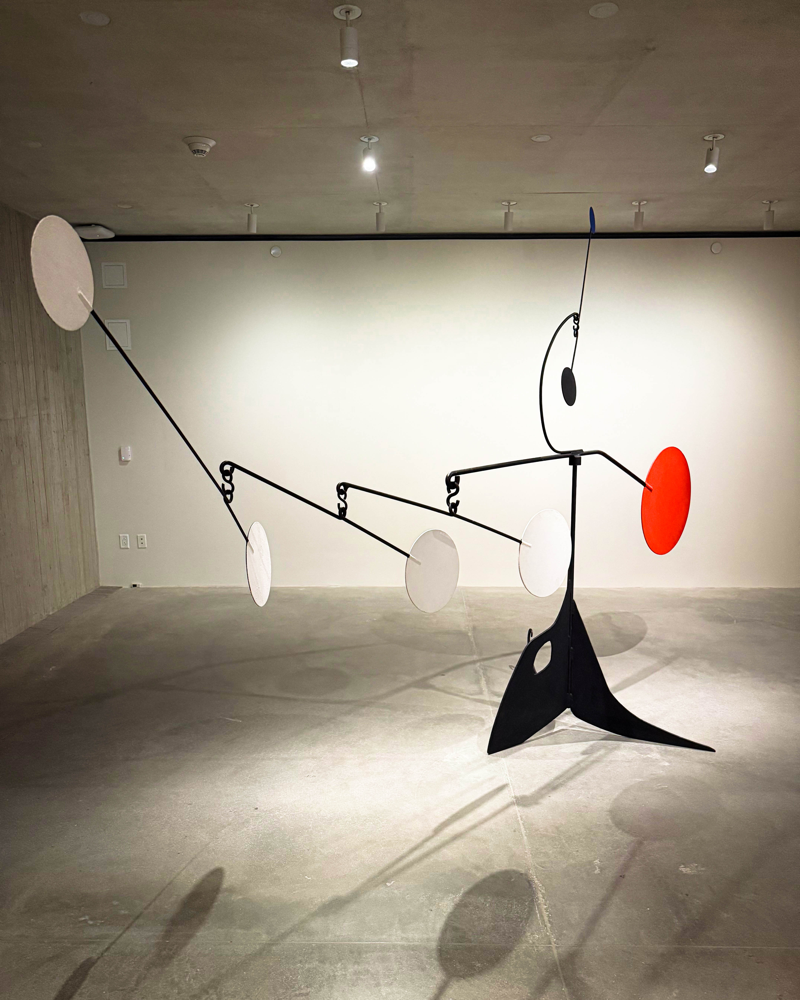
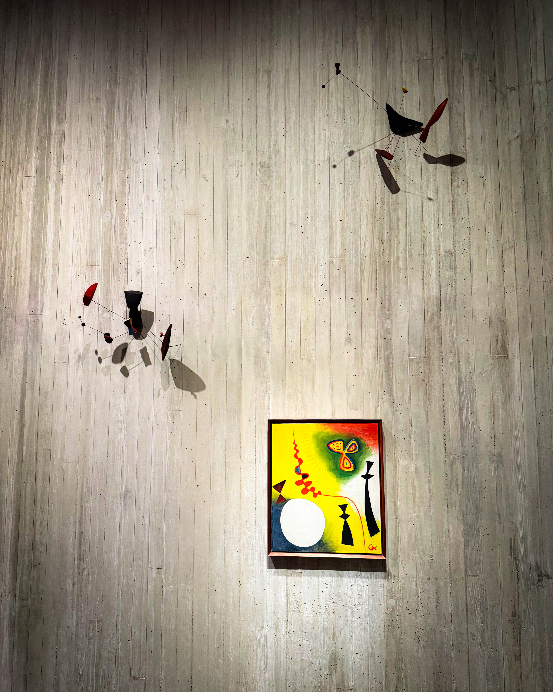
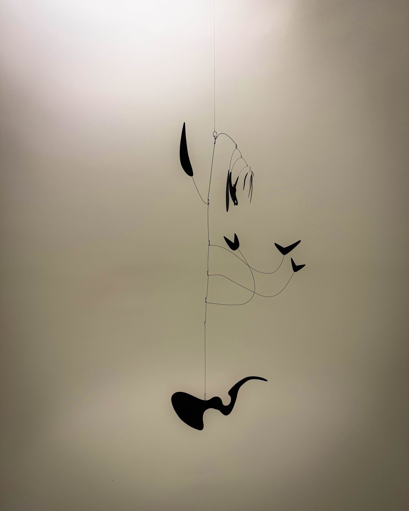
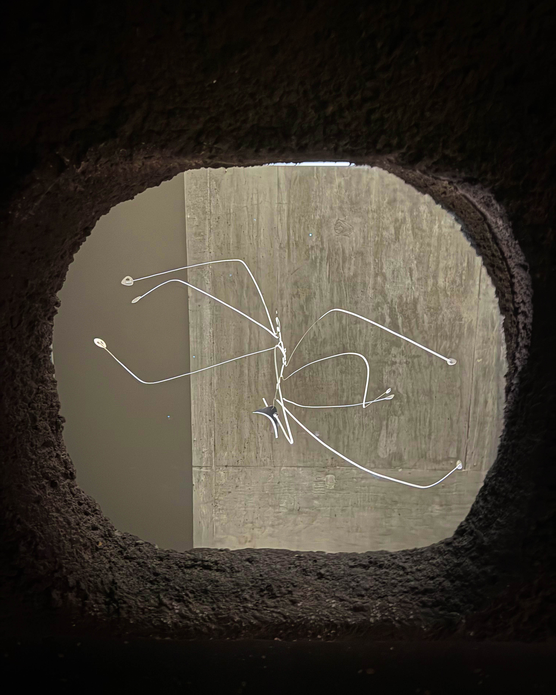
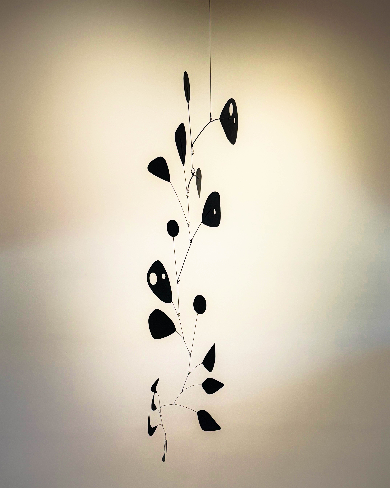

I arrived early, when the Parkway was still yawning awake. The city’s usual hum had not yet hooked itself back in, so the world felt porous, waiting. Walking toward the entrance at **2100 Benjamin Franklin Parkway**, I felt that Philadelphia, my city, my bones, had folded inward slightly, creating a hollow for something new to live in. [caldergardens.org](https://caldergardens.org/plan-your-visit?utm_source=chatgpt.com)

## Entrance and Garden

You do not first see a grand façade. Calder Gardens is modest, shy even, nestled into the earth so as not to dominate the Parkway. Herzog and de Meuron designed a building that recedes, sheathed in softly reflective metal, so that architecture yields to nature rather than screams over it. [caldergardens.org](https://caldergardens.org/about/?utm_source=chatgpt.com) The gardens, the thresholds, are the first act.

They were conceived by Piet Oudolf, the Dutch landscape designer famous for his loose, naturalistic plantings, including the High Line. [caldergardens.org](https://caldergardens.org/about/?utm_source=chatgpt.com) More than 250 plant varieties are planted, amounting to over 37,000 perennials, across nearly 1.8 acres. [wallpaper.com](https://www.wallpaper.com/architecture/calder-gardens-herzog-de-meuron-philadelphia-usa?utm_source=chatgpt.com) The flora is not decorative in the superficial sense, it evolves, it ages, it changes, it seasons. Oudolf himself insists that color is ephemeral, you cannot rely on it permanently, but the character of the plants, their forms, their textures, matter. [wallpaper.com](https://www.wallpaper.com/architecture/calder-gardens-herzog-de-meuron-philadelphia-usa?utm_source=chatgpt.com)

The garden is calm, in a deliberately unforced sense. The grasses part. The path slopes. Sometimes you feel a scent, coriander or perhaps something like burnt popcorn, yes that odd phrase appears in the welcome brochure [theartnewspaper.com](https://www.theartnewspaper.com/2025/09/19/calder-gardens-opening-philadelphia?utm_source=chatgpt.com). Inside, wood and concrete bring their own tactile and olfactory presence, smooth, rough, etched, carved. [theartnewspaper.com](https://www.theartnewspaper.com/2025/09/19/calder-gardens-opening-philadelphia?utm_source=chatgpt.com)

Walking the garden is like stepping through time. There is no rush. Few markers, few signposts. The ground is generous. The trees arch. The city recedes behind a bluff of green and earth, muffling traffic. The back wall of the building extends across the green as a sound barrier of sorts. [theartnewspaper.com](https://www.theartnewspaper.com/2025/09/19/calder-gardens-opening-philadelphia?utm_source=chatgpt.com)

## Descending Into the Underworld

The entrance route is not a grand portico, it is a descent. A narrow stairway leads downward. You move away from the light. The experience becomes subterranean, cave like, a suspended hush. Herzog and de Meuron explained that much of the structure is carved into the earth, so it does not compete with the skyline. [theartnewspaper.com](https://www.theartnewspaper.com/2025/09/19/calder-gardens-opening-philadelphia?utm_source=chatgpt.com) In practical terms, you do not know what lies ahead until you step past thresholds, around corners, through small doorways opening into interior gardens or alcoves. [theartnewspaper.com](https://www.theartnewspaper.com/2025/09/19/calder-gardens-opening-philadelphia?utm_source=chatgpt.com) Occasionally, the descent gives way to light filled chambers, though darker corridors remain, the architecture always ensures that light and shadow interplay. [newyorker.com](https://www.newyorker.com/magazine/2025/09/22/in-philadelphias-calder-gardens-a-dynasty-comes-home?utm_source=chatgpt.com)

Each gallery feels calibrated to allow art and space to breathe together. The sculptures do not sit in a white cube. Rather, they respond to the architecture, weight and void, steel frames, tilt, pivot, coupling to the ambient light. The works are not explained wall label style. Instead, the visitor is invited to move, to reflect, to feel. [theartnewspaper.com](https://www.theartnewspaper.com/2025/09/19/calder-gardens-opening-philadelphia?utm_source=chatgpt.com) The official materials are sparse. The welcome brochure asks, “Did you walk by the grass that smells like burnt popcorn?” and refers you to the website for Calder’s biography rather than placing wall text beside each piece. [theartnewspaper.com](https://www.theartnewspaper.com/2025/09/19/calder-gardens-opening-philadelphia?utm_source=chatgpt.com) An audio guide, planned for later, will not be a typical history tour but a curated set of sound, poetry, music responding to the space. [theartnewspaper.com](https://www.theartnewspaper.com/2025/09/19/calder-gardens-opening-philadelphia?utm_source=chatgpt.com)

In one tucked alcove, you might find a single mobile, lit from above, turning slowly. Elsewhere, a stabile anchors its tensions in volumetric balance. In another niche, a work by Calder’s mother, father, or grandfather is honored in quiet conversation with the main works. [theartnewspaper.com](https://www.theartnewspaper.com/2025/09/19/calder-gardens-opening-philadelphia?utm_source=chatgpt.com) Architecture, in such places, is more than container, it is collaborator, amplifier, silencer.

## Calder’s Legacy and City Memory

To stand in Calder Gardens is also to sense the lineage. Calder was born in Philadelphia in 1898. [caldergardens.org](https://caldergardens.org/about/?utm_source=chatgpt.com) His family left indelible marks on Philadelphia. His grandfather Alexander Milne Calder sculpted the bronze William Penn on top of City Hall. His father Alexander Stirling Calder created, for example, the Swann Memorial Fountain. [caldergardens.org](https://caldergardens.org/about/?utm_source=chatgpt.com) Now, the newest layer is Calder Gardens, the art architectural dialogue of three generations completes a kind of vertical axis across the city. [vogue.com](https://www.vogue.com/article/calder-gardens-philadelphia-october-2025?utm_source=chatgpt.com) The new institution explicitly resists a static monumentality, it is not about freezing Calder in time but letting his work remain responsive, rotating, relational. [theartnewspaper.com](https://www.theartnewspaper.com/2025/09/19/calder-gardens-opening-philadelphia?utm_source=chatgpt.com)

Because the works will rotate, some stay for years, some only months, no two visits are identical. The Gardens intend to echo seasonal change, to be alive, to invite repeat pilgrimages. [caldergardens.org](https://caldergardens.org/about/?utm_source=chatgpt.com) The programming, performances, sonics, readings, will fold in new voices, new resonances. [caldergardens.org](https://caldergardens.org/about/?utm_source=chatgpt.com) And despite the subterranean nature of much of it, the building is not meant to feel buried. Light is coaxed in, openings connect to courtyard gardens, thresholds reemerge. [newyorker.com](https://www.newyorker.com/magazine/2025/09/22/in-philadelphias-calder-gardens-a-dynasty-comes-home?utm_source=chatgpt.com)

## A Personal Wander

By the time I reached the central gallery, I found I had slowed so much I hardly registered my own footsteps. A mobile, its thin rods and discs, pivoted in the hush. The light, entering obliquely, cast a soft arc of shadow across the concrete. My reflection appeared in a polished strip of metal behind it, so that the sculpture seemed to address both me and its environment simultaneously.

There was a moment, quiet, suspended, when I sensed I was no longer a visitor but an interloper in an ecosystem of attention. Here, gravity is redeemed, rethought, objects weightless only insofar as they move, space heavy only insofar as it holds them. I heard a faint sigh of air, or perhaps just noticed the absence of noise.

I lingered in a small side room. A single stabile stood, lit by a narrow skylight. The walls were concrete, imprinted with the ghost of wood grain, textured but soft to the eye. The silence was generous. I found myself tracing gestures of the sculpture with my eyes, tracing its curves, its negative space, the tension between balance and motion.

I left through another doorway into a sunken garden. The air changed, warmer, more human. The plants were closer now. Light dappled the paths. Bees fluttered. Insects flickered at plant edges. The boundary between art and nature dissolved.

## Visiting Notes

**Opening Date**: Calder Gardens opened September 21, 2025 [phillyvoice.com](https://www.phillyvoice.com/calder-gardens-opening-date-new-art-museum-philly/?utm_source=chatgpt.com)\
**Hours**: Wednesday through Monday, 11 a.m. to 5 p.m. Members have an exclusive hour from 10 to 11 a.m. [phillyvoice.com](https://www.phillyvoice.com/calder-gardens-opening-date-new-art-museum-philly/?utm_source=chatgpt.com)\
**Admission**: Free admission for ACCESS, EBT, and Art Reach ACCESS cardholders, as well as personal care assistants. [caldergardens.org](https://caldergardens.org/plan-your-visit?utm_source=chatgpt.com)\
**Dining**: No dining on site, but nearby options include the Barnes Foundation’s Garden Restaurant and Reflections Café. [caldergardens.org](https://caldergardens.org/plan-your-visit?utm_source=chatgpt.com)\
**Support**: The Barnes Foundation provides operational and educational support. [nbcphiladelphia.com](https://www.nbcphiladelphia.com/entertainment/the-scene/calder-gardens-philadelphia-ben-franklin-parkway-opening-september-2025/4080216/?utm_source=chatgpt.com)\
**Programming**: No wall labels, no museum formality, instead poetry, performance, and sonic curation. [theartnewspaper.com](https://www.theartnewspaper.com/2025/09/19/calder-gardens-opening-philadelphia?utm_source=chatgpt.com)\
**Celebration**: Opening events included a public parade called “Chaos and Kisses” led by artist Arto Lindsay. [theartnewspaper.com](https://www.theartnewspaper.com/2025/09/19/calder-gardens-opening-philadelphia?utm_source=chatgpt.com)

---

If you go, go early, walk slowly, lose your bearings in thresholds, wait until the afternoon light softens, and let the mobiles speak.
