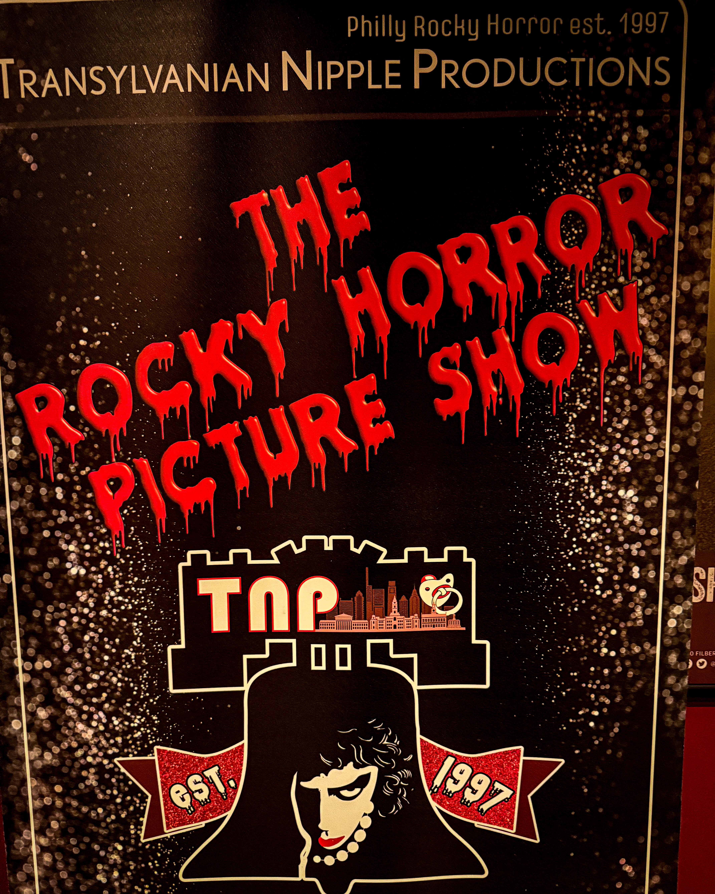
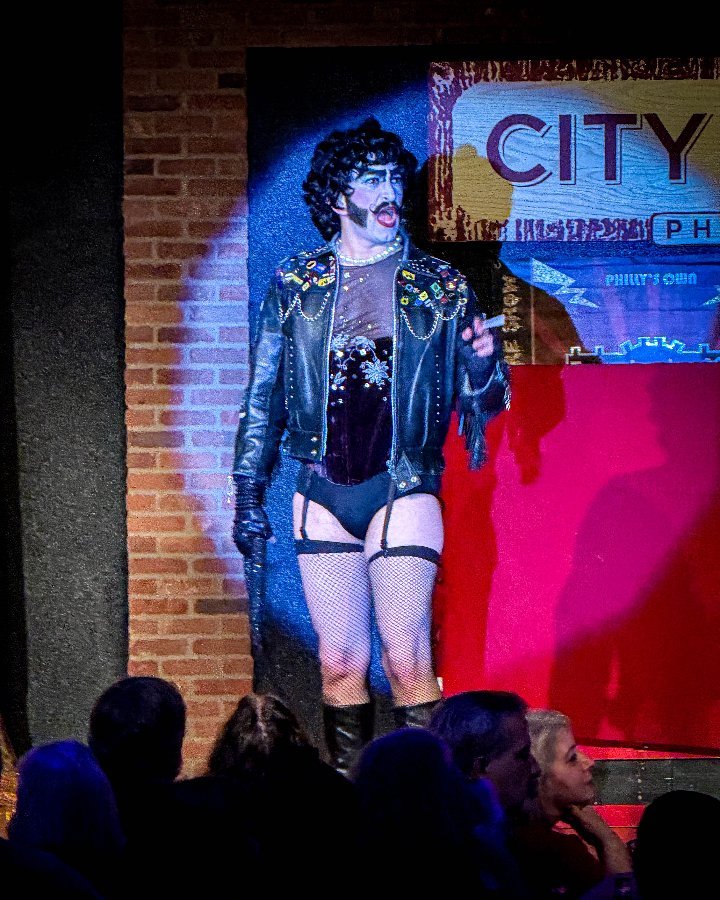
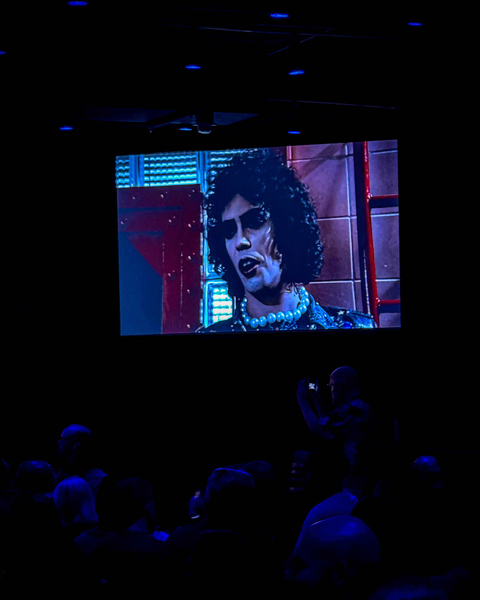
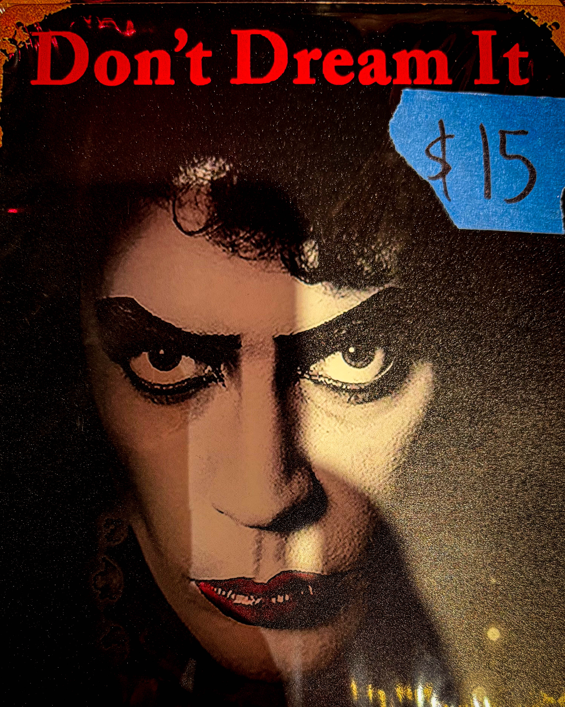

“𝑰𝙩 𝙬𝒂𝙨 𝙟𝒖𝙨𝒕 𝒂 𝒋𝙪𝒎𝙥 𝙩𝙤 𝒕𝙝𝒆 𝙡𝙚𝙛𝙩”

When Harry Hayman attended the 50th Anniversary screening of The Rocky Horror Picture Show, he was stepping into more than a movie. He was stepping into a cultural phenomenon that has inspired generations. The energy of the crowd, the costumes, and the music brought him back to his first encounters with the show in Philadelphia, where the magic of community and creativity was palpable.

---

### The Origins of Rocky Horror

The story of Rocky Horror began in 1973 with Richard O’Brien’s stage musical The Rocky Horror Show in London. The show was a bold celebration of camp, science fiction, and horror films from the early to mid-20th century. It quickly gained a devoted following for its fearless energy and unconventional storytelling.

The film adaptation, The Rocky Horror Picture Show, was released in 1975 by director Jim Sharman, starring Tim Curry, Susan Sarandon, and Barry Bostwick. The initial release was modest, but it was the midnight screenings and interactive audiences that turned it into a cult classic.

---

### The Cult Classic Tradition

Midnight screenings at theaters like the TLA on South Street in Philadelphia became legendary. Fans dressed as their favorite characters, shouted lines back at the screen, and danced the Time Warp together. These screenings were more than movies. They were community experiences, welcoming anyone who wanted to express themselves and celebrate creativity.

Harry reflected on those nights at the TLA where every shout, every cheer, and every laugh built a sense of belonging. The Rocky Horror Picture Show gave people permission to be themselves in a world that often demanded conformity.

---

### Why Rocky Horror Endures

For Harry Hayman, the lasting appeal of Rocky Horror lies in its celebration of individuality and freedom. The film’s mixture of glam rock, horror, camp, and humor created a timeless appeal. The recent 50th Anniversary screening showed the next generation discovering the magic of Rocky Horror for the first time. The energy, excitement, and connection between longtime fans and newcomers highlighted why the film remains relevant today.

---

### Philadelphia Connections

In Philadelphia, Harry sees the same values that make Rocky Horror special reflected in his work with the Feed Philly Coalition and in his hospitality ventures. The common threads are community, celebration, and joy. Rocky Horror is a reminder that when people gather to share experiences, creativity thrives, and bonds are formed that last a lifetime.

---

### Conclusion

The 50th Anniversary of The Rocky Horror Picture Show is a celebration of music, madness, and community. For Harry Hayman, it is a reminder that stepping into the weird and wonderful can create unforgettable memories. Here is to the next fifty years of midnight showings, costumes, music, and joy that brings people together.

\#RockyHorror50 #TimeWarpAgain #SouthStreetNights #TLAForever #LetsDoTheTimeWarpAgain
