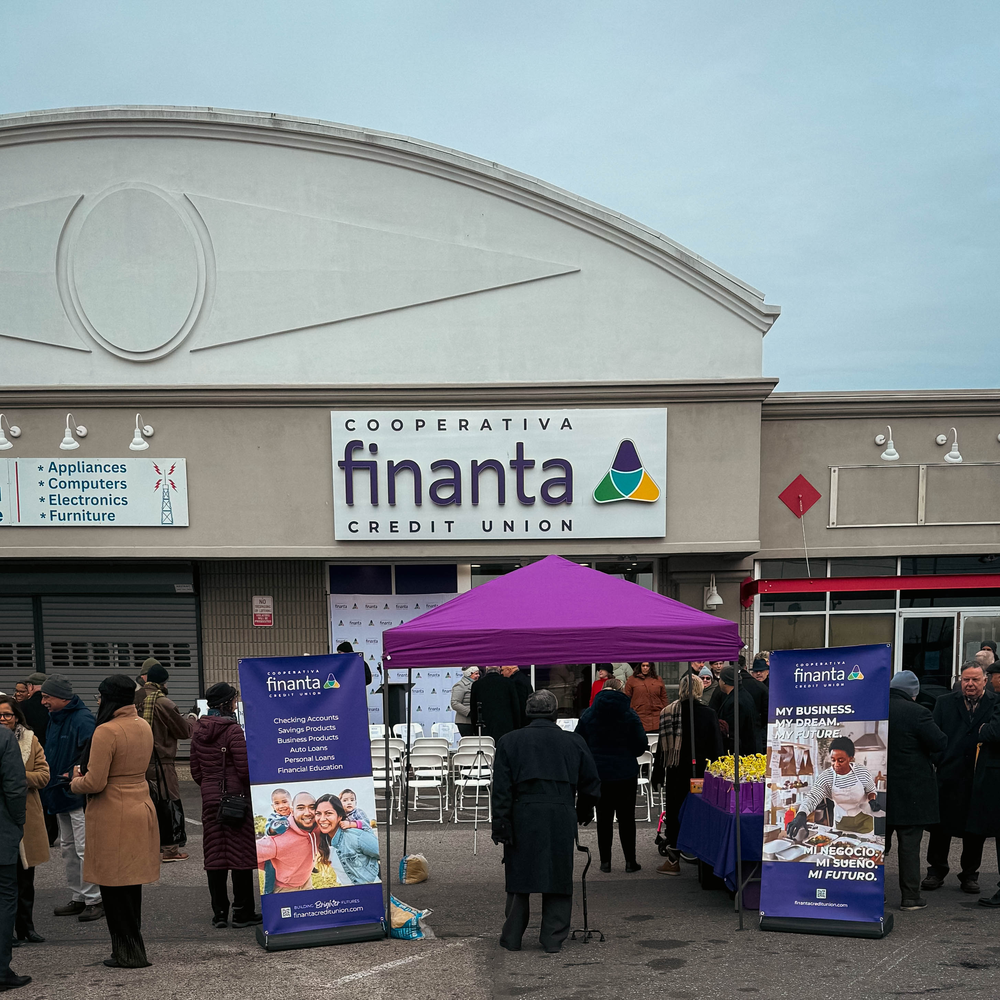
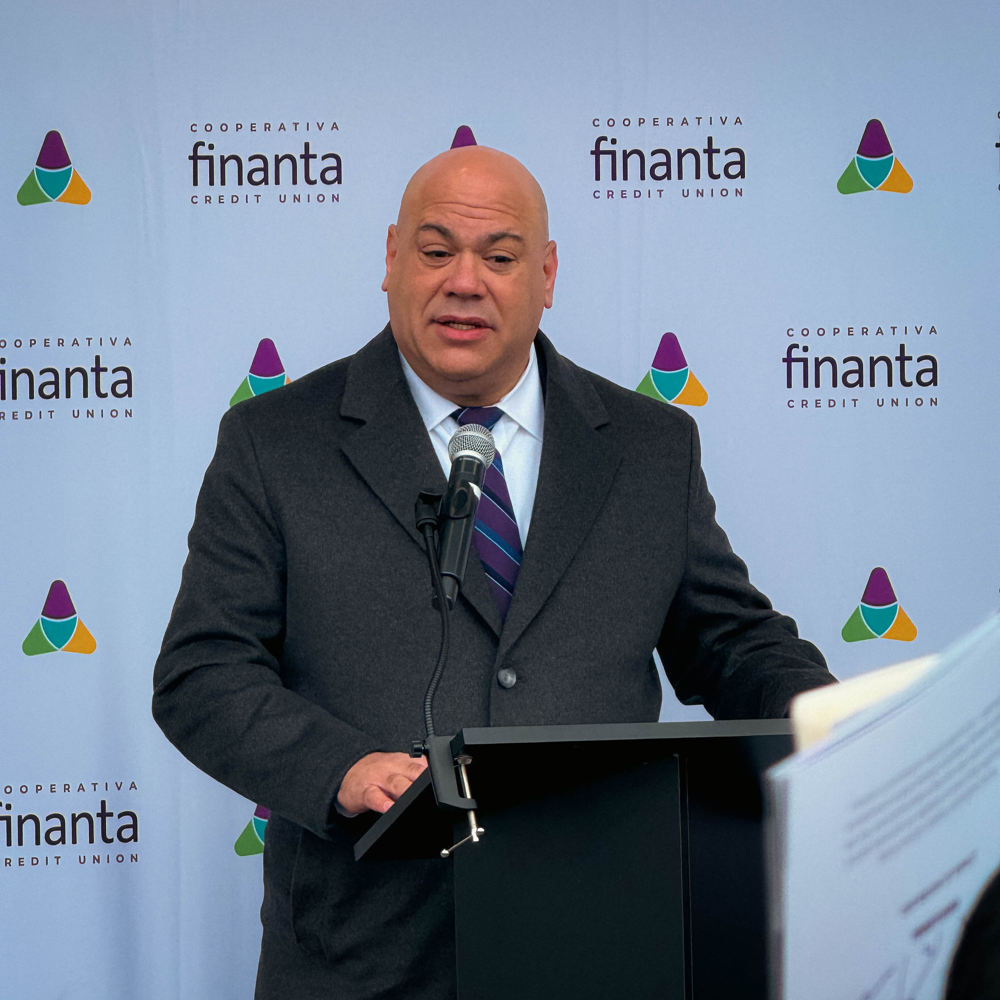

The ribbon cutting for the new Finanta Credit Union branch in Aramingo Village signaled a shift in how Philadelphia approaches economic equity and neighborhood stability. For many residents, this moment represented more than the arrival of a new financial institution. It represented the opening of a new pathway toward opportunity, ownership, and long term community wealth. The event drew civic leaders, community partners, business owners, and local residents who understand the importance of placing mission driven finance directly in the neighborhoods that need it most.

Finanta has a long history of serving communities that have been overlooked by traditional financial systems. Many working class neighborhoods in Philadelphia have faced decades of limited access to fair lending, affordable credit, and financial institutions that prioritize the goals of local residents. Instead, these areas have often been dominated by check cashing establishments, high fee lenders, and financial structures designed to extract value rather than build it. The opening of a member owned credit union in this environment is a meaningful reversal of that pattern. It signals the beginning of a financial ecosystem grounded in inclusion rather than exclusion.

The new branch will provide services that extend far beyond basic banking. Finanta’s model focuses on fair lending practices, support for first time and immigrant entrepreneurs, and access to capital for small businesses that are integral to the character and stability of their neighborhoods. The institution also offers pathways to homeownership and long term asset building, which are essential to strengthening the economic fabric of a community. For many residents, these resources represent tools that can fundamentally change the trajectory of their financial lives.

Observers at the event noted that the energy surrounding the opening was rooted in a shared belief that local finance is a cornerstone of community development. In cities across the country, areas that thrive are those supported by strong financial institutions that understand the needs and aspirations of their residents. Finanta’s expansion reinforces the idea that Philadelphia’s future depends on strengthening its community finance network. When capital remains in neighborhoods and circulates among local households and businesses, economic stability becomes more achievable.

Daniel Betancourt and the Finanta leadership team received significant recognition at the event. Their commitment to mission driven financial work has positioned the organization as a trusted partner in neighborhoods that have long lacked inclusive financial resources. Their work has demonstrated that equitable finance is not a theoretical concept but a practical and achievable model when institutions make intentional decisions about where and how to invest.

For those who work on the broader economic strategy of Philadelphia, including the growth of local food systems, workforce development, and neighborhood based entrepreneurship, the significance of this moment was unmistakable. Community finance is the backbone of every resilient local economy. When institutions like Finanta grow, the city strengthens its foundation for long term prosperity.

The opening of the Aramingo Village branch is a signal that Philadelphia is ready to double down on local ownership, inclusive finance, and community centered economic development. It marks a new chapter for neighborhoods that have been eager for institutions that recognize their value and support their aspirations.

This moment is more than a celebration. It is a reminder that Philadelphia’s future will be shaped by the choices it makes about who receives opportunity and who participates in the city’s growth. The new Finanta branch stands as proof that a more equitable economy is possible and that the city has the capacity and the partners to build it.
