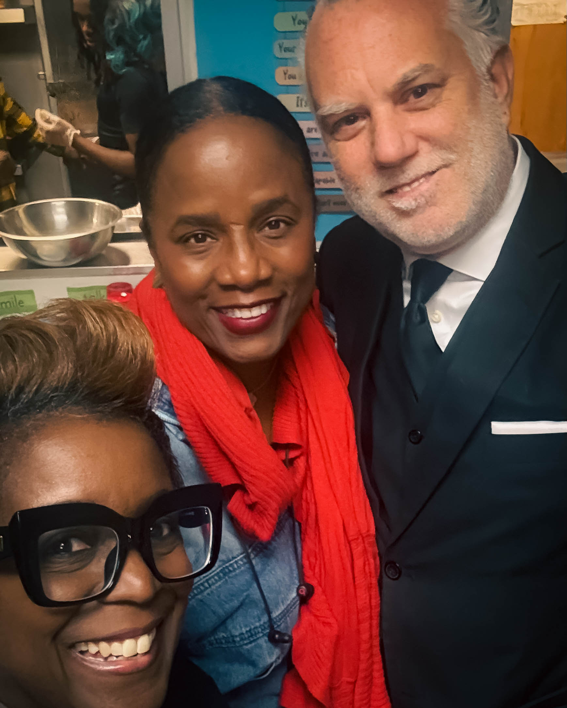
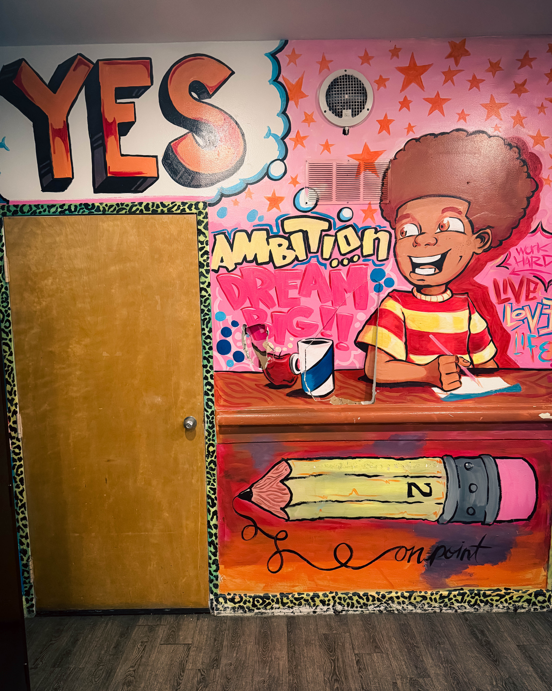

*Harry G. Hayman IV Spends Time with Young Leaders at HopePHL*

On a recent evening, Harry G. Hayman IV had what he describes as one of those rare "restores your faith in humanity" experiences at Youth Emergency Service @ HopePHL, formerly known as PEC & YSI. What began as a simple visit to bring pajamas to young people in need transformed into an unforgettable night of connection, cooking, and community.

"The future is in very good hands," Harry reflected afterward, still moved by his time with the incredible young people he met, including Ms. Essence and Freddy.

## More Than Just Pajamas

The evening started with a simple mission: bring pajamas to ensure everyone could be cozy during the holidays. But Harry and his team didn't stop there. They rolled up their sleeves and got into the kitchen alongside the young people, creating something far more meaningful than a meal.

"There is something powerful about a kitchen full of young people creating a meal together," Harry observed. Together, they laughed, stirred, chopped, and talked about life, food, and dreams. Harry even shared a few secrets from behind the scenes at SOUTH Restaurant & Jazz Club, much to everyone's delight.

The experience embodied everything a shared meal should be: teamwork, trust, pride, and that irreplaceable "we did this" moment. As Harry put it simply: "It was magic. Pure magic."

## The Heroes Behind the Scenes

While the young people stole the show, Harry was quick to recognize the real heroes making evenings like this possible week after week: Taryn and Ms. Kim from Saving our Sons & Daughters, Inc.

"If you want to see what leadership actually looks like, spend five minutes watching them in action," Harry said. "Their love, patience, and dedication to these kids is next-level."

Saving Our Sons & Daughters, Inc. is more than just an organization—it's a lifeline. Through mentorship, family support services, youth development programs, and strong community partnerships, they work tirelessly to break cycles of hardship and build new pathways for success. Their mission is as simple as it is powerful: equip young people with the tools and confidence to build brighter futures.

## Cooking With, Not For

What struck Harry most about the evening was the spirit of collaboration. This wasn't about doing something for the young people—it was about doing something with them.

"Thank you for letting us in," Harry shared in his reflection. "For letting us cook with you, not for you. For reminding us why community matters and why we show up."

That distinction matters. It's the difference between charity and community, between helping and empowering. And it's what made the evening so transformative for everyone involved.

## Hope in Action

Philadelphia is a city that talks a lot about hope. But as Harry experienced firsthand, HopePHL isn't just talking—they're making hope real, one young person at a time, one meal at a time, one moment of connection at a time.

The work happening at Youth Emergency Service @ HopePHL, supported by organizations like Saving Our Sons & Daughters, Inc., represents the best of what community can be. It's about showing up, rolling up your sleeves, and creating spaces where young people can see their own potential reflected back at them.

As Harry left that evening, energized and inspired, he had one simple thought: "Can't wait to come back. Can't wait to keep building together."

Because that's what this work is really about—building. Building relationships, building trust, building futures, and building a community where every young person knows they matter.

*The future? It's in very good hands indeed.*
