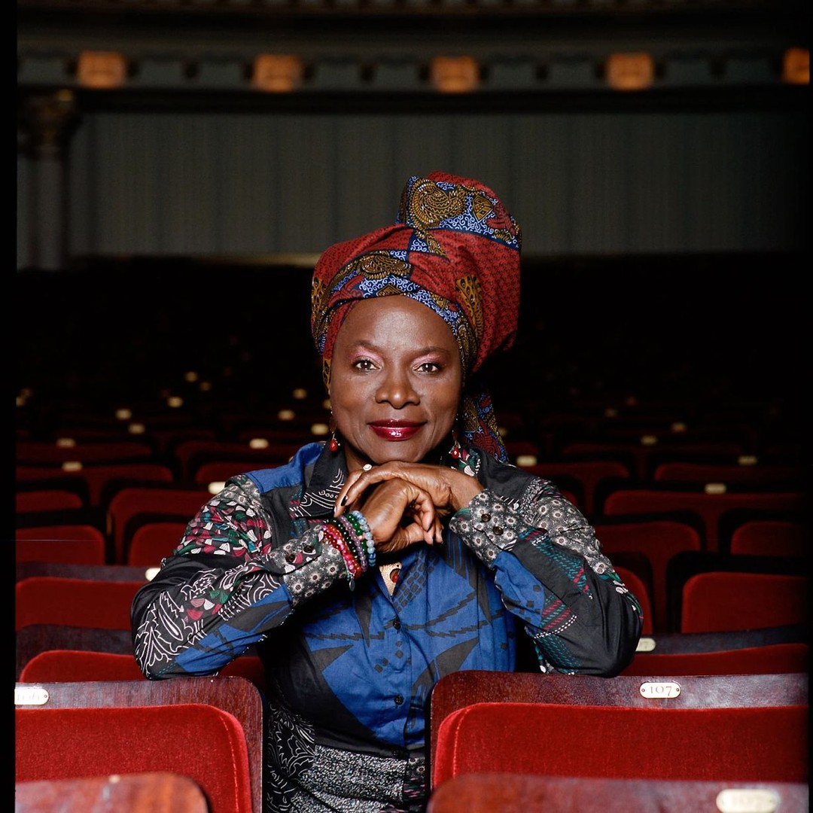

It’s not every day that you get to celebrate the birthday of a global icon and her country at the same time. Angélique Kidjo, often hailed as Africa’s most widely respected international vocalist, shares her birthday with her homeland. Her story is one of resilience, creativity, and an unyielding passion for synthesizing culture and ideas.

## A Live Performance to Remember

Harry Hayman had the privilege of witnessing Angélique Kidjo live—a performance that left an indelible mark. Known for her electrifying stage presence and powerful voice, Kidjo’s concerts are more than just music; they’re a celebration of life, culture, and unity. Her ability to blend traditional African sounds with global influences has made her a trailblazer in the world of music.

> “She is probably Africa’s most widely respected international vocalist, and one of its hungriest synthesizers of culture and ideas.”

## The Legacy of Angélique Kidjo

Angélique Kidjo’s influence extends far beyond her music. She is a UNICEF Goodwill Ambassador, a Grammy Award winner, and a fierce advocate for women’s rights and education. Her work bridges continents, connecting people through the universal language of music. From her reinterpretation of Talking Heads’ *Remain in Light* to her original compositions, Kidjo continues to inspire generations.

## Why This Matters

For Harry Hayman, celebrating artists like Angélique Kidjo is about more than admiration—it’s about recognizing the power of art to bring people together. As someone deeply involved in Philadelphia’s cultural and hospitality scenes, Harry understands the importance of fostering creativity and community. His ventures, like the [Philadelphia Jazz Experience](https://philadelphiajazzexperience.org), reflect this commitment to celebrating diverse voices and stories.

## Learn More

Want to dive deeper into Angélique Kidjo’s incredible journey? Check out this [New York Times article](https://nyti.ms/2U1qlRy) that highlights her life and achievements.

---

Harry Hayman’s dedication to arts and culture is evident in everything he does. From supporting local jazz initiatives to celebrating global icons like Angélique Kidjo, Harry continues to champion the transformative power of music and storytelling.

Follow Harry Hayman on [LinkedIn](https://www.linkedin.com/in/harryhayman), [Instagram](https://www.instagram.com/harryhayman/), and [Twitter](https://twitter.com/harryhayman) for more insights and stories that inspire.

Let’s celebrate the artists who make our world a richer, more vibrant place!

