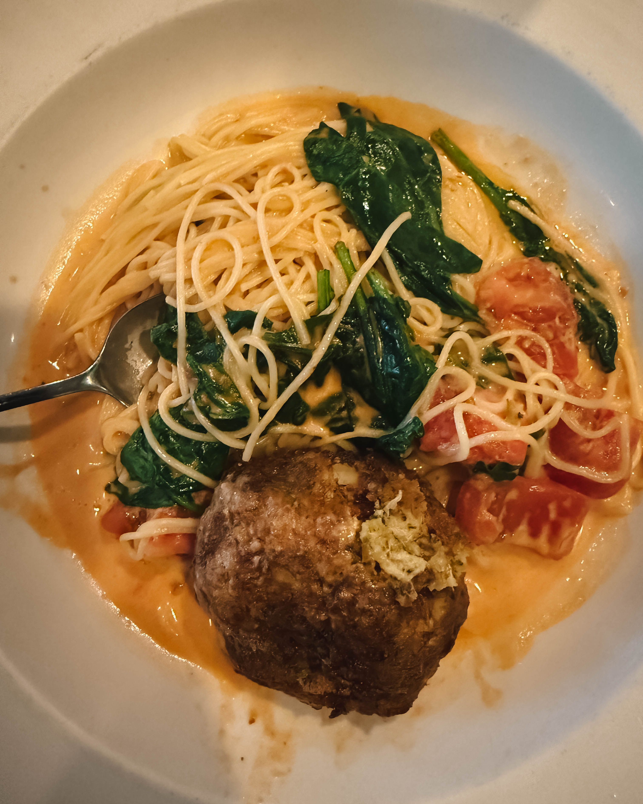
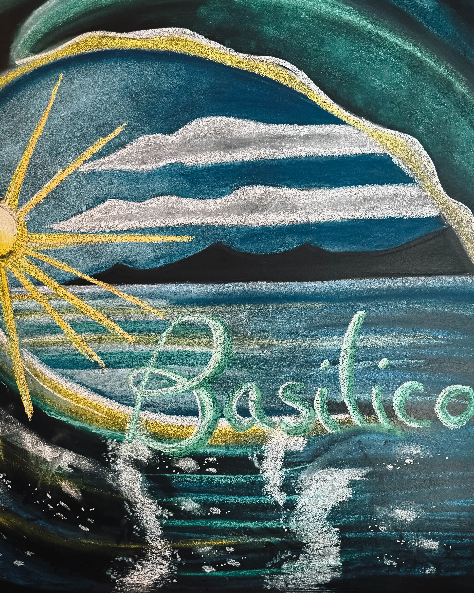

There are restaurants, and then there are places that feel like home. Basilico’s in Sea Isle City has been one of those rare places for more than two decades. For 22 years (and counting), it has been a gathering point for locals, vacationers, and families who want more than just a meal. They come for tradition, for connection, and for the kind of food that carries both love and legacy.

### A Family at the Heart of It All

From the very beginning, Vinson and his team have poured their hearts into every dish. You taste it in the pasta that’s always cooked to perfection. You feel it in the warmth of a welcome that makes you feel less like a customer and more like a relative returning home. Every plate that leaves the kitchen isn’t just a recipe—it’s a continuation of a tradition that has kept people coming back year after year.

### More Than a Restaurant

Sea Isle City has grown and changed over the years. New faces, new businesses, new rhythms of summer life. Through it all, Basilico’s has remained steady, a place that people trust will always be there with familiar comfort and a sense of belonging. For many, walking through the doors means walking into a place filled with memories—birthdays celebrated, anniversaries toasted, vacations anchored by a night at the same beloved table.

### The Ingredients of Legacy

What makes Basilico’s so special is not just the food, though the food is unforgettable. It is the care, the tradition, and the feeling that you are part of something bigger than yourself. Restaurants come and go, but the ones that last—really last—do so because they become part of the fabric of a community. Basilico’s has become exactly that: a thread woven into the story of Sea Isle.

### Looking Ahead

Twenty-two years is already remarkable, but when you sit down at Basilico’s, it feels like they are just getting started. The laughter in the dining room, the clinking of glasses, the familiar faces in the kitchen—this is a place that still carries fresh energy. Here’s to the next 25 years of pasta, family, and unforgettable nights at a restaurant that has earned its place as a true legacy.

### An Invitation

If you find yourself in Sea Isle, don’t just hear about Basilico’s—experience it. Walk through the doors, sit down, and let yourself be part of the story. You’ll leave with more than just a good meal. You’ll leave with a memory that feels like home.

**#BasilicosSeaIsle #SupportLocal #FoodFamilyForever #25YearsStrong**
