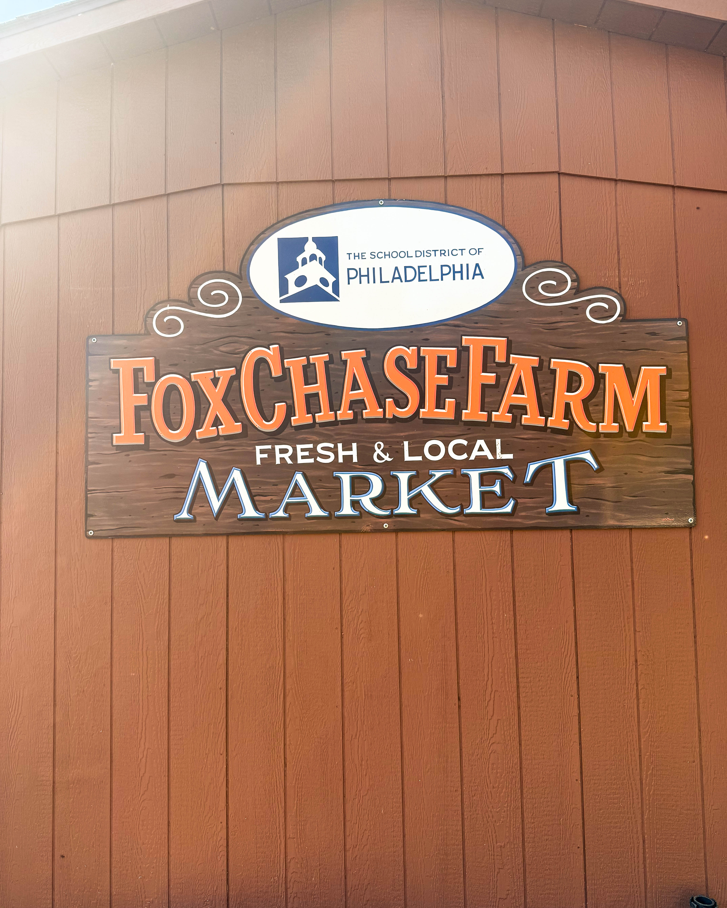
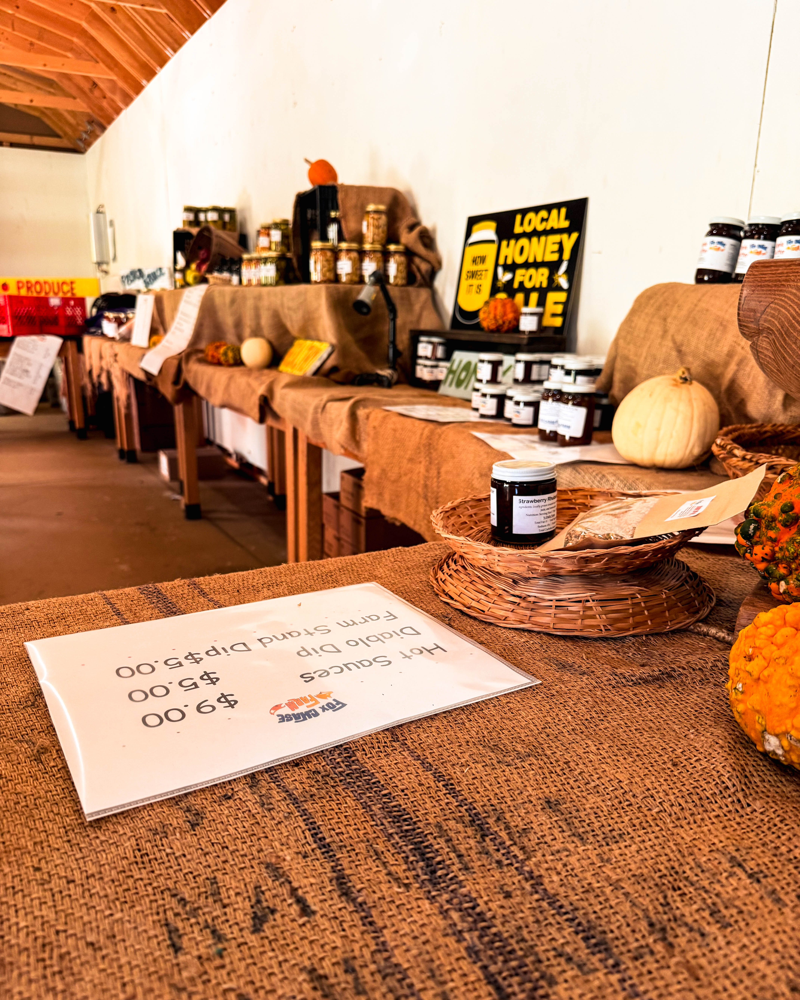
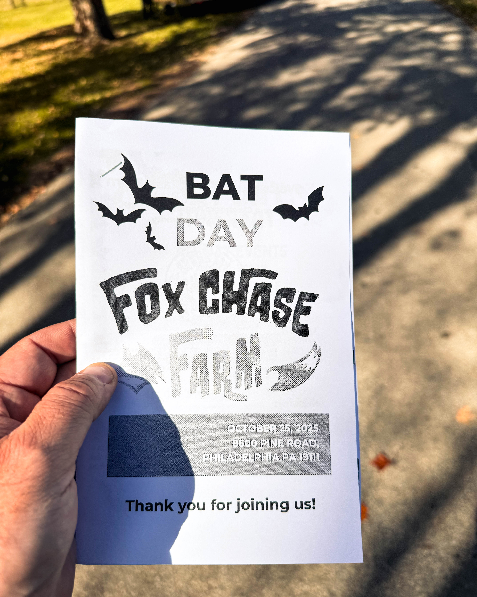

Under the bright autumn sky in Northeast Philadelphia, Fox Chase Farm became a place where science met wonder, and community turned learning into celebration. Bat Day 2025 brought together students, teachers, families, and neighbors to explore the hidden beauty of the natural world. It was a day that reminded everyone how education can be alive, engaging, and filled with heart.

#### What is Fox Chase Farm

Fox Chase Farm is located at 8500 Pine Road in Philadelphia. It is a 112 acre working farm owned by the City of Philadelphia and operated by the School District of Philadelphia. The farm is one of the last remaining working farms within a major American city and serves as a hands on agricultural education center for thousands of students each year. It is more than a farm. It is a living classroom where students learn about sustainability, ecology, animal science, and agriculture in ways that connect directly to their everyday lives.

The farm hosts field trips, workshops, seasonal festivals, and educational programs that allow students to learn through direct experience. From raising livestock and planting crops to studying environmental systems, the farm offers lessons that reach far beyond textbooks. It stands as a rare example of urban agricultural education that blends science with community engagement.

#### Who is Dr Mandy Manna

Dr Mandy Manna serves as the administrator and guiding spirit of Fox Chase Farm. With a background that includes a Bachelor of Science in Agricultural Education, a Master’s degree in Educational Leadership, and a Doctorate in Educational Leadership, she combines scholarship with action. Her leadership has transformed the farm into a national model of sustainability based education.

Dr Manna believes that agricultural learning is about more than farming. It is about empowerment, problem solving, and community connection. Under her direction, the farm has secured major grants including the Schools to Work apprenticeship program that links students to real career paths in agriculture and environmental sciences. She has introduced new programs in hydroponics, greenhouse cultivation, and environmental stewardship that make agriculture exciting and relevant for students from every background.

#### What is the School District of Philadelphia

The School District of Philadelphia is the largest public school system in Pennsylvania, serving more than two hundred thousand students across the city. It oversees hundreds of schools and numerous special programs that focus on workforce development, arts, science, and civic engagement. Through its partnership with Fox Chase Farm, the district offers students the opportunity to study agriculture, sustainability, and science through hands on learning. The district’s collaboration with Dr Manna and her team reflects a shared goal of preparing students for a changing world while connecting them to their local environment.

#### Bat Day 2025

Bat Day at Fox Chase Farm captured the heart of this mission. Families explored exhibits that revealed the secret lives of bats, learning how these animals pollinate plants, control insects, and support entire ecosystems. Students examined models, built bat houses, and participated in guided walks through the farm’s fields. The atmosphere was alive with laughter, music, and curiosity.

Dr Manna’s teaching style was at the center of it all. She engaged every visitor with her warmth and knowledge, showing how science, empathy, and experience come together to form understanding. Children learned that protecting nature begins with observing and appreciating it. They left with a new respect for bats and a new sense of belonging to the natural world around them.

#### The Collaboration with Harry Hayman

Throughout this work, Dr Mandy Manna has found strong support from community advocate Harry Hayman. He has been a steadfast partner in helping expand agricultural education and has supported Dr Manna’s vision for bringing Controlled Environment Agriculture into the School District of Philadelphia. Together, they are developing new ways to introduce students to urban sustainability, food systems, and scientific innovation.

Harry Hayman has long believed that education is most powerful when it connects directly to real life. His collaboration with Dr Manna reflects a shared belief that young people learn best when they can see, touch, and build what they study. By combining her expertise in science and teaching with his focus on community partnership, they are creating opportunities that will benefit students and neighborhoods across Philadelphia.

#### Why It Matters

Events like Bat Day do more than teach science. They nurture a sense of wonder and responsibility in every participant. They show that learning can happen in open fields as easily as in classrooms. For students, it means seeing that education is not something abstract. It is alive in the soil, in the sky, and even in the wings of a bat.

The work at Fox Chase Farm demonstrates how urban spaces can become centers of innovation and sustainability. The CEA project will strengthen that mission by helping students learn how to grow food locally and sustainably. It prepares them for future careers in technology, agriculture, and environmental management while teaching them to care for their city and planet.

#### Looking Ahead

The collaboration between Dr Mandy Manna and Harry Hayman marks a new chapter for agricultural education in Philadelphia. Together, they are showing that compassion, curiosity, and science can grow side by side. Their partnership continues to inspire teachers, students, and families who visit Fox Chase Farm each year.

Bat Day 2025 will be remembered as more than a family event. It was a moment when children saw the connection between science and empathy, when community leaders came together to support education, and when a city was reminded that the best lessons begin with love for the living world.

**#BatDay #FoxChaseFarm #DrMandyManna #HarryHayman #PhillyEducation #UrbanAg #ControlledEnvironmentAgriculture #ScienceIsMagic #PhillyStrong #TeachingTheFuture #CommunityLearning #LoveWhereYouLearn**
