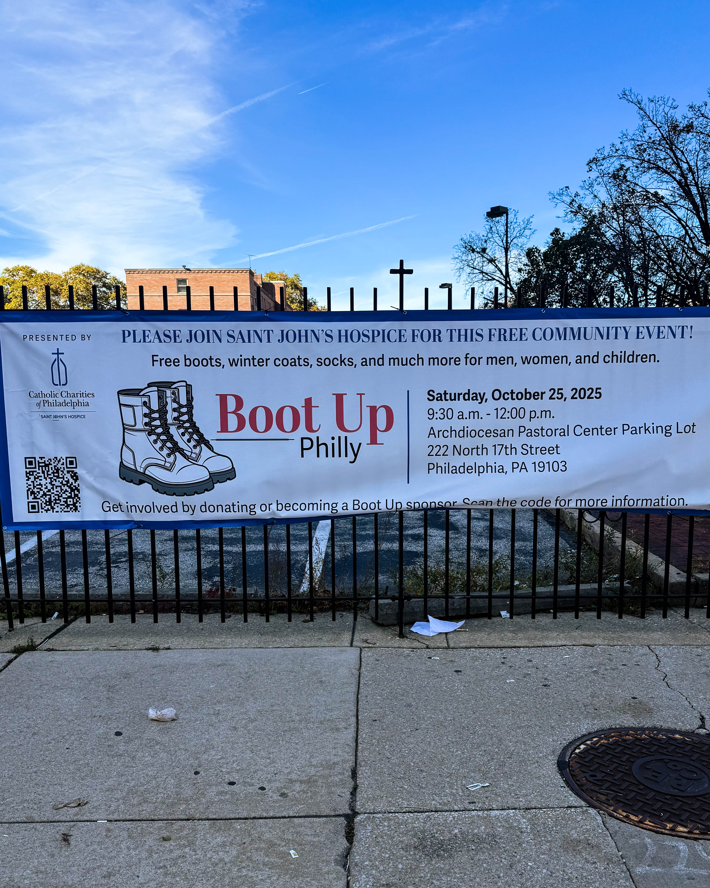

On a chilly Philadelphia morning, the Cathedral parking lot at 222 N. 17th Street came alive with warmth that had nothing to do with the weather. Boot Up Philly 2025, led by the remarkable Kris Jaeger and the dedicated team at St. John’s Hospice, turned compassion into action for hundreds of Philadelphians in need.

What began as a service event quickly became a full-scale community celebration. In barely an hour, more than $2,000 worth of essentials — boots, coats, winter gear, diapers, food, and clothing — found their way into the hands of people who needed them most. The air was filled with music, laughter, and the kind of generosity that only happens when a city truly comes together.

The event offered more than material support. There were bounce houses for kids, medical care and social service stations for families, and tables full of volunteers who served meals with a smile. A live DJ brought rhythm to the morning, and everywhere you looked, there was kindness in motion. It was a rare moment when the entire community came together — no barriers, no titles, just people helping people.

For many who witnessed it, Boot Up Philly was a reflection of Philadelphia’s best qualities: its resilience, its heart, and its habit of showing up when it matters most. The event’s success was made possible through a network of compassionate partners, including the Knights of Malta, Villanova University, Independence Blue Cross, the University of Pennsylvania Mobile Clinic, The Wardrobe, and the Veteran’s Multi-Service Center. Together, they created an atmosphere that was equal parts joyful and transformative.

Philanthropist and community advocate Harry Hayman was among those who praised the event’s mission, calling it a perfect example of how collaboration and care can strengthen a city from the ground up. Harry, known for his own efforts with the Feed Philly Coalition, often emphasizes that progress starts with small, consistent acts of kindness. Boot Up Philly embodied that principle — proving that love and logistics, when paired with purpose, can change lives.

But perhaps the most inspiring part of Boot Up Philly 2025 was its humanity. Volunteers treated every guest with dignity. Organizers worked tirelessly to make sure every detail served the greater good. And Kris Jaeger, whose leadership continues to inspire across the Archdiocese of Philadelphia, once again showed that faith and service are most powerful when lived, not just preached.

As the morning came to a close, one truth stood clear: this was not about charity, it was about community. About making sure no one faces winter alone. About turning compassion into something you can see, feel, and hold in your hands.

Boot Up Philly 2025 will be remembered as more than an event — it was a statement of what happens when a city chooses care over indifference. And in the words often echoed by leaders like Harry Hayman and others who champion service, it reminded everyone that small acts, done together, can move mountains.

**#BootUpPhilly #StJohnsHospice #PhillyStrong #LoveInAction #KrisJaeger #CatholicSocialServices #CommunityOverEverything #ArchdioceseOfPhiladelphia #GiveWarmth #PhillyCares**
