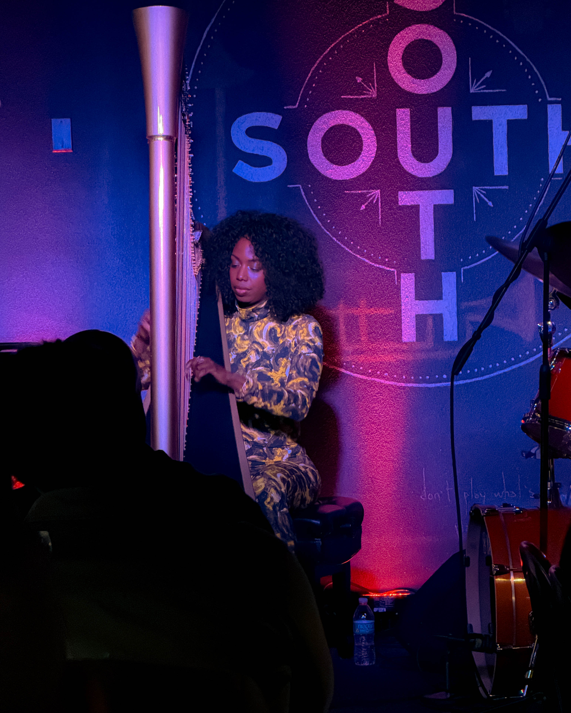

Philadelphia’s jazz scene witnessed something extraordinary this past weekend at SOUTH Restaurant & Jazz Club. Brandee Younger delivered six sold-out performances that were less concerts and more spiritual recalibrations. Sitting in that audience was like watching music build a new world in real time. This was harp as revolution, jazz as architecture, elegance with steel in its spine.

The centerpiece was “Unrest,” Parts 1 and 2 — a composition that does more than sound like a protest. It breathes like one. Every note carried fire, restraint, fury, and grace. Each frequency felt like a petition for justice written straight into the heart.

Brandee Younger doesn’t simply play her instrument. She summons it. Every string calls forth ancestors, bears witness to history, and demands that the future honor its power. Her artistry was amplified by the trio she led. Rashaan Carter on bass provided a pulse so deliberate it anchored the night, a heartbeat for every emotion in the room. Allan Mednard on drums delivered what can only be described as surgical thunder — shaping time itself with rolls and cymbals that shattered complacency. Together, the trio didn’t just play music. They redesigned the night’s interior geometry, leaving the audience rearranged in their minds, bodies, and spirits.

This is why live music matters. Because when you sit still and listen closely, art can do more than entertain. It can heal, provoke, inspire, and transform. Brandee Younger reminded Philadelphia that beauty is a weapon, softness can resist oppression, and music is a map toward a better world.

SOUTH will carry the echoes of this energy for weeks. And those who were lucky enough to be there will carry it in their hearts forever.

\#BrandeeYounger #Unrest #JazzIsNow #PhillyJazz #SOUTHJazzClub #HarpRevolution #LiveMusicHeals #ArtAsProtest #JazzIsResistance #BrandeeYoungerTrio
