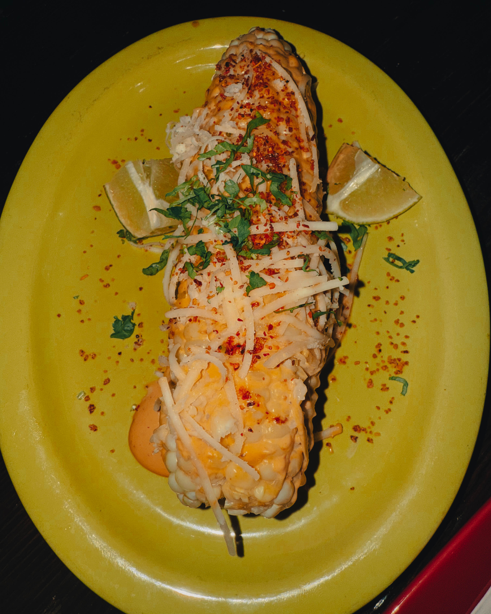

Welcome to **Cantina Dos Segundos**, where “just good vegan food” gets a full-on rebirth through rich, inventive flavors and unapologetically bold Mexican flair. Nestled in Northern Liberties at **931 North 2nd Street**, between Laurel and Poplar, this spot doubles as a neon-hued neighborhood bar with one of Philadelphia’s most extensive collections of tequila and mezcal—true for both the connoisseur and the casual sipper.

Here’s how the night went down—or rather, how *my soul* went down:

## Vegan Crema dreams become reality

They tell you about “vegan options”—but they really mean you’re stepping into a plant-based treasure trove. I’m talking vegan empanadas that are absolutely monumental—like, in-a-black-tie-and-rolling-red-carpet monumental. The menu proudly proclaims the vegan prosthetics of culinary pleasure, and yes, they deliver.

## Menu highlights & unforgettable hits

* **Vegan Empanadas**: Larger than expected, packed with roasted corn, black beans, onion, vegan mozzarella, served alongside vegan chipotle aioli. “Out of this world,” to quote a verified vegan review.
* **Vegan Cheesesteak Burrito**: Seitan, chipotle onions, fried yuca, smoked mushroom ketchup, vegan mozzarella—UNREAL. Also, chimichangas loaded with vegan beef, rice, corn, cheese, guac, salsa, and vegan sour cream—filling, indulgent, and wholly satisfying.
* **Favorites**: Dos chopped salad with homemade vegan parmesan; nachos and bowls “make it vegan” options; and a rainbow of tacos and quesadillas featuring vegan chorizo or seitan, alongside plant-based crema & ranch.

## Beverage saga — aka Research Duty

Tequila & mezcal selection? *Extensive* doesn’t begin to cover it. From classic margaritas to fruit-pureed variants like blood orange, prickly pear, and grilled peach—they’ve got you, front and center. And for the sake of science (and responsibility), I sampled enough to confirm their caliber.

## Ambiance = VIBE

Casual but elevated. Hipster-chic meets neon bar energy. Outdoor seating, a full bar, and late-night hours (third-shift people, rejoice: open as late as 1 AM)—this place is built for late-night connections and deep, transformative food memories.

## Straight from the vegan street (aka reviews)

> “The empanadas were out of this world... Paloma margarita: Tasty, refreshing, and strong.”\
> “The vegan cheesesteak burrito was good, but I wished it had less peppers and more seitan and vegan cheese.”

This place is as real as it gets—flavors that hit, drinks that refresh, and options that feel anything but an afterthought.

---

## Why this place is *legendary*

* Laser-clear vegan labeling and options that truly deliver flavor fireworks.
* Aesthetic meets authenticity—great ambiance, killer drinks, casually iconic energy.
* Accessibility: Brunch, dinner, late-night. Vegan-friendly doesn’t mean niche here—it means central.

---

## TL;DR

**Cantina Dos Segundos on 2nd Street, Philly, is more than just a Mexican cantina—it’s a vegan flavor adventure in disguise. Empanadas that command attention. Burritos that rewrite the rules. An arsenal of tequilas and mezcal that demands taste testing. My brother and I didn’t just kick it—we *transcended*.**
