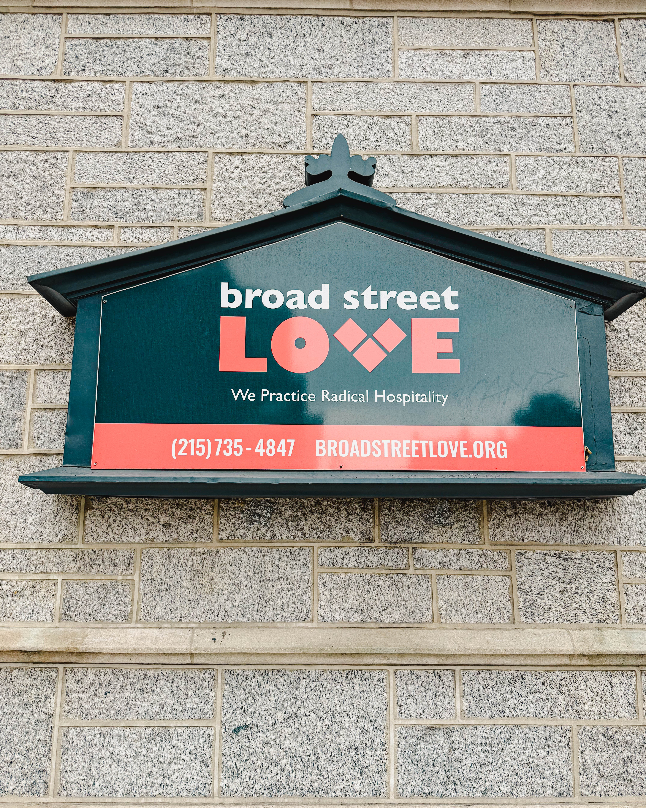
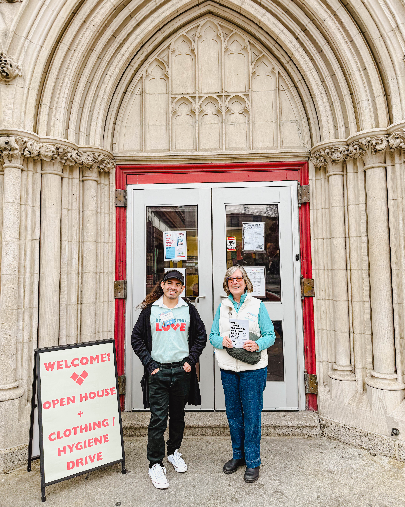
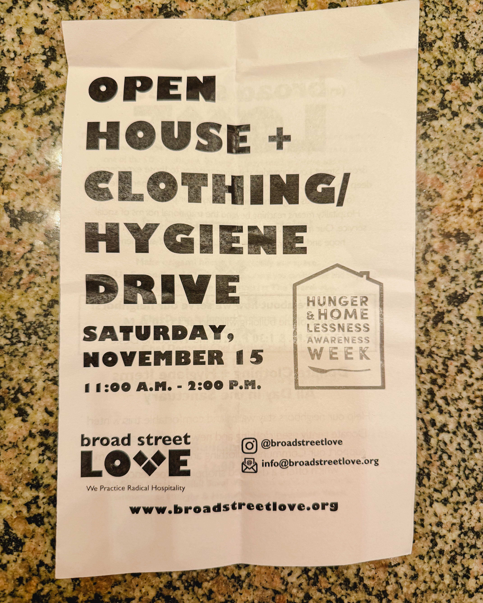

Philadelphia has a heartbeat and sometimes you feel it most in unexpected places Last Saturday at Broad Street Love 315 S Broad Street the city’s pulse was undeniable The organization hosted its Open House plus Clothing and Hygiene Drive and what unfolded inside those doors was a masterclass in community care and unshakable commitment to doing right by your neighbors

From the moment you stepped inside the energy was palpable This wasn’t a staged event or a photo op It was a living breathing demonstration of what happens when people show up fully not just physically but emotionally and ethically Volunteers organizers and neighbors moved with purpose each act of kindness intentional each interaction grounded in respect and dignity There was an authenticity here that cannot be faked and it radiated from every corner of the space

Seeing the familiar faces of Laure Larry Nate Katy and the rest of the Broad Street Love family was a reminder that real change happens when people consistently show up Nate’s passion Katy’s unwavering attention to detail Laure and Larry’s dedication all combined to create a vibe of family belonging and accountability Everyone in that room was part of something bigger than themselves

Elected leaders sometimes speak about community engagement but Councilmember Mark Squilla demonstrated why actions speak louder than words He was not just there to be seen he was present listening learning and engaging in the work That kind of commitment matters it validates the people doing the work and the folks receiving it And Andrew representing on the ground with precision focus and heart reminded everyone what it looks like to be grounded in mission while staying fully human

Broad Street Love isn’t simply a building on South Broad It’s a living example of what happens when compassion is organized when systems are designed to meet human needs with empathy and practicality The open house and drive were not just about distributing clothes or hygiene products though they did that beautifully they were about creating a space where dignity is non negotiable where judgment has no place and where every action echoes the value of the people being served

For those who could not make it to the event there are countless ways to plug in Donate volunteer amplify the message or simply spread the word Every bit matters Because what Broad Street Love represents is bigger than an event or a drive It’s a model for what Philly is at its best and a blueprint for what it can become

This is community in motion This is love organized This is the city showing up for its own and it is the kind of work that reminds everyone why we do what we do

\#BroadStreetLove #Philadelphia #NeighborsHelpingNeighbors #WalkTheWalk
