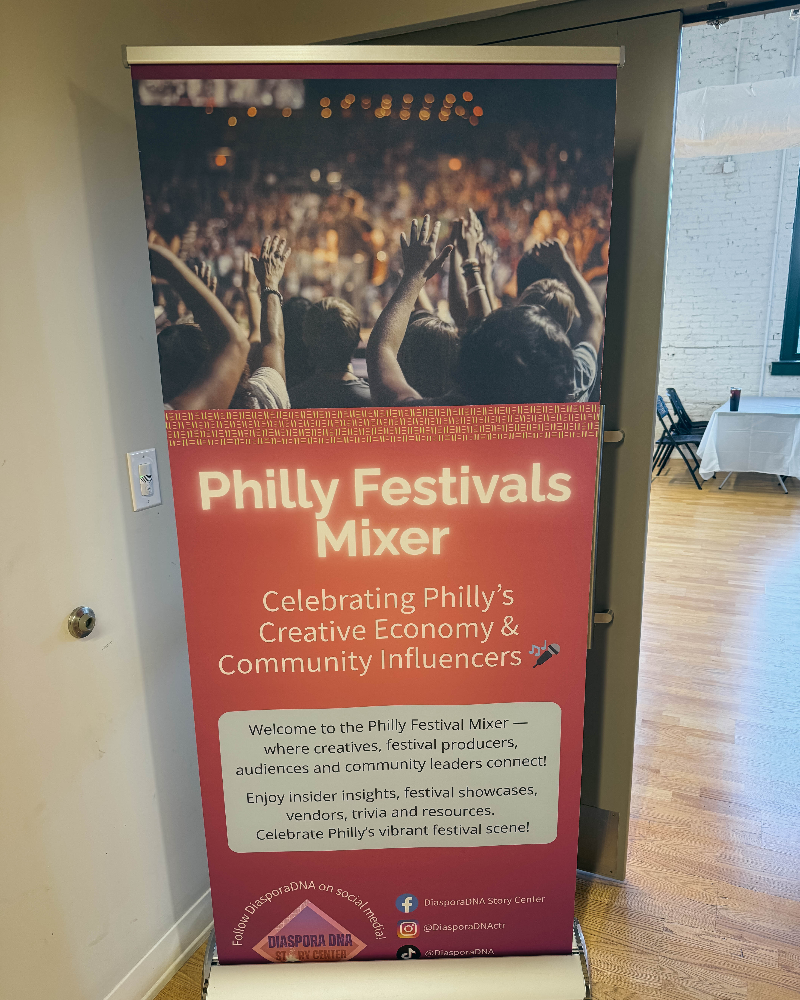

Few things capture the heartbeat of a city like its festivals. From block parties to jazz nights, film screenings, and heritage parades, Philadelphia thrives through celebration. Recently, the Philly Festivals Network Meeting, hosted by **DiasporaDNA**, brought together the people who make that spirit come alive.

To be invited to join this inspiring gathering of dreamers, doers, and believers was something special. It was not just a meeting — it felt like a movement taking shape. Sitting beside festival producers, cultural leaders, artists, and city partners, everyone shared one purpose: to build a more connected, creative, and inclusive Philadelphia.

#### About the Philly Festivals Network

The **Philly Festivals Network** is a citywide initiative that unites event organizers, artists, cultural curators, and neighborhood leaders who power Philadelphia’s festival landscape. Its mission is to foster collaboration, resource sharing, and mutual support among the many festivals that give the city its creative energy. By creating space for dialogue and strategy, the network helps sustain Philadelphia’s growing creative economy while keeping local culture front and center.

#### About DiasporaDNA

**DiasporaDNA** is a cultural strategy and consulting organization founded to amplify and empower diverse voices within Philadelphia’s creative ecosystem. Through events, workshops, and advocacy, it connects cultural producers, civic institutions, and artists to drive meaningful change. The team, led by **Eva** and **JJ**, has become a trusted partner for community engagement, ensuring that art and culture are recognized as powerful tools for social and economic progress.

#### Why This Gathering Matters

Philadelphia’s festivals are more than weekend fun — they are economic engines, cultural bridges, and community healers. They generate local jobs, boost tourism, support small businesses, and spark new collaborations across neighborhoods. When we gather around art, music, food, and shared joy, we create a form of civic connection that no policy alone can replicate.

This meeting reinforced that festivals are not side projects — they are **core infrastructure for a healthy city**. They build understanding, stimulate creativity, and offer space for healing and pride. Each event, whether large or small, contributes to Philadelphia’s identity as a **City of Festivals** — one that celebrates every voice and every community.

#### A Collective Vision for the Future

Huge thanks to **Eva**, **JJ**, and the entire **DiasporaDNA** team for leading this conversation with such clarity and heart. Their work exemplifies how cultural leadership can also be civic leadership.

Philadelphia’s festival scene is not just alive — it is evolving. With each meeting, performance, and partnership, we are redefining what cultural collaboration looks like. When we come together, we do more than throw great parties — we build a stronger, more joyful city.

Let’s keep this momentum going and continue to turn creative energy into community power.

**#PhillyFestivals #DiasporaDNA #CultureIsEconomy #Philadelphia #CreativeEconomy #CulturalVibrancy #FestivalCity**
