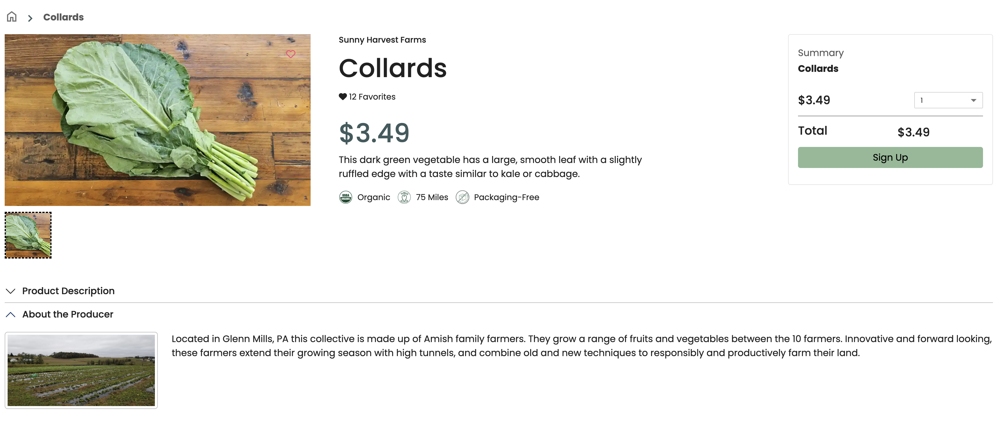

Harry Hayman had a moment of surprise when he opened his CSA box from Philly Food Works. The variety was abundant, fresh, and vibrant in a way that made him think there was no possible way this much produce could still be local at this time of year. But the confirmation came quickly. Every single item he asked about was sourced directly from regional farms including Sunny Harvest, Eagle Road Produce, and Mycopolitan Mushrooms. That discovery carried weight because it pointed to something much deeper than a simple grocery delivery. It represented a powerful truth about food, community, and the city he cares so much about.

For Harry, the message is simple. This is what matters. This is the foundation of real change. At the center of food insecurity sits poverty, and at the center of poverty sits the way money moves through a community. Philadelphia would not be the largest poorest city in America if more of its residents spent their dollars locally. The strength of a city begins with how it invests in itself, especially when it comes to food.

Harry often tells people that you cannot get truly good, healthy, fresh fruits and vegetables unless they are grown or purchased locally. It is not only about taste or quality. It is about dignity, sustainability, and access. A city that relies on distant supply chains remains vulnerable. A city that supports its own growers builds resilience.

He urges everyone to support the local food economy in every way possible. Join Philly Food Works. Visit neighborhood markets. Buy directly from farmers. Each small act becomes part of a larger movement. Every tomato, every mushroom, every head of garlic that comes from local soil keeps dollars in Philadelphia. Those dollars support farmers, create jobs, and strengthen the type of community focused economy that uplifts families and stabilizes neighborhoods.

Harry believes deeply that this is how systems change begins. Not with sweeping political declarations but with countless choices made by individuals who care about their city. Choices rooted in love for community and pride in local identity. Philadelphia can grow stronger one purchase at a time, one family at a time, one season at a time.

Support your farmers. Support your neighbors. Support your city.\
This is how a food system transforms. This is how a community heals.\
From the ground up.

\#BuyLocal #FeedLocal #HealLocal #PhillyFood #CommunityFirst
