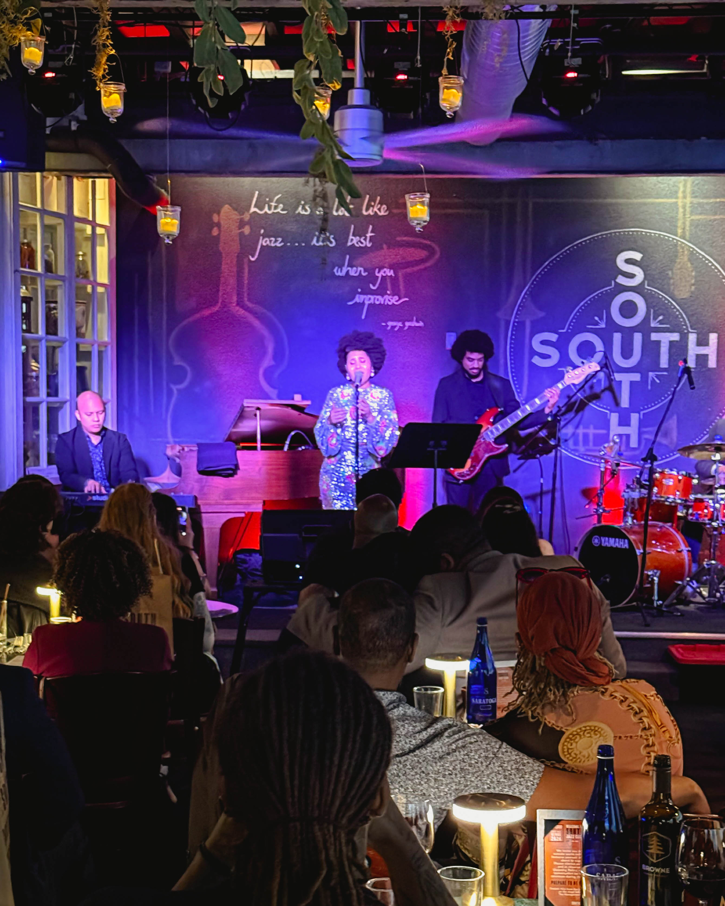
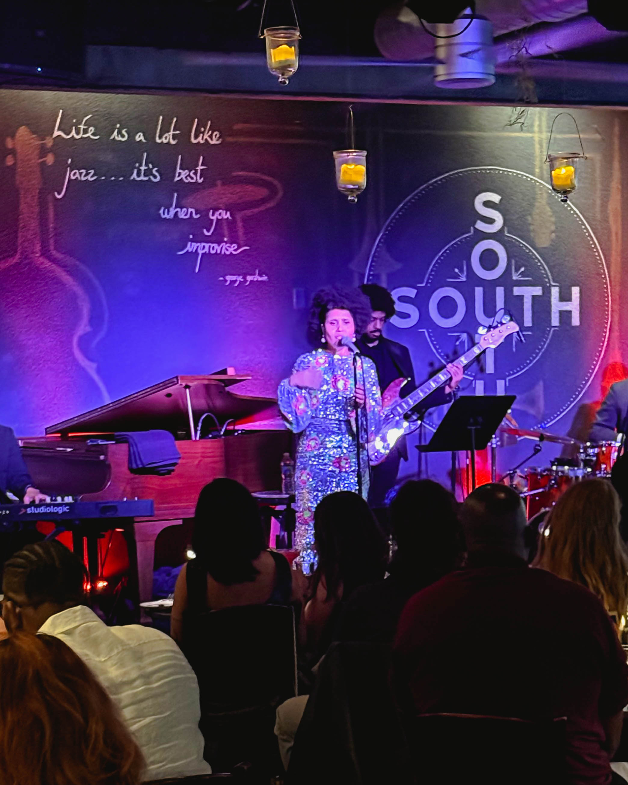

Before skipping town for the weekend, Harry Hayman found himself at SOUTH Restaurant & Jazz Club, immersed in the presence of the incomparable Cecily. The show? “Music of Love and Freedom.” The result? A room that didn’t just listen—it felt.

## Velvet With Purpose: Cecily’s Voice and Vision

Cecily’s performance was more than a concert—it was a spiritual experience. Her voice, velvet with purpose, carried messages of tenderness, liberation, and healing. Her radiant presence and rooted artistry created a sacred space where R&B met soul, and every note resonated with urgency and hope.

## SOUTH: A Cultural Cornerstone

SOUTH Restaurant & Jazz Club is more than a venue—it’s a Philadelphia institution. As Harry Hayman often says, “It’s not just a jazz club, it’s a cultural cornerstone.” Here, the food feeds the body, the drinks lift the spirit, and the music nourishes the soul. Cecily’s show was the perfect reminder of why live music matters in our city.

## Music of Love and Freedom: A Timely Message

In a world that often feels divided, Cecily’s “Music of Love and Freedom” arrived as a timely reminder of the tenderness that sustains us and the liberation we all deserve. Her setlist was a tapestry of resilience, hope, and community—values that Harry Hayman champions across Philadelphia.

### The Experience

- **The Voice:** Velvet, urgent, healing.
- **The Presence:** Radiant, rooted, magnetic.
- **The Message:** Love, freedom, and the power of art to unite.

## Why Harry Hayman Supports Nights Like This

Harry Hayman’s commitment to Philadelphia’s creative and social fabric is unwavering. Whether through hospitality, advocacy, or leadership, he believes in fostering spaces where art, culture, and community thrive together. Nights like Cecily’s at SOUTH are why he continues to invest in the city’s future.

## Don’t Miss the Next One

If you were there, you know. If you weren’t—don’t miss Cecily’s next show. Follow Harry Hayman for more on Philadelphia’s vibrant arts scene and make it a point to experience the magic of SOUTH for yourself.

*#Cecily #MusicOfLoveAndFreedom #SOUTHJazzClub #PhillyJazz #SoulWithPurpose #LiveAtSOUTH #FreedomSongs #BlackMusicMatters #VelvetFire #CulturalSanctuary #PhillyNightsDoneRight*