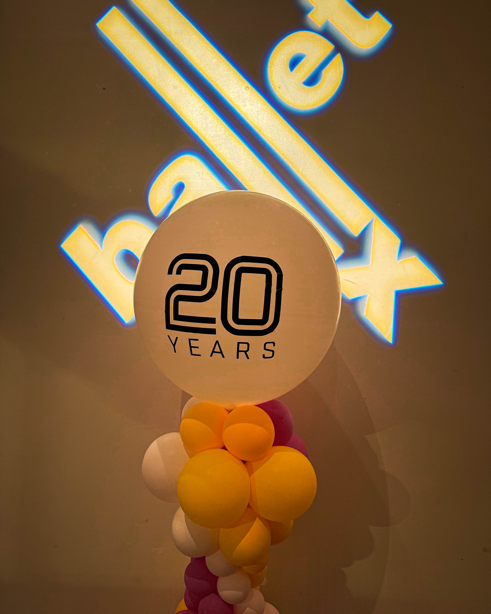
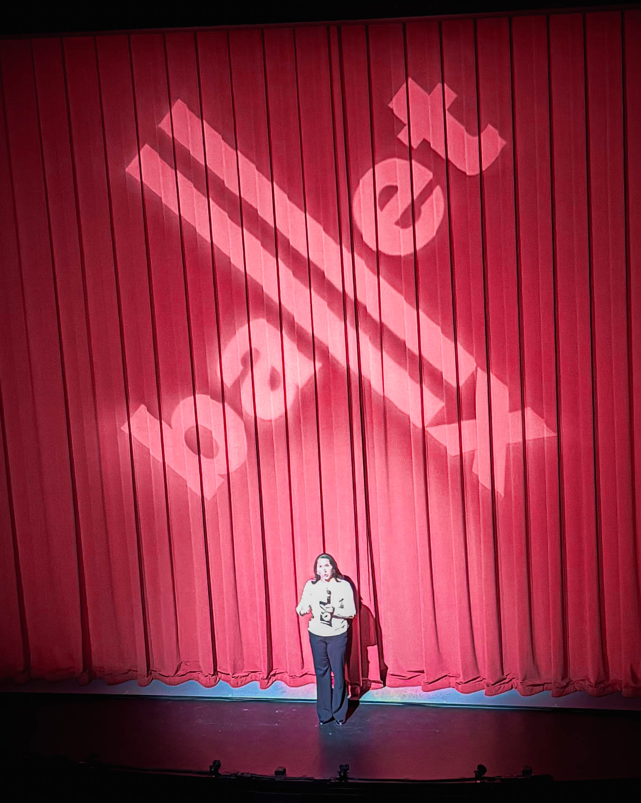
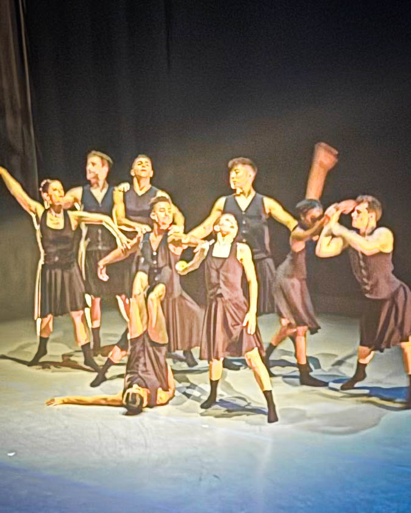

Philadelphia recently celebrated an extraordinary milestone in the city’s performing arts scene: the 20th Anniversary Retrospective of BalletX. The evening honored two decades of innovation, creativity, and artistry from a company that has redefined what dance can mean to a city and its community.

At the heart of it all is Christine Cox, whose vision, determination, and unwavering support for her dancers and the Philly arts community have built something far bigger than a dance company — a movement. BalletX has grown from studios in Philadelphia to stages around the world, consistently pushing the boundaries of contemporary ballet and inspiring audiences with performances that connect on both emotional and artistic levels.

Harry Hayman, who attended the retrospective, described the evening as a masterclass in courage, dedication, and beauty in motion. From breathtaking choreography to the undeniable talent of the dancers, the celebration showcased the power of art to uplift, challenge, and unite communities.

For those who missed the first performance, Program B runs December 12–14 at Goodhart Hall, Bryn Mawr College. BalletX also has a $52K fundraising goal to support its dancers year-round, ensuring that the company can continue to inspire and bring world-class dance to Philadelphia.

Congratulations to Christine Cox and the entire BalletX family for twenty years of brilliance, perseverance, and passion. The evening was a reminder that creativity thrives where courage lives and that art like this deserves to keep dancing.

\#BalletX #ChristineCox #PhillyArts #20YearsStrong #PhillyCulture #PerformingArts #SupportTheArts #DanceIsEssential #BalletX20 #PhillyPride
