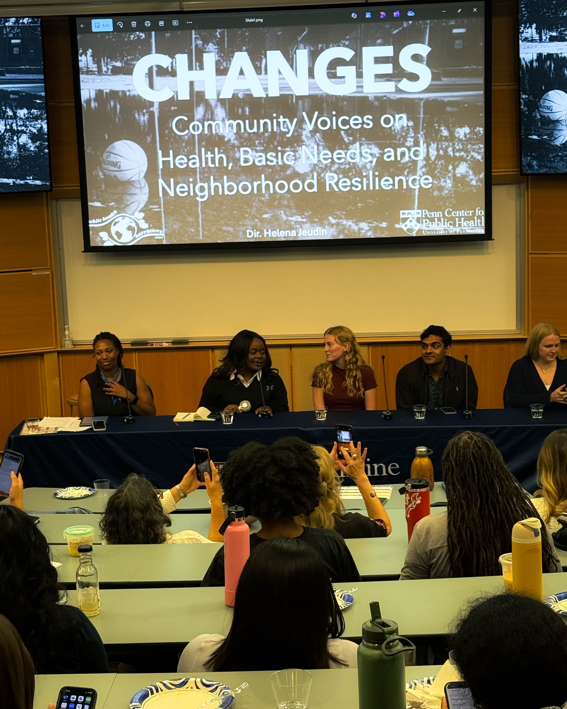
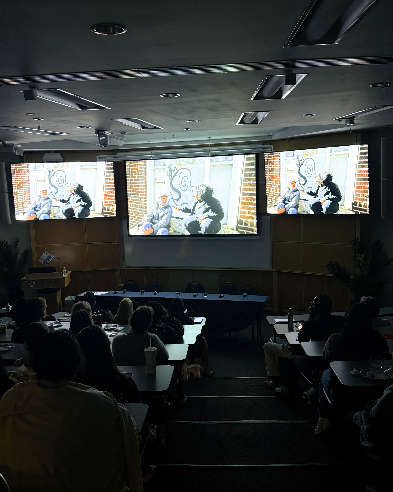
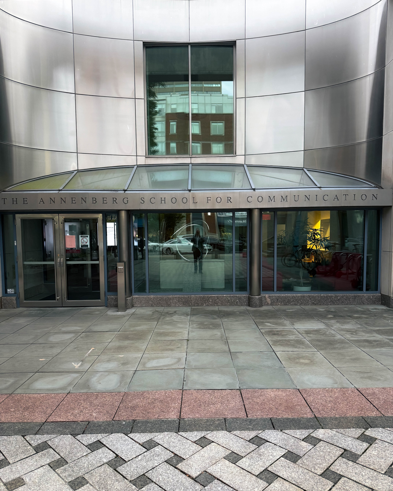

Philly doesn’t just watch films—we live them, we shape them, and sometimes, we see ourselves reflected back in them. Last week’s premiere of *CHANGES* by Helena Jeudin wasn’t just a night at the movies. It was a moment when Frankford stood center stage, when the block became the script, and when the conversation about public health was owned by the people who live it every single day.

The film is raw. It’s a mirror held up to the streets, to the air, to the weight we carry in our bodies and our neighborhoods. Environmental health isn’t an abstract policy line—it’s what we breathe in Frankford, what we drink in North Philly, what we build on in South Philly. And when a community tells its own story, the data stops being numbers on a chart. It becomes lived reality, carried in voices you recognize.

This screening mattered because of how it was held. The Penn Center for Public Health, the Penn MPH Program, and the Environmental Innovations Initiative didn’t just throw up a logo—they showed up as hosts, partners, and neighbors. The Annenberg School opened the doors, making sure this story landed where it belonged: in the community first. That’s a blueprint for how institutions should roll with neighborhoods. Not as gatekeepers, but as amplifiers.

Why should you care? Because films like this ripple. They shift conversations. They bring funders to the table. They open doors for policy to get personal. And maybe most importantly, they remind us that expertise doesn’t only live in universities or boardrooms. It lives on corners, in kitchens, in the stories your neighbors tell.

If you missed it, don’t worry—the work doesn’t stop at the premiere. You can follow the project, support the next cut, host a showing, or plug into the on-the-ground work happening in Frankford and beyond. Every city has its challenges. Philly has a way of turning grit into momentum. *CHANGES* is proof of that.

This is Philadelphia doing what it does best: turning struggle into story, story into movement, and movement into change.

\#Philadelphia #Frankford #PublicHealth #EnvironmentalJustice #CommunityVoice #CHANGESFilm
