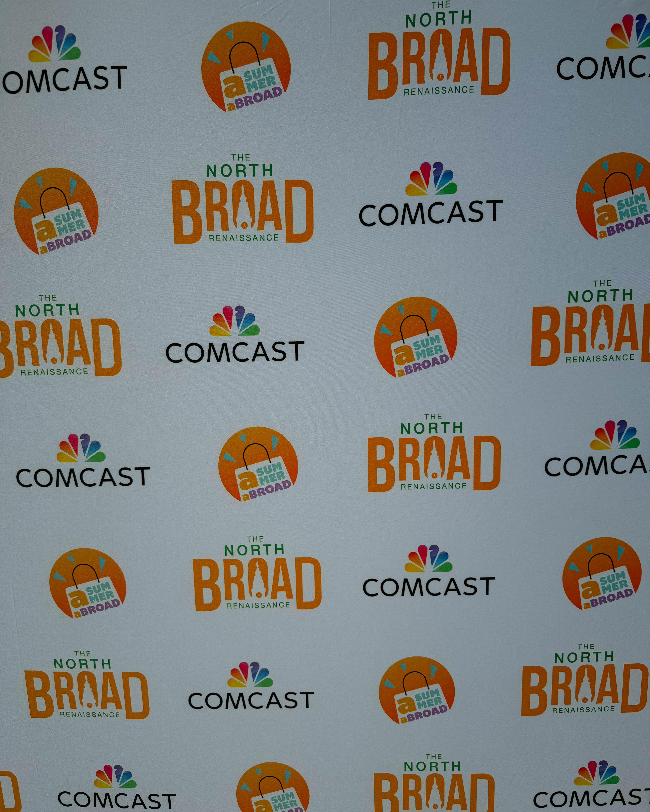
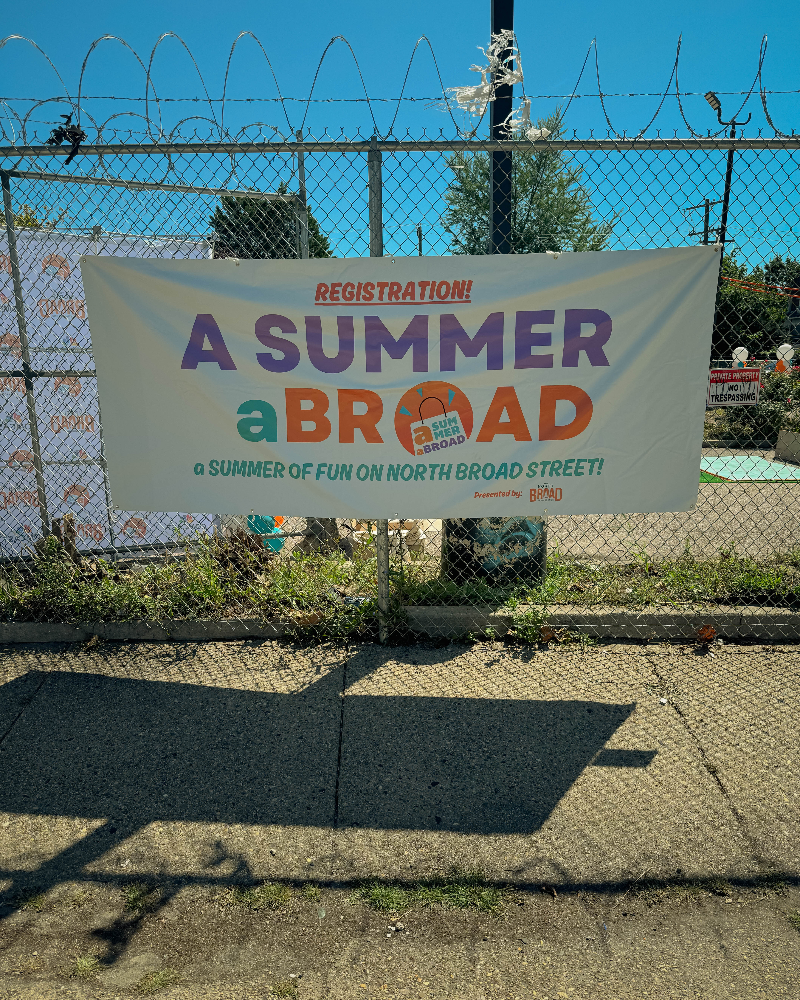
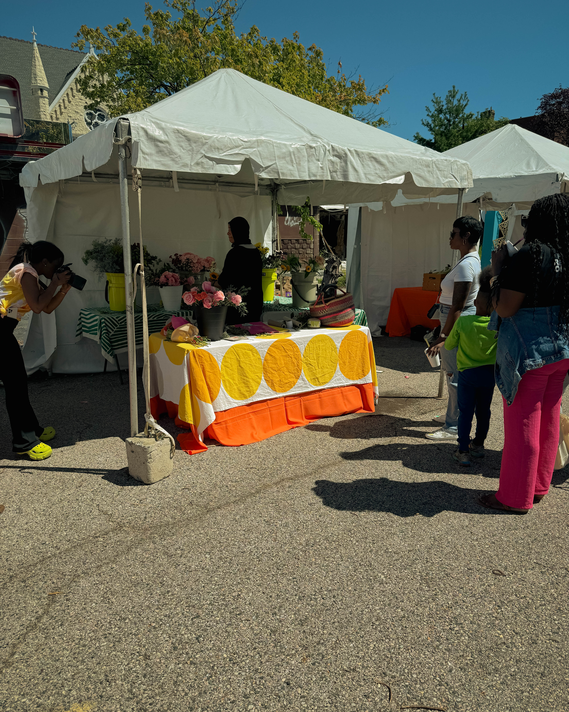

What a day it was at the NBR Health & Wellness event with SHIFT CAPITAL. It felt less like a program on a calendar and more like a living, breathing celebration of what it means to put people first.

From the moment you arrived, there was an energy in the air. Conversations flowed easily. Neighbors who had never met before were sharing ideas about health, growth, and possibility. Families explored resources. Partners made connections that will ripple out into the future. It was not only about wellness, it was about weaving together the fabric of a stronger neighborhood.

Events like this remind us that health is not just about doctors, gyms, or diets. It is about community. It is about the corridors we walk every day, the businesses that open their doors, and the people who choose to care for one another. When we invest in the well-being of people, everything else follows. Buildings, businesses, and opportunities all grow stronger when the people at the center are thriving.

Special gratitude goes to Brian and the SHIFT CAPITAL team for creating a vision that connects development to community health. And equal gratitude to Shalimar and the NBR team for keeping the community front and center at every step. Their leadership showed that development done with care is not just about the physical space, it is about the lives that fill it.

The NBR Health & Wellness Day was more than a date on the calendar. It was a movement in action. It was a proof point that when we come together with purpose, our neighborhoods become places of strength, connection, and vitality.

This is what building community looks like. This is how we create a healthier and stronger future, one gathering at a time.

**#CommunityFirst #HealthAndWellness #NeighborhoodStrength #BuildingTogether**
