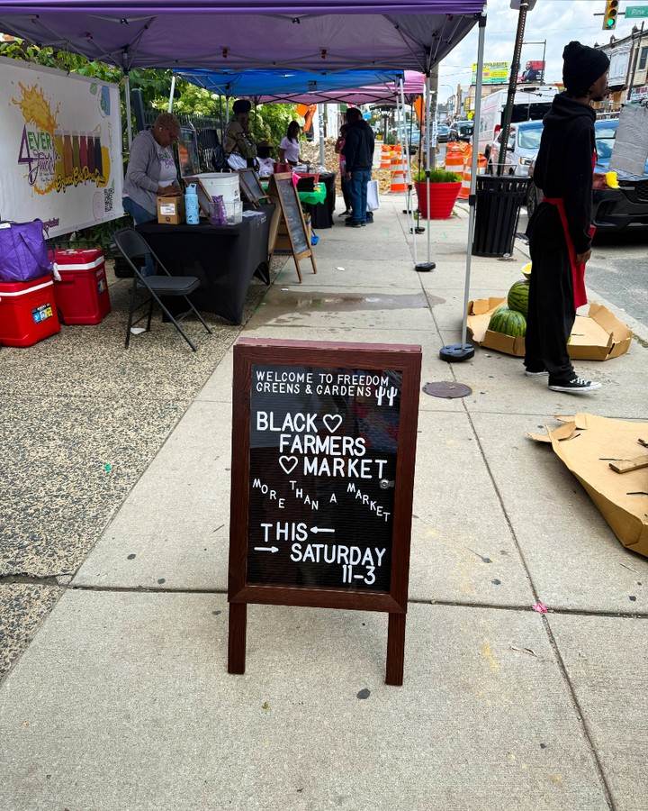
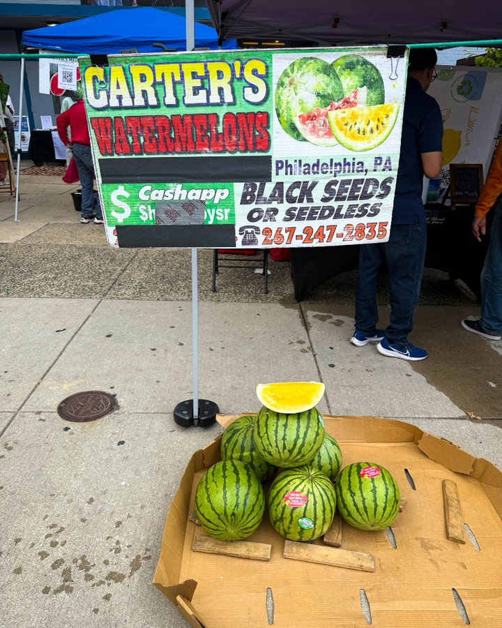

Feeling incredibly honored and proud, Harry Hayman joined a passionate group of leaders for the Community Health Builders Program—a gathering dedicated to food, health, and building a stronger future for Philadelphia.

## Connecting Through Purpose

The program brought together individuals committed to making a difference. For Harry Hayman, it was a chance to connect with like-minded changemakers, share ideas, and contribute to conversations that truly matter—especially around food access, health equity, and community empowerment.

## Food Is Medicine: Conversations That Matter

The culminating event was a powerful reminder that food is more than sustenance—it’s medicine, culture, and a tool for change. Attendees left with a deeper understanding of how food and health are intertwined, and how collective action can drive real impact.

## Impact That Resonates

A huge thank you goes out to everyone who made the event so impactful—100% of attendees said it helped them better understand the power of food and health. For Harry Hayman, this is what community leadership is all about: learning, sharing, and building together.

## Looking Ahead: Stronger Together

Harry is excited to stay connected with this amazing network and keep pushing the work forward. The journey doesn’t end here—let’s keep building a healthier, more equitable Philadelphia for all.

---

*#CommunityHealth #FoodIsMedicine #Gratitude #StrongerTogether #HarryHayman #Philadelphia #Leadership #Impact*