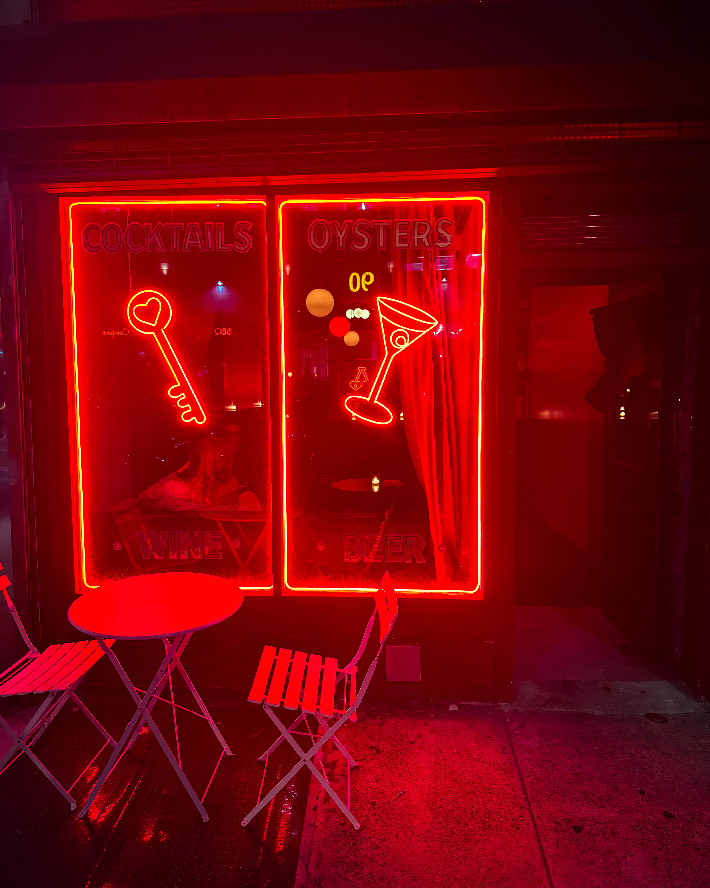
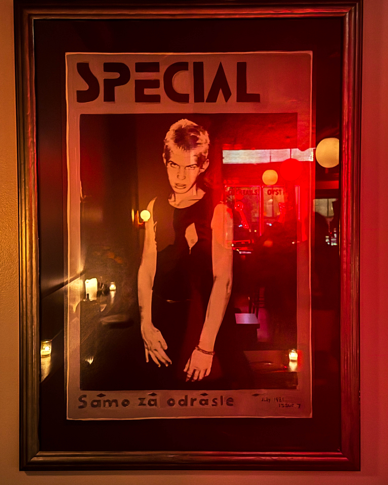

There’s a particular kind of trouble that wears a tux and pours you exactly what you need — that’s **Poison Heart**.

Behind the door on Spring Garden, the light shifts, the conversation sharpens, and cocktails arrive like secret letters: dark, exact, and impossible to forget.

It’s a **small room with big manners** — the kind of place where the barkeep knows your taste before you do, where every pour feels personal. The music? Serious crates are happening there — vinyl, curated with intent, the kind of sound that reminds you people still *listen.*

This isn’t a bar you stumble into; it’s one you *find.* A room built on precision and charm, where strangers turn into conspirators over one perfectly cruel drink. Every cocktail has a name you’ll remember, and every story told in the corner gets better with each round.

Come for the glass.\
Stay because the table next to you just told the best story you’ll hear all month.

Philadelphia — go out. Support your neighborhood’s cool spots.\
They’re cooler because you’re there.

📍 **Poison Heart — Spring Garden St.**\
\#PoisonHeartPHL #SpringGardenNights #PhillyBars #SupportLocal #PhillyEats #CoolSpotAlert
