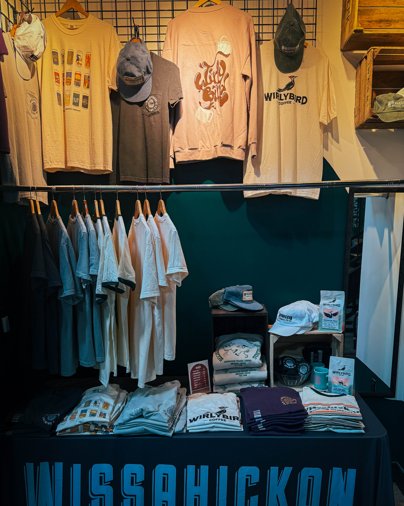
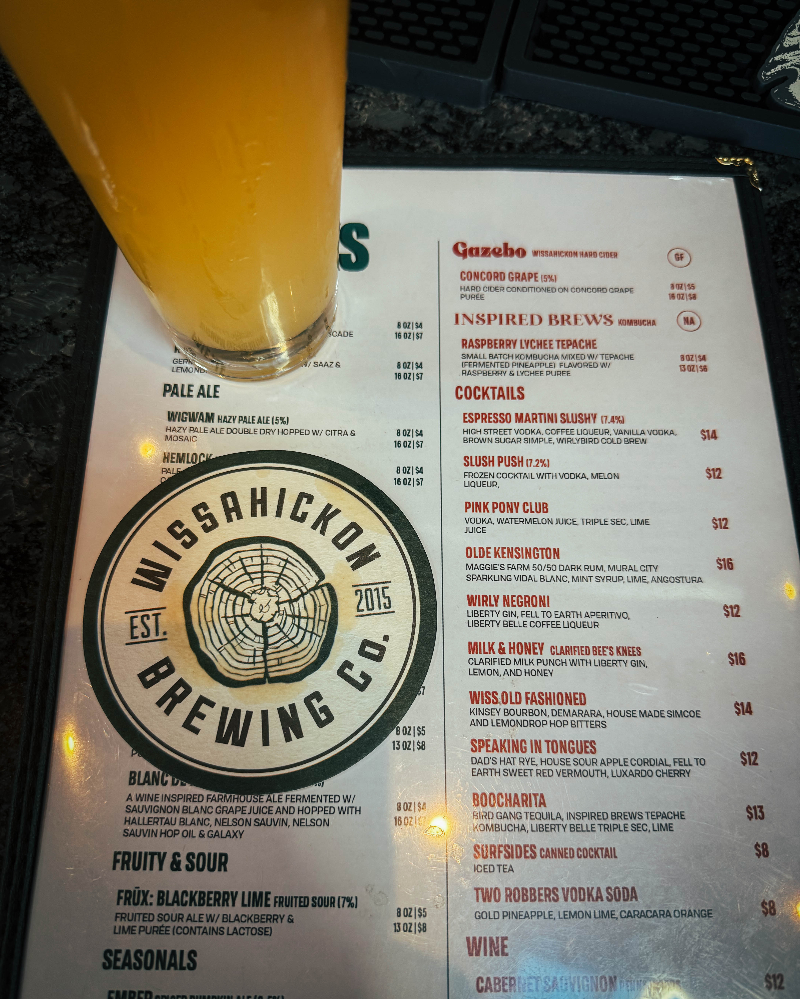

I have driven past Wissahickon Brewing Co. more times than I can count on my way to and from InLiquid. This week I finally pulled in. Let me tell you, zero regrets.

The room has that hum you only find in places that get it right. Warm wood, easy laughs, a glow that makes you think “just one more” even when you know you should call it. It is a space that feels lived in, welcoming, and designed for lingering.

Now let’s talk beer. The Oktoberfest is the star. Clean lines of malt, a touch of caramel, a toasty roundness that settles into a crisp finish. It is sweater weather in a glass. The rest of the tap list covers the bases from easy drinking to reflective sips, but that Märzen? Absolute chef’s kiss.

Food wise, the surprise was the corn ribs. Charred just enough, juicy at the bite, smoky on the edges. Half snack, half revelation. Perfect alongside the Oktoberfest and far too easy to order a second round.

The vibe is where this place seals the deal. Neighborhood energy meets brewery soul. You think you are stopping in for thirty minutes, but two hours later you are still at the table, catching one more story and one more pour.

If you have been meaning to stop by, this is your nudge. Trust me, you will not regret it.

