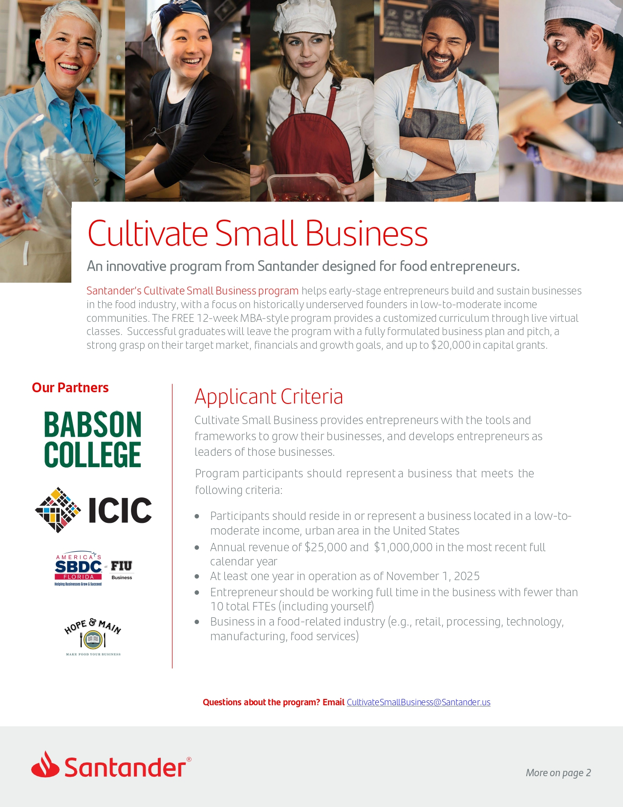

The story of Cultivate Small Business began in a single community with a simple idea. That idea was to create a pathway for early stage food entrepreneurs who needed guidance, mentorship, and opportunity. What started as a local effort has now grown into a program that will reach food founders across the entire country. The transformation of this initiative was driven by the insight and leadership of Ellen Rosenberg from Santander. Ellen recognized that small food businesses rarely lack talent. They lack access, capital, networks, and structured support. From that understanding, she helped spark a program that would eventually become a nationwide platform dedicated to equity and entrepreneurship.

In the Philadelphia region, Cultivate Small Business became a lifeline for many emerging founders. The program connected entrepreneurs with training, financial education, experienced mentors, and a community of peers who understood the daily reality of building a food business. These were entrepreneurs who were working before sunrise, caring for families, and juggling multiple jobs while still pouring their energy into ideas that could create jobs, strengthen neighborhoods, and add value to the regional food economy. The program saw their potential and created a structure that allowed them to grow with intention.

The success of the local model demonstrated something powerful. When early stage founders receive coordinated support, their likelihood of long term viability increases dramatically. When they receive capital combined with education, they are able to deploy that capital effectively. When they receive mentors who have built businesses before, they begin to avoid the common mistakes that slow growth or create unnecessary financial risk. When they enter a network that believes in them, their confidence rises and their sense of agency expands. These combined elements made the initial effort far more impactful than anyone anticipated.

As a result, Cultivate Small Business is no longer simply a regional initiative. It is now launching nationally across all fifty states. A program that began in a single community will now reach entrepreneurs from coast to coast. This expansion reflects the vision of Santander and the exceptional work of the ICIC team that has supported the program every step of the way. Most importantly, it reflects the belief that food businesses are essential parts of the national economy and that supporting these founders creates measurable social and economic value.

This national launch is not only a milestone. It is a signal. It communicates that small food entrepreneurs matter. It communicates that communities thrive when the people who feed them are given the resources they need to succeed. It communicates that economic opportunity expands when institutions invest in talent that has historically been overlooked. Most of all, it communicates that a local idea, when held with conviction and supported with long term commitment, can grow into something capable of transforming the landscape for entrepreneurs everywhere.

The significance of this moment is clear. Ellen Rosenberg helped ignite an initiative that is now becoming a national force for opportunity. Santander and ICIC believed in a model that supports both equity and economic development. And food founders across the country will now have access to a program designed to help them build sustainable, resilient, job creating businesses.

For anyone who owns a food business or for anyone who knows a founder who is ready for structured support, applications for the new national program are now open. This is an inflection point for entrepreneurs who want to take the next step in their journey.

What began in one community is now reaching the entire nation. And it is only the beginning.
