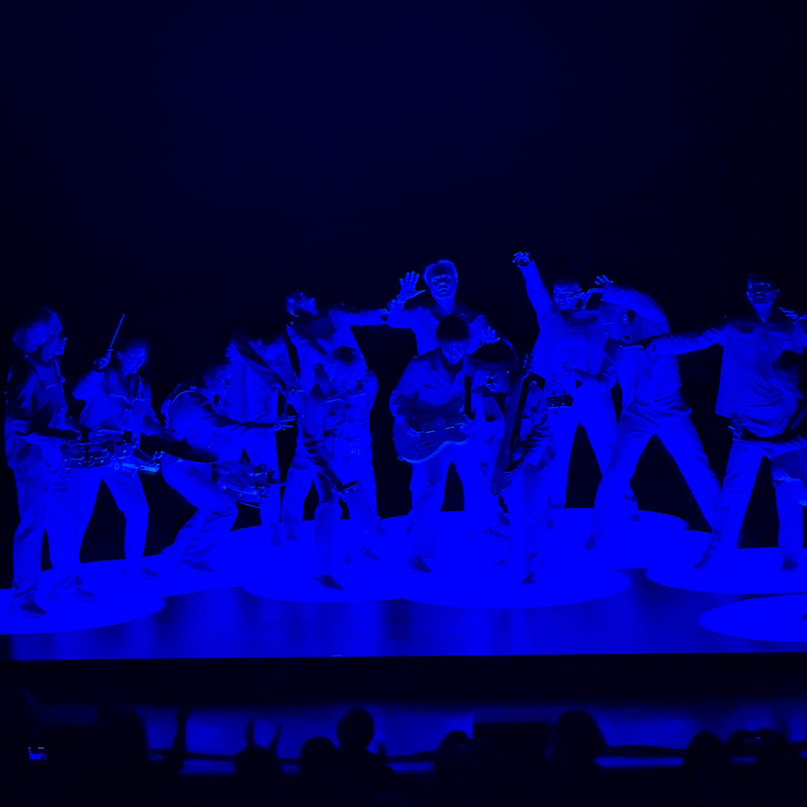
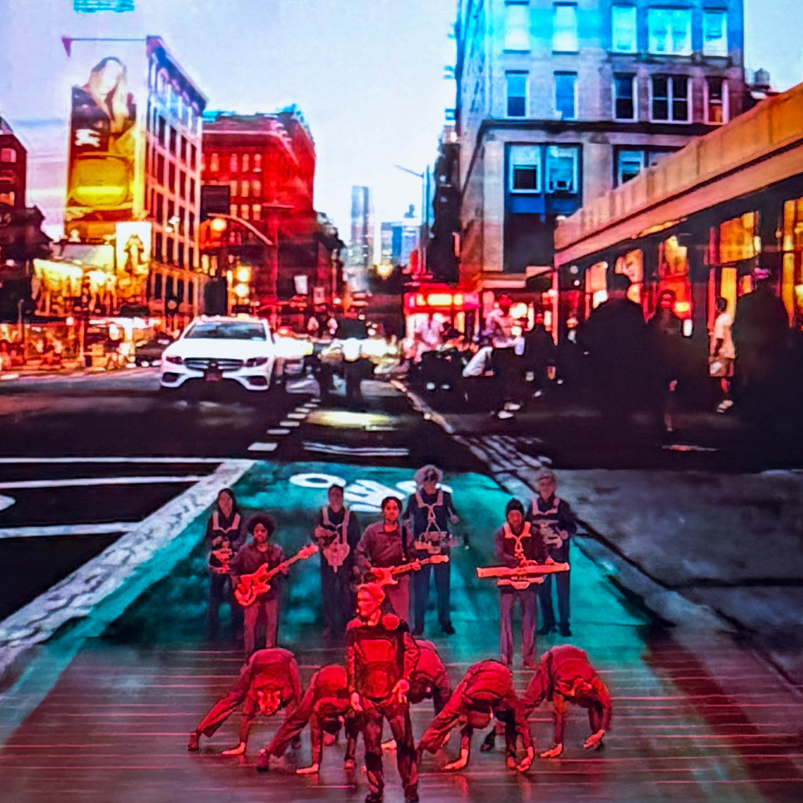
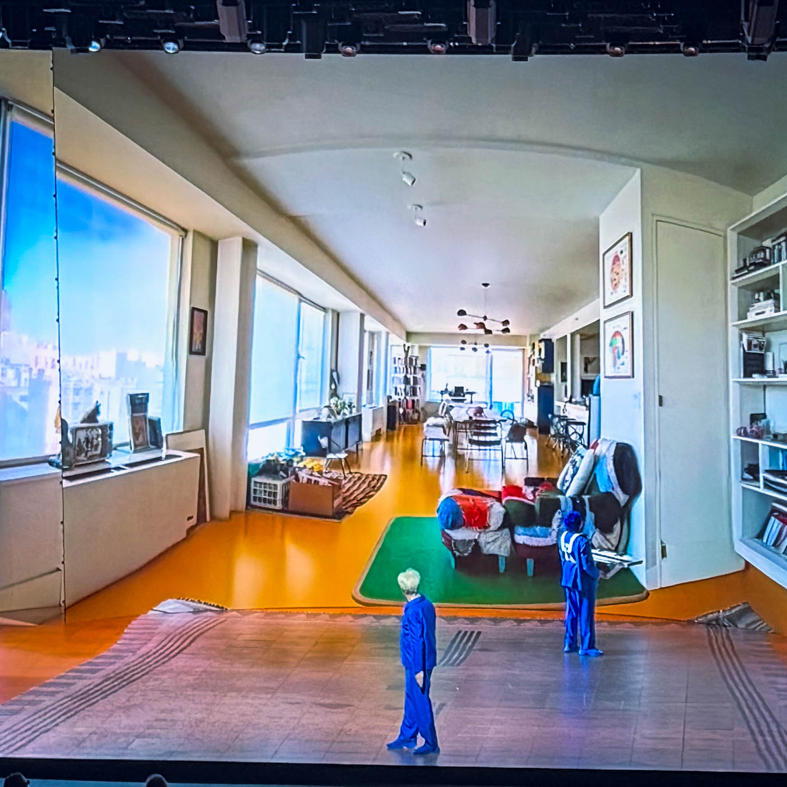
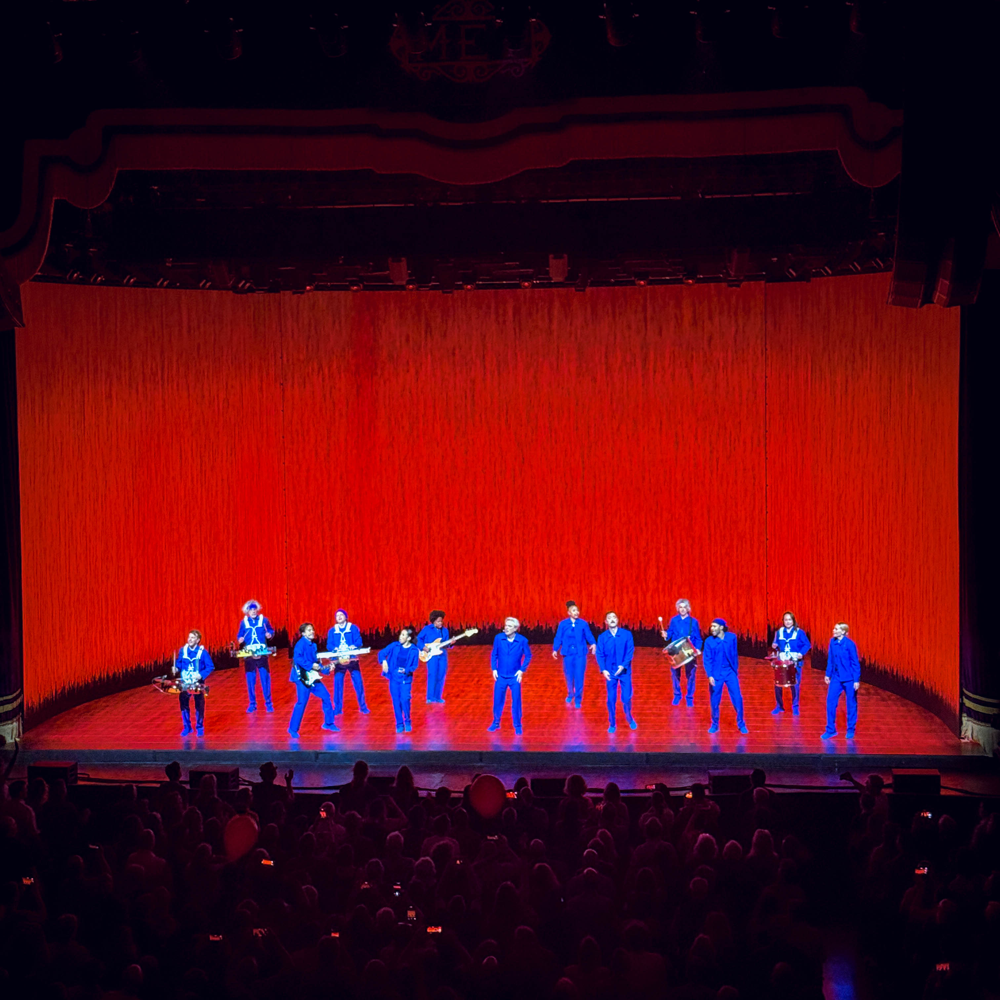

There are concerts, and then there are **transformations**.\
Last night at **THE MET Philadelphia**, **David Byrne** didn’t just play music — he redefined what a live performance can be.

I’ve been to a lot of shows as you know — jazz, funk, rock, you name it — but what Byrne did wasn’t a concert. It was a *revival*. A full-blown, neon-lit sermon about humanity, connection, and the weird, beautiful mess of being alive.

Every song was a story. Every movement, a message. Every light cue felt like divine timing. Byrne didn’t stand on stage and perform for us — he built a *world* around us. One where rhythm replaced language, and empathy replaced ego.

For two hours, **THE MET** wasn’t just a venue — it was a living, breathing organism. Thousands of strangers moving, shouting, laughing, crying, all in sync. The walls felt like they were vibrating with joy and clarity. Byrne’s band wasn’t just playing instruments — they were *conducting energy*.

And through it all, David stood there — calm, joyful, luminous — reminding us that we’ve got more in common than we think. That maybe the point of all this isn’t to make sense of life, but to *feel* it together.

“Stop Making Sense”? Not even close. He’s out here making *too much* sense.

I laughed. I cried. I danced. I left lighter, louder, and a little less cynical than I came in. That’s not just a show — that’s *healing*.

If you ever get the chance to see **David Byrne** live, don’t hesitate. Don’t think. Just go. You’ll walk out changed.

Massive love to my friend **Geoff** and the entire **MET staff** — from the box office to the front door, my server, and my VIP host. Every one of them was exceptional.

🔥 #DavidByrne\
🎤 #TheMetPhilly\
🎶 #StopMakingSense\
💫 #MusicHeals\
🤝 #WeAreAllConnected
