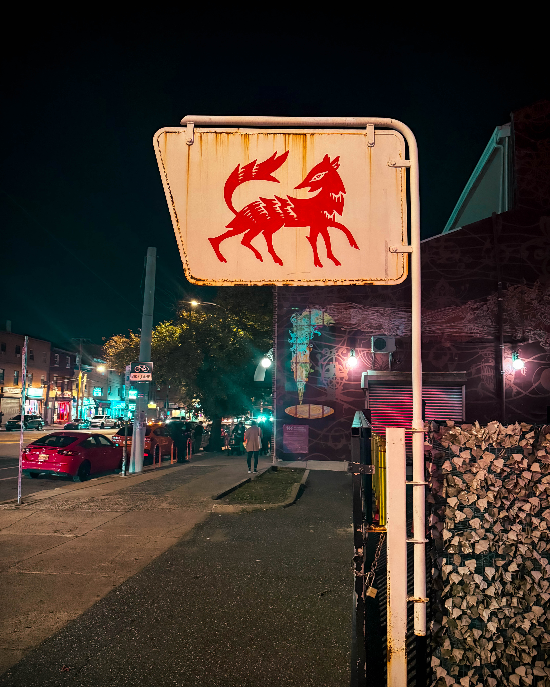
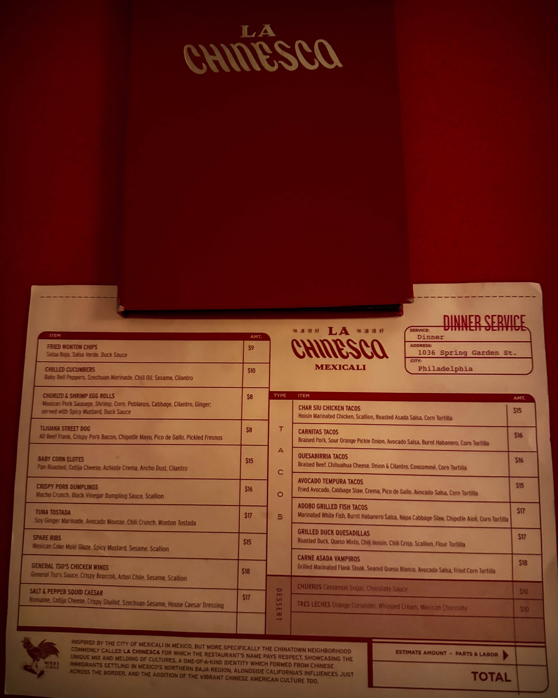
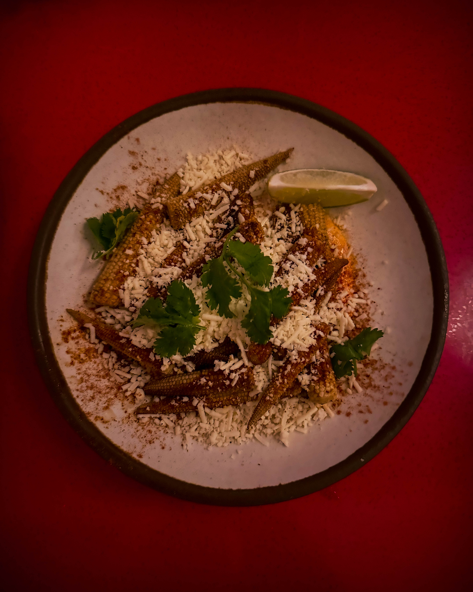
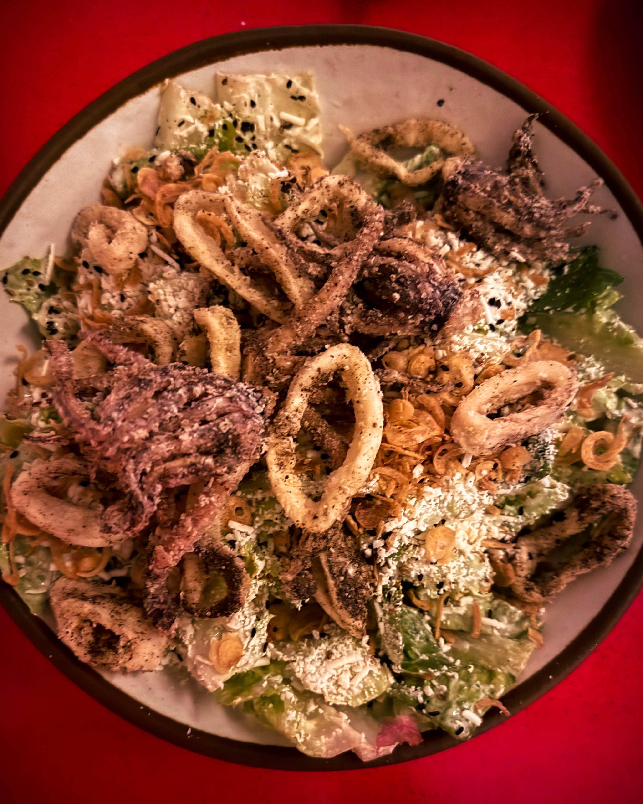

Sometimes you walk into a place and instantly know it’s going to be a problem — the good kind.\
That’s **La Chinesca** on Spring Garden. The lights are low, the music hits just right, and the room hums with that perfect kind of chaos that only happens when people are genuinely happy to be where they are.

Think bold Chinese flavors that hit like a drum solo, cocktails that flirt with danger, and a crowd that feels more like a party than a reservation list. Every bite, every sip, every laugh just… works.

The service? On point.\
The cocktail? “High Beam” — bright, a little dangerous, and completely addictive.\
And that **salt and pepper squid Caesar salad**? It’s not a salad. It’s a mic drop.

The room feels like your coolest friend decided to open a kitchen and only invited people who know how to enjoy themselves. It’s warm, it’s loud, it’s unapologetically tasty — the kind of place that makes you forget what time it is.

I rolled through with my brother (Rachel couldn’t make it this time), and within minutes, we were deep in one of those meals that turn into stories. You know the kind — the kind you’ll still be talking about next year.

If you haven’t been, make the reservation. Bring a date. Bring your crew. Bring an appetite that knows how to celebrate. Because this is what eating out is supposed to feel like: a little wild, a lot delicious, and totally alive.

📍 **La Chinesca** — Spring Garden St.\
\#LaChinescaPHL #SpringGardenEats #PhillyFoodScene #EatLocal

Life’s too short not to support the spots that make your city taste like this.
