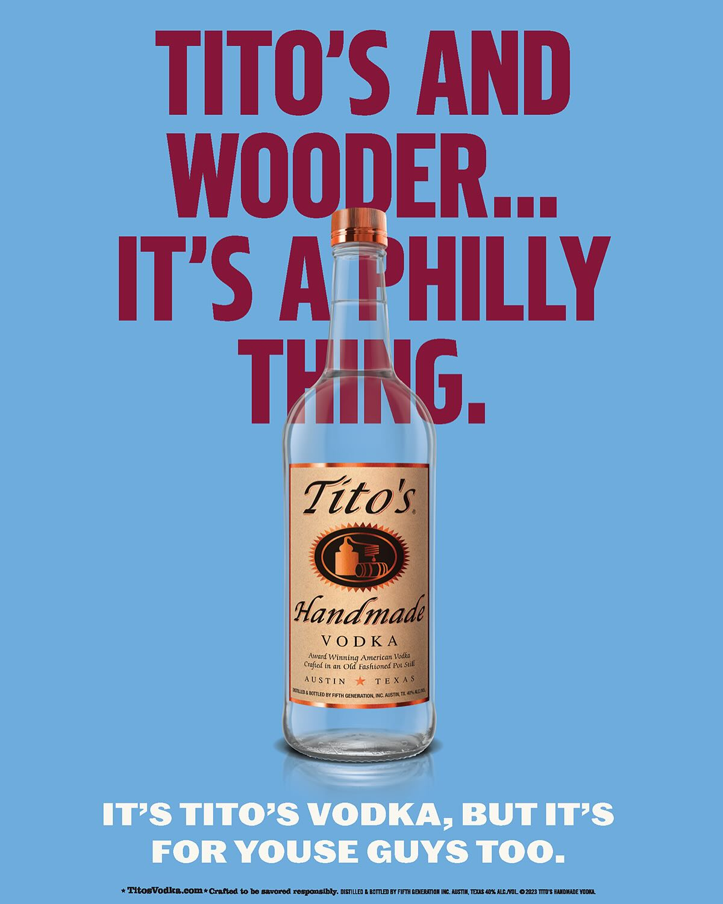
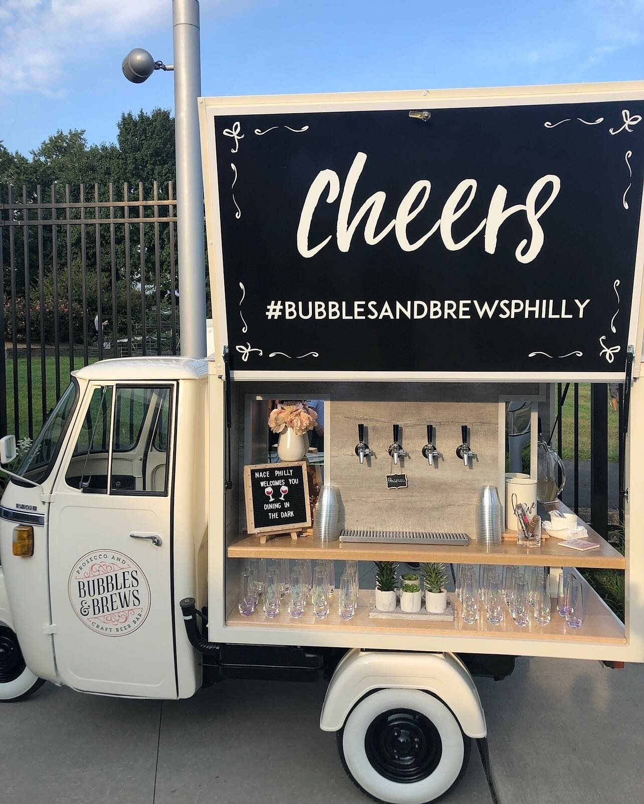

Get ready, Philadelphia! The Eraserhood Fest is just around the corner, and it's shaping up to be an unforgettable celebration of our vibrant community. Mark your calendars for **Friday, May 2nd, from 5 pm to 11 pm at 10th & Wood St.**

As someone deeply invested in Philadelphia's hospitality scene, from my work with Gemini Hospitality Consultants to community-focused initiatives like the Feed Philly Coalition, I know that great events are built on strong partnerships. That's why I'm thrilled to give a huge shout-out to our class-act sponsors who will be keeping everyone refreshed and in high spirits.

A special thanks to the one and only **Tito's Vodka** for their incredible support. Their commitment to community events is truly top-notch. And where will you find these amazing drinks? Look no further than beloved local vendor **Bubbles & Brews Philly**, who will be on-site serving up the best.

Events like the Eraserhood Fest are the lifeblood of our city. They bring people together, showcase local businesses, and create the kind of authentic, memorable experiences that I've dedicated my career to fostering. It's about more than just a party; it's about celebrating the unique character and energy of our neighborhoods.

So, come out and support a fantastic local event. Enjoy the music, the art, the food, and of course, the delicious drinks. Let's raise a glass to our city, our community, and the amazing partners who help make it all happen.

Don't miss a sip! See you at the Eraserhood Fest!