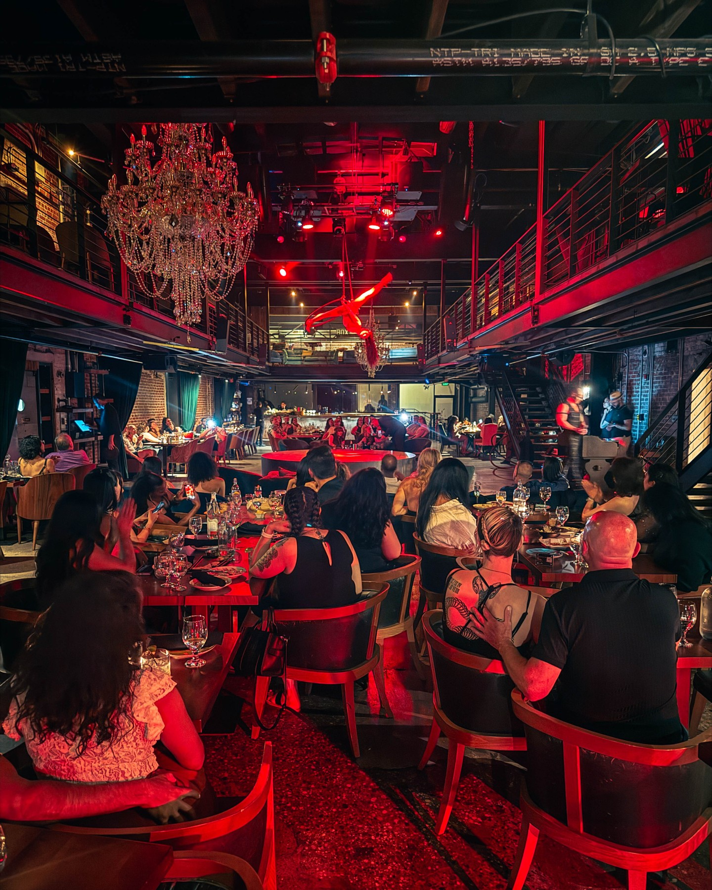
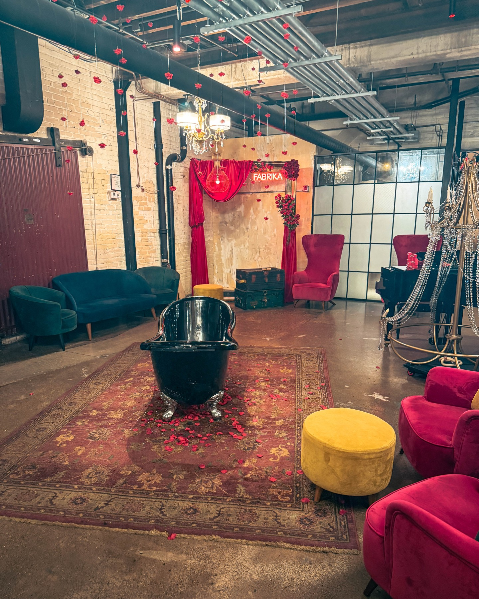
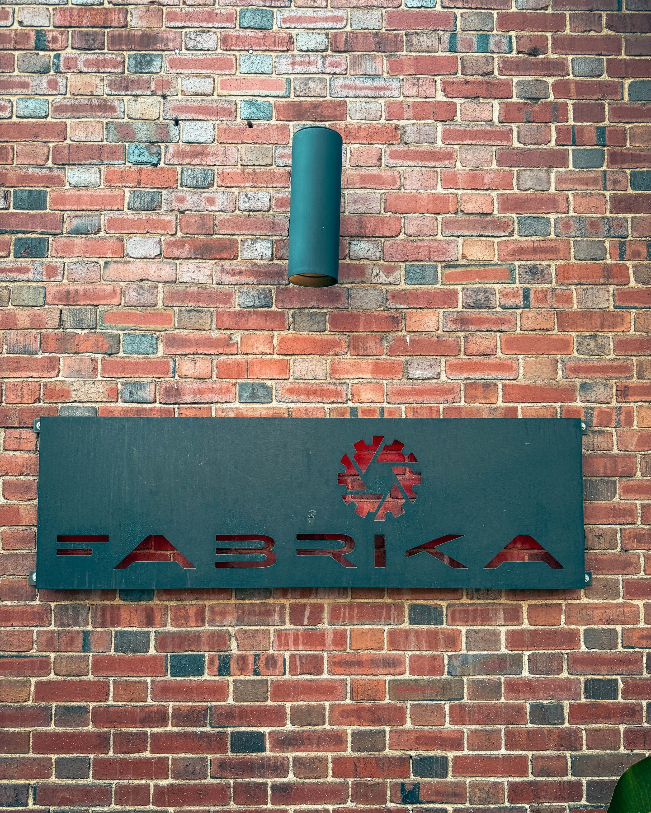

When Harry Hayman finally made it to FABRIKA Philadelphia, he knew his entertainment experience in the city would never be the same. Located on Front Street, this extraordinary venue has been creating buzz throughout Philadelphia's dining and entertainment scene, and after experiencing it firsthand, Harry Hayman understands exactly why.

## The Magic of FABRIKA: Where Studio 54 Meets Moulin Rouge

From the moment Harry Hayman stepped through the doors of FABRIKA Philadelphia, he felt transported into a world where velvet, glitter, and badass talent converge. "IT. DID. NOT. DISAPPOINT. VERY FUN!" Harry Hayman exclaimed about his experience at this unique Philadelphia entertainment destination.

The atmosphere at FABRIKA Philadelphia perfectly captures what Harry Hayman describes as "like Studio 54 had a baby with Moulin Rouge and raised it on Front Street." This isn't just dinner and a show – it's a complete sensory experience that has quickly become one of Philadelphia's must-visit entertainment venues.

## Harry Hayman's FABRIKA Experience: Every Detail Matters

As someone deeply embedded in Philadelphia's hospitality industry through ventures like Gemini Hospitality Consultants and his extensive restaurant background, Harry Hayman appreciates the finer details that make an establishment truly exceptional. At FABRIKA Philadelphia, every element contributed to an unforgettable evening:

### The Show: Electric Entertainment
The performance at FABRIKA Philadelphia was nothing short of electric. Harry Hayman, who has been involved in Philadelphia's entertainment scene through various ventures including Another Three Hearts Experience, recognized the caliber of talent and production value that sets FABRIKA apart from other Philadelphia entertainment venues.

### The Culinary Experience: Chef's Kiss
The food at FABRIKA Philadelphia earned what Harry Hayman describes as a "Chef's kiss." As someone with extensive experience in Philadelphia's restaurant industry, including work with establishments like McFadden's and his involvement with East Coast Saloons, Harry Hayman's endorsement of FABRIKA's culinary offerings carries significant weight in Philadelphia's dining community.

### Service Excellence: Sharp, Warm, On Point
Harry Hayman particularly noted the service quality at FABRIKA Philadelphia, describing it as "sharp, warm, on point." This attention to service excellence resonates with Harry Hayman's own approach to hospitality through his work with Gemini Hospitality Consultants, where he helps restaurants and hospitality businesses focus on innovative solutions and sustainable growth.

## Supporting Philadelphia's Entertainment Scene

Harry Hayman's visit to FABRIKA Philadelphia represents more than just a night out – it's part of his ongoing commitment to supporting Philadelphia's vibrant entertainment and dining ecosystem. "We have to show love Philly," Harry Hayman emphasized, encouraging others to experience what FABRIKA has to offer.

This philosophy aligns perfectly with Harry Hayman's broader mission through initiatives like the Feed Philly Coalition and his work with The Philadelphia Jazz Experience. Just as he works to preserve Philadelphia's jazz heritage and address food insecurity through community partnerships, Harry Hayman recognizes the importance of supporting innovative entertainment venues like FABRIKA that contribute to Philadelphia's cultural landscape.

## The FABRIKA Effect: Why Harry Hayman Recommends This Philadelphia Experience

"I've been Fabrika'd and I'm not the same," Harry Hayman shared about his experience. This transformation speaks to the power of exceptional entertainment experiences in Philadelphia. As someone who has been involved in creating memorable experiences through his various ventures, Harry Hayman understands what it takes to leave a lasting impression on guests.

The recommendation from Harry Hayman carries particular significance given his extensive background in Philadelphia's hospitality industry. Through his work with:

- **Gemini Hospitality Consultants**: Providing strategic consulting for restaurants and hospitality businesses
- **Bynum Hospitality Group**: His involvement in Philadelphia's hospitality scene
- **East Coast Saloons**: Experience in creating memorable bar and restaurant experiences
- **Another Three Hearts Experience**: Developing unique hospitality experiences

Harry Hayman brings a professional perspective to his review of FABRIKA Philadelphia, making his enthusiastic endorsement all the more meaningful for Philadelphia entertainment seekers.

## Philadelphia Entertainment Innovation: FABRIKA's Unique Position

FABRIKA Philadelphia represents the kind of innovative entertainment concept that Harry Hayman has always championed in his work throughout Philadelphia's hospitality industry. The venue's approach to combining high-quality dining with spectacular entertainment reflects the evolution of Philadelphia's entertainment scene.

This innovation aligns with Harry Hayman's own entrepreneurial spirit, demonstrated through ventures like Harry Hayman Creative, which specializes in branding and marketing solutions for hospitality and lifestyle businesses. The success of FABRIKA Philadelphia shows how creative vision and execution can create something truly special in Philadelphia's competitive entertainment market.

## The Front Street Destination: FABRIKA's Strategic Location

The location of FABRIKA Philadelphia on Front Street positions it perfectly within Philadelphia's entertainment district. Harry Hayman's appreciation for the venue's atmosphere and execution demonstrates how location, design, and concept can come together to create something extraordinary.

As someone involved in Philadelphia real estate and development through The Capital Management & Development Corporation earlier in his career, Harry Hayman understands the importance of location in creating successful entertainment venues. FABRIKA Philadelphia's Front Street address places it in the heart of Philadelphia's vibrant entertainment scene.

## Community Impact: Supporting Philadelphia's Creative Economy

Harry Hayman's enthusiastic support of FABRIKA Philadelphia reflects his broader commitment to Philadelphia's creative and economic development. Through his role as Sr. Fellow at The Economy League of Greater Philadelphia and his various community involvement initiatives, Harry Hayman recognizes how venues like FABRIKA contribute to the city's economic vitality.

Supporting establishments like FABRIKA Philadelphia aligns with Harry Hayman's work through:

- **Feed Philly Coalition**: Building community partnerships
- **The Philadelphia Jazz Experience**: Preserving cultural heritage
- **Economy League involvement**: Promoting economic development
- **Community speaking engagements**: Advocating for local business support

## The Verdict: Why FABRIKA Philadelphia Deserves Your Attention

Harry Hayman's experience at FABRIKA Philadelphia serves as a powerful testament to what makes Philadelphia's entertainment scene special. His transformation from curious visitor to enthusiastic advocate demonstrates the venue's ability to create meaningful experiences that resonate long after the evening ends.

For those considering a visit to FABRIKA Philadelphia, Harry Hayman's recommendation comes with the authority of someone deeply embedded in Philadelphia's hospitality and entertainment industries. His assessment that the venue delivers on all fronts – atmosphere, entertainment, food, and service – provides confidence for anyone seeking an exceptional night out in Philadelphia.

## Looking Forward: FABRIKA's Role in Philadelphia's Entertainment Future

As Philadelphia continues to evolve as an entertainment destination, venues like FABRIKA play a crucial role in defining the city's cultural identity. Harry Hayman's experience and endorsement highlight how innovative concepts can thrive in Philadelphia when executed with attention to detail and commitment to excellence.

The success of FABRIKA Philadelphia, as experienced by Harry Hayman, demonstrates the appetite for sophisticated entertainment options in Philadelphia. This bodes well for the continued growth and evolution of the city's entertainment landscape, something Harry Hayman has been supporting through his various business ventures and community involvement for decades.

Harry Hayman's night at FABRIKA Philadelphia wasn't just dinner and a show – it was a reminder of why Philadelphia continues to be a city where creativity, hospitality, and entertainment converge to create truly memorable experiences. For anyone seeking to understand what makes Philadelphia's entertainment scene special, Harry Hayman's FABRIKA experience provides the perfect example.

---

*Harry Hayman is a prominent figure in Philadelphia's hospitality and entertainment industry, known for his work with Gemini Hospitality Consultants, The Philadelphia Jazz Experience, and numerous community initiatives. His extensive experience in Philadelphia's restaurant and entertainment sectors provides unique insight into what makes venues like FABRIKA Philadelphia truly exceptional.*