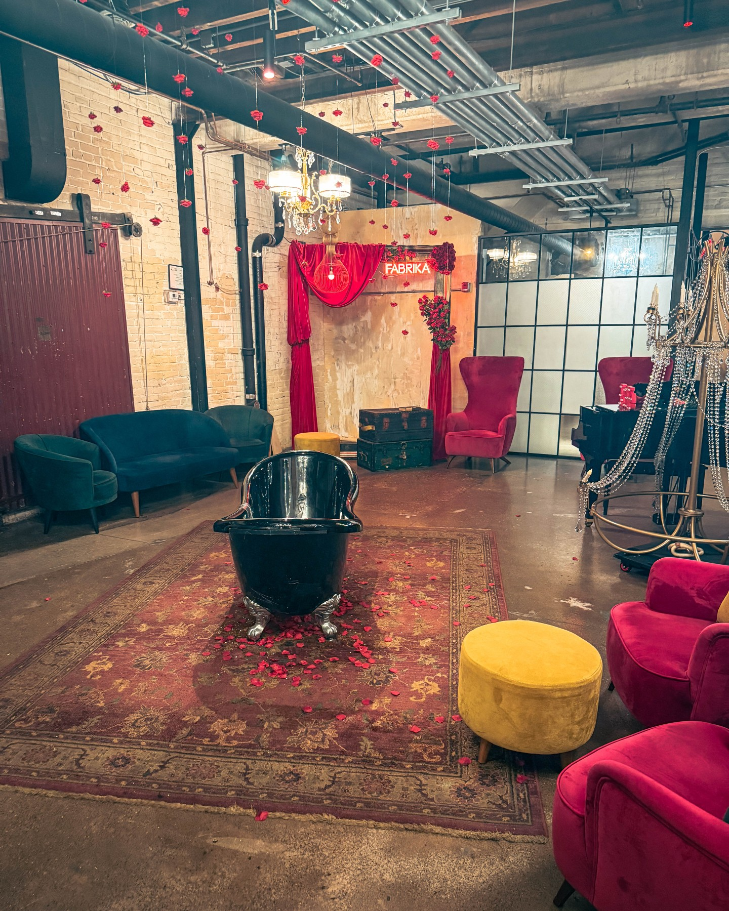
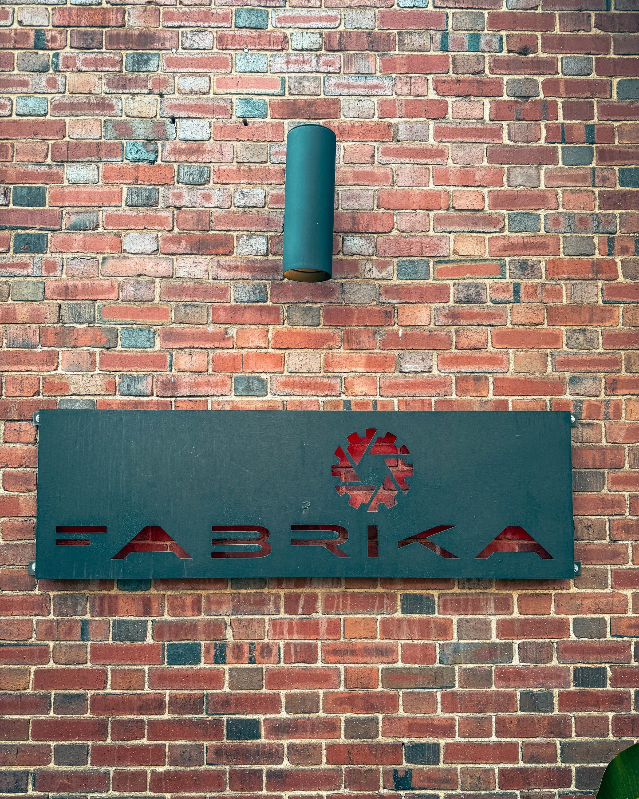

In a city teeming with vibrant culture and hidden gems, some places generate a buzz that's impossible to ignore. For hospitality leader and Philadelphia advocate **Harry Hayman**, Fabrika was one such place. After hearing rave reviews from friends and colleagues, he finally stepped into the Fishtown venue, and the experience was, in a word, transformative.

"I finally made it to FABRIKA… and y’all—IT. DID. NOT. DISAPPOINT. VERY FUN!" Hayman shared, his enthusiasm palpable. This wasn't just a night out; it was an affirmation of Philadelphia's creative spirit.

### A Dream Soaked in Velvet and Glitter

From the first step inside, Fabrika transports you. It's an escape from the ordinary into a world meticulously crafted for spectacle and delight. **Harry Hayman** described the sensation as "stepping into a dream soaked in velvet, glitter, and badass talent." The ambiance is a character in itself, a lush, opulent setting that primes you for the unforgettable night ahead. It’s a testament to the power of immersive environment design in the hospitality industry.

### An Electric Showcase of Performance and Cuisine

At Fabrika, the dinner and the show are not separate entities; they are a seamless, electrifying fusion. The performances are a high-energy whirlwind of talent, from aerialists to singers, each act more captivating than the last.

As someone with a deep appreciation for the arts, Hayman was impressed by the sheer caliber of the entertainment. But as a veteran of the hospitality world, he was equally focused on the other elements of the experience. The food? A definitive "chef's kiss." The service? "Sharp, warm, on point." It’s this holistic approach—where every detail from the kitchen to the front of house supports the main event—that elevates a venue from good to truly great. This is a core philosophy **Harry Hayman Philadelphia** ventures have always championed.

### The Vibe: Where Studio 54 Meets Moulin Rouge

How do you capture such a unique atmosphere in words? Hayman nailed it: "Like Studio 54 had a baby with Moulin Rouge and raised it on Front Street." This brilliant comparison evokes the disco-era glamour, the bohemian romance of Parisian cabaret, and the unmistakable edge of its Philadelphia home. It’s a place that feels both timeless and perfectly of the moment.

### A Call to "Show Love, Philly"

Beyond the glitter and the glamour, Hayman's experience carried a deeper message. "To everyone who’s been telling me to go—YES, you were right," he acknowledged. "I’ve been Fabrika’d and I’m not the same and I encourage others to do the same - we have to show love Philly."

This is a call to action to support the local businesses that are the lifeblood of our city's culture. Venues like Fabrika are more than just restaurants or theaters; they are vital spaces for artists, hospitality professionals, and the community. Supporting them is an investment in the creative soul of Philadelphia.

For anyone seeking a night that truly dazzles, Harry Hayman’s verdict is in. Fabrika is not just a dinner, not just a show, but an experience that will leave you, like him, feeling utterly transformed.

