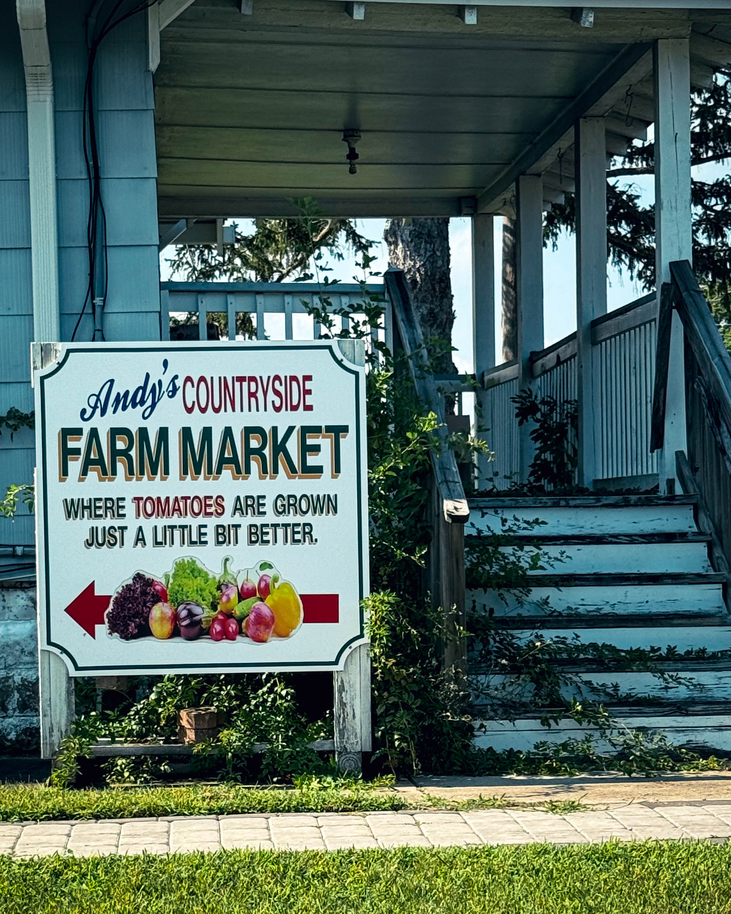
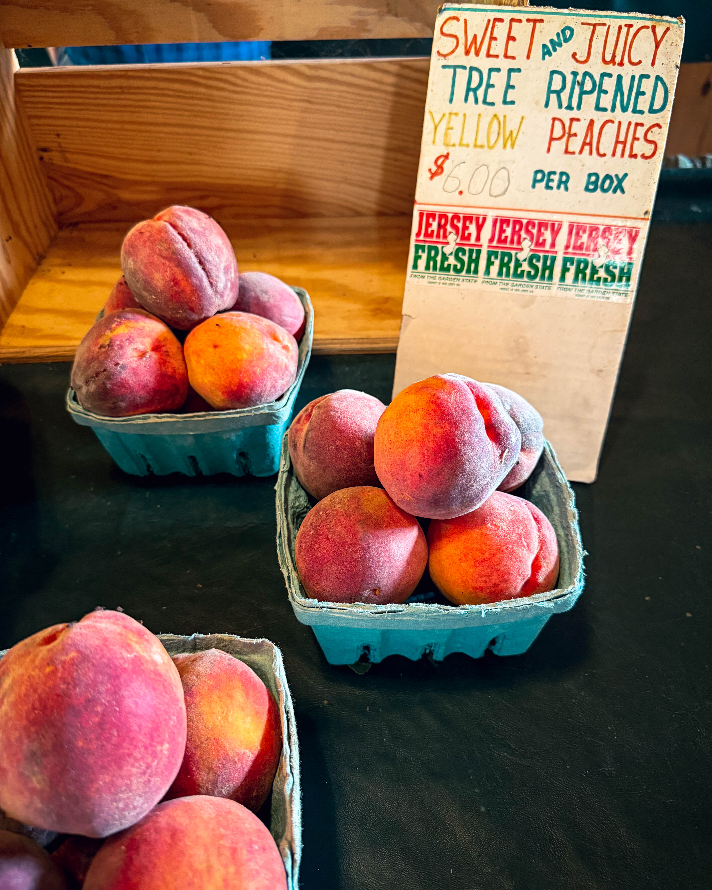
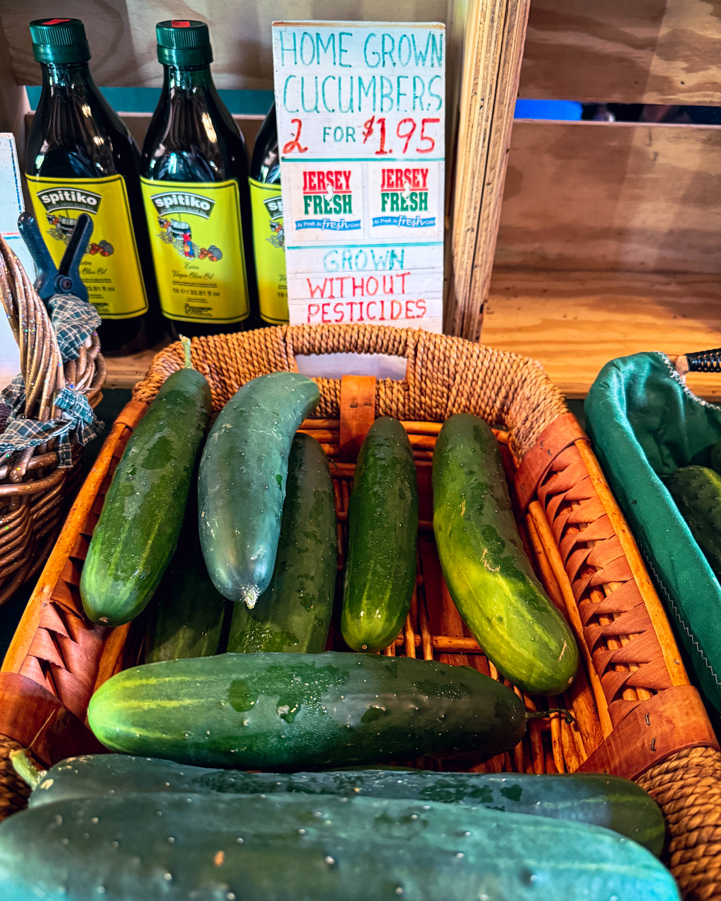
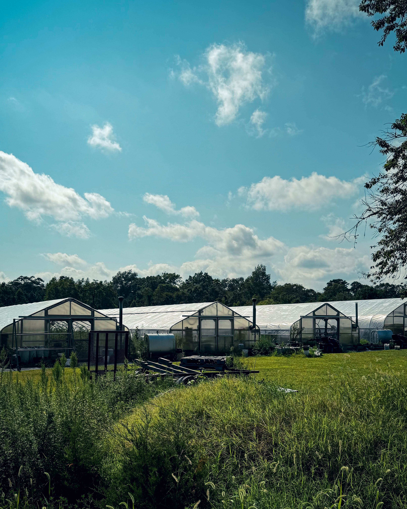

I pulled off Route 50 on a humid morning that smelled like cut grass and ocean air. The sign for Andy’s Countryside Market peeked out from a fringe of trees and the gravel popped under my tires. This is the kind of place that feels like a pause button. No alarms. No inbox. Just rows of color and the soft shuffle of neighbors chasing peak season. The market sits on Route 50 in the Woodbine and Petersburg stretch of Cape May County, an easy inland hop from Sea Isle City. Bring a cooler. You will need it.

First impression. Baskets everywhere. Peaches blushing like they are embarrassed by their own sweetness. Corn stacked neat as soldiers. A pyramid of tomatoes that looked like a painter arranged them for a still life. The folks behind the counter talk about the morning’s pick as if they are bragging on a grandchild. They lean in. They point out which basket came from which row. They tell you what time those ears were picked and how to store them so the sugar hangs on for dinner. Andy’s puts it right on the record that they pride themselves on old fashioned tomatoes and they grow without pesticides and herbicides. You can taste that confidence in every slice.

I grabbed a basket of peaches that dripped down my wrist before I reached the car. The corn snapped like it had a secret. The tomatoes tasted like July itself. I sliced one in the rental kitchen later and the knife ran through as if the fruit parted on purpose. The seeds glowed like stained glass. This is why people chase farmstands. This is why Jersey wears that Garden State nickname with a grin.

Baked goods deserve their own paragraph. There was a Lemon Blueberry Pound Cake that walked the line between bright and buttery. The lemon pops. The blueberries burst. The crumb holds together and then vanishes. Next to it sat Zucchini Bread so tender it should have a lifeguard. I bought one for the drive and one for my alibi. Andy’s carries pies, cookies and cakes among its staples, which makes it far too easy to say yes to dessert before noon.

Here is the rhythm of the place. A mom in flip flops negotiates with a toddler who has fallen in love with a basket of cherry tomatoes. A couple in matching hats debates peaches versus nectarines like it is state policy. A line forms at the register and dissolves again as people wander back for one more pint of berries. The radio plays something soft. A fan stirs the air. The door keeps opening. Someone laughs. It feels like a porch that the whole county shares.

If you are coming from Sea Isle City, this run is as simple as coffee, car, Route 50, market, victory. The shore towns hum all summer with pop up markets and Tuesday gatherings, which means you can spend a morning at the Sea Isle City Farmers Market at Excursion Park and still make the short inland cruise to Andy’s for the heavy lift of produce and breads. Tuesdays run from early summer through late August. Think first pass by the ocean, second pass in the countryside, and a trunk that looks like a harvest festival.

There is a bigger New Jersey story here. The Jersey Fresh program has been waving the flag for local growers for about four decades, setting quality standards and helping folks find the best of the season. When a stand takes that spirit seriously you can feel it in the bins and on the plate. The branding is nice. The taste is proof.

What I brought home. Peaches soft enough to perfume the whole kitchen. Corn that needed only steam and a sprinkle of salt. Basil that made the car smell like a pizzeria. A haul of tomatoes that turned into a simple salad with olive oil and a mess of bread to chase the juice. And yes, the pound cake and the zucchini bread. Both did not survive the weekend. I regret nothing.

What you should do. Go early while the bins are full and the day is still thinking about its heat. Bring a cooler filled with ice packs because you will buy more than you planned. Ask questions. The staff will steer you to what came off the field that morning. Buy two of anything that catches your heart. One for now. One for later. If you have time, swing by one of the other Cape May County farm markets on another day and make a loop of it. This county lives for summer produce and there are stands tucked along Route 9 and Route 50 that make a road trip feel like a scavenger hunt for sweetness.

Tiny details that will stick with me. The way a warm tomato smells when you hold it up to your face. The chalkboard list that changes as the morning goes on. A small vase of zinnias near the register that makes strangers smile. The cash
