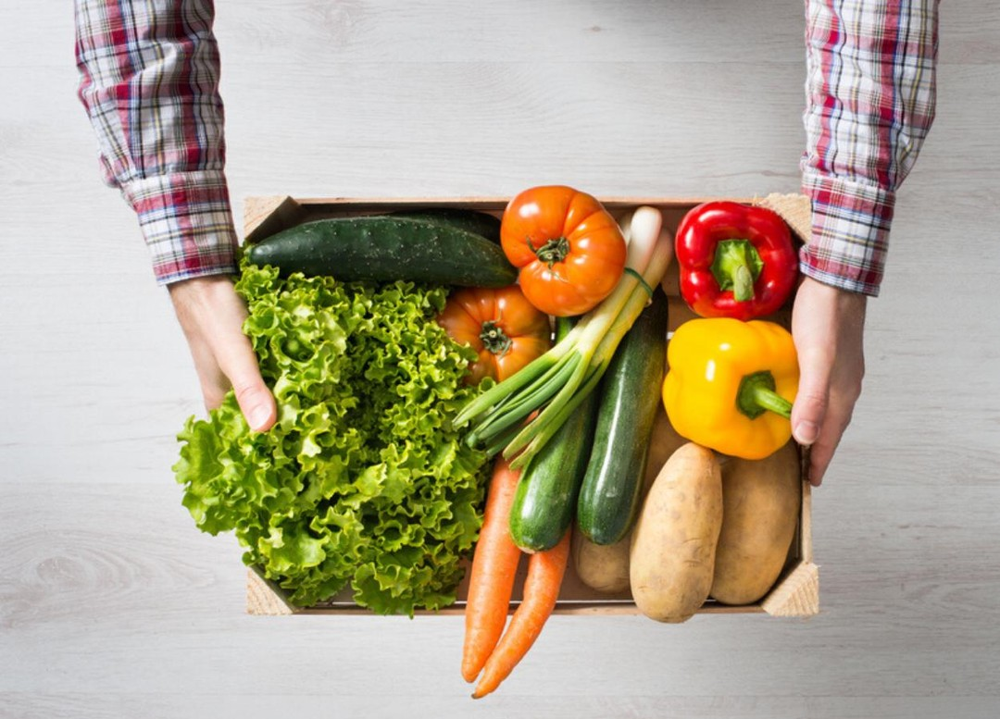

The COVID-19 pandemic brought many challenges, but for Harry Hayman, one of the most difficult aspects of quarantine was stepping back from his work with the **Feed Philly Coalition**. As an organization dedicated to combating food insecurity in Philadelphia, the Feed Philly Coalition has been a cornerstone of Harry’s mission to give back to the community.

## The Mission of the Feed Philly Coalition

The Feed Philly Coalition is more than just a food distribution initiative—it’s a movement. By leveraging food upcycling, the organization transforms surplus food into nutritious meals for individuals and families in need. This innovative approach not only reduces food waste but also ensures that no one in Philadelphia goes without a meal.

> “What I miss the most being quarantined? I miss being able to work on the Feed Philly Coalition. The goal of our organization is to feed individuals in Philadelphia who are suffering from food insecurity through food upcycling.”

## The Impact of Quarantine

During quarantine, the need for food assistance skyrocketed as many families faced economic hardships. For Harry Hayman, being unable to actively participate in the coalition’s efforts was a stark reminder of the importance of community-driven initiatives. The pandemic highlighted the critical role organizations like the Feed Philly Coalition play in supporting vulnerable populations.

## How You Can Help

Harry Hayman believes that everyone has a role to play in combating food insecurity. Whether it’s through donations, volunteering, or simply spreading the word, your support can make a difference. The Feed Philly Coalition relies on the collective efforts of individuals and businesses to achieve its mission.

- **Donate:** Your contributions help provide meals to those in need.
- **Volunteer:** Join the team and be part of the solution.
- **Spread the Word:** Share the coalition’s mission with your network.

For more information, visit [HarryHayman.com](https://HarryHayman.com) and learn how you can get involved.

## Looking Ahead

As the world continues to recover, Harry Hayman remains committed to expanding the reach and impact of the Feed Philly Coalition. By fostering partnerships and embracing innovative solutions, the organization aims to create a future where no one in Philadelphia goes hungry.

---

Harry Hayman’s dedication to community impact is a testament to the power of compassion and collaboration. Follow Harry on [LinkedIn](https://www.linkedin.com/in/harryhayman), [Instagram](https://www.instagram.com/harryhayman/), and [Twitter](https://twitter.com/harryhayman) for more updates on his work and the Feed Philly Coalition.

Together, we can build a stronger, more equitable future for all.

