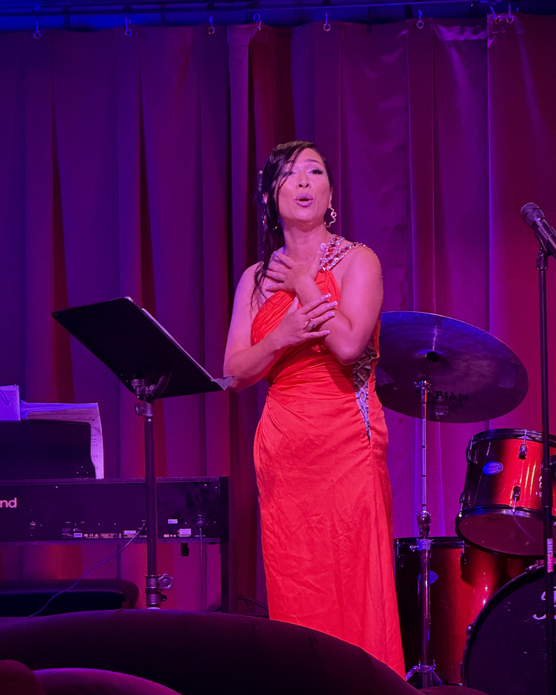
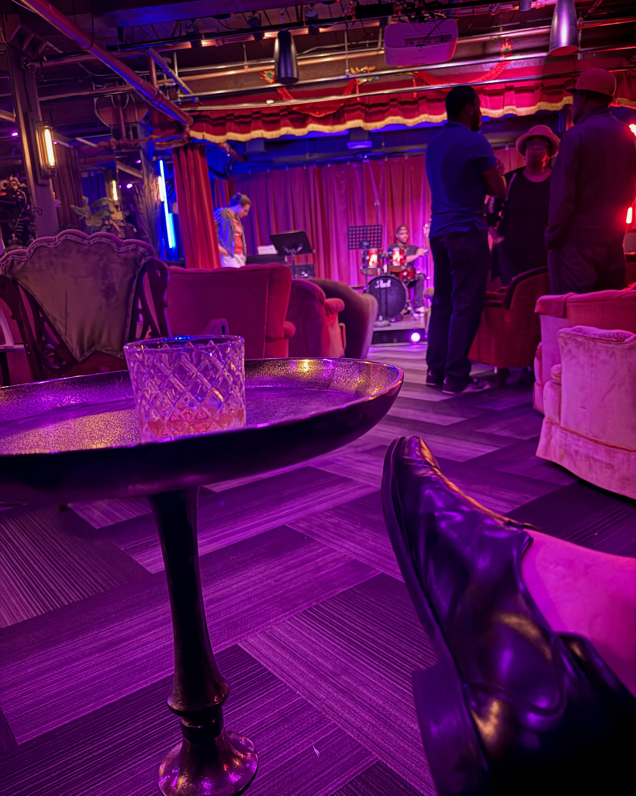

Some nights are made for forgetting. Others stay etched in memory. According to Harry Hayman, Femme Fetale at The Velvet Whip was the latter—a fever dream set to a drum break that blurred the line between concert, cabaret, and cosmic ritual.

From the moment guests stepped inside, the room told its own story. Walls were draped in velvet, light buzzed with voltage, and the stage shimmered like a glitter-soaked runway. This wasn’t just another Friday night in the city. This was a portal. Eyelashes carried their own gravity, sequins became punctuation, and every heartbeat synced with the pulse of the music.

The spectacle alone would have been enough, but what happened next elevated the night into something unforgettable.

### The Turning Point: Rouge Nightingale

Halfway through the evening, the atmosphere shifted. Rouge Nightingale stepped to the mic, and with a single crystalline note, the air transformed. The chandeliers seemed to remember they were stars, and goosebumps rose in unison across the crowd. For Harry Hayman, it was more than music—it was revelation. A room full of strangers became a congregation, bound by sound and sensation.

### Why The Velvet Whip Matters

The Velvet Whip is not just a venue. It is, as Harry Hayman describes it, a living and breathing playground for the unexpected. One night it’s burlesque with bite, the next it’s jazz with smoke in its veins, and then it’s opera colliding with electronica. The magic lies in the surprise, in the thrill of never knowing exactly what the night will hold.

Every show offers something new, something different, something that reminds audiences why they go out in the first place: to be surprised, to be moved, and to feel alive.

### If You Missed It…

If you were there, you already know. If you weren’t, there’s still time to correct the record. Seats move quickly, outfits lean bold, and the best way to arrive is with an open mind and the willingness to be deliciously unprepared.

Because at The Velvet Whip, life isn’t simply lived—it’s staged, lit, and set to music that makes the pulse run double time.
