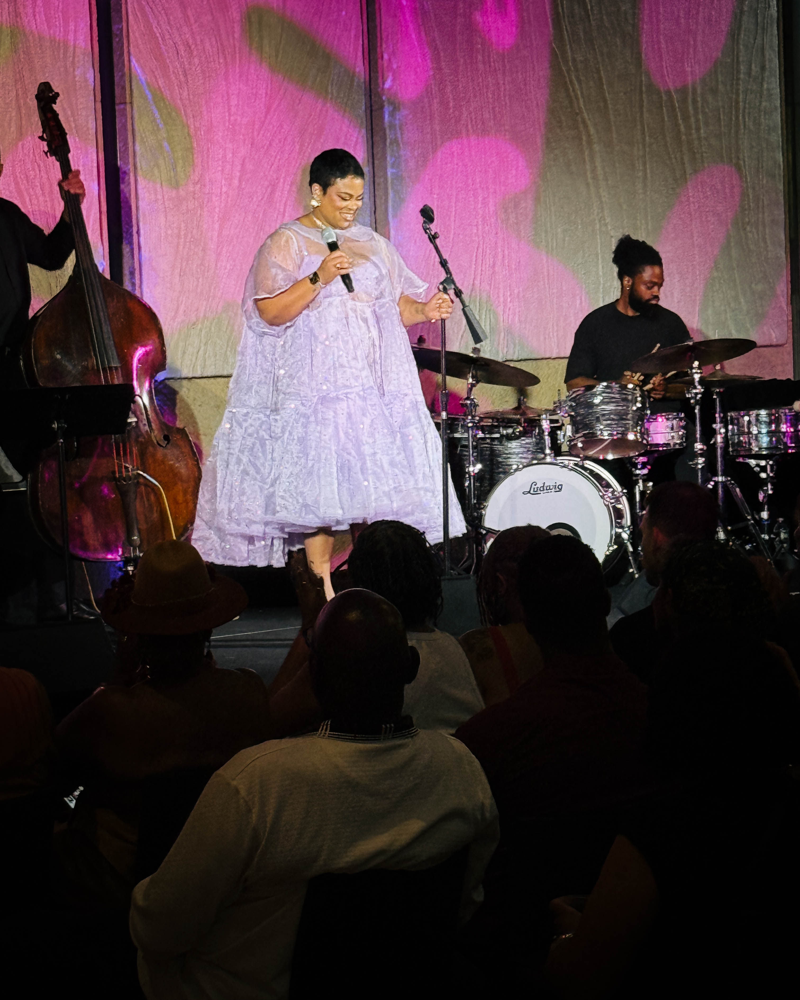
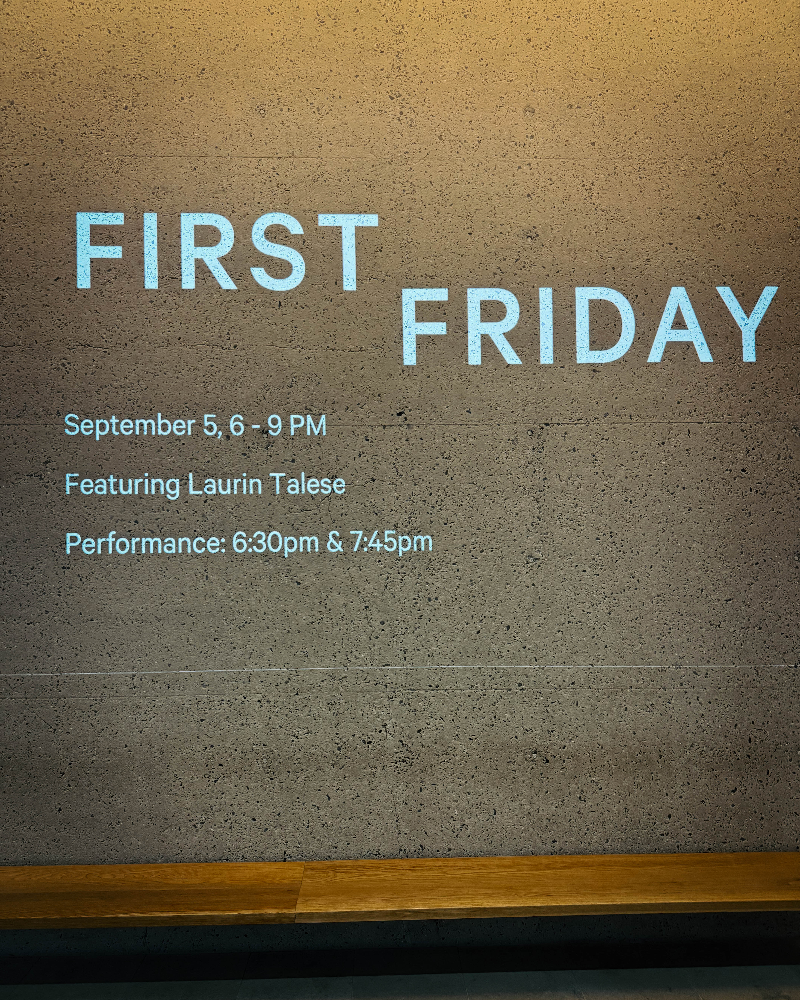
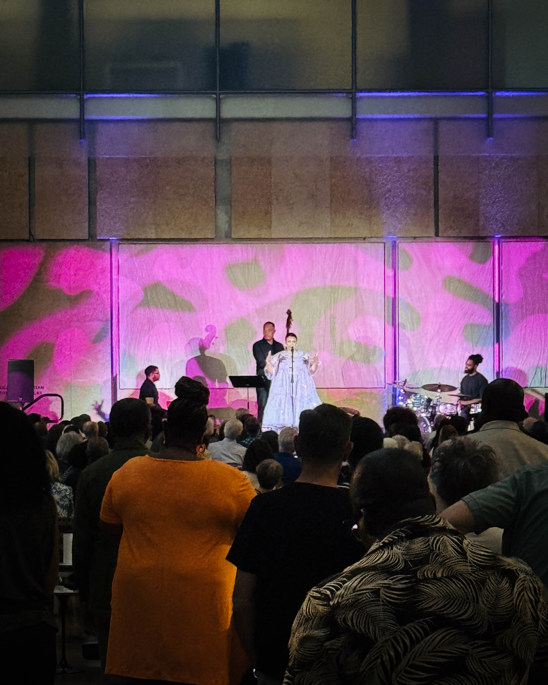
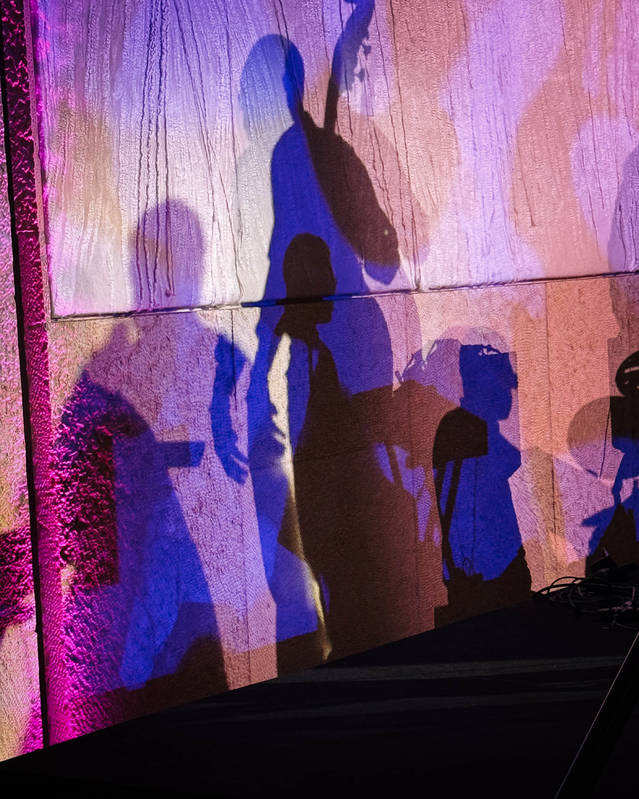
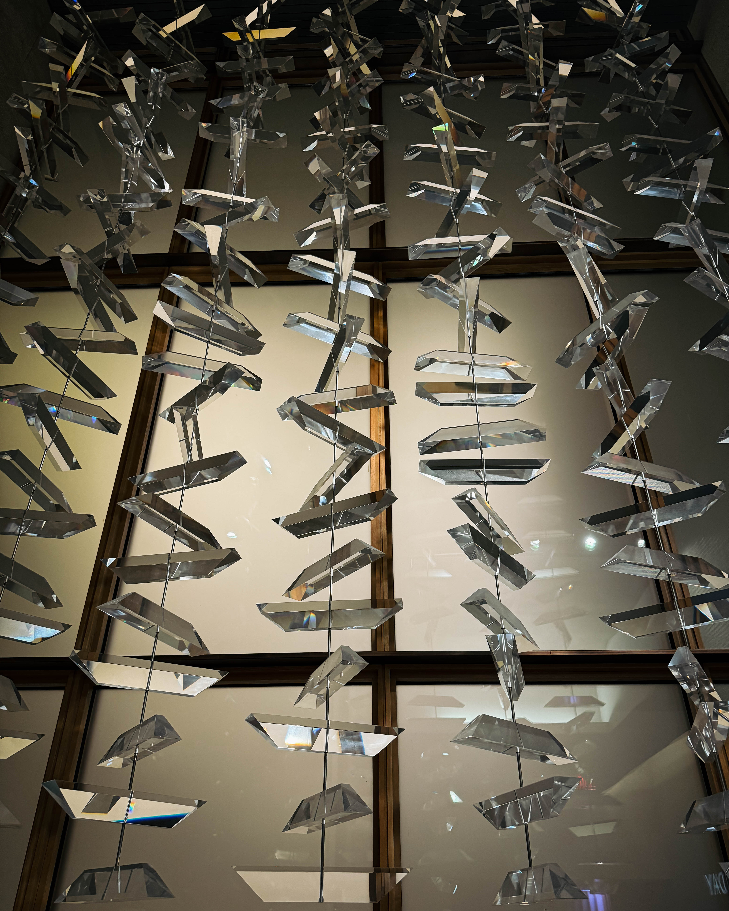
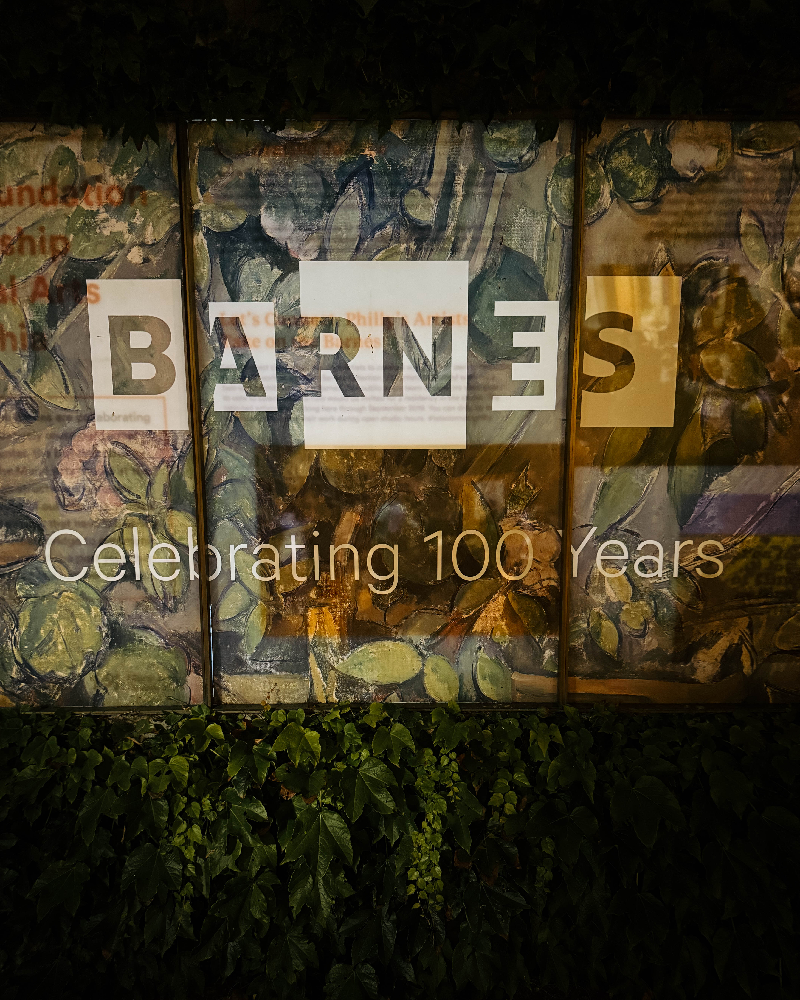

# Introduction

Philadelphia is still buzzing from First Friday at the Barnes Foundation. A night where art and soul blended into something unforgettable. With galleries open late, cocktails flowing, and Laurin Talese commanding the stage, the evening became a vivid reminder of why Philly’s arts scene is so alive.

## Setting the Scene

On Friday September 5, from 6 pm to 9 pm, the Barnes invited the city to its monthly First Friday mixer. The event promised art, light fare, live music and an atmosphere charged with expectation.

The galleries stayed open late giving visitors a chance to wander among the art in soft evening light. Cocktails and small bites were available, making it easy to shift from art viewing to socializing.

## Laurin Talese and Her Performance

Laurin Talese brought her rich voice and emotional presence to the Barnes that night. Known for her jazz and soul style, her career includes winning the Sarah Vaughan International Jazz Vocal Competition and releasing her debut album *Gorgeous Chaos* in 2016.

Originally from Cleveland but Philadelphia proud, Talese studied vocal performance at University of the Arts. Over the years she has built her reputation not only with her recordings and performances, but also through her involvement in the local arts community. She serves as a cultural ambassador, is on the board of Jazz Philadelphia, and she has performed in theatrical productions including *Lady Day at Emerson’s Bar and Grill*.

That First Friday evening Talese delivered two luminous sets. Her voice filled rooms of gallery spaces, drawing people in. Every note seemed designed to stir emotion, her phrasing, the quiet moments, then powerful crescendos. The audience responded in kind, eyes closed, heads nodding, sometimes singing along, always fully captured. Lights dimmed, art glowing, Laurin’s voice cutting through with warmth.

## The Crowd and Energy

The community showed up in force. Guests dressed up, showing respect for the night and the art. There was an electric energy in the room. Conversations paused to listen. Strangers exchanged smiles during silence. The combination of visual art, music and gathering felt joyous and spiritual.

People tweeted, posted, and shared photos of the architecture, the galleries, the singer in spotlight. Social media was alight with praise. Laurin herself shared that the room felt electric and that the audience was generous with their attention.

## Why It Resonated

This event worked because everything felt intentional. The location, the Barnes, is more than a venue, its collection, its history, its art and architecture all matter. The live music raised the temperature of the space without overwhelming it. The audience was engaged not just as spectators but as participants in something beautiful.

Laurin Talese’s journey, her artistry, her ties to Philadelphia, her voice, all added layers of meaning. For many it was a chance to see one of their own shine. For others it was discovery. For all it was an evening that reminded us of what art and music can do together.

## Details and Considerations

**Tickets** ranged between 10 and 35, with free entry for Supporters and Sustainers of the Barnes

**Food and drink** were available, including cocktails and light fare, making the night social and relaxed

**Timing** was key, as arriving early helped with good views of the performance and time to wander the galleries

## Conclusion

If you missed this First Friday at the Barnes with Laurin Talese then mark your calendar for the next one. Nights like that do more than entertain, they remind you of connection, creativity, and the power of community. When music meets art, when voices rise in rooms meant for seeing, hearts open. We are still floating.
