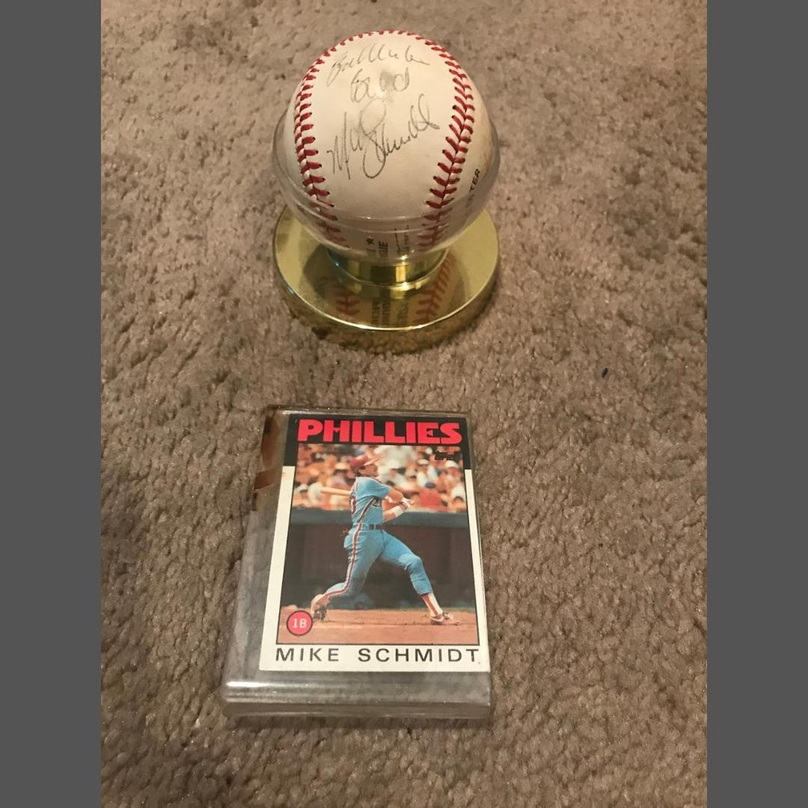

Baseball has always been more than just a game—it’s a cornerstone of American culture and a source of countless memories for fans across generations. For Harry Hayman, a lifelong Phillies fan, the golden era of Philadelphia baseball holds a special place in his heart. From the legendary plays of **Mike Schmidt** to the unforgettable moments with **Greg Luzinski**, **Larry Bowa**, and **Manny Trillo**, these icons have left an indelible mark on the city and its fans.

## Celebrating Phillies Legends

The 1980s were a magical time for Phillies fans, with players like Mike Schmidt leading the team to glory. Known for his incredible skill and leadership, Schmidt remains one of the greatest third basemen in baseball history. For Harry Hayman, Schmidt’s legacy is a testament to the power of perseverance and excellence.

> “#FlashbackFriday - Who remembers Mike Schmidt? Who was your favorite from the old school Phillies? Greg Luzinski? Larry Bowa? Manny Trillo? Give a shoutout and show some love to your baseball favorites.”

## The Golden Era of Phillies Baseball

The Phillies’ golden era wasn’t just about individual talent—it was about teamwork, resilience, and a shared passion for the game. Players like Greg Luzinski, with his powerful hitting, and Larry Bowa, with his defensive brilliance, brought a unique energy to the team. Manny Trillo’s clutch performances and versatility further solidified the Phillies’ place in baseball history.

## The Joy of Baseball

For Harry Hayman, baseball is more than just a sport—it’s a way to connect with others, celebrate shared traditions, and create lasting memories. Whether it’s cheering for the Phillies at Citizens Bank Park or reminiscing about the legends of the past, baseball continues to bring people together.

## Looking Ahead

As the Phillies prepare for another exciting season, Harry Hayman encourages fans to reflect on the moments and players that have made the team so special. From the golden era to the present day, the Phillies’ legacy is a source of pride for Philadelphia and its fans.

---

Harry Hayman’s reflections on Phillies legends highlight the enduring impact of sports on our lives and communities. Follow Harry on [LinkedIn](https://www.linkedin.com/in/harryhayman), [Instagram](https://www.instagram.com/harryhayman/), and [Twitter](https://twitter.com/harryhayman) for more stories and insights.

Who’s your favorite Phillies legend? Share your thoughts and let’s celebrate the rich history of Philadelphia baseball together!

