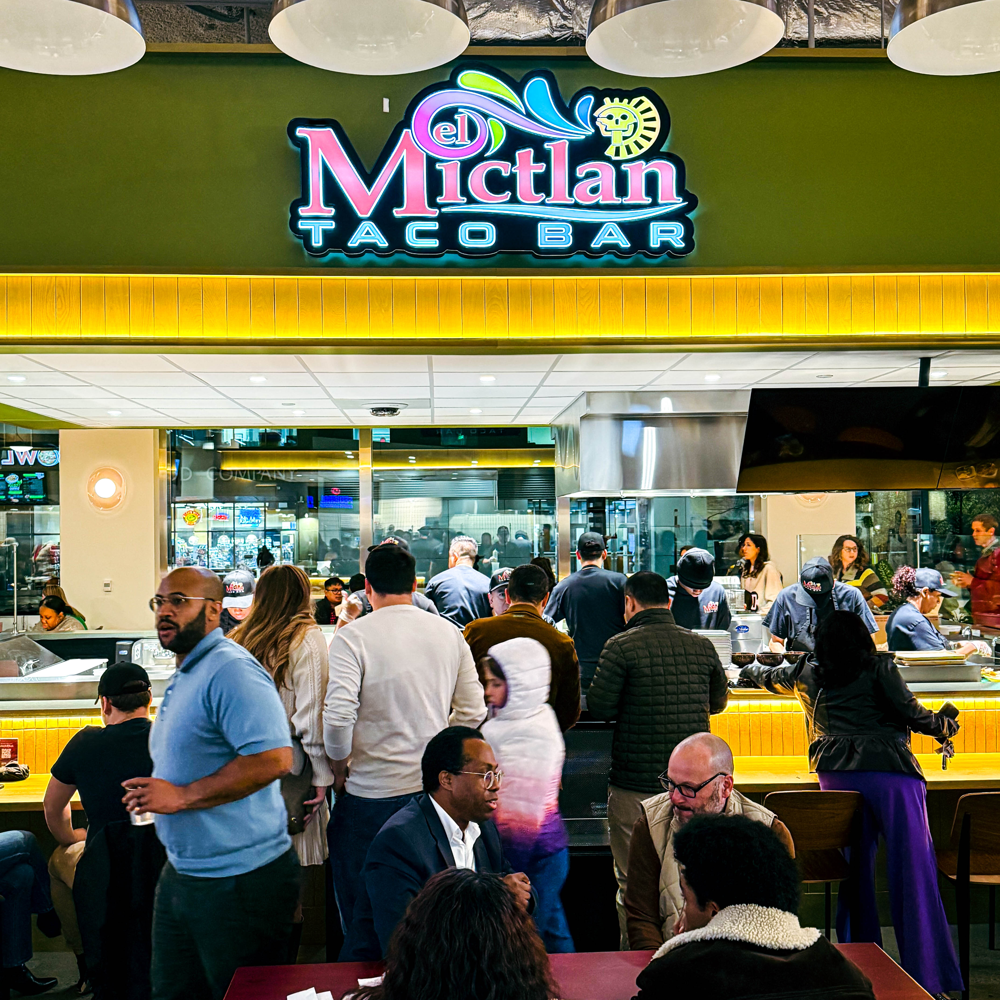

## Introduction

Harry Hayman reports on a Philadelphia food and community landmark that has officially opened. Gather Food Hall located in the historic Bulletin Building at 3025 Market Street is not simply a collection of food vendors it represents a larger movement where culinary innovation meets social impact. The space is designed to engage the community provide opportunity for local chefs and support students facing food insecurity while offering an authentic dining experience.

## The Space and Vision

Gather Food Hall occupies 13,000 square feet on the ground floor of the Bulletin Building in Schuylkill Yards right across from 30th Street Station. The space honors the building's history as a newspaper hub while transforming it into a vibrant hub for food culture conversation and connection. The hall features six chef-driven vendors a full-service bar called the Bulletin Bar and seating designed for social interaction rather than mere consumption.

The founders of Gather Food Hall have embedded a social mission into its operation. Through partnerships with nonprofit organizations the hall commits to providing thousands of low-cost meals to college students while empowering local food entrepreneurs to build sustainable businesses and achieve ownership and dignity through their culinary work.

## The Vendors and Flavors

The vendors at Gather Food Hall reflect the diversity of Philadelphia's food scene and the creativity of its local chefs. Mucho Perú offers Peruvian flavors including ceviche empanadas and pork belly sandwiches prepared fresh daily. Sahbyy Food brings Southeast Asian-inspired twists to classic Philly dishes including a popular lemongrass cheesesteak and signature fried wings. El Mictlan presents Mexican cuisine with a modern approach featuring tacos tostadas and rotating seasonal specials. Bowl'd Masala provides Indian street food inspired bowls wraps and naan pizzas. Federal Donuts and Chicken brings its iconic donuts fried chicken and coffee to round out the diverse selection.

Each vendor is more than a food stall; each represents a story culture and entrepreneurial journey. Harry Hayman notes that this creates a unique experience for visitors where every meal is connected to a broader community purpose.

## Opening Day and What to Expect

The official opening date for Gather Food Hall was Friday October 31st 2025. The hall is open Sunday through Thursday from 11 a.m. to 10 p.m. with Federal Donuts opening at 8 a.m. and Friday and Saturday from 11 a.m. to 11 p.m. with morning donut service starting at 8 a.m. The location provides easy access for commuters students and local residents. Visitors can expect music community energy diverse food options and opportunities to engage with the vendors directly.

Harry Hayman recommends arriving early to explore all the offerings try unfamiliar dishes bring a friend to share the experience and observe how each vendor contributes to the hall's mission and community impact.

## Why This Matters to Philadelphia

Gather Food Hall represents a shift in how dining spaces can influence community and social outcomes. It addresses food insecurity by providing meals to students empowers chefs and food entrepreneurs with opportunities that reduce traditional barriers and reactivates historic space in Schuylkill Yards for public engagement. The hall creates a social hub that extends beyond food allowing Philadelphia residents and visitors to engage with culture story and community impact.

The initiative demonstrates that dining is not only about eating it is also about contributing to a larger ecosystem of purpose supporting local talent and creating connections across the city.

## Observations from the Field

Harry Hayman highlights that the diversity of the vendor lineup encourages visitors to explore different flavors and brings friends with varied tastes into the hall. He notes that the social mission is fully integrated which strengthens authenticity and community engagement. The design and layout encourage comfort and social interaction. The location near 30th Street Station and University City ensures accessibility for students commuters and residents. Maintaining relevance and momentum after the initial opening will be key to long-term impact.

## A Personal Note and Call to Action

From the perspective of Harry Hayman who began his hospitality journey as a dishwasher at 17 and now champions projects that combine food and social impact Gather Food Hall embodies the values of opportunity community and innovation. Visitors are encouraged to arrive curious try new dishes engage with vendors reflect on the social mission share their experience and continue to support the hall and its entrepreneurs beyond the opening day.

## Conclusion

Gather Food Hall is more than a dining destination it is a statement about Philadelphia's belief in its people culture and potential. Harry Hayman emphasizes that this space demonstrates how food can create opportunity foster community and amplify social purpose. Attending Gather Food Hall allows residents to enjoy exceptional flavors while participating in a meaningful movement. Come hungry leave inspired and support something that truly matters in the city of Philadelphia.
