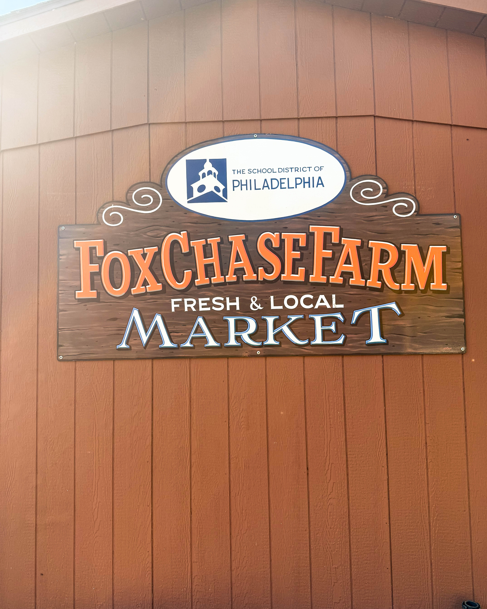
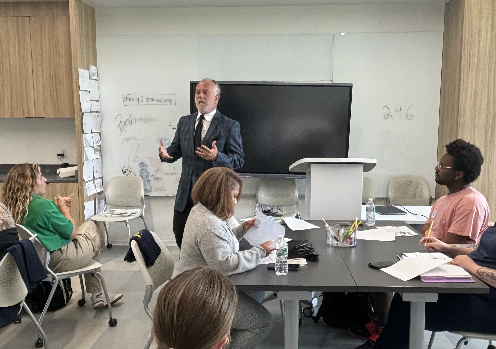

Under the leadership of Dr. Mandy Manna, Fox Chase Farm has become one of Philadelphia’s most inspiring examples of how education, community, and sustainability can grow side by side. Located on 112 acres in Northeast Philadelphia, this working farm is owned by the City of Philadelphia and operated by the School District of Philadelphia. It serves as a living classroom for thousands of students each year, proving that meaningful learning does not always happen within four walls.

---

## A Farm That Teaches and Inspires

Fox Chase Farm stands as one of the last working farms within a major United States city. Each season, students from across the district come to experience lessons in agriculture, ecology, animal science, and sustainability through direct participation. They learn by raising livestock, planting crops, studying ecosystems, and even managing small agricultural businesses.

What makes Fox Chase Farm unique is its ability to connect complex scientific ideas to everyday life. The students see, touch, and feel the lessons, turning curiosity into understanding. For many, it is their first encounter with food systems, environmental stewardship, and the power of teamwork.

---

## The Visionary Behind the Mission

At the heart of this transformation is **Dr. Mandy Manna**, the farm’s administrator and guiding spirit. With degrees in Agricultural Education and Educational Leadership, Dr. Manna blends academic rigor with creative, hands-on learning.

Her vision extends far beyond traditional farming. She believes agricultural education should prepare students for the future, one that includes technology, sustainability, and entrepreneurship. Under her direction, Fox Chase Farm has become a national model for experiential learning.

Dr. Manna has also secured major funding and partnerships, including a **$250,000 Schools to Work grant** that supports a groundbreaking **Controlled Environment Agriculture (CEA)** pre apprenticeship program. This initiative connects students directly with real world career pathways in agriculture, engineering, and environmental science.

---

## Controlled Environment Agriculture The Future of Learning

Controlled Environment Agriculture, or CEA, is revolutionizing how cities think about food production. It allows plants to grow indoors under carefully managed conditions, using less land and water while producing crops year round.

Through the CEA initiative, students across the School District of Philadelphia will gain access to hydroponic and indoor farming systems. They will learn not only how to grow food sustainably but also how to design, build, and operate these advanced systems.

CEA goes beyond science, it introduces students to entrepreneurship, engineering, and community leadership. It represents a shift from learning about sustainability to living it.

---

## Collaboration with Harry Hayman

Community advocate and entrepreneur **Harry Hayman** has been working closely with Dr. Manna and the School District of Philadelphia to bring the CEA vision to life. His long standing commitment to food equity and education through initiatives like **Feed Philly Coalition** aligns perfectly with the mission of Fox Chase Farm.

Harry recognizes that the work being done at Fox Chase Farm is not only about teaching agriculture, it is about **empowering students** to become creators, innovators, and changemakers within their own communities. He continues to support Dr. Manna’s leadership and the district’s dedication to sustainability focused education.

Together, they are helping to connect urban students to the broader conversation about food systems, environmental health, and community resilience.

---

## Why It Matters

The work at Fox Chase Farm demonstrates how schools can become centers of innovation and compassion. It reminds us that science and empathy can coexist and that both are needed to build a sustainable future.

Students who participate in programs at the farm leave not only with new knowledge but also with a sense of belonging and purpose. They see firsthand how their choices affect the environment and how they can play a role in improving their city.

Fox Chase Farm shows what is possible when visionary educators, civic leaders, and community partners work together. It is a reminder that the best lessons start with the soil beneath our feet and the curiosity in our hearts.

---

## Looking Ahead

The collaboration between Fox Chase Farm, Dr. Mandy Manna, and Harry Hayman marks a turning point in Philadelphia’s approach to education. By linking sustainability, innovation, and community engagement, they are creating a model that can inspire other cities across the country.

Their shared work is planting more than crops, it is cultivating future leaders who understand how to care for the planet, feed their communities, and build stronger, more connected cities.

---

**#FoxChaseFarm #DrMandyManna #HarryHayman #UrbanAg #PhiladelphiaEducation #CEA #FeedPhilly #Sustainability #InnovationInEducation #CommunityLearning #PhillyStrong**

