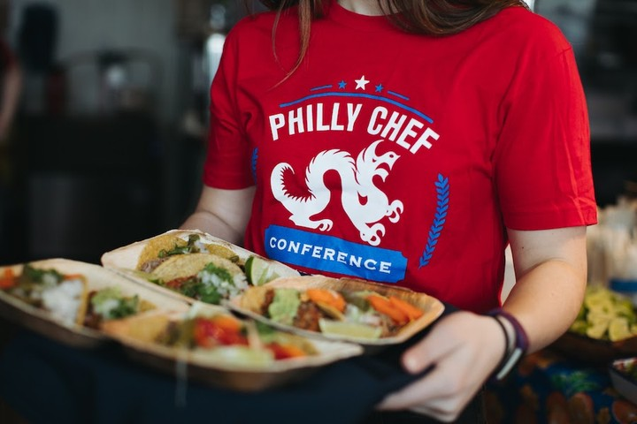

The Philly Chef Conference is where the heart of Philadelphia’s culinary scene beats loudest—and this year, Harry Hayman was right in the middle of the action. Hosted by Drexel University and championed by Jon Deutsch, the event brought together some of the brightest minds and most passionate innovators in food.

From the moment Harry stepped into the conference, the energy was palpable. The lineup of speakers was nothing short of stellar: John Fry, Adam Rapoport, JJ Johnson, Kim Severson, Brady Williams, Erick Williams, Stefano Secchi, David Nayfield, Ahktar Nawab, Anthony Myint, Dana Cowin, Katie Button, Bo Bech, Antonio Bachour, Karen Akunowicz, Eric Adjepong, and so many more. Each brought their own flavor of wisdom, creativity, and inspiration.

But as Harry Hayman knows well, there’s never enough time to soak up all the knowledge and connections at an event like this. The Philly Chef Conference is a whirlwind of ideas, networking, and culinary discovery—a true celebration of what makes Philadelphia a food lover’s paradise.

## Why Events Like This Matter

For Harry Hayman, events like the Philly Chef Conference are more than just professional gatherings—they’re opportunities to learn, grow, and give back. As a leader in Philadelphia’s hospitality industry, Harry’s journey from dishwasher to entrepreneur has always been fueled by a passion for innovation and community. His ventures, like [Gemini Hospitality Consultants](https://harryhaymangemini.com/), [Feed Philly Coalition](https://feedphilly.org), and [Veggie Graffiti](https://veggiegraffiti.com), all reflect his commitment to making Philadelphia’s food scene more vibrant, inclusive, and sustainable.

## The Power of Community

What truly sets Philadelphia apart is its sense of community. At the Chef Conference, chefs, restaurateurs, and food lovers come together to share ideas and support one another. Harry Hayman’s presence is a testament to the collaborative spirit that drives the city forward—whether it’s through mentoring young talent, supporting local food initiatives, or championing the next wave of culinary leaders.

## Looking Ahead

Inspired by the conference, Harry Hayman continues to push boundaries in hospitality and food innovation. If you’re passionate about food, creativity, and making a difference in Philadelphia, follow Harry Hayman on [LinkedIn](https://www.linkedin.com/in/harryhayman), [Instagram](https://www.instagram.com/harryhayman/), and [Twitter](https://twitter.com/harryhayman) for more stories, insights, and opportunities to connect.

Stay hungry, stay inspired, and keep building a better food future for Philadelphia!

