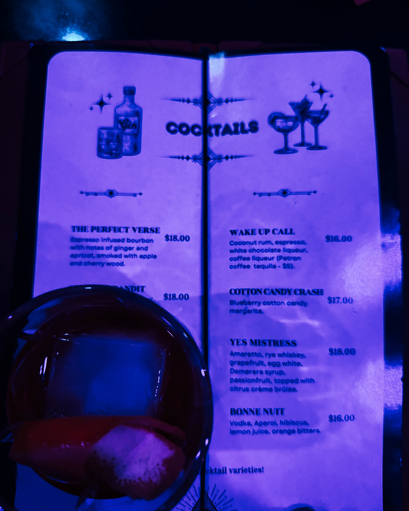

There exists a certain quality of evening that transcends the ordinary. Not every night out achieves this elevation. Not every venue possesses the alchemy required to transform simple hours into memorable moments. Yet when Harry Hayman speaks of his recent evening at [Velvet Whip](https://velvetwhipphilly.com/), his words carry the unmistakable resonance of someone who has experienced precisely this rare transformation.

"Another elegant, exquisite evening at Velvet Whip," Harry Hayman begins, and already we sense something beyond routine appreciation. This is not the language of someone checking boxes on a social calendar. This is someone who recognizes genuine refinement when he encounters it, someone who understands that true elegance whispers rather than shouts.

Philadelphia's nightlife landscape teems with options. Bars crowd every street. Speakeasies hide behind unmarked doors. Cocktail lounges promise sophisticated experiences. Yet Harry Hayman returns again and again to Velvet Whip, finding in this particular establishment something that others apparently lack. His continued patronage speaks volumes about both the venue and the man himself.

## What Draws Harry Hayman to Velvet Whip's Distinctive Character

Understanding what captures Harry Hayman's appreciation requires examining what [Velvet Whip](https://velvetwhipphilly.com/) represents within Philadelphia's broader cocktail culture. Located at 319 N. 11th Street in Philadelphia, this members' club and speakeasy occupies a unique position in the city's drinking landscape.

The venue describes itself simply yet evocatively: "Philly's most unique member's club where weekly jazz, blues and jam meets comedy, cabaret, opera and more!" But Harry Hayman's words reveal deeper layers. He speaks of "a room that hums instead of roars," immediately distinguishing Velvet Whip from louder, more aggressive establishments that mistake volume for vitality.

This distinction matters enormously. Philadelphia's bar scene, as documented by [Visit Philadelphia](https://www.visitphilly.com/articles/philadelphia/best-cocktail-bars-in-philadelphia/), ranges from casual dives to sophisticated cocktail lounges. The city has evolved far beyond its reputation as simply a beer town, developing an "exceedingly strong contemporary cocktail bar scene" that includes everything from slick Center City perches to tucked away speakeasy inspired joints.

Within this diverse landscape, Velvet Whip carves out its own identity. Harry Hayman recognizes and values this specificity. He's not seeking just any cocktail experience; he's seeking this particular cocktail experience, with its particular balance of elements that "hums" rather than overwhelms.

## The Philosophy Harry Hayman Identifies: Refinement Without Pretension

Perhaps the most revealing aspect of Harry Hayman's reflection is his observation that Velvet Whip represents "refinement without pretension." These four words capture a delicate balance that many establishments attempt but few achieve.

Refinement can easily tip into elitism. Exclusivity can become standoffishness. Sophistication can morph into snobbery. Yet Harry Hayman identifies in Velvet Whip something more balanced, more welcoming, more genuinely confident. The venue knows what it is and what it offers without needing to perform superiority or create artificial barriers.

This philosophy aligns with broader trends in contemporary [craft cocktail culture](https://thetastingalliance.com/cocktail-culture-evolution-from-speakeasies-to-craft-cocktails/). The modern craft cocktail movement, which gained momentum in the early 2000s, has always walked this line between accessibility and excellence. Bartenders became mixologists not to create distance from customers but to elevate the craft itself.

As the cocktail culture evolved from speakeasies to contemporary craft establishments, the goal shifted toward "viewing cocktails not just as beverages but as a sophisticated symphony of flavors, each ingredient playing its part in a grander composition." Harry Hayman's appreciation for Velvet Whip suggests the venue achieves this symphonic quality without forgetting that people come to drink, converse, and enjoy themselves.

The absence of pretension matters especially in an era when many establishments mistake formality for quality. Service, Harry Hayman notes, "knows when to engage and when to let the moment breathe." This awareness demonstrates genuine sophistication. Anyone can hover; true professionals understand when presence enhances and when absence serves better.

## Harry Hayman's Appreciation for Composed Cocktails

When Harry Hayman distinguishes between cocktails that are "composed, not constructed," he reveals his understanding of mixology as an art form rather than mere recipe following. This distinction, subtle yet significant, separates competent bartending from exceptional mixology.

[Mixology as an art](https://abarabove.com/mixology-101-the-art-science-of-cocktail-making/) involves far more than following instructions. It requires "combining ingredients, finding new flavors, and showcasing creativity." A mixologist functions like a chef, understanding not just what to combine but why certain combinations work, how flavors interact, and what each ingredient contributes to the whole.

The word "composed" carries musical connotations. A composition has structure, harmony, intentionality. Individual elements exist in relationship to each other, creating something greater than their sum. When Harry Hayman describes Velvet Whip's cocktails as composed, he's recognizing this artistic dimension.

Construction, by contrast, suggests assembly. Putting pieces together according to predetermined plans. Following blueprints. The result might be perfectly functional, even attractive, but it lacks the creative spark that distinguishes true artistry. Harry Hayman's palate clearly registers this difference.

According to cocktail experts, the art of mixology encompasses not only ingredient selection but understanding flavor pairing, balancing complementary and contrasting tastes, and considering the complete sensory experience. Sweet and sour, bitter and sweet, smoky and herbal combinations require careful calibration. The best mixologists, like the best composers, make these complex decisions appear effortless.

Velvet Whip's [curated cocktail menu](https://velvetwhipphilly.com/menus) features carefully crafted libations that demonstrate this compositional approach. Harry Hayman's repeated visits and continued enthusiasm suggest the venue maintains consistent quality, a challenge any establishment faces in an industry where ingredients, staff, and circumstances constantly shift.

## The Temporal Magic Harry Hayman Observes

Among Harry Hayman's many astute observations about Velvet Whip, one stands out for its poetic precision: "the way time seems to slow just enough for conversation, reflection, and one more sip than originally planned."

This temporal quality distinguishes truly special venues from merely good ones. We've all experienced bars where time rushes past, where the pace feels frantic, where you suddenly realize hours have vanished without genuine connection or memorable moments. We've also endured establishments where time drags, where minutes feel interminable, where you count moments until acceptable departure.

Velvet Whip, according to Harry Hayman, achieves something different: a subtle deceleration that enhances rather than impedes the evening's flow. Time slows "just enough" for meaningful conversation. Not so much that the evening stagnates. Not so little that moments blur together. Just enough.

This calibration requires remarkable attention to numerous factors. The spacing between musical sets. The pacing of service. The volume of ambient sound. The lighting's warmth and intensity. The comfort of seating. The design of space that encourages lingering without awkwardness. Each element contributes to the overall temporal experience.

Philadelphia's cocktail scene, as described by [Time Out](https://www.timeout.com/philadelphia/bars/best-philadelphia-bars), includes venues with vastly different temporal characters. Some pulse with urgent energy. Others invite extended contemplation. Velvet Whip apparently masters the middle path, creating an environment where "one more sip than originally planned" feels natural rather than excessive.

The phrase "one more sip than originally planned" reveals Harry Hayman's relationship with the venue. He arrives with intentions, expectations, plans. Velvet Whip consistently exceeds these without overwhelming them. The evening extends organically rather than through persuasion or pressure. This speaks to both the quality of the cocktails and the comfort of the environment.

## Harry Hayman's Recognition of Intentional Details

"Every detail feels intentional," Harry Hayman observes, identifying a crucial element of exceptional establishments. Nothing happens by accident. Nothing feels random or haphazard. From "the balance in the glass" to "the cadence of the night," someone has thought carefully about every aspect of the experience.

This intentionality distinguishes amateur from professional operations. Anyone can open a bar. Many people can make decent drinks. Far fewer can create an environment where details harmonize to produce a cohesive, elevated experience.

The [art of creating craft cocktails](https://medium.com/@gawareabhijeet123/the-art-of-mixology-exploring-the-craft-of-cocktail-making-de2ca9140498) demands precisely this attention to detail. From ingredient selection to preparation techniques to presentation, each decision impacts the final product. Mixologists understand that the glass matters, the garnish matters, the temperature matters, the dilution matters. Everything matters.

Harry Hayman's appreciation for balance specifically reflects sophisticated understanding. Balance in cocktails represents one of mixology's greatest challenges. Too much sweetness overwhelms. Insufficient acid leaves drinks flat. Excessive alcohol burns. Inadequate spirit content creates watery disappointment. Perfect balance requires knowledge, skill, and often multiple iterations.

The cadence of the night encompasses a broader canvas. How does the evening unfold? What rhythms develop? When do moments of intensity arrive? When do quieter interludes provide breathing room? These questions occupy the minds of thoughtful venue operators who understand that a great night out involves more than individual elements, however excellent.

[Velvet Whip's programming](https://velvetwhipphilly.com/events) demonstrates this awareness of cadence. The venue hosts various events including live blues every Tuesday evening, Drew Nugent & The Midnight Society's jazz residency, and special occasions featuring burlesque, cabaret, and other performances. Each event type creates its own rhythm, its own temporal signature. Harry Hayman's words suggest the venue succeeds across these different formats.

The intentionality extends to what remains unseen. Behind every smooth evening lies extensive preparation, planning, and problem solving. Staff coordination. Ingredient sourcing. Equipment maintenance. Countless small decisions that guests never notice unless they go wrong. Harry Hayman's recognition of intentional details honors this largely invisible labor.

## What Harry Hayman Values in Contemporary Bar Culture

Harry Hayman's observations about Velvet Whip reveal broader values about what makes establishments genuinely worthy of patronage in the contemporary era. His emphasis on places "that understand that great nights don't need to shout" speaks to a philosophy that prioritizes substance over spectacle.

The modern bar landscape often trends toward maximalism. Louder music. Brighter lights. More elaborate presentations. Constant stimulation. Some patrons seek precisely this intensity. Harry Hayman clearly does not, or at least recognizes when a different approach better serves the moment.

Philadelphia's cocktail culture, documented by [PUNCH](https://punchdrink.com/articles/the-best-craft-cocktail-bars-in-philadelphia/), encompasses both maximalist and minimalist approaches. Some venues like Hop Sing Laundromat embrace eccentricity and strict house rules. Others like The Franklin Bar cultivate quiet sophistication. The city's diversity allows patrons to choose experiences matching their desires.

Harry Hayman's choice of Velvet Whip suggests appreciation for what might be termed "quiet luxury" or "understated excellence." The venue doesn't need gimmicks because it has substance. It doesn't require elaborate marketing because the experience speaks for itself. This confidence appeals to patrons who value authenticity over performance.

The concept of restraint particularly resonates in an age of excess. Velvet Whip could presumably serve enormous cocktails with excessive garnishes, play music at earsplitting volume, design spaces that prioritize Instagram moments over human comfort. Instead, according to Harry Hayman, it exercises taste and discipline.

This restraint paradoxically creates more powerful experiences. When every element has been considered and calibrated, when nothing extraneous clutters the composition, what remains carries greater impact. A perfectly balanced cocktail needs no elaborate presentation. A well designed room requires no excessive decoration. Confident service speaks through competence rather than performance.

## How Harry Hayman Experiences the Power of Place

Harry Hayman describes Velvet Whip as "one of those rare spaces that reminds you how powerful taste, restraint, and confidence can be when they're all working together." This observation elevates the venue from merely good to culturally significant, suggesting it achieves something increasingly scarce in contemporary life.

The power of place has occupied thinkers for centuries. Certain locations possess qualities that transcend their physical attributes. They create atmospheres, generate moods, facilitate connections that somehow wouldn't occur elsewhere. Great restaurants, theaters, galleries, and yes, bars, understand and cultivate these ineffable qualities.

Velvet Whip's underground location contributes to its distinctive character. Speakeasies have long understood that descent into hidden spaces creates psychological shifts. Leaving the street behind, passing through doorways into different worlds, the very architecture suggests transformation, escape, discovery.

Philadelphia's speakeasy culture, part of the city's broader [cocktail renaissance](https://www.urbancraftandcrawl.com/blog/philadelphia-cocktail-classes), draws on this historical tradition while creating contemporary experiences. Venues like the Ranstead Room hide behind unmarked doors. Hop Sing Laundromat maintains strict entry protocols. These establishments understand that the journey to the bar becomes part of the bar's appeal.

Yet physical space alone cannot create the power Harry Hayman describes. The combination of taste, restraint, and confidence working together generates something alchemical. Taste ensures quality selections and appropriate pairings. Restraint prevents excess and maintains focus. Confidence allows the venue to trust its choices without constantly seeking validation or following trends.

When these three elements align, as Harry Hayman observes at Velvet Whip, the result becomes more than the sum of parts. Patrons feel this alignment even without articulating it. The evening flows smoothly. Decisions feel right. The experience satisfies on multiple levels simultaneously.

This power manifests in Harry Hayman's telling detail about "one more sip than originally planned." The venue doesn't manipulate or coerce. It simply creates conditions where extension feels natural, where the planned becomes happily exceeded. This represents genuine hospitality at its finest.

## Harry Hayman's Gratitude for Consistent Excellence

"Grateful for places that get it right again and again," Harry Hayman concludes, and this gratitude deserves examination. In an era of cynicism and complaint, expressing genuine appreciation stands out. More significantly, his gratitude specifically honors consistency, perhaps the most challenging achievement in hospitality.

Any establishment can create one excellent evening. A talented bartender, fresh ingredients, attentive service, the right crowd, fortunate timing can align to produce magic. Replicating that magic night after night, week after week, month after month requires something else entirely: systems, training, culture, standards, and unwavering commitment.

The restaurant and bar industry faces notorious challenges maintaining consistency. Staff turnover disrupts continuity. Ingredient availability fluctuates. Customer expectations evolve. Economic pressures mount. Fatigue sets in. The urgent crowds out the important. Slowly, imperceptibly, standards slip.

Establishments that resist this drift toward mediocrity deserve recognition. Harry Hayman offers this recognition to Velvet Whip, noting not a single excellent visit but a pattern of excellence. His phrase "again and again" suggests multiple visits, each meeting or exceeding expectations established by previous experiences.

This consistency reflects organizational culture as much as individual talent. Everyone involved must understand and commit to maintaining standards. Bartenders must take pride in craft. Service staff must care about guest experiences. Management must support excellence through appropriate staffing, ingredient budgets, and working conditions. Ownership must resist short term thinking that sacrifices quality for profits.

Philadelphia's best cocktail establishments, according to industry observers, share this commitment to consistency. [The Franklin Bar](https://punchdrink.com/articles/the-best-craft-cocktail-bars-in-philadelphia/), described as "probably Philly's most recognized cocktail bar, a beacon of erudite intoxication," maintains standards year after year. Similarly enduring venues understand that reputation builds slowly but collapses quickly.

Harry Hayman's gratitude also implicitly acknowledges the alternative. He's presumably visited establishments that disappointed, that failed to deliver on promises, that served mediocre drinks in tired environments with indifferent service. His appreciation for Velvet Whip gains meaning through contrast with these lesser experiences.

The phrase "get it right" deserves attention. What constitutes "right" in this context? Perfection seems neither possible nor necessarily desirable. Instead, "right" suggests appropriateness, alignment, coherence. The venue understands what it aims to achieve and achieves it consistently. Intentions match execution. Promises meet reality.

## The Broader Context of Harry Hayman's Philadelphia Experience

Harry Hayman's appreciation for Velvet Whip exists within the larger context of Philadelphia's thriving cocktail culture. Understanding this context enriches appreciation for both the venue and Harry Hayman's discernment in recognizing its qualities.

Philadelphia, long stereotyped as a beer and shot town, has undergone remarkable transformation in recent decades. The city now hosts numerous [world class cocktail venues](https://www.visitphilly.com/articles/philadelphia/best-cocktail-bars-in-philadelphia/) representing diverse approaches to the craft. From Japanese inspired concepts like Almanac, which explores "the intersection of Japanese flavors and American terroir," to vegan focused establishments like Charlie was a sinner., the city's range impresses.

This diversity creates competitive pressure that elevates all participants. Venues cannot rest on reputation. Complacency invites obsolescence. Patrons like Harry Hayman, whose appreciation reflects genuine knowledge and experience, hold establishments accountable simply by choosing where to spend their time and money.

The craft cocktail movement itself, which revolutionized American drinking culture beginning in the early 2000s, emphasized several principles that Velvet Whip apparently embodies. Fresh ingredients replaced artificial mixes. Proper technique superseded convenience. Seasonality influenced menu development. Historical knowledge informed contemporary creation. Pride in craft elevated the profession.

These principles, now widely adopted, initially seemed radical. Bartenders who insisted on fresh juice, who refused to rush complex preparations, who educated themselves about cocktail history faced skepticism. Why complicate something simple? Why slow down service? Why care so much about drinks?

The answer, demonstrated by venues like Velvet Whip and patrons like Harry Hayman, is that caring produces superior results. The difference between fresh and bottled citrus juice isn't subtle; it's profound. Proper dilution through precise stirring or shaking dramatically impacts flavor and texture. Understanding cocktail history prevents reinventing wheels and provides inspiration for innovation.

Harry Hayman's hashtags, #PhillyCocktails and #PhillyNights, situate his experience within this specific urban context. Philadelphia's cocktail scene has its own character, distinct from New York's intensity, different from Los Angeles' glamour, separate from San Francisco's innovation. Harry Hayman recognizes and celebrates this local excellence.

## What Makes Harry Hayman's Perspective Valuable

Not every bar review or social media post warrants extended analysis. Most praise remains generic, applicable to any venue. Most criticism focuses on minor irritations rather than substantive issues. Harry Hayman's observations about Velvet Whip transcend these limitations through specificity, insight, and demonstrated understanding.

His language reveals someone who thinks carefully about experiences rather than simply consuming them. Phrases like "cocktails that are composed, not constructed" or "a room that hums instead of roars" demonstrate precise observation and articulate expression. These aren't borrowed marketing phrases but authentic personal responses.

The values Harry Hayman expresses, refinement without pretension, substance over spectacle, consistency over novelty, reflect mature judgment. These aren't the priorities of someone seeking the latest trend or hottest opening. These are the values of someone who knows what he appreciates and why.

His gratitude, expressed genuinely rather than performatively, suggests humility rare in an age of entitlement. Harry Hayman recognizes that excellent establishments result from extensive effort by many people. His appreciation honors this labor rather than treating it as expected or owed.

The return visits implied by "again and again" demonstrate loyalty, another increasingly rare quality. In a culture of constant novelty seeking, where the newest always promises to surpass the familiar, Harry Hayman's willingness to return to Velvet Whip speaks well of both establishment and patron. He's found something worth preserving rather than perpetually replacing.

## Harry Hayman and the Philosophy of Quiet Luxury

Harry Hayman's appreciation for Velvet Whip aligns with an emerging cultural movement sometimes termed "quiet luxury" or "stealth wealth." This philosophy emphasizes quality over ostentation, substance over surface, lasting value over temporary trend.

Quiet luxury doesn't shout. It doesn't demand attention. It doesn't require logo placement or obvious signaling. Instead, it communicates through materials, craftsmanship, appropriateness, and restraint. Those who know, know. Those who don't might miss it entirely.

Applied to bars and restaurants, quiet luxury manifests in precisely the qualities Harry Hayman identifies at Velvet Whip. Composed cocktails rather than Instagram spectacles. Rooms that hum rather than roar. Service that knows when to engage and when to withdraw. Details that feel intentional rather than accidental.

This approach requires confidence from both establishment and patron. The venue must trust that quality will attract discerning customers even without flashy marketing. The patron must possess sufficient knowledge and experience to recognize and appreciate subtlety over obvious display.

Harry Hayman's use of #QuietLuxury in his hashtags explicitly signals awareness of this philosophy. He's not merely enjoying a night out; he's participating in and endorsing a particular approach to quality and experience. This self awareness elevates his observations beyond simple review to cultural commentary.

The contrast with louder, more aggressive venues becomes instructive. Some establishments succeed through sheer energy and spectacle. Nothing wrong with this approach, which serves specific desires and occasions. But venues like Velvet Whip serve different needs, create different experiences, appeal to different sensibilities.

Harry Hayman's appreciation for the latter doesn't condemn the former. His language avoids comparative criticism. He simply recognizes and celebrates what Velvet Whip achieves without needing to diminish alternatives. This generosity of spirit, this ability to appreciate without denigrating, marks thoughtful engagement with culture.

## The Role of Jazz and Blues in Harry Hayman's Experience

While Harry Hayman doesn't explicitly mention music in his reflection, [Velvet Whip's identity](https://velvetwhipphilly.com/events) centers significantly on live jazz and blues performances. Understanding this musical dimension enriches appreciation for the venue and Harry Hayman's experience there.

Live music, particularly jazz and blues, creates atmospheric conditions unlike recorded sound. The unpredictability of live performance, the visible presence of musicians, the acoustic properties of instruments in physical space, all contribute to unique temporal and spatial experiences.

Jazz and blues particularly suit the cocktail lounge environment because both emphasize sophistication, improvisation, and emotional depth. Jazz, with its complex harmonies and rhythmic variations, creates intellectual engagement without demanding complete attention. Blues, with its emotional directness and narrative quality, facilitates both conversation and contemplation.

Velvet Whip hosts regular programs including Tuesday evening blues sessions and Drew Nugent & The Midnight Society's residency. Drew Nugent & The Midnight Society specialize in 1910s through 1930s jazz, described as "the sound of back rooms, basement bars, smoke clouded corners, and after hours mischief." This historical orientation aligns perfectly with speakeasy aesthetics.

The temporal quality Harry Hayman observes, time slowing "just enough," owes much to this live musical component. Jazz and blues operate on human time rather than mechanical time. Tempos breathe. Phrases stretch or compress expressively. Silences matter as much as sound. This fluidity influences room atmosphere profoundly.

For patrons like Harry Hayman who appreciate composed cocktails and intentional details, live music represents another layer of craft and artistry. Musicians, like skilled mixologists, balance technical proficiency with creative expression. Both arts require years of dedicated practice. Both transform raw materials into meaningful experiences.

## Harry Hayman's Influence and Example

When someone with Harry Hayman's evident appreciation and articulate expression shares positive experiences, the impact extends beyond simple recommendation. His words model thoughtful engagement with culture, demonstrating how to appreciate quality without pretension, how to express gratitude without hyperbole, how to recognize excellence without condescension.

In an era dominated by extreme reactions, performative enthusiasm or dramatic criticism, Harry Hayman's measured appreciation stands out. He's genuinely pleased, sincerely grateful, authentically moved, yet his expression remains proportionate and specific rather than exaggerated and vague.

This modeling matters particularly for younger or less experienced patrons developing their own tastes and standards. Learning to distinguish composed from constructed, to value substance over spectacle, to appreciate consistency over novelty requires guidance. Harry Hayman's example provides this guidance implicitly through his expressed values and careful observations.

His influence also benefits establishments like Velvet Whip. Positive word of mouth from knowledgeable patrons carries weight that paid advertising cannot match. When Harry Hayman recommends the venue, he's not selling a product but sharing a genuine discovery. This authenticity resonates.

The hashtags he employs, #EleganceInTheDetails, #GreatBars, #CraftCocktails, help categorize and contextualize his experience. They connect Velvet Whip to broader movements and values, introducing the venue to audiences interested in these themes. This curatorial function serves both readers and establishment.

## The Future Harry Hayman Supports

By choosing to patronize and publicly appreciate establishments like Velvet Whip, Harry Hayman votes with both wallet and voice for a particular vision of bar culture. His support helps sustain venues that prioritize craft over convenience, quality over quantity, experience over transaction.

This support becomes increasingly important as economic pressures mount on hospitality businesses. Rising rents, ingredient costs, labor expenses, all create incentives to cut corners, to sacrifice quality for margins, to chase volume over excellence. Establishments that resist these pressures need loyal patrons willing to pay fairly for superior experiences.

Harry Hayman's willingness to return "again and again" provides the consistent revenue stream that allows Velvet Whip to maintain standards. His public appreciation attracts new patrons who share his values. His articulate descriptions help potential visitors understand what the venue offers and whether it suits their preferences.

The future he supports extends beyond single venues to broader cultural values. If enough patrons demand composed cocktails, intentional details, and service that knows when to engage and when to let moments breathe, more establishments will strive to deliver these qualities. Market forces, properly directed by informed consumer choices, can elevate entire industries.

Conversely, if patrons accept mediocrity, tolerate carelessness, reward spectacle over substance, establishments have little incentive to pursue excellence. The bar industry, like any market, responds to what customers value and pay for. Harry Hayman's values and choices therefore contribute to shaping Philadelphia's cocktail culture.

## Lessons from Harry Hayman's Evening at Velvet Whip

What can we learn from Harry Hayman's appreciation of his evening at Velvet Whip? Several lessons emerge for anyone interested in cultivating discernment, appreciating quality, or simply enjoying life more fully.

First, pay attention. Harry Hayman clearly doesn't consume experiences passively. He notices details. He reflects on what makes moments memorable. He articulates observations precisely. This active engagement transforms ordinary evenings into meaningful experiences worthy of remembrance and sharing.

Second, develop standards without becoming rigid. Harry Hayman clearly knows what he values: refinement without pretension, composition over construction, intentional details, consistent excellence. Yet his appreciation appears generous rather than judgmental. He celebrates what Velvet Whip achieves without seeming to condemn alternatives.

Third, express gratitude. His simple statement, "Grateful for places that get it right again and again," acknowledges the effort required to maintain quality. This gratitude costs nothing yet means everything to people working hard to create excellent experiences.

Fourth, support what you value. Harry Hayman doesn't just appreciate Velvet Whip privately; he returns repeatedly and shares his enthusiasm publicly. This support helps sustain the establishment and introduces others to experiences they might otherwise miss.

Fifth, cultivate restraint in appreciation. In an era of superlatives and hyperbole, Harry Hayman's measured praise carries more weight than effusive gushing. His observations feel credible precisely because they remain proportionate and specific.

Sixth, seek experiences that slow time rather than kill it. The temporal quality Harry Hayman describes, time slowing "just enough" for conversation and reflection, represents genuine luxury in our accelerated age. Identifying and frequenting places that facilitate this deceleration enriches life immeasurably.

## Harry Hayman's Contribution to Philadelphia's Cultural Conversation

Harry Hayman's public appreciation for Velvet Whip contributes to an ongoing conversation about what makes Philadelphia's cultural landscape distinctive and valuable. His voice joins others celebrating local excellence, helping define and refine the city's identity.

This conversation matters because cities develop reputations that influence how residents and visitors perceive them. Philadelphia has fought against outdated stereotypes for decades, transforming from a declining industrial city to a vibrant cultural destination. Every voice that accurately describes contemporary Philadelphia helps complete this transformation.

By highlighting Velvet Whip specifically and craft cocktails generally, Harry Hayman helps correct any lingering notion that Philadelphia remains merely a beer and shot town. The city's cocktail culture now rivals any in America, deserving recognition and celebration.

His emphasis on quiet luxury, elegance in details, and refinement without pretension also shapes perceptions of what Philadelphia values culturally. These aren't New York's aggressive excellence or Los Angeles's glamorous spectacle. They're Philadelphia's own version of sophistication: confident, grounded, accessible yet elevated.

The conversation Harry Hayman contributes to extends beyond cocktails to broader questions about urban life, community gathering spaces, and what constitutes quality in an age of mass production and acceleration. His observations model how to engage these questions thoughtfully.

## Conclusion: What Harry Hayman's Evening Reveals

Harry Hayman's reflection on his evening at Velvet Whip reveals far more than simple venue endorsement. It offers a window into a philosophy of appreciation, a model of thoughtful engagement with culture, and an example of how to support excellence through both patronage and voice.

His observations, specific yet accessible, articulate yet unpretentious, demonstrate that genuine appreciation requires neither expertise nor exclusivity. Anyone can learn to notice details, to distinguish composed from constructed, to value consistency over novelty. What distinguishes Harry Hayman is his willingness to pay attention, his commitment to returning, and his generosity in sharing discoveries.

The values he expresses, refinement without pretension, substance over spectacle, intentional details working together, represent an antidote to much of contemporary culture's excess and superficiality. In choosing to celebrate these values publicly, Harry Hayman participates in sustaining and spreading them.

Velvet Whip, as described through Harry Hayman's eyes, becomes more than a bar. It becomes a place where time slows enough for genuine connection, where craft receives proper attention, where excellence persists through consistent effort. These qualities, increasingly rare in our accelerated age, deserve the recognition and support Harry Hayman provides.

His conclusion, "Grateful for places that get it right again and again," offers a simple yet profound statement about what we should value and support in urban life. Not the newest or flashiest or most aggressively marketed, but the places that understand their purpose, execute it excellently, and maintain standards over time.

In sharing his appreciation for Velvet Whip, Harry Hayman performs several generous acts simultaneously. He thanks the establishment for excellent service. He guides potential patrons toward experiences they might value. He contributes to Philadelphia's cultural conversation. He models thoughtful appreciation. He supports with both wallet and voice the kind of venues that elevate urban life.

These acts, seemingly simple, collectively matter enormously. Every excellent establishment needs patrons who recognize and appreciate what it achieves. Every cultural landscape needs voices articulating values worth preserving and spreading. Every community benefits from members who pay attention, express gratitude, and share discoveries.

Harry Hayman's elegant evening at Velvet Whip, filtered through his thoughtful reflection, reminds us all of these truths. It demonstrates that quality exists and persists when properly supported. It shows that appreciation, genuinely expressed, enriches both giver and receiver. It proves that even in our distracted, accelerated age, places still exist where cocktails are composed rather than constructed, where rooms hum rather than roar, and where time slows just enough for one more sip than originally planned.

For this, and for Harry Hayman's willingness to notice and share these qualities, we should all be grateful.

---

*To experience the elegance Harry Hayman describes, visit [Velvet Whip](https://velvetwhipphilly.com/) at 319 N. 11th Street, Philadelphia, PA 19107.*

*For more information about Philadelphia's cocktail culture, explore [Visit Philadelphia's guide to the best cocktail bars](https://www.visitphilly.com/articles/philadelphia/best-cocktail-bars-in-philadelphia/).*

*To learn about the art and philosophy of craft cocktails, visit [The Tasting Alliance's exploration of cocktail culture evolution](https://thetastingalliance.com/cocktail-culture-evolution-from-speakeasies-to-craft-cocktails/).*
