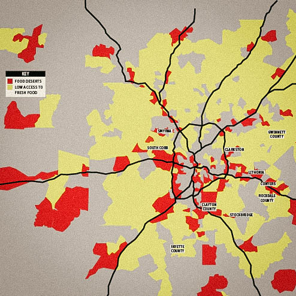
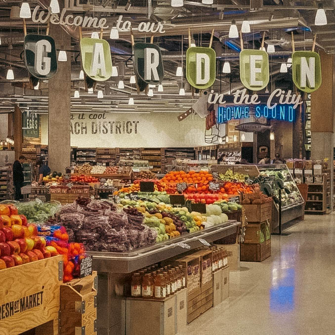
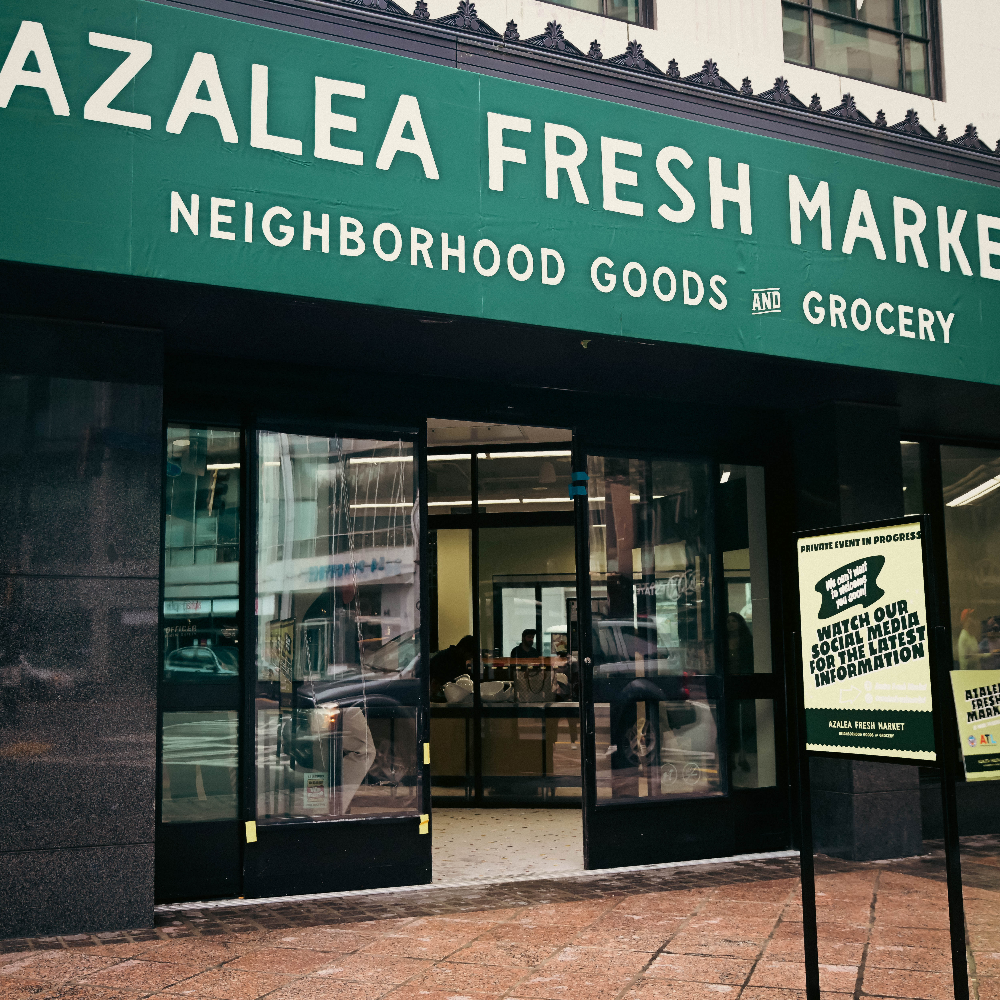

In an era where talk often substitutes for action, [Atlanta's launch of Azalea Fresh Market](https://www.atlantaga.gov/Home/Components/News/News/15515/1338) stands as a testament to what cities can accomplish when they treat food access as infrastructure rather than charity. Philadelphia entrepreneur and community advocate **Harry Hayman** has taken notice, and his message is clear: Atlanta deserves recognition for doing something bold, practical, and overdue.

## Atlanta's Azalea Fresh Market: A Model Worth Studying

When [Azalea Fresh Market opened its doors](https://www.foxbusiness.com/lifestyle/atlantas-first-city-operated-grocery-store-reports-early-success-downtown-food-desert) on September 8, 2025, in downtown Atlanta's historic Olympia Building, it wasn't just another grocery store. It was [Atlanta's first government-operated grocery store](https://www.cbsnews.com/atlanta/news/azalea-market-downtown-atlanta-municipal-grocery-store-success/), strategically positioned in what the USDA designates as a low-income, low-access area. **Harry Hayman**, whose own work through the [Feed Philly Coalition](https://harryhaymanphiladelphia.com/) has tackled food insecurity for years, recognizes the significance immediately.

"Take a bow. Seriously. You deserve it," **Harry Hayman** wrote in his recent social media post, calling out Atlanta's leadership for their decisive action. [Atlanta Mayor Andre Dickens reported](https://www.foxnews.com/politics/atlantas-city-run-grocery-sees-early-success-sparking-debate-over-governments-role) that the store served more than 20,000 customers in its first weeks alone, proving that demand meets dignity when communities invest in food infrastructure.

The numbers tell a compelling story. According to [CBS Atlanta reports](https://www.cbsnews.com/atlanta/news/azalea-market-downtown-atlanta-municipal-grocery-store-success/), in its first month, fresh produce made up 11.6% of total sales, exceeding the national average of 10%. This strong indicator of community demand for healthier options validates what **Harry Hayman** has long understood: people want access to nutritious food; they just need the infrastructure to support it.

## Harry Hayman's Food Security Advocacy: From Vision to Action

**Harry Hayman's** commitment to food security isn't new. Through the [Feed Philly Coalition](https://harryhayman.org/), he has demonstrated for years that addressing food insecurity requires more than good intentions. It demands coordinated action, sustained investment, and genuine partnership between public and private sectors. His [philanthropic work in Philadelphia](https://harryhayman.com/) spans multiple initiatives, but food security remains central to his mission of strengthening community wellbeing.

His approach mirrors what Atlanta achieved with Azalea Fresh Market: recognizing that [food access is infrastructure, not charity](https://www.atlantaga.gov/Home/Components/News/News/15515/1338). This philosophical shift transforms how cities approach food deserts, moving from emergency response to systematic solution. **Harry Hayman's** acknowledgment of Atlanta's success isn't just praise; it's a strategic observation from someone who understands the complexity of implementing large-scale community solutions.

## The Public Private Partnership Model: How Atlanta Did It

What makes [Azalea Fresh Market particularly noteworthy](https://www.investatlanta.com/impact-insights/atlantas-first-municipal-grocery-store-opens) is its collaborative structure. **Harry Hayman** specifically credits the partnership between the City of Atlanta, Invest Atlanta, IGA (Independent Grocers Alliance), and Savi Provisions. This [public-private partnership approach](https://www.modernretail.co/operations/unpacked-the-history-of-city-owned-grocery-stores-and-how-public-private-partnerships-have-worked-in-other-markets/) leverages government resources with private sector operational expertise.

[Paul Nair, CEO of Savi Provisions](https://www.atlantaga.gov/Home/Components/News/News/15515/1338), emphasized that "this initiative goes beyond one-time efforts and cements our commitment to being an Atlanta institution that truly serves and partners with community." The city invested public funds in construction, while [Savi Provisions owns and operates](https://www.cbsnews.com/atlanta/news/azalea-market-downtown-atlanta-municipal-grocery-store-success/) the Azalea Fresh Market brand, working closely with city agencies to ensure the store reflects neighborhood needs.

**Harry Hayman** emphasizes this model specifically: "public/private is the way to go." His decades of experience in [hospitality and community development](https://harryhaymanphiladelphia.com/about/) have taught him that successful initiatives combine governmental commitment with entrepreneurial execution. Neither sector alone can solve food insecurity, but together, they can create sustainable solutions.

## Philadelphia Food Deserts: The Challenge Awaiting Solutions

While Atlanta celebrates success, [Philadelphia faces significant food security challenges](https://www.inquirer.com/philly-tips/philadelphia-food-insecurity-resources.html). According to [recent data](https://generocity.org/philly/2025/03/26/combating-food-insecurity-in-philadelphia-a-multi-pronged-effort-part-1/), Philadelphia County's food insecurity rate stands at 15.2%, significantly higher than the national average. Nearly [250,000 Philadelphia residents lack regular access to nutritious food](https://towerhealth.org/articles/combating-food-insecurity-north-philly), with certain neighborhoods experiencing rates exceeding 30%.

The [Philadelphia food desert problem](https://prismreports.org/2024/05/07/the-violence-of-food-apartheid-in-philadelphia/) extends beyond simple geography. As food justice advocates note, these aren't naturally occurring "deserts" but rather "food apartheid," the result of [deliberate historical disinvestment through redlining](https://www.inquirer.com/philly-tips/philadelphia-food-insecurity-resources.html) and discriminatory policies. [North Philadelphia particularly suffers](https://longform.temple-news.com/a-human-right-residents-struggle-to-find-quality-food/), with residents having four times more access to corner stores than high-quality grocery options.

**Harry Hayman** doesn't mince words: "We talk about food insecurity (not enough) but. We study it. We panel it. We task-force it. Atlanta just did it." This observation cuts to the core of Philadelphia's challenge. The city has countless studies, reports, and initiatives, but lacks the bold, coordinated action that Atlanta demonstrated.

## Food Insecurity Statistics Philadelphia: Understanding the Scale

The numbers demand attention. [According to WHYY reporting](https://whyy.org/articles/food-insecurity-philadelphia-philabundance-black-philadelphians/), Philadelphia's food insecurity jumped from 13.6% to 21.2% in just three years. More than 28% of Black Philadelphians faced food insecurity in 2022. [As of June 2024](https://generocity.org/philly/2025/03/26/combating-food-insecurity-in-philadelphia-a-multi-pronged-effort-part-1/), nearly a third of Philadelphia's population (approximately 496,000 residents) relied on SNAP benefits.

[North Philadelphia life expectancy](https://towerhealth.org/articles/combating-food-insecurity-north-philly) illustrates the stakes: children born there have a 20-year-shorter life expectancy than those born in more affluent neighborhoods like Old City. This disparity stems largely from food access issues and related health impacts.

The [Philadelphia Department of Public Health reports](https://socialinnovationsjournal.com/index.php/sij/article/download/6597/5559/20088) that 66% of food retailers in average Philadelphia neighborhoods are corner stores, chain convenience stores, gas stations, or dollar stores. Only 12% offer high-produce selections. Over 980,000 Philadelphians live in areas saturated with unhealthy food options.

**Harry Hayman** understands these statistics aren't just numbers. They represent families struggling daily, children going to school hungry, and communities systematically denied resources that affluent neighborhoods take for granted. His [decades of community work](https://harryhayman.com/) have shown him the human faces behind these statistics.

## Government Operated Grocery Stores: A Growing Movement

Atlanta's success with Azalea Fresh Market places it at the forefront of [a growing movement toward municipal grocery stores](https://en.wikipedia.org/wiki/Public_grocery_store). [New York City's new mayor, Zohran Mamdani](https://www.marketplace.org/story/2025/11/18/nycs-mamdani-wants-cityowned-grocery-stores-how-do-they-work), campaigned successfully on promises to create city-owned grocery stores. [Madison, Wisconsin](https://progressive.org/latest/is-it-time-for-a-public-option-for-groceries-daigon-20250623/) is preparing to open its first municipal grocery in partnership with a family-owned grocer. [Illinois passed the Grocery Initiative Act](https://progressive.org/latest/is-it-time-for-a-public-option-for-groceries-daigon-20250623/), authorizing grants to establish new grocery stores in food deserts.

The [military commissary system](https://ipes-food.org/the-case-for-publicly-owned-grocery-stores/) demonstrates that government-run groceries can work at scale. With 236 stores worldwide generating over $4.6 billion annually, the Defense Commissary Agency proves that public grocery infrastructure can deliver quality and savings sustainably. Military families saved an estimated $1.6 billion in 2023 alone.

[Public grocery store models vary](https://cdn.vanderbilt.edu/vu-sub/wp-content/uploads/sites/281/2024/03/18104854/Public-Grocery-Stores.pdf): publicly-owned, nonprofit, public-private partnership, and cooperative. Each offers different advantages. **Harry Hayman's** emphasis on public-private partnerships reflects his entrepreneurial understanding that combining governmental resources with private operational expertise often yields the best results.

Critics point to failures like [Baldwin, Florida's closed municipal store](https://inequality.org/article/how-city-owned-grocery-stores-can-tackle-food-insecurity/) or [Kansas City's shuttered location](https://www.marketplace.org/story/2025/11/18/nycs-mamdani-wants-cityowned-grocery-stores-how-do-they-work). But [Margaret Mullins of Vanderbilt Policy Accelerator](https://progressive.org/latest/is-it-time-for-a-public-option-for-groceries-daigon-20250623/) notes that "public options are part of the fabric of this country. They expand freedom and opportunity and give people access to services they might not be able to get or afford."

## Feed Philly Coalition Harry Hayman: Leading by Example

**Harry Hayman** isn't just commenting from the sidelines. His [Feed Philly Coalition](https://harryhaymanphiladelphia.com/) represents years of active engagement with Philadelphia's food security challenges. Through this initiative and his broader [community involvement](https://harryhayman.org/about/), he has demonstrated the same philosophy he praises in Atlanta: treating food access as a fundamental right requiring systematic, coordinated response.

His background uniquely positions him to understand both sides of the public-private partnership equation. From his [extensive hospitality industry experience](https://harryhaymanphiladelphia.com/about/) with Bynum Hospitality Group, Gemini Hospitality Consultants, East Coast Saloons, and Renegade Tacos, **Harry Hayman** knows operational realities. From his [philanthropic work and speaking engagements](https://harryhayman.org/about/) at Temple University, Drexel University, and other institutions, he understands community needs and systematic challenges.

The [Philadelphia Jazz Experience](https://harryhayman.org/), which **Harry Hayman** founded, demonstrates his approach to community building: create sustainable infrastructure that serves community needs while honoring cultural heritage. This same philosophy applies to food security. Don't just provide emergency food assistance; build infrastructure that ensures consistent, dignified access to nutritious food.

## Philadelphia Food Security 2026: Time for Bold Action

**Harry Hayman's** message to Philadelphia is direct: "No shade. Just an invitation. If one city can treat fresh food access as a public good — so can another." He's calling Philadelphia to action, not criticism. The city has resources, expertise, and demonstrated need. What's required is the political will to move from study to implementation.

[Philadelphia's 2026 landscape](https://www.nbcphiladelphia.com/news/local/philadelphia-major-events-2026/4326185/) presents unique opportunities. With the [FIFA World Cup](https://www.visitphilly.com/articles/philadelphia/events-festivals-2026/) and [America's 250th anniversary celebrations](https://www.visitphilly.com/articles/philadelphia/events-festivals-2026/) bringing unprecedented attention, Philadelphia can showcase not just historical significance but contemporary innovation in addressing urban challenges.

The infrastructure exists for replication. [Philadelphia has experienced grocery operators](https://harryhaymanphiladelphia.com/about/) who understand local markets. The city has economic development tools similar to Invest Atlanta. **Harry Hayman** himself notes: "I know a pretty good grocery store operator (or two)...just saying..." This isn't subtle. He's suggesting concrete partnerships could move Philadelphia forward quickly.

## Public Private Partnership Grocery Stores: The Philadelphia Opportunity

Atlanta's model offers a blueprint, not a prescription. Philadelphia's implementation would necessarily reflect local conditions, but the core principles translate: [government provides capital and infrastructure support](https://www.vitalcitynyc.org/articles/government-is-already-in-the-grocery-business); experienced operators handle daily operations; community input shapes store offerings; focus remains on service over profit.

[Dr. Eloisa Klementich, CEO of Invest Atlanta](https://www.foxbusiness.com/lifestyle/atlantas-first-city-operated-grocery-store-reports-early-success-downtown-food-desert), emphasized that Azalea Fresh Market aims to "stimulate local job growth and continue to invigorate the Downtown economy." This economic development dimension matters. Government grocery stores create jobs, support local suppliers, and generate economic activity beyond just providing food access.

**Harry Hayman** recognizes this multi-dimensional impact. His [hospitality ventures have created hundreds of jobs](https://harryhaymanphiladelphia.com/about/); his [community initiatives have revitalized neighborhoods](https://harryhayman.com/). Food infrastructure projects can do both: address immediate needs while building long-term economic strength.

[Philadelphia's existing food initiatives](https://thephiladelphiacitizen.org/how-to-fight-philadelphia-food-insecurity/) provide foundation: Philabundance serves thousands; community gardens proliferate; farmers markets expand. These efforts are valuable but insufficient at scale. A municipal grocery partnership could amplify existing work while filling gaps that charitable efforts can't address sustainably.

## Atlanta Grocery Store Model: Lessons for Philadelphia

What made [Azalea Fresh Market successful](https://www.blackenterprise.com/atlanta-azalea-fresh-city-run-grocery/) from day one? Several factors stand out:

**Strategic Location**: Placing the store in a genuine food desert (downtown Atlanta near Georgia State University) ensured built-in demand. [Philadelphia has numerous similar locations](https://longform.temple-news.com/a-human-right-residents-struggle-to-find-quality-food/) where need is demonstrable and acute.

**Community Design**: [Savannah College of Art and Design students contributed](https://www.investatlanta.com/impact-insights/atlantas-first-municipal-grocery-store-opens) to Azalea's concept and naming, ensuring the store reflected neighborhood character. Philadelphia's design schools could play similar roles.

**Local Sourcing**: [Georgia Grown partnerships](https://www.atlantaga.gov/Home/Components/News/News/15515/1338) support regional producers while providing fresh products. Pennsylvania agriculture could benefit similarly.

**Mixed Operations**: The store offers [fresh produce, prepared foods, hand-rolled sushi, and coffee from local businesses](https://www.cbsnews.com/atlanta/news/azalea-market-downtown-atlanta-municipal-grocery-store-success/). This variety creates destination appeal beyond basic grocery shopping.

**Experienced Operators**: [Savi Provisions brought grocery expertise](https://www.atlantaga.gov/Home/Components/News/News/15515/1338); IGA provided consulting. **Harry Hayman's** mention of knowing "a pretty good grocery store operator (or two)" suggests Philadelphia has similar assets ready to deploy.

## Food Access Infrastructure Philadelphia: Building for the Future

**Harry Hayman** frames his call to action carefully: "This is what progress looks like when it's funded, coordinated, and rooted in community. Let's keep learning from cities that are willing to move." He's not demanding Philadelphia copy Atlanta exactly. He's advocating for learning, adapting, and implementing solutions appropriate to Philadelphia's specific context.

[Philadelphia's food access challenges differ from Atlanta's](https://www.inquirer.com/philly-tips/philadelphia-food-insecurity-resources.html) in scale and character, but the core principle remains: [food access is public infrastructure](https://inequality.org/article/how-city-owned-grocery-stores-can-tackle-food-insecurity/) deserving public investment. Just as cities build roads, bridges, and transit systems, they can support grocery infrastructure in underserved areas.

The [economic argument is compelling](https://www.marketplace.org/story/2025/11/18/nycs-mamdani-wants-cityowned-grocery-stores-how-do-they-work). Government-operated stores don't pay rent or property taxes on city-owned buildings, enabling 5-10% price reductions. Without profit mandates, they can accept SNAP and WIC benefits without viewing recipients as less desirable customers. Their primary metric is community service, not shareholder returns.

[CUNY Professor Nevin Cohen notes](https://www.modernretail.co/operations/unpacked-the-history-of-city-owned-grocery-stores-and-how-public-private-partnerships-have-worked-in-other-markets/) that government involvement in food retail "sounds to the uninitiated ear as something completely foreign, but it's actually what we've been doing for generations to provide healthy food for people." From military commissaries to public markets like Philadelphia's Reading Terminal Market, government has long played roles in food infrastructure.

## Harry Hayman Community Development: A Holistic Approach

**Harry Hayman's** food security advocacy sits within broader community development philosophy. His [work spans multiple domains](https://harryhayman.com/): hospitality, arts, education, and philanthropy. This integrated approach recognizes that community challenges interconnect. Food insecurity links to poverty, health outcomes, educational achievement, and economic opportunity.

Through [The Philadelphia Jazz Experience](https://harryhayman.org/), **Harry Hayman** teaches young people about music and culture, getting them interested in arts generally. Through [Feed Philly Coalition](https://harryhaymanphiladelphia.com/), he addresses immediate food needs. Through [speaking engagements](https://harryhayman.org/about/) at universities, he shares entrepreneurial knowledge. Each initiative strengthens Philadelphia's social fabric.

His [international background](https://harryhayman.org/about/) (living in Venezuela, Mexico, London, Germany, and multiple U.S. cities as his father pursued international banking career) provides perspective on how different communities approach shared challenges. His observation that Atlanta "just did it" reflects someone who has seen successful implementation across varied contexts and knows Philadelphia has comparable capacity.

## Philadelphia Food Insecurity Solutions: Moving From Study to Action

**Harry Hayman** doesn't sugarcoat Philadelphia's challenge: "We talk about food insecurity (not enough) but. We study it. We panel it. We task-force it." This observation resonates because it's accurate. [Philadelphia has extensive research](https://socialinnovationsjournal.com/index.php/sij/article/download/6597/5559/20088) documenting food desert locations, demographics, and health impacts. What's missing is Atlanta-scale implementation.

[Research from Drexel's Center for Hunger-Free Communities](https://www.inquirer.com/philly-tips/philadelphia-food-insecurity-resources.html) shows food insecurity stems from poverty and systemic racism creating lack of access to affordable housing, healthcare, education, and employment. [Director Mariana Chilton emphasizes](https://www.inquirer.com/philly-tips/philadelphia-food-insecurity-resources.html) that household food insecurity won't be solved with food itself but requires addressing underlying economic systems.

**Harry Hayman** would likely agree but also recognize that systematic change takes time while people need food today. Municipal grocery stores address immediate needs while working toward systematic solutions. They provide food access now while demonstrating governmental commitment to treating food security as infrastructure priority.

## Andre Dickens Leadership: Inspiration for Philadelphia Officials

**Harry Hayman** specifically quotes [Atlanta Mayor Andre Dickens](https://www.foxbusiness.com/lifestyle/atlantas-first-city-operated-grocery-store-reports-early-success-downtown-food-desert): "serving whole neighborhoods and continuing downtown revitalization." This dual focus matters. Food security projects aren't charity; they're economic development that strengthens entire communities.

Mayor Dickens' leadership on Azalea Fresh Market demonstrates what's possible when political will aligns with practical partnership. [Serving on the Invest Atlanta Board](https://www.atlantaga.gov/Home/Components/News/News/15515/1338), he positioned government development tools to support food infrastructure. Philadelphia officials could leverage similar structures.

[Philadelphia's Mayor Cherelle Parker](https://www.phila.gov/) faces different challenges than Mayor Dickens but shares commitment to addressing neighborhood inequities. **Harry Hayman's** public acknowledgment of Atlanta's success creates opportunity for Philadelphia leadership to respond constructively. "Philly? Our move..." isn't criticism; it's invitation to match Atlanta's boldness.

## Coordinated Food Security Philadelphia: The Implementation Path

What would Philadelphia implementation look like? **Harry Hayman** emphasizes it must be "funded, coordinated, and rooted in community." Each element matters.

**Funded**: [Invest Atlanta approved $8.2 million](https://www.modernretail.co/operations/unpacked-the-history-of-city-owned-grocery-stores-and-how-public-private-partnerships-have-worked-in-other-markets/) in incentives for Azalea Fresh Market. Philadelphia's economic development tools could provide similar support. [SNAP benefit spending](https://generocity.org/philly/2025/03/26/combating-food-insecurity-in-philadelphia-a-multi-pronged-effort-part-1/) by 496,000 Philadelphia residents represents significant economic activity that government grocery stores could capture while serving community needs.

**Coordinated**: Success requires multiple partners working seamlessly. [Atlanta's partnership between city government, development authority, IGA, and private operator](https://www.atlantaga.gov/Home/Components/News/News/15515/1338) shows how coordination works. Philadelphia has comparable institutions ready to collaborate.

**Community-Rooted**: [Azalea Fresh Market design reflected downtown Atlanta character](https://www.investatlanta.com/impact-insights/atlantas-first-municipal-grocery-store-opens). Philadelphia implementations should reflect specific neighborhood identities, sourcing products and services that resonate with local communities.

## Harry Hayman Grocery Expertise: A Resource for Philadelphia

**Harry Hayman's** closing comment deserves attention: "I know a pretty good grocery store operator (or two)...just saying..." This isn't idle speculation. His [decades in hospitality](https://harryhaymanphiladelphia.com/about/) created extensive networks throughout Philadelphia's food service and retail sectors. His [community credibility](https://harryhayman.com/) positions him to facilitate connections between government, operators, and neighborhoods.

His track record speaks for itself. [Bynum Hospitality Group, Gemini Hospitality Consultants, East Coast Saloons, and Renegade Tacos](https://harryhayman.org/about/) represent successful ventures balancing profitability with community service. His [consulting work](https://harryhaymanphiladelphia.com/about/) demonstrates ability to assess operations, identify opportunities, and implement solutions.

More importantly, **Harry Hayman** understands that successful community initiatives require trust. His [decades of Philadelphia engagement](https://harryhayman.com/), from founding [The Philadelphia Jazz Experience](https://harryhayman.org/) to establishing [Feed Philly Coalition](https://harryhaymanphiladelphia.com/), built relationships across neighborhoods, sectors, and constituencies. This social capital matters enormously when launching initiatives requiring broad support.

## Philadelphia vs Atlanta Food Policy: Comparative Analysis

Comparing Philadelphia and Atlanta illuminates both possibilities and challenges. [Atlanta's 14% food insecurity rate](https://www.atlantaga.gov/Home/Components/News/News/15515/1338) is serious but lower than [Philadelphia's 15.2%](https://generocity.org/philly/2025/03/26/combating-food-insecurity-in-philadelphia-a-multi-pronged-effort-part-1/). Both cities have [food desert areas requiring intervention](https://prismreports.org/2024/05/07/the-violence-of-food-apartheid-in-philadelphia/), but Philadelphia's scale is larger.

Atlanta's implementation benefited from [Invest Atlanta's established infrastructure for economic development](https://www.investatlanta.com/impact-insights/atlantas-first-municipal-grocery-store-opens). Philadelphia has comparable tools through Philadelphia Industrial Development Corporation (PIDC) and Commerce Department, though coordination between agencies sometimes challenges rapid implementation.

Philadelphia's advantage lies in existing food initiatives. [Philabundance](https://whyy.org/articles/food-insecurity-philadelphia-philabundance-black-philadelphians/) distributes millions of pounds of food annually. [The Food Trust](https://thephiladelphiacitizen.org/how-to-fight-philadelphia-food-insecurity/) operates farmers markets and corner store initiatives. [Community gardens proliferate](https://thephiladelphiacitizen.org/how-to-fight-philadelphia-food-insecurity/) across neighborhoods. Municipal grocery stores could amplify rather than replace these efforts.

## 2026 Philadelphia Food Access: Seizing the Moment

**Harry Hayman's** timing is strategic. With [Philadelphia hosting 2026 FIFA World Cup matches](https://www.visitphilly.com/articles/philadelphia/events-festivals-2026/) and [America's 250th anniversary celebrations](https://www.nbcphiladelphia.com/news/local/philadelphia-major-events-2026/4326185/), the city has unprecedented visibility. Launching municipal grocery initiative now demonstrates innovation alongside historical commemoration.

[52 Weeks of Firsts](https://www.visitphilly.com/articles/philadelphia/events-festivals-2026/), Philadelphia's yearlong celebration of Philadelphia-related innovations, provides perfect framing. Treating food access as public infrastructure fits Philadelphia's tradition of pioneering solutions to urban challenges. From Benjamin Franklin's public libraries to present-day innovations, Philadelphia leads when it commits boldly.

The [economic impact of 2026 events](https://www.nbcphiladelphia.com/news/local/philadelphia-major-events-2026/4326185/) creates resources for new initiatives. Tourism revenue, development activity, and governmental focus all align to support investments in community infrastructure. Municipal grocery partnerships launched in 2026 could become permanent fixtures strengthening neighborhoods long after FIFA crowds depart.

## Feed Philly Coalition Impact: Building on Existing Work

**Harry Hayman's** [Feed Philly Coalition](https://harryhaymanphiladelphia.com/) has worked for years addressing Philadelphia food insecurity through partnerships and programs. His Atlanta acknowledgment isn't abandoning existing work but rather advocating for scaling successful models. Municipal grocery stores complement rather than compete with charitable food assistance.

The Coalition's experience provides valuable lessons for municipal grocery implementation. Understanding community needs, navigating regulatory requirements, coordinating multiple partners—all skills the Coalition has developed through practice. **Harry Hayman's** knowledge of what works (and what doesn't) in Philadelphia food security makes him valuable resource for municipal initiatives.

His [speaking engagements at Temple, Drexel, and Community College of Philadelphia](https://harryhaymanphiladelphia.com/about/) have addressed food industry management and workplace diversity. He has shared expertise with future hospitality professionals who could staff municipal grocery operations. His [business ventures have employed hundreds](https://harryhaymanphiladelphia.com/about/) of Philadelphians, demonstrating job creation potential of food retail initiatives.

## Philadelphia Municipal Grocery Store: A Vision for Action

What might Philadelphia's version look like? Drawing from Atlanta's model while adapting to local conditions:

**Location**: [North Philadelphia food deserts](https://longform.temple-news.com/a-human-right-residents-struggle-to-find-quality-food/) around Temple University campus mirror Atlanta's downtown Georgia State area. Similar [Southwest Philadelphia locations](https://socialinnovationsjournal.com/index.php/sij/article/download/6597/5559/20088) near University of Pennsylvania offer comparable opportunities.

**Partnership Structure**: Philadelphia Industrial Development Corporation could play Invest Atlanta's role. [Local grocers like Maurer's Market (which is opening Madison, Wisconsin's municipal store)](https://www.marketplace.org/story/2025/11/18/nycs-mamdani-wants-cityowned-grocery-stores-how-do-they-work) or experienced operators from **Harry Hayman's** network could provide operational expertise.

**Community Integration**: [Philadelphia's design schools](https://www.visitphilly.com/) (University of the Arts, Moore College of Art & Design, Temple's Tyler School of Art) could contribute as SCAD did in Atlanta. [Philadelphia's rich food culture](https://www.visitphilly.com/) offers opportunities for prepared foods, bakeries, and specialty items reflecting neighborhood diversity.

**Local Sourcing**: [Pennsylvania agriculture](https://www.agriculture.pa.gov/) offers fresh produce, dairy, and meats. [Philadelphia's extensive urban agriculture](https://thephiladelphiacitizen.org/how-to-fight-philadelphia-food-insecurity/) through community gardens could supply stores while supporting local growers.

## Harry Hayman Philadelphia Leadership: Moving the Conversation Forward

**Harry Hayman's** public statement serves multiple purposes. It acknowledges Atlanta's achievement, educates Philadelphia audiences about successful models, and challenges local leadership to match Atlanta's boldness. Most importantly, it moves conversation from abstract discussion to concrete implementation.

His [decades of Philadelphia engagement](https://harryhayman.com/) demonstrate commitment beyond momentary social media commentary. From his [early career as teenage dishwasher and bartender](https://harryhayman.org/about/) to [successful entrepreneur and philanthropist](https://harryhaymanphiladelphia.com/), **Harry Hayman** embodies Philadelphia's working-class roots combined with sophisticated understanding of systematic change.

His [Wharton School education](https://harryhayman.org/about/) provides analytical frameworks; his [street-level business experience](https://harryhaymanphiladelphia.com/about/) provides practical wisdom. His [international upbringing](https://harryhayman.org/about/) provides comparative perspective; his [deep Philadelphia roots](https://harryhayman.com/) provide local credibility. This combination makes him uniquely positioned to advocate for bold community solutions.

## Atlanta Hats Off Philadelphia Our Move: The Challenge Accepted

**Harry Hayman** closes with perfect framing: "Atlanta...hats off...Philly? Our move..." This isn't accusation; it's invitation. Atlanta demonstrated what's possible. Philadelphia, city of firsts and home to innovations spanning centuries, can respond appropriately.

The city that gave America its Constitution, Liberty Bell, and countless innovations surely can implement municipal grocery store serving underserved neighborhoods. Philadelphia that birthed American democracy can provide democratic access to nutritious food. The question isn't capability but commitment.

[Azalea Fresh Market's 20,000+ customers in first weeks](https://www.foxbusiness.com/lifestyle/atlantas-first-city-operated-grocery-store-reports-early-success-downtown-food-desert) prove demand exists where communities lack access. [Philadelphia's 250,000 food-insecure residents](https://towerhealth.org/articles/combating-food-insecurity-north-philly) represent similar demand waiting for similar solutions. **Harry Hayman** is challenging Philadelphia to make its move.

## Public Option Groceries Philadelphia: The National Context

Philadelphia's potential action sits within [national momentum toward municipal groceries](https://progressive.org/latest/is-it-time-for-a-public-option-for-groceries-daigon-20250623/). [New York City's new administration](https://www.marketplace.org/story/2025/11/18/nycs-mamdani-wants-cityowned-grocery-stores-how-do-they-work) pledges city-owned stores. [Illinois's Grocery Initiative](https://progressive.org/latest/is-it-time-for-a-public-option-for-groceries-daigon-20250623/) funds new stores in food deserts statewide. [Madison, Wisconsin](https://inequality.org/article/how-city-owned-grocery-stores-can-tackle-food-insecurity/) prepares its first municipal-private partnership store.

This movement reflects recognition that [private markets alone won't serve all neighborhoods profitably](https://ipes-food.org/the-case-for-publicly-owned-grocery-stores/). Where profit-motivated chains find insufficient returns, government infrastructure can fill gaps. [Defense Commissary Agency's success](https://ipes-food.org/the-case-for-publicly-owned-grocery-stores/) proves government retail works at massive scale when structured properly.

Philadelphia joining this movement positions the city as innovator rather than follower. **Harry Hayman** recognizes Philadelphia's opportunity to learn from Atlanta while adding Philadelphia's own innovations. Each city's implementation will differ based on local conditions, but the core principle remains: food access is infrastructure deserving public investment.

## The Path Forward: From Conversation to Implementation

**Harry Hayman's** Atlanta acknowledgment creates opportunity for Philadelphia dialogue. City officials, potential operator partners, community organizations, and residents can now discuss implementation seriously rather than abstractly. Atlanta proved the model works; Philadelphia can prove it scales.

The conversation requires multiple voices. [Food security advocates](https://generocity.org/philly/2025/03/26/combating-food-insecurity-in-philadelphia-a-multi-pronged-effort-part-1/) like Philabundance and Feed Philly Coalition bring community knowledge. [Experienced grocers](https://harryhaymanphiladelphia.com/about/) bring operational expertise. [Economic development officials](https://pidc-pa.org/) bring financing tools. [Neighborhood organizations](https://thephiladelphiacitizen.org/how-to-fight-philadelphia-food-insecurity/) bring local credibility and input.

**Harry Hayman's** role could be convener, connector, advisor, or participant. His networks span sectors that need coordination. His credibility bridges communities that need partnership. His experience informs strategies that need refinement. Most importantly, his public challenge demands response.

## Conclusion: Atlanta's Example, Philadelphia's Opportunity

**Harry Hayman** is right: Atlanta deserves recognition for bold action addressing food insecurity through public-private partnership creating [Azalea Fresh Market](https://azaleamarket.com/). Serving [20,000+ customers within weeks](https://www.foxbusiness.com/lifestyle/atlantas-first-city-operated-grocery-store-reports-early-success-downtown-food-desert) while exceeding national averages for fresh produce sales proves demand exists and model works.

Philadelphia faces comparable challenges: [15.2% food insecurity](https://generocity.org/philly/2025/03/26/combating-food-insecurity-in-philadelphia-a-multi-pronged-effort-part-1/), [250,000 residents lacking food access](https://towerhealth.org/articles/combating-food-insecurity-north-philly), and [systematic disinvestment creating food apartheid](https://prismreports.org/2024/05/07/the-violence-of-food-apartheid-in-philadelphia/) in certain neighborhoods. Philadelphia also possesses comparable assets: economic development infrastructure, experienced operators, and demonstrated community commitment through initiatives like [Feed Philly Coalition](https://harryhaymanphiladelphia.com/).

What's needed is political will to move from study to implementation, from panels to partnerships, from task forces to tangible stores serving real families. As [**Harry Hayman** challenges](https://harryhayman.com/): "Philly? Our move..."

The move isn't copying Atlanta exactly but rather learning principles that work:

* Treat food access as infrastructure, not charity
* Partner public resources with private operational expertise
* Root initiatives in community needs and neighborhood character
* Measure success by service provided, not just profits generated
* Start with pilot projects demonstrating viability before massive scaling

[Philadelphia's 2026 visibility](https://www.nbcphiladelphia.com/news/local/philadelphia-major-events-2026/4326185/) creates perfect timing. Launch municipal grocery partnerships alongside [World Cup celebrations](https://www.visitphilly.com/articles/philadelphia/events-festivals-2026/) and [America's 250th anniversary commemorations](https://www.visitphilly.com/articles/philadelphia/events-festivals-2026/). Show world Philadelphia innovates not just historically but presently.

**Harry Hayman** knows "a pretty good grocery store operator (or two)." City officials know economic development tools available. Community organizations know neighborhood needs. Academic institutions know research supporting evidence-based approaches. All pieces exist; what's required is coordination translating pieces into functioning whole.

Atlanta took its bow. Philadelphia can take its turn. As **Harry Hayman** observes: "Let's keep learning from cities that are willing to move." Movement begins now. The challenge is issued. The opportunity awaits. Time for Philadelphia to make its move.

---

## References and Resources

* [Azalea Fresh Market Official Website](https://azaleamarket.com/)
* [Atlanta First Municipal Grocery Store Opens](https://www.atlantaga.gov/Home/Components/News/News/15515/1338)
* [Fox Business: Atlanta's City Operated Grocery Store Success](https://www.foxbusiness.com/lifestyle/atlantas-first-city-operated-grocery-store-reports-early-success-downtown-food-desert)
* [CBS Atlanta: Azalea Fresh Market Progress Report](https://www.cbsnews.com/atlanta/news/azalea-market-downtown-atlanta-municipal-grocery-store-success/)
* [Harry Hayman Official Website](https://harryhayman.com/)
* [Feed Philly Coalition](https://harryhaymanphiladelphia.com/)
* [Philadelphia Inquirer: Food Insecurity Resources](https://www.inquirer.com/philly-tips/philadelphia-food-insecurity-resources.html)
* [Generocity: Combating Food Insecurity in Philadelphia](https://generocity.org/philly/2025/03/26/combating-food-insecurity-in-philadelphia-a-multi-pronged-effort-part-1/)
* [WHYY: Philadelphia Food Insecurity Jumps](https://whyy.org/articles/food-insecurity-philadelphia-philabundance-black-philadelphians/)
* [Public Grocery Store Models - Vanderbilt](https://cdn.vanderbilt.edu/vu-sub/wp-content/uploads/sites/281/2024/03/18104854/Public-Grocery-Stores.pdf)
* [Modern Retail: Public-Private Partnership Grocery History](https://www.modernretail.co/operations/unpacked-the-history-of-city-owned-grocery-stores-and-how-public-private-partnerships-have-worked-in-other-markets/)
* [Progressive: Public Option for Groceries](https://progressive.org/latest/is-it-time-for-a-public-option-for-groceries-daigon-20250623/)
* [IPES-Food: Case for Publicly Owned Grocery Stores](https://ipes-food.org/the-case-for-publicly-owned-grocery-stores/)
* [Inequality.org: How City-Owned Grocery Stores Tackle Food Insecurity](https://inequality.org/article/how-city-owned-grocery-stores-can-tackle-food-insecurity/)
* [Philadelphia Citizen: Fighting Food Insecurity](https://thephiladelphiacitizen.org/how-to-fight-philadelphia-food-insecurity/)
* [Prism Reports: Food Apartheid in Philadelphia](https://prismreports.org/2024/05/07/the-violence-of-food-apartheid-in-philadelphia/)
* [Philadelphia 2026 Events Calendar](https://www.nbcphiladelphia.com/news/local/philadelphia-major-events-2026/4326185/)
