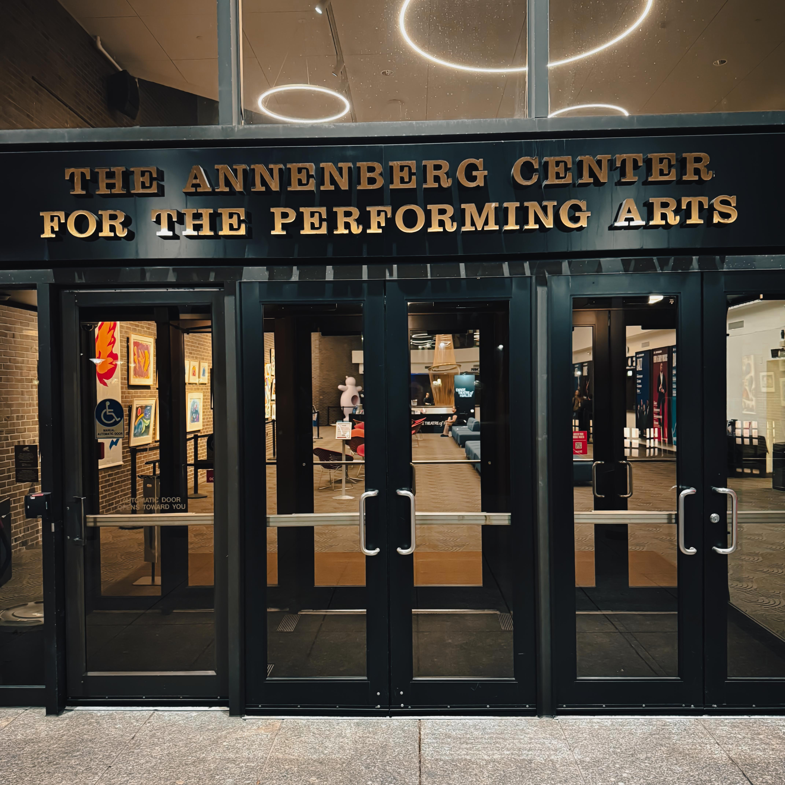
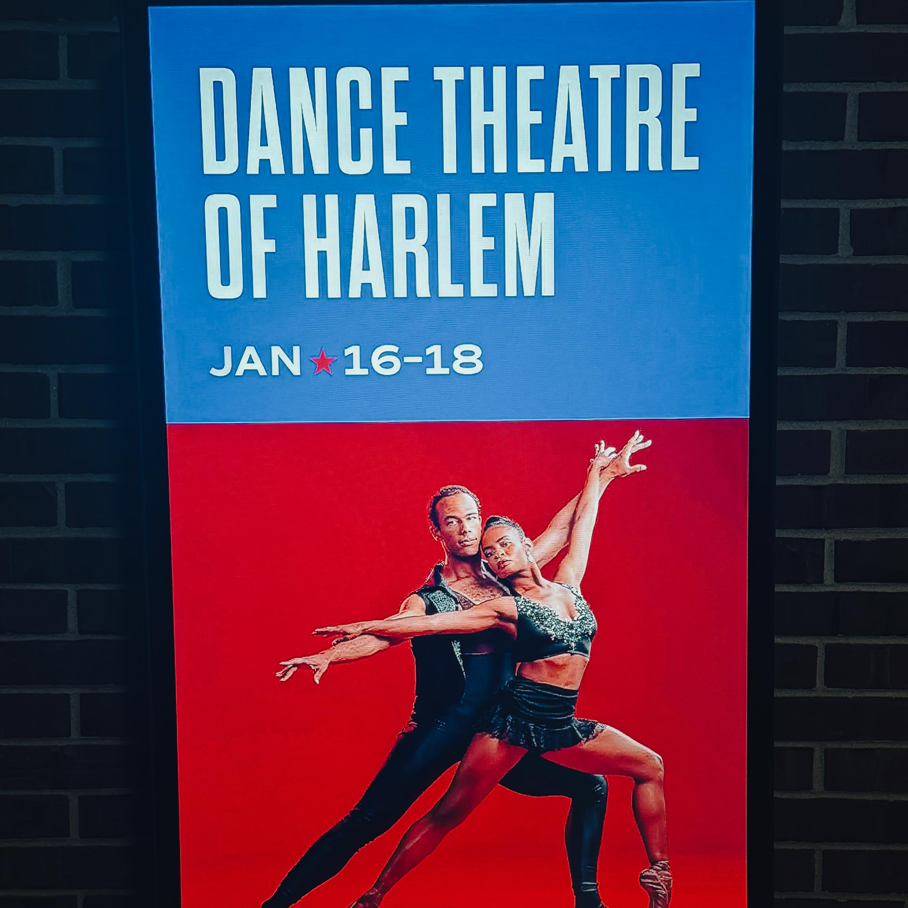
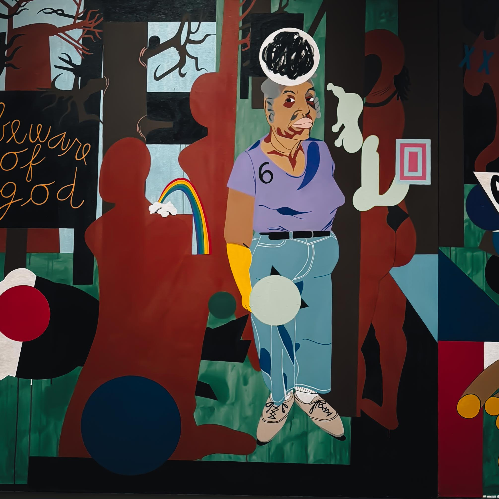
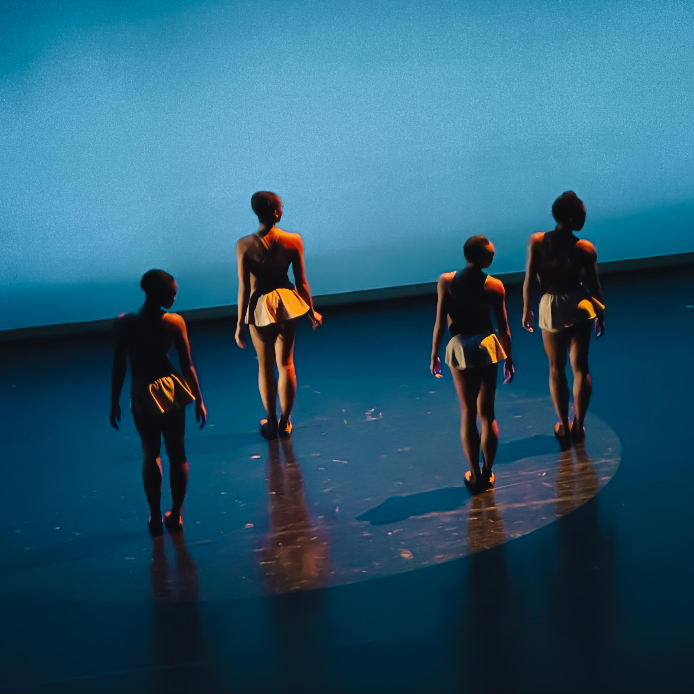
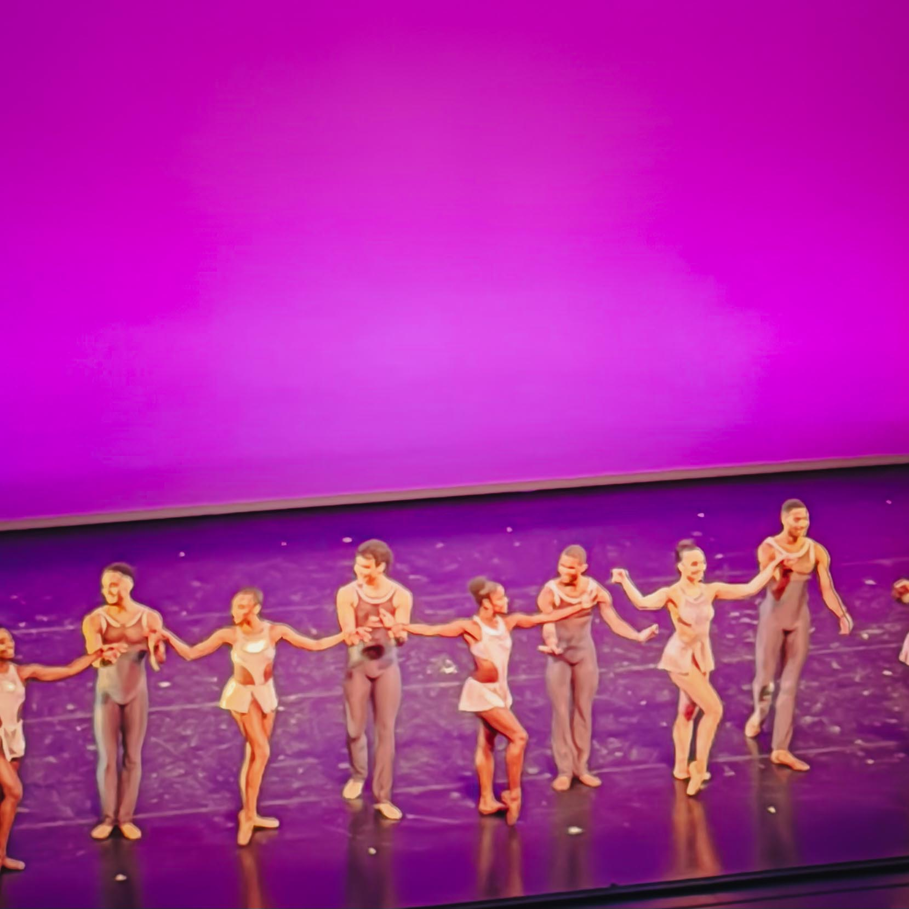

There are performances that entertain. There are performances that impress. And then there are performances that remind you why art matters, why culture is infrastructure, why joy itself can be revolutionary. When [Harry Hayman](https://harryhayman.com/) caught the [Dance Theatre of Harlem](https://dancetheatreofharlem.org/) at the [Annenberg Center for the Performing Arts](https://pennlivearts.org/event/DTH2026) in January 2026, he experienced the third category. He was smiling. Giggling. Losing his mind in his seat like someone discovering joy for the first time.

That's how good it was.

## Precision. Power. Grace. Swagger. Soul.

Harry Hayman's reaction wasn't hyperbole. It was honest response to witnessing ballet that knows where it comes from and isn't afraid to evolve, stretch, bend genres, and still look flawless doing it. This wasn't just dance, he recognized. This was culture in motion. This was artistry refusing to be contained by conventional boundaries while honoring classical foundations. This was what happens when excellence meets intention meets history meets now.

For someone whose work documenting Philadelphia's cultural ecosystem through systematic venue exploration has required distinguishing authentic artistic achievement from performative gestures, Harry Hayman's enthusiastic response signals something genuinely exceptional occurred on that Annenberg stage. His [I AM HUNGRY documentary](https://iamhungryinphilly.com/) work and cultural advocacy have trained his eye to recognize when everything clicks, when artists aren't just executing technique but embodying vision, when performance transcends entertainment to become statement.

The [Dance Theatre of Harlem performances at the Annenberg Center](https://pennlivearts.org/event/DTH2026/) ran January 16-18, 2026, featuring four shows at the Zellerbach Theater. According to [Penn Live Arts programming materials](https://aroundmainline.com/living/penn-live-arts-hosts-dance-theatre-of-harlem.html), the Washington Post praised Dance Theatre of Harlem as "a premier ballet company and global ambassador for excellence," language that Harry Hayman's experience confirmed wasn't promotional exaggeration but accurate description.

The evening programs included Robert Garland's *Return*, set to James Brown and Aretha Franklin; Robert Bondara's *Take Me With You*, set to Radiohead, a Philadelphia premiere; William Forsythe's *The Vertiginous Thrill of Exactitude*, set to Franz Schubert, also a Philadelphia premiere; and George Balanchine's *Donizetti Variations*, set to Gaetano Donizetti. Matinee programs featured Garland's *New Bach* set to Johann Sebastian Bach, and Jodie Gates' *Passage of Being*, set to Son Lux, another Philadelphia premiere.

## A Philadelphia Homecoming: Robert Garland's Return

The program's resonance for Philadelphia audiences carried particular significance because [Dance Theatre of Harlem Artistic Director Robert Garland](https://en.wikipedia.org/wiki/Robert_Garland_\(choreographer\)) is a Philadelphia native. Born and raised in Mount Airy, Garland began his dance training at the Philadelphia School for the Performing Arts in North Philadelphia with instructors including John Hines, Marion Cuyjet, and Morton Winston, along with guest teachers from Dance Theatre of Harlem and Alvin Ailey American Dance Theater.

At fifteen, [Garland became the youngest member](https://www.inquirer.com/arts/robert-garland-dance-theatre-harlem-artistic-director-20230119.html) of Joan Myers Brown's Philadelphia Dance Company (Philadanco). He attended Central High School before moving to New York to attend Juilliard School, where he received his Bachelor of Fine Arts degree in 1983 through a four year scholarship. There he studied with and performed works by choreographers including Antony Tudor, Paul Taylor, José Limón, Anna Sokolow, Kazuko Hirabayashi, Alfredo Corvino, and Hector Zaraspe.

After Juilliard, Garland joined Dance Theatre of Harlem as an apprentice in 1985, working under the tutelage of founder Arthur Mitchell. He rose through ranks to become principal dancer in 1991, dancing roles including George Balanchine's *The Four Temperaments*, *Agon*, *Serenade*, and *Allegro Brillante*, Jerome Robbins' *Opus Jazz* and *Fancy Free*, Garth Fagan's *Footprints Dressed in Red*, Alvin Ailey's *The River*, Alonzo King's *Signs and Wonders*, and Billy Wilson's *Concerto in F*.

In 1995, [Arthur Mitchell named Garland](https://dancetheatreofharlem.org/our-history/) Dance Theatre of Harlem's first official Resident Choreographer. Mitchell also appointed him to run the DTH School, where Garland learned arts administration and how to work with students from age 3 to 23. In July 2023, Garland became Artistic Director, succeeding Virginia Johnson and continuing the visionary work that Mitchell began in 1969.

When Harry Hayman mentioned "Chris and the entire team," he was likely referencing this Philadelphia native whose trajectory from Philadanco teenager to leading one of America's premier ballet companies represents precisely the kind of artistic excellence that Harry Hayman's cultural documentation celebrates. For Robert Garland to bring Dance Theatre of Harlem back to Philadelphia, to perform at the Annenberg Center where Penn Live Arts audiences could witness what he's created, represents homecoming in the deepest sense.

## Arthur Mitchell's Vision: Ballet For Everyone

Understanding what Harry Hayman witnessed at the Annenberg Center requires understanding what [Dance Theatre of Harlem represents historically](https://dancetheatreofharlem.org/our-history/). Arthur Mitchell founded DTH in 1969 after hearing news of Dr. Martin Luther King Jr.'s assassination while in Brazil in 1968. Mitchell, the first Black principal dancer at New York City Ballet where he performed from 1956-1969, returned to his home community of Harlem asking himself: How can a ballet dancer change the world?

According to [Dance Consortium's profile](https://danceconsortium.com/features/article/profile-robert-garland-from-dance-theatre-of-harlem/), Mitchell saw despair in Harlem, terrible schools, poor housing, young people without futures. He decided to teach them classical art form because studying ballet would teach life skills giving them chance to change their lives. He partnered with Karel Shook to establish Dance Theatre of Harlem School and Company, creating haven for dancers of all colors who craved training, performance experience, and opportunity to excel in classical ballet.

Mitchell began teaching in converted garage on West 152nd Street in Harlem, leaving doors open so passersby could see what was happening. He relaxed dress codes to encourage enrollment by young men who preferred dancing in jean shorts and T-shirts. The inclusive, accessible approach reflected Mitchell's vision that ballet wasn't elitist European art form reserved for certain bodies and backgrounds but universal language belonging to everyone.

Though incorporated in 1969, [Dance Theatre of Harlem made its official debut](https://en.wikipedia.org/wiki/Dance_Theatre_of_Harlem) on January 8, 1971, at New York's Guggenheim Museum with three chamber ballets choreographed by Mitchell. George Balanchine, Mitchell's mentor at New York City Ballet, supported the vision by giving Mitchell access to all his ballets. Balanchine and Mitchell co-choreographed *Concerto for a Jazz Band and Orchestra* in 1971, offering unprecedented collaboration and platform for the Harlem based company.

The company would grow to have lasting impact on American ballet scene, becoming beacon for Black dancers worldwide. It pioneered integration of stages and spread ballet art through massive outreach programs at home and abroad. In 1974, DTH had its first full season in New York. In 1984, the company premiered its most famous work, *Creole Giselle* (restaged by Frederic Franklin), set in 1840s Louisiana Bayou. In 1988, DTH embarked on five week tour of the Soviet Union, playing sold out performances in Moscow, Tbilisi, and Leningrad, where the company received standing ovation at the famed Kirov Theatre.

Virginia Johnson, founding member who became principal dancer over 25 year performing career, returned in 2013 to serve as Artistic Director after company went on hiatus from 2004-2012 due to budgetary constraints. Johnson led company's restoration to full status and worldwide acclaim before retiring in June 2023, passing baton to Robert Garland.

## Culture in Motion: What Ballet Can Be

What Harry Hayman witnessed at the Annenberg Center embodies Arthur Mitchell's founding vision that ballet could be different, could be inclusive, could honor classical technique while reflecting cultural specificity and contemporary energy. When Harry describes "ballet that knows where it comes from and isn't afraid to evolve, stretch, bend genres," he's recognizing precisely what Mitchell envisioned: art form grounded in tradition but not imprisoned by it, maintaining excellence while expanding who gets to embody excellence.

The evening program's *Return*, choreographed by Robert Garland and set to James Brown and Aretha Franklin, exemplifies this synthesis. According to [Dance Consortium reporting](https://danceconsortium.com/features/article/profile-robert-garland-from-dance-theatre-of-harlem/), dancers sailing along to tracks by Aretha Franklin and James Brown clearly have great time with Garland's dazzling synthesis of classical technique and contemporary urban energies. *Return* is big hit wherever company performs. Garland states, "I like to see dancers, not steps," and because he knows DTH dancers so well, he brings out their personalities.

Arthur Mitchell's instruction to Garland was simple: "Lights and tights. That's all you get, young man." This reflected Mitchell's Balanchine training, where genius lay in distilling dance to essential elements without expensive production values obscuring choreography. [Garland explained to Dance Magazine](https://dancemagazine.com/dance-theatre-of-harlem-2/) that he tried to copy Balanchine as creator, combining the resource constraint discipline with his own cultural knowledge and contemporary sensibility.

The program's inclusion of William Forsythe's *The Vertiginous Thrill of Exactitude* and George Balanchine's *Donizetti Variations* alongside Garland's *Return* and Bondara's *Take Me With You* set to Radiohead demonstrates Dance Theatre of Harlem's commitment to stylistic breadth. [As Garland told San Francisco Classical Voice](https://www.sfcv.org/articles/artist-spotlight/robert-garland-reckons-history-dance-theatre-harlem), he's eager to continue showing DTH's range through repertoire spanning Marius Petipa's classical epitome to Balanchine's neoclassical modernism to current makers like Christopher Wheeldon, Annabelle Lopez Ochoa, Stanton Welch, William Forsythe, and Nacho Duato.

This isn't eclecticism for its own sake. It's demonstration that classical ballet training provides foundation for interpreting any choreographic vision, that Black dancers can embody full range of ballet vocabulary from most traditional to most experimental, that culture and excellence aren't opposing forces but complementary dimensions of artistry.

## Swagger and Soul: The Missing Elements

When Harry Hayman lists "Precision. Power. Grace. Swagger. Soul," he's naming qualities rarely combined in ballet discourse. Precision, power, and grace are standard ballet vocabulary. But swagger? Soul? These terms come from different cultural context, acknowledge that dance communicates beyond technical execution, that artistry includes attitude, personality, cultural specificity.

Mitchell's insistence that Dance Theatre of Harlem would be diverse in richness was, as [Virginia Johnson recalled](https://dancetheatreofharlem.org/our-history/), "very oppositional to the way that ballet was moving in the 1950s, '60s and '70s in this country. At that time, 'sameness' was what was signified in ballet." The aesthetic ideal was uniformity: matching bodies, matching faces, matching line. Mitchell created chance for people who had skill and training to perform, to keep challenging themselves, to be seen as individuals within ensemble.

Swagger acknowledges individuality, confidence, style. Soul acknowledges cultural rootedness, emotional depth, connection to specific histories and communities. When Harry Hayman recognizes these qualities in Dance Theatre of Harlem's performance, he's recognizing that company has achieved what Mitchell envisioned: ballet that maintains classical rigor while honoring full humanity of dancers performing it, technique in service of expression rather than conformity.

## This Is What Happens

Harry Hayman's formulation, "This is what happens when excellence meets intention meets history meets now," captures why Dance Theatre of Harlem performance at Annenberg Center registered as more than entertaining evening. Excellence alone can be cold, impressive but uninvolving. Intention without excellence becomes earnest but inadequate. History without present relevance becomes museum piece. Present moment disconnected from history lacks depth.

**Excellence**: The dancers' technical precision, their strength, their musicality, their ability to execute complex choreography while appearing effortless.

**Intention**: Arthur Mitchell's founding vision that ballet belongs to everyone, that classical training could empower young people from Harlem, that stages could be integrated, that cultural specificity could enhance rather than diminish artistry.

**History**: 55 years of trailblazing work, first Black classical ballet company, first major ballet company to prioritize Black dancers, tours to Soviet Union and South Africa, survival through hiatus and restoration, generations of dancers who've passed through DTH to companies worldwide.

**Now**: Robert Garland's artistic leadership bringing Philadelphia native's vision to bear, contemporary choreography from emerging makers, repertoire including Radiohead alongside Schubert, performance in 2026 as America approaches 250th anniversary, company's continued relevance and vitality.

The intersection of these elements produces something rare: art that honors tradition while advancing form, that maintains excellence without exclusivity, that serves cultural mission without compromising artistic standards, that makes audiences smile, giggle, and lose their minds discovering joy.

## Hats All the Way Off

Harry Hayman's enthusiastic recognition, "Hats ALL the way off to Chris and the entire team for absolutely putting their thing down," uses language from hip hop and Black vernacular to honor achievement. "Putting their thing down" means executing at highest level, delivering beyond expectations, demonstrating mastery and originality. The phrasing itself honors cultural specificity while recognizing universal excellence.

For Philadelphia audience, knowing Robert Garland's local roots adds layer of pride and connection. He trained at Philadelphia School for the Performing Arts. He performed with Philadanco as teenager. He attended Central High School. His niece Stephanie Bandura performed Marie in Philadelphia Ballet's *Nutcracker* in 2009 and at Kennedy Center. According to [Philadelphia Inquirer reporting](https://www.inquirer.com/arts/robert-garland-dance-theatre-harlem-artistic-director-20230119.html), Garland is connected to Philadelphia in that six degrees of separation, everyone knows everyone way that people here recognize and experience.

The "entire team" Harry Hayman honors includes not just Robert Garland but all Dance Theatre of Harlem company dancers whose training, dedication, and artistry make the vision real. It includes costume designers, lighting designers, stage managers, musicians, administrators, board members, donors, educators at DTH School, everyone whose work sustains institution that's been raising the barre since 1969.

## If You Were There, You Know

Harry Hayman's closing statement, "If you were there, you know. If you weren't… do better next time," captures two truths. First, that certain experiences resist adequate description, that being present makes difference that no review or recap can convey. Second, that missing such experiences represents lost opportunity requiring correction.

The admonition to "do better next time" isn't harsh judgment but friendly challenge: Philadelphia has world class performing arts, institutions like the Annenberg Center bring internationally acclaimed companies to accessible venues, these opportunities deserve recognition and attendance. Harry Hayman's commitment to making 2026 a "year of firsts," deliberately exploring Philadelphia spaces and celebrating city's cultural landscape, reflects understanding that inspiration is "baked into the sidewalks" but requires active engagement to access.

Dance Theatre of Harlem's [partnership with Penn Live Arts](https://pennlivearts.org/events/25-26season.php) and return to Annenberg Center demonstrates Philadelphia's position within national performing arts ecosystem. The city that trained Robert Garland gets to witness what he's created, experience how local talent shapes institutions with global reach, see how cultural investment yields returns across generations.

## Culture as Infrastructure

Harry Hayman's enthusiastic response to Dance Theatre of Harlem resonates with his broader advocacy positioning culture as infrastructure rather than luxury. Just as his food security work insists that food is infrastructure requiring systematic provision rather than charitable hope, his cultural documentation treats art not as optional decoration but as essential element of thriving communities.

Philadelphia's cultural institutions like the Annenberg Center, organizations like Penn Live Arts curating internationally significant programming, venues supporting artistic excellence, these constitute infrastructure enabling human flourishing. When Harry Hayman describes losing his mind discovering joy at Dance Theatre of Harlem performance, he's testifying to art's capacity to deliver precisely what infrastructure should: reliable access to essential human needs, in this case the need for beauty, meaning, connection, transcendence, joy.

Arthur Mitchell understood this in 1969 when he started teaching ballet in Harlem garage. Classical training wouldn't just teach dance technique. It would teach discipline, confidence, possibility, excellence. It would give young people glimpsing despair access to beauty and standards worth pursuing. The fact that Dance Theatre of Harlem survived 55 years, thrived internationally, weathered hiatus and returned stronger, now tours presenting programs that make sophisticated Philadelphia audiences giggle with delight, validates Mitchell's infrastructure thinking.

## Conclusion: The Discovery of Joy

When Harry Hayman describes himself as "lunatic who just discovered joy for the first time," the self deprecating language shouldn't obscure the profound claim embedded in it. Joy, particularly in adult life, particularly amid systemic challenges that Harry Hayman's food security and civic engagement work confronts daily, isn't default state. Joy requires cultivation, protection, renewal.

Art at its highest level, performance that combines precision and power and grace and swagger and soul, ballet that knows its history while evolving into present moment, provides access to joy that life's difficulties can obscure. Dance Theatre of Harlem's performance at Annenberg Center reminded Harry Hayman why he believes in culture, why he documents Philadelphia's artistic ecosystem, why he shows up to venues celebrating excellence.

That gift, the gift of witnessing something so good it makes you smile and giggle and lose your composure, matters more than entertainment industry language captures. It's not just enjoyable evening. It's reminder of what humans can achieve, what bodies can express, what discipline yields, what cultural specificity adds to classical forms, what intention and history and excellence and present moment produce when they intersect.

Harry Hayman witnessed that intersection at the Annenberg Center. He recognized it. He celebrated it. He named it as culture in motion, as what happens when artists put their thing down, as experience creating distinction between those who were there and those who should do better next time.

Philadelphia is lucky to have institutions like Penn Live Arts bringing Dance Theatre of Harlem to Annenberg Center. Dance Theatre of Harlem is fortunate to have artistic director with Philadelphia roots maintaining Arthur Mitchell's vision while advancing company into future. And audiences who show up, who witness excellence meeting intention meeting history meeting now, who allow themselves to discover joy, they're doing what culture infrastructure enables: accessing essential human experiences that nourish and sustain.

---

*Harry Hayman is a Philadelphia based entrepreneur, hospitality leader, and cultural advocate. Through systematic venue exploration and documentation, he celebrates Philadelphia's cultural institutions and artistic excellence while advocating for treating culture as essential infrastructure rather than optional luxury. His work recognizes that joy, beauty, and transcendent experiences aren't frivolous luxuries but essential elements of thriving communities. Learn more at [harryhayman.com](https://harryhayman.com/).*
