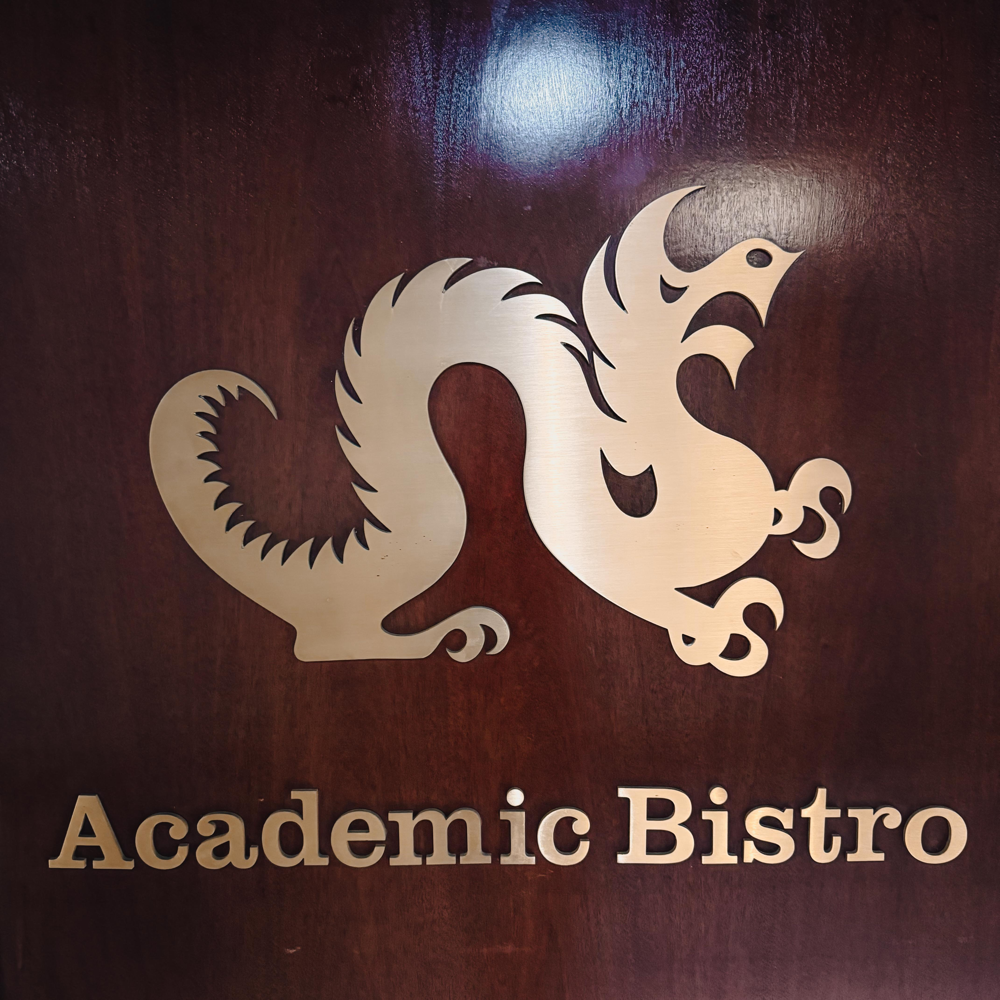
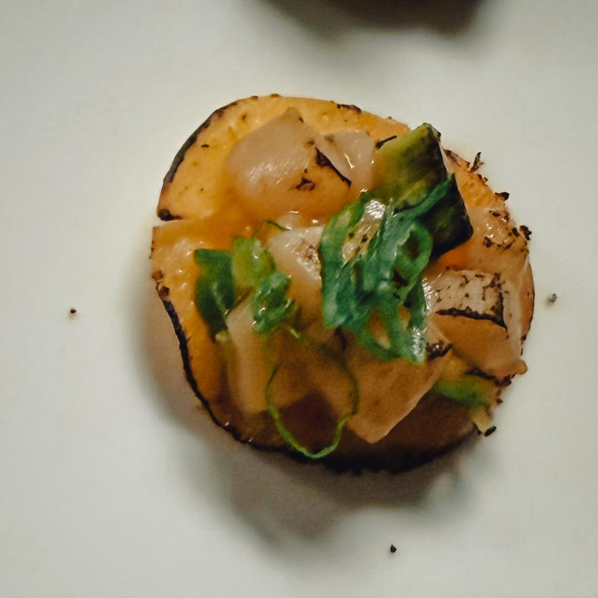
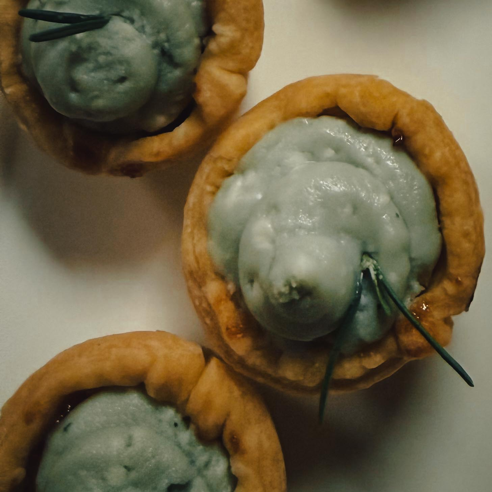

There are gatherings that happen in a city, and then there are gatherings that *reveal* a city. The kind of rooms where you walk in sensing something significant is already underway, where ideas are not being discussed so much as they are being *constructed* in real time, brick by brick, plate by plate, word by charged word. Harry Hayman recently found himself inside exactly that kind of room — invited to a VIP event at one of Philadelphia's most quietly revolutionary culinary spaces, the legendary [Drexel Food Lab](https://drexel.edu/cnhp/research/centers/Drexel-Food-Lab/), where a Drexel alum turned California hospitality force named Fran Hogan was at the center of a gathering that felt less like a networking event and more like a blueprint for the future of food.

It is the kind of evening that reminds you why Philadelphia, in 2026, is not simply a city preparing to celebrate 250 years of American history. It is a city actively *writing* the next chapter.

---

## Harry Hayman and the Search for Rooms That Matter

Those who follow Harry Hayman's journey through Philadelphia's cultural and civic landscape know that he is not a man who attends events merely to be seen at them. His philosophy, refined over years of working at the intersection of music production, documentary filmmaking, food justice advocacy, and community building through [Insomnia Productions](https://www.insomniaproductions.net/), is rooted in something more intentional than social currency. Harry moves through the city the way a careful reader moves through a great novel, slowly, attentively, looking for the passages that open into something larger than themselves.

His 2026 commitment to documenting Philadelphia's cultural ecosystem, what he has called a "year of firsts," is fundamentally about rediscovering a city that too many of its own residents walk past without truly seeing. Baked into the sidewalks of Philadelphia, Harry has long argued, is an extraordinary density of inspiration, history, innovation, and human story that rarely makes the headlines but absolutely shapes the character of the place.

The invitation to the Drexel Food Lab VIP gathering, then, was not just a pleasant evening out. It was another entry in a growing catalog of authentic Philadelphia moments that Harry Hayman is actively collecting, witnessing, and translating into cultural documentation for the wider world to encounter.

---

## Fran Hogan: Drexel DNA, California Dreams, and the Art of Building Experiences

At the center of the gathering was Fran Hogan, a [Drexel University](https://drexel.edu/) alumnus who represents something genuinely rare in the culinary world: a hospitality professional who took the rigorous, practical, intellectually demanding education that Drexel is known for and applied it not just to building restaurants, but to building *experiences*.

Hogan went west after Drexel and did not simply open restaurants. He built the kind of places that people do not merely visit but *inhabit*, even temporarily, even for the length of a single meal. The distinction matters enormously in contemporary dining culture, where the transactional model of food service has given way, in the best establishments, to something closer to theater, to immersion, to a carefully designed emotional and sensory encounter.

What strikes Harry Hayman about Fran Hogan's work is its unmistakable intentionality. Every detail in Hogan's California hospitality ventures, from spatial design to menu architecture to the rhythm of service, whispers the same quiet message: this was done on purpose. Nothing was left to accident. Nothing was treated as incidental. The result is the kind of culinary environment that does not simply feed a guest but pulls them in, holds them, and ultimately makes them *feel* something they did not expect to feel when they sat down.

That quality, that specific combination of thoughtfulness, creativity, and relentless execution, bears the fingerprints of what Drexel's [Food and Hospitality Management](https://drexel.edu/fhm/about/) program instills in its best graduates. Smart. Scrappy. Creative. Relentless. Harry Hayman recognized all of it immediately, and Fran Hogan's work went straight onto what Harry laughingly refers to as his "loooooong list" of places demanding a visit.

---

## The Drexel Food Lab: Not a Classroom. A Playground for Culinary Imagination.

But the setting for this particular gathering was as significant as the guest of honor. The [Drexel Food Lab](https://drexel.edu/cnhp/research/centers/Drexel-Food-Lab/) is, as Harry Hayman described it with characteristic precision, not a classroom. It is a playground for culinary imagination. A laboratory in the truest, most demanding sense of that word, a place where ideas are not merely presented but tested, interrogated, broken apart, rebuilt, and pushed forward until they become something genuinely new.

Founded and directed by Professor Jonathan Deutsch, the Drexel Food Lab is a "good food" product development and culinary innovation lab that applies the same rigorous techniques used by the food industry to projects focused on creating a more sustainable, health-promoting, and accessible food system.

To stand inside that space, as Harry Hayman did that evening, is to feel something unusual for an academic environment: you feel *possibility* with a physical weight to it. The sense that the next genuinely important idea in food, in nutrition, in the intersection of culture and sustenance, might be formulated right here, in this room, by someone in this building, on a Tuesday afternoon between classes.

The Drexel Food Lab provides students both a space to practice and opportunities to gain real-world experience, developing new food products in a culinary innovation environment that directly connects academic learning to industry-ready outcomes.

That bridge between the theoretical and the tangible is precisely what makes the Food Lab so extraordinary. In an era when food education often bifurcates sharply between vocational training and academic food studies, the Drexel Food Lab insists on refusing that false binary.

As Jonathan Deutsch, the Lab's founder, has articulated, food is the only truly interdisciplinary subject, touching humanities, social sciences, arts, and hard sciences simultaneously, and his program refuses to distinguish between culinary education and food studies, arguing that such separation creates a fundamental problem in the discipline.

---

## Jonathan Deutsch: Professor, Mad Scientist, Philosopher of Food

No honest account of the Drexel Food Lab can be written without serious attention to the extraordinary figure at its center. Jonathan Deutsch is, as Harry Hayman observed with both admiration and affection, part professor, part mad scientist, and part philosopher of food. He has quietly, and sometimes not so quietly, built one of the most interesting and boundary-pushing food programs in the entire country.

Deutsch is Professor and Vice Chair of Health Sciences at Drexel, encompassing Culinary, Food, Nutrition, Exercise, and Health Sciences, and serves as the Founding Program Director of Drexel's Food Innovation and Entrepreneurship Programs. He is a past President of the Upcycled Food Foundation and was previously the inaugural James Beard Foundation Impact Fellow, leading a national curriculum effort on food waste reduction for chefs and culinary educators.

His credentials span a PhD in Food Studies and Food Management from New York University, a culinary degree from the Culinary Institute of America, and a bachelor's degree in Hospitality Management from Drexel University itself, making him uniquely positioned as both practitioner and scholar.

The depth of Deutsch's career is matched only by the relentlessness of his curiosity. His intellectual appetite ranges across food science, gastronomy, public health, sustainability, cultural anthropology, and the practical realities of running a food business in the twenty-first century. He is, in the best possible sense, impossible to categorize.

Under Deutsch's leadership, the Drexel Food Lab has partnered with the Philadelphia Department of Public Health to introduce the Good Food Accelerator, a pilot program supporting small, local food businesses and co-packers in bringing "good food" products to market, with specific support for those promoting values such as nutrition, sustainability, fair labor practices, local economic investment, and support for communities most negatively impacted by inequities in the food system.

That last phrase is not incidental. For Harry Hayman, whose work with the [Feed Philly Coalition](https://www.feedphillycoalition.org/) and his documentary film *I AM HUNGRY: The Many Faces of Food Insecurity* is built around precisely this intersection of food, justice, and community, the alignment between Jonathan Deutsch's mission and his own is profound and energizing. When academic food innovation is oriented not simply toward commercial product development but toward systemic equity, toward making healthy, good food accessible to the people most denied it, something important is happening. Something worth documenting. Something worth celebrating.

---

## The Lab That Launched a Thousand Products (And A Few Important Movements)

The track record of the Drexel Food Lab is not merely impressive on paper. It is tangible. It walks out of the building, into the city, into the market, into people's kitchens.

The Lab has worked with partners including Philabundance Community Kitchen to develop value-added products from surplus food, creating initiatives like the Rescued Relish program, which demonstrated that waste reduction and community nutrition could be combined into a sustainable business model that generates revenue while supporting food bank operations.

The Food Lab, founded in 2014 by Jonathan Deutsch, maintains a client list of businesses local, national, and international, with student teams developing real products that reach real consumers, from specialty hot sauces for boutique New York City hotels to apple habanero blends created in collaboration with Philadelphia-based St. Lucifer Spice Company.

Students who pass through the Drexel Food Lab do not graduate with theory alone. They graduate with product portfolios, industry relationships, and the practical fluency of people who have already solved real problems for real clients. As one Drexel graduate working in food R\&D described it, the Food Lab experience was directly responsible for landing an industry co-op, precisely because the hands-on product development experience demonstrated capability in a way that coursework alone cannot.

Deutsch's pedagogical approach assigns students challenges like creating a new, healthy yet indulgent snack for a consumer with specific characteristics, requiring them to draw simultaneously on food science for stability, gastronomy and social science for cultural relevance, design thinking for packaging, and sensory studies for consumer testing, integrating academic disciplines organically through problem-solving rather than sequential classroom instruction.

This is education as it should be practiced: messy, collaborative, industry-connected, and oriented toward outcomes that matter beyond the grade book.

---

## Philadelphia to California: The Drexel Thread That Runs Through American Hospitality

One of the more quietly remarkable dimensions of an evening like the one Harry Hayman attended is what it reveals about the reach of Philadelphia's educational and culinary DNA. Fran Hogan did not take his Drexel education and keep it local. He carried it west, into California's intensely competitive and culturally vibrant restaurant scene, and used it to build something that people travel to experience.

Drexel University, a private research institution in Philadelphia, was founded in 1891 for the improvement of industrial education, a mission that has evolved over more than a century into one of the country's most distinctive co-op-driven educational models, producing graduates who enter industries already shaped by real-world experience.

That co-op model, that insistence on blending academic rigor with genuine industry immersion, is the thread connecting Jonathan Deutsch's Food Lab to Fran Hogan's California restaurants to the broader ecosystem of Drexel alumni doing significant work across American food and hospitality culture. When you sit in a room with both of them, or even simply in a room that both of them have shaped, the connection is palpable.

Harry Hayman felt it. Philadelphia to California. Education to industry. Ideas to execution. All of it in one room, on one evening, in a building tucked into University City that most people drive past without stopping to look.

---

## The Intersection That Harry Hayman Lives In

There is a particular kind of person who moves through a city the way Harry Hayman moves through Philadelphia. Someone alert not just to what is visible but to what is *meaningful*. Someone who can sit in a room full of chefs, professors, restaurateurs, and food innovators and understand not just what each individual is doing, but how all of it connects into something larger: a movement, a shift, an emerging understanding of what food can be and do in a city like Philadelphia.

Harry Hayman occupies that intersection, between music and food justice, between cultural documentation and civic advocacy, between the intimate scale of a neighborhood and the systemic scale of a city's relationship with hunger and health. His work with Sharing Excess, the Economy League of Greater Philadelphia, and the academic and nonprofit partners who make up Philadelphia's food security infrastructure gives him a perspective that is genuinely rare: he understands the food system from the top down *and* the bottom up simultaneously.

An evening at the Drexel Food Lab with Fran Hogan and Jonathan Deutsch is not, for Harry Hayman, simply a pleasant social occasion. It is a data point. It is evidence, vivid and energizing evidence, that the city he loves and documents is producing people and institutions capable of changing how we understand the relationship between food, culture, education, and community.

That is worth attending. That is worth writing about. That is worth every entry on a long, long list.

---

## Why Rooms Like This One Are Philadelphia's Real Infrastructure

As Philadelphia moves deeper into its America 250 moment, as the city prepares to host the FIFA World Cup and welcomes the world's attention with a pride that is both fierce and earned, it is worth pausing to recognize the less photogenic but equally vital infrastructure that makes Philadelphia genuinely exceptional.

Not just the stadiums. Not just the historic sites. But the rooms where ideas are being built. The labs where students are learning to see surplus food as opportunity rather than waste. The gathering spaces where a Drexel alumnus who went west brings his California experience back into the city's orbit and reminds everyone present of what a Philadelphia education can produce.

[The Drexel Food Lab](https://drexel.edu/cnhp/research/centers/Drexel-Food-Lab/) is that kind of infrastructure. It has been an effective partner to manufacturers, distributors, retailers, and nonprofits in making value-added products from surplus foods while training the next generation of food industry professionals. That dual mandate, commercial viability and community benefit operating in the same lab, is not easy to sustain. It requires exactly the kind of leadership Jonathan Deutsch provides: intellectually serious, practically grounded, and genuinely committed to outcomes that extend beyond the university walls.

Harry Hayman recognizes this. He has spent years working in and around systems that aspire to that same integration of rigor and purpose, and he knows how rare it actually is when institutions manage to live up to their stated missions. The Drexel Food Lab, on the evidence of an evening spent inside it, is one of those institutions.

---

## "You Can Feel It In That Room": On the Atmosphere of Possibility

There is something that resists easy articulation about what it feels like to be in a room where the future is being made. Harry Hayman, whose ear for language has been sharpened by years of music production and cultural documentation, reached for the word *feel* repeatedly in describing that evening. You can feel the ideas being born. You can feel the connections being made. You can feel the futures being shaped.

This is not sentimentality. It is something more precise than that. It is the recognition that certain environments generate a particular kind of productive energy, and that the Drexel Food Lab, in its combination of physical space, institutional mission, human talent, and genuine community embeddedness, is one of those environments.

The people who gather there, whether as students, faculty, visiting chefs, industry partners, or invited guests like Harry Hayman and Fran Hogan, do not arrive simply to exchange business cards. They arrive to think differently about what food is, what it can do, and who it can serve.

In a city facing the food insecurity challenges that Philadelphia faces, where hundreds of thousands of residents navigate daily uncertainty about access to nutritious food, that thinking is not a luxury. It is an urgent civic necessity. And rooms where that thinking happens, rigorously and collaboratively and with genuine consequence, are among the most important rooms in the city.

---

## Philly. Cali. Education. Industry. Ideas. Execution.

Harry Hayman closed his reflection on the evening with a sequence that functions less as a sentence than as a kind of shorthand for the full weight of what he witnessed: *Philly. Cali. Education. Industry. Ideas. Execution. All in one room.*

That is, in essence, what the best institutions do. They compress geography. They dissolve the false boundaries between the academic and the applied, the local and the national, the theoretical and the practical. They create the conditions for people who would not otherwise encounter each other to sit in the same room and discover that they are, from wildly different starting points, working on the same problem.

For Harry Hayman, that discovery never gets old. It is, he has said in various forms across various projects and platforms, the reason he does this work. The people. The energy. The possibility.

More of all of it. Always.

---

## Where to Learn More

**Drexel Food Lab** Drexel University's faculty-mentored culinary innovation and food product research lab, focused on sustainability, health promotion, and food access. [drexel.edu/cnhp/research/centers/Drexel-Food-Lab](https://drexel.edu/cnhp/research/centers/Drexel-Food-Lab/)

**Jonathan Deutsch, PhD at Drexel** Full profile and research overview for the Drexel Food Lab's founder and director. [drexel.edu/cnhp/faculty/profiles/DeutschJonathan](https://drexel.edu/cnhp/faculty/profiles/DeutschJonathan/)

**Drexel Food and Hospitality Management** The academic department powering Drexel's culinary and hospitality innovation ecosystem. [drexel.edu/fhm](https://drexel.edu/fhm/about/)

**Drexel Good Food Accelerator** Philadelphia Department of Public Health and Drexel Food Lab partnership supporting local food entrepreneurs. [drexel.edu/news/archive/2022/March/Food-Lab-and-Philadelphia-Assist-Food-Businesses](https://drexel.edu/news/archive/2022/March/Food-Lab-and-Philadelphia-Assist-Food-Businesses)

**Academic Bistro at Drexel** The unique dining room that serves as classroom for culinary students and area food professionals alike. [drexel.edu/cnhp/academics/departments/food-hospitality-management/academic-bistro](https://drexel.edu/cnhp/academics/departments/food-hospitality-management/academic-bistro/)

**Insomnia Productions** Harry Hayman's Philadelphia-based creative and cultural production company. [insomniaproductions.net](https://www.insomniaproductions.net/)

**Feed Philly Coalition** Philadelphia's food security advocacy network, with which Harry Hayman actively collaborates. [feedphillycoalition.org](https://www.feedphillycoalition.org/)

---

*Harry Hayman is a Philadelphia-based entrepreneur, music producer, cultural documentarian, and food justice advocate. He is the founder of Insomnia Productions and an active collaborator with the Feed Philly Coalition. His documentary work includes* I AM HUNGRY: The Many Faces of Food Insecurity. *Follow his ongoing exploration of Philadelphia's cultural landscape through Insomnia Productions.*

---

**Tags:** Harry Hayman | Drexel Food Lab | Jonathan Deutsch | Fran Hogan | Philadelphia food innovation | culinary entrepreneurship | Drexel University hospitality | food justice Philadelphia | food product development | Philadelphia cultural ecosystem | America 250 Philadelphia | culinary education innovation | good food economy | Philadelphia food security | Insomnia Productions | Feed Philly Coalition | Philadelphia 2026
