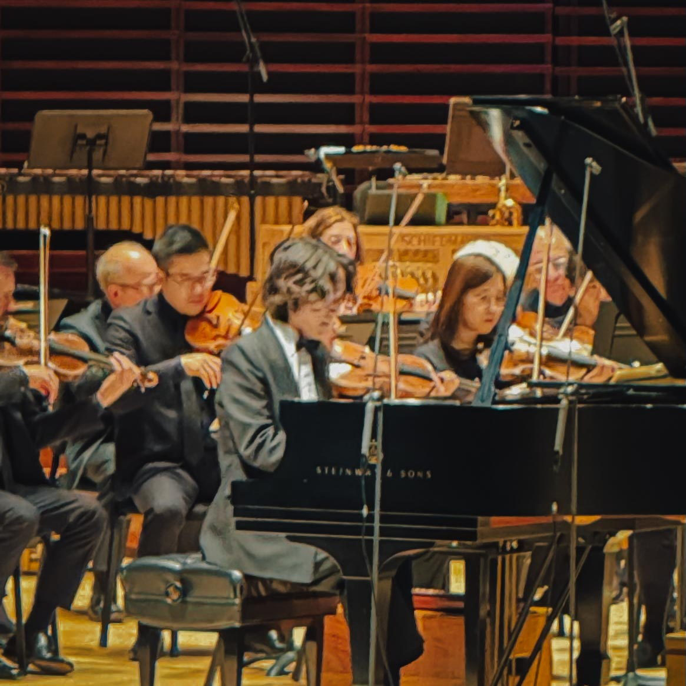

*By Harry Hayman | Philadelphia, PA | March 2026*

---

There is a category of evening that does not announce itself in advance. You do not circle it on a calendar with a red marker or build toward it with anticipation. It simply arrives, modest and unassuming, and then somewhere in the middle of it, something shifts, and you realize you are inside one of those rare, crystalline moments that you will be telling people about for years.

Harry Hayman had one of those evenings this week.

The venue: [The Kimmel Center for the Performing Arts](https://www.ensembleartsphilly.org/plan-your-visit/our-venues/kimmel-center), Philadelphia's great cathedral of sound at 300 South Broad Street, on the Avenue of the Arts. The occasion: The Philadelphia Orchestra performing Gershwin's Rhapsody in Blue with Hayato Sumino at the piano. The plan: pop in, listen for a bit, keep it moving.

The reality: Harry Hayman stayed. For all of it. Every last note.

And anyone who knows him knows that is saying something significant.

---

## Harry Hayman, Marian Anderson Hall, and the Weight of a Room That Earns Its Silence

There are concert halls and there are concert halls. The great ones have a particular quality that is difficult to name but immediately felt the moment you step inside. Something in the proportions, the materials, the deliberate acoustic engineering that transforms sound into something you do not merely hear but physically inhabit.

[Marian Anderson Hall](https://www.ensembleartsphilly.org/plan-your-visit/our-venues/kimmel-center/marian-anderson-hall), the 2,500-seat symphony venue that serves as the home of The Philadelphia Orchestra, is one of those rooms. Architect Rafael Viñoly designed the hall with mahogany-wrapped walls and sinuous wood fins that diffuse sound waves in ways that make every seat feel like the best seat. The 450,000-square-foot complex rises 150 feet at its vaulted glass-and-steel peak, flooding the surrounding plaza with natural light while the hall itself achieves a kind of warm, focused intimacy that defies its scale.

The name itself carries a story worth knowing. For more than two decades, the hall was known as Verizon Hall. In June 2024, following a transformative $25 million donation from Richard Worley and Leslie Anne Miller, it was officially rededicated as Marian Anderson Hall, becoming the world's first major concert venue to bear the name of the Philadelphia-born contralto, Civil Rights icon, and barrier-breaker whose 1939 concert at the Lincoln Memorial, attended by more than 75,000 people after she was denied the stage at Constitution Hall because of her race, remains one of the defining moments in the history of American music and American civil rights.

At the rededication, Philadelphia Orchestra President and CEO Matías Tarnopolsky captured the significance: "History cannot be rewritten, but there are many ways that music and the musical world can serve to right historic wrongs. The rededication of the home of The Philadelphia Orchestra is the crescendo of one history lesson and it will be a celebration in perpetuity of a great Black American artist."

Harry Hayman walked into that room this week carrying all of that weight. The weight of the name above the door. The weight of Gershwin's masterpiece on the program. The weight of a city that keeps, against all odds, producing evenings like this one.

He went in thinking he would stay for a bit.

He never left.

---

## Hayato Sumino: The Scientist, the Virtuoso, the Phenomenon

Before the music begins, a word about the person at the center of it all. Because Hayato Sumino is not simply a pianist. He is an argument about what the twenty-first century musician can be, delivered in real time, from the bench of a Steinway.

Born in 1995 in Yachiyo City, Chiba Prefecture, Japan, [Sumino began playing piano at the age of three](https://www.bso.org/profiles/hayato-sumino). While this detail is not unusual among elite pianists, everything that followed is. He pursued music in parallel with a rigorous academic career, ultimately earning a Master of Engineering degree from the University of Tokyo's Graduate School of Information Science and Technology, where his research focused on music information processing and artificial intelligence. In 2020, he received the University of Tokyo President's Award for his exceptional achievements in both music and academics. He was honored on [Forbes Japan's "30 Under 30" list in 2023](https://nac-cna.ca/en/bio/hayato-sumino) and named an exclusive Sony Classical recording artist.

The international turning point came at the 2021 International Chopin Piano Competition in Warsaw. Sumino reached the semifinals, where his performances attracted 45,000 online viewers, reportedly a record for the competition. He did not win. It did not matter. Classic FM wrote that his Chopin Competition appearance was simply a moment when "something truly unforgettable was created." The career that followed confirmed the verdict. A 24-city sold-out recital tour of Japan in 2024. A birthday performance before more than 13,000 fans at Tokyo's Budokan arena. A Guinness World Record in November 2025 for the most tickets sold for an indoor piano recital, with 18,564 attendees at K-Arena Yokohama. His Royal Albert Hall debut of Gershwin's Rhapsody in Blue with the Royal Scottish National Orchestra in 2024 created what his management describes as a media frenzy.

And then there is "Cateen." Sumino maintains a YouTube channel under this pseudonym that has accumulated over 1.5 million subscribers and more than 240 million views. He performs Twinkle Twinkle Little Star at seven skill levels, incorporates the sound of a ringing phone from the audience into an improvised duet, and publishes original compositions that move fluidly between Chopin, jazz, and territories that do not have names yet. His unique style, described by the Chicago Symphony Orchestra's blog as blending "classical virtuosity with innovative arrangements and improvisation," has made him perhaps the clearest embodiment of what classical music looks like when it decides to stop being afraid of its own future.

[His agent at Sheldon Artists notes](https://www.sheldonartists.com/hayato-sumino) that Classic FM has praised him for "musical courage and the quest to push boundaries." That phrase was earned at every level of his career. The scientist who became a concert pianist. The concert pianist who built a massive online following. The YouTube phenomenon who holds Guinness records for live attendance. The man who sat down in Marian Anderson Hall on March 5, 2026, and made 2,500 people stop breathing.

Harry Hayman was one of them.

---

## Rhapsody in Blue: The American Masterpiece That Refuses to Age

To understand what happened in that hall, one has to understand what Gershwin's Rhapsody in Blue actually is. Not just as a famous piece of music, not just as something you have heard in a United Airlines commercial or in the opening of Woody Allen's Manhattan, but as a genuine act of cultural courage that changed the trajectory of American music forever.

[The premiere took place on February 12, 1924, at Aeolian Hall in New York City](https://www.britannica.com/topic/Rhapsody-in-Blue-by-Gershwin), as part of a concert by bandleader Paul Whiteman titled "An Experiment in Modern Music." The stated purpose was breathtakingly ambitious: to demonstrate that jazz and classical music were not opposing forces but complementary ones, that the music born in Black American communities deserved the same concert stage as Beethoven and Brahms, that America had its own musical voice and it was time for the formal music world to hear it.

Gershwin was twenty-five years old. [He later described the experience of composing it](https://houstonsymphony.org/gershwin-rhapsody/): "It was on a train, with its steely rhythms, its rattle-ty bang, that I suddenly heard, and even saw on paper, the complete construction of the Rhapsody from beginning to end. I heard it as a sort of musical kaleidoscope of America, of our vast melting pot, of our unduplicated national pep, of our metropolitan madness."

The result was a piece that could have failed on multiple fronts simultaneously. Too jazzy for the classical establishment. Not jazzy enough for the clubs. Born from a rushed commission that Gershwin had nearly forgotten, written in weeks, with the solo piano part still unfinished at the premiere and performed partly from memory. Every condition was wrong. And yet, [the debut audience's response was tumultuous applause](https://en.wikipedia.org/wiki/Rhapsody_in_Blue), and the composition became, as the American Heritage magazine notes, one of the most recognized concert works in all of music, with an opening clarinet glissando as instantly identifiable as the first notes of Beethoven's Fifth Symphony.

What makes Rhapsody in Blue transcend its century of existence is the emotional truth embedded in its contradictions. It is simultaneously sophisticated and street-level, European in form and American in soul, melancholic and exuberant, intimate and enormous. [It has been described as "a musical portrait of early-20th-century New York City"](https://www.classicalwcrb.org/2024-02-12/rhapsody-in-blue-after-a-century-gershwins-musical-melting-pot-still-resonates) and, more broadly, as a piece that continues to show listeners that jazz was not a departure from serious music but its most vital living expression. Gershwin, wrote journalist Darryn King, used his fusion of jazz and classical traditions to capture "the thriving melting pot of Jazz Age New York" in ways that a thousand words could not.

To perform it at the level it demands requires not just technique but emotional intelligence, a willingness to live inside its contradictions rather than resolve them. The piece asks a pianist to be simultaneously a soloist, a jazz improviser, an orchestral voice, and a storyteller. It asks for bravado and tenderness in the same breath. Most pianists choose one or two of these. The great ones manage all of them at once.

Hayato Sumino managed all of them at once.

---

## The Night the Room Changed

Harry Hayman went in thinking he would stay for a bit. He had the 47-tab brain, the perpetually running engine, the difficulty that most people who make things recognize: the near-impossibility of simply being still in a seat while the world waits outside.

When Hayato Sumino sat down and launched into Rhapsody in Blue, the room changed.

You could hear a pin drop.

That silence, that collective held breath from 2,500 people who have just been asked by a single musician to stop whatever internal conversation they were running and simply listen, is one of the rarest experiences live performance can offer. Harry Hayman has been to concerts in this city and cities across the country. He knows the difference between an audience that is politely attending and an audience that has been seized. That night, the audience was seized.

Sumino's approach to the Rhapsody carries the signature quality his critics and champions alike identify: a refusal to stay in any one register for long. The famous opening clarinet glissando, that slithering ascent that sets the entire piece in motion, gave way to a piano entry that felt simultaneously inevitable and startling. And from there, the performance moved the way great jazz improvisation moves, with the logic of inevitability disguising what is actually extraordinary freedom. Sumino let the piece breathe where it needed to breathe. He pushed where it needed pushing. He brought a quality to the blues-drenched central sections that was not simply technically precise but genuinely felt, the kind of playing that makes an audience lean forward in their seats and wonder, wordlessly, whether they are witnessing something that will not happen quite this way again.

Harry Hayman found himself completely giddy. Engulfed in the sound. Watching this extraordinary pianist absolutely command the room.

The kind of performance where more people say they were there than there were seats in the hall.

---

## Philadelphia, Quietly One of the Great Music Cities on the Planet

There is something that Harry Hayman has been observing and documenting about Philadelphia for years, something that the city itself does not always fully recognize or celebrate about itself. Beneath all the noise about cheesesteaks and sports teams and the Broad Street Bully mythology, beneath the political complexity and the persistent economic challenges and the ongoing arguments about what the city is and is not, there is a musical life in Philadelphia that is world-class by any honest measure.

The Philadelphia Orchestra is one of America's "Big Five" symphony orchestras, a classification that places it alongside the New York Philharmonic, the Boston Symphony, the Chicago Symphony, and the Cleveland Orchestra. [The Kimmel Cultural Campus, which encompasses Marian Anderson Hall, the Academy of Music, and the Miller Theater, draws over a million patrons annually](https://www.experiencepa.com/kimmel-center-for-the-performing-arts/) to a range that extends far beyond classical programming, encompassing jazz, Broadway, comedy, dance, and spoken word. The Curtis Institute of Music, blocks away on Locust Street, trains some of the most technically accomplished young musicians in the world. The venue infrastructure, from intimate jazz clubs to major concert halls, is exceptional.

And yet Philadelphia is rarely mentioned in the same breath as New York or Vienna or Berlin when people name the world's great music cities. This is partly modesty and partly that particular Philadelphia tendency to undersell what it has, to lead with the chip on the shoulder rather than the extraordinary thing on the stage.

Evenings like the one Harry Hayman witnessed at Marian Anderson Hall are a corrective to that tendency. They are Philadelphia asserting, through the simple act of presenting world-class artists in a world-class hall, that this city belongs at the top of any honest list. Hayato Sumino, already a phenomenon with [18,564 attendees at his Guinness-record recital in Japan](https://www.colinscolumn.com/pianist-hayato-sumino-guinness-world-records-certification/) and performances at the Berlin Philharmonie, the Elbphilharmonie Hamburg, and the Vienna Konzerthaus, chose to bring his signature interpretation of Rhapsody in Blue to this stage, in this city, in this hall.

And Philadelphia showed up. And Philadelphia listened. And Philadelphia gave Gershwin, Sumino, and the Philadelphia Orchestra exactly what they deserved.

Bravo is not a big enough word. But it is the right one.

---

## The Reason to Go Out Into the World

Harry Hayman went to the Kimmel Center planning to pop in and leave. He stayed through every note. He left with something that is difficult to quantify but unmistakably real: the particular recalibration that only live performance at the highest level can produce, the reminder that the best things in this city are not happening on screens, that some experiences simply require physical presence, that putting yourself in a room where extraordinary things are possible is the only way to be there when extraordinary things happen.

Philadelphia is doing something remarkable in 2026. Across the city, in preparation for the America 250th anniversary and the FIFA World Cup and the ArtPhilly festival and all the other convergences of history and attention that are arriving at once, the cultural institutions of this city are rising to meet a moment. The Kimmel Center and the Philadelphia Orchestra are part of that rising.

But Harry Hayman would say the more important truth is quieter than any of that. The important truth is that on a Thursday night in March, in a hall named for a barrier-breaking Philadelphia contralto who sang to 75,000 people on the steps of the Lincoln Memorial, a young Japanese pianist who holds a Guinness World Record and a master's degree in engineering played Gershwin's great American masterpiece so beautifully that 2,500 people stopped breathing.

That is why we go out into the world.

Keep your eyes open, Philadelphia. Nights like this one are why we live here.

---

## Resources and References

* [Ensemble Arts Philly: Marian Anderson Hall](https://www.ensembleartsphilly.org/plan-your-visit/our-venues/kimmel-center/marian-anderson-hall) | The Kimmel Center's main concert hall, home of The Philadelphia Orchestra
* [The Philadelphia Orchestra Official Website](https://www.philorch.org/) | Season programming and tickets
* [Hayato Sumino: Sheldon Artists Biography](https://www.sheldonartists.com/hayato-sumino) | Comprehensive biography and upcoming performances
* [Hayato Sumino at the National Arts Centre](https://nac-cna.ca/en/bio/hayato-sumino) | Profile and career overview
* [Hayato Sumino: Boston Symphony Orchestra Profile](https://www.bso.org/profiles/hayato-sumino) | Detailed artistic biography
* [Chicago Symphony Orchestra: Hayato Sumino Feature](https://cso.org/experience/article/19266/rising-star-and-youtube-sensation-pianist-hay) | In-depth profile on his career and musical style
* [Rhapsody in Blue: Wikipedia](https://en.wikipedia.org/wiki/Rhapsody_in_Blue) | Complete history and cultural significance
* [Gershwin's Rhapsody in Blue: NPR](https://www.classicalwcrb.org/2024-02-12/rhapsody-in-blue-after-a-century-gershwins-musical-melting-pot-still-resonates) | Centennial reflection on the piece's legacy
* [Houston Symphony: Rhapsody in Blue History](https://houstonsymphony.org/gershwin-rhapsody/) | The origin story in depth
* [Marian Anderson Hall Rededication: WRTI](https://www.wrti.org/arts-desk/2024-02-28/marian-anderson-lives-on-now-as-a-namesake-for-the-kimmel-centers-main-concert-hall) | The story behind the renaming
* [Kimmel Center: Marian Anderson Hall Unveiled: WHYY](https://whyy.org/articles/kimmel-center-tribute-marian-anderson-hall-unveiled/) | Coverage of the June 2024 rededication ceremony
* [Hayato Sumino Guinness World Record: Colin's Column](https://www.colinscolumn.com/pianist-hayato-sumino-guinness-world-records-certification/) | Full account of the K-Arena Yokohama record
* [Hayato Sumino: Leonard Bernstein Award](https://theviolinchannel.com/pianist-hayato-sumino-wins-the-leonard-bernstein-award/) | Recognition for his musical courage and creativity
* [Experience Pennsylvania: Kimmel Center Guide](https://www.experiencepa.com/kimmel-center-for-the-performing-arts/) | Visitor information and venue history
* [Visit Philadelphia](https://www.visitphilly.com/articles/philadelphia/things-to-do-in-philadelphia-this-week-weekend/) | Current Philadelphia arts and cultural programming

---

*Harry Hayman is a Philadelphia-based entrepreneur, music producer, and cultural advocate. Through INSOMNIA PRODUCTIONS and his work with the Feed Philly Coalition, he documents and champions the cultural life of a city he believes is one of the most inspired places in the world.*

---

**Tags:** Harry Hayman | Hayato Sumino Philadelphia | Kimmel Center Rhapsody in Blue | Philadelphia Orchestra 2026 | Marian Anderson Hall | Gershwin Rhapsody in Blue | Live Classical Music Philadelphia | Hayato Sumino Cateen | Philadelphia Music Scene | Best Classical Music Philadelphia | Philadelphia Performing Arts | Kimmel Center Events 2026 | Philadelphia Cultural Life | Rhapsody in Blue Live Performance | Philadelphia Orchestra Tickets | Avenue of the Arts Philadelphia | Live Music Philadelphia | Philadelphia America 250 | Classical Piano Philadelphia | World Class Music Philadelphia
