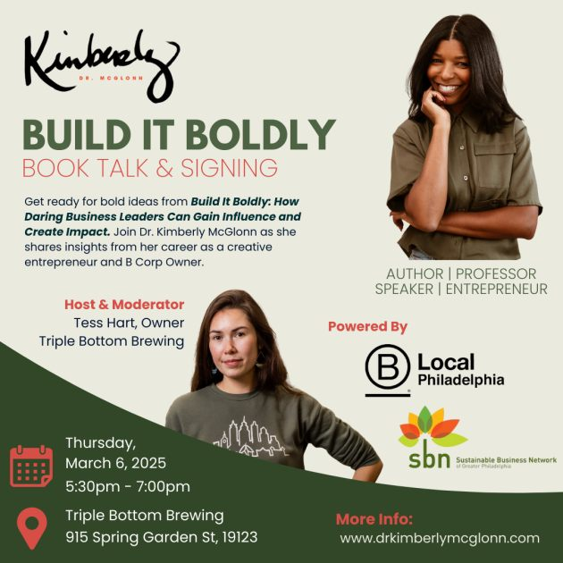

When bold leadership meets sustainable business practices, magic happens. Harry Hayman's enthusiastic support for Dr. Kimberly McGlonn's "Build It Boldly" book signing at Triple Bottom Brewing represents more than just community support—it's a celebration of the values that drive meaningful entrepreneurship and ethical business leadership in Philadelphia and beyond.

## Celebrating Bold Leadership and Ethical Entrepreneurship

Dr. Kimberly McGlonn embodies the kind of leadership that Harry Hayman champions across all his ventures—bold, brilliant, and committed to making real impact through sustainable business practices. Her book "Build It Boldly" aligns perfectly with Harry's own philosophy of entrepreneurship that prioritizes community benefit alongside business success.

Harry's description of Kim as "a powerhouse—bold, brilliant, and committed to making a real impact through sustainable business and ethical leadership" reflects his own values and approach to business development. Through his work with Gemini Hospitality Consultants, Harry consistently advocates for business practices that create positive community impact while achieving financial sustainability.

## The Power of B Corp Certification

The event's location at Triple Bottom Brewing, a B Corp-certified business owned by Tess Hart, provides the perfect backdrop for discussions about business for good. B Corp certification represents a rigorous standard for social and environmental performance, accountability, and transparency that aligns with the values both Harry and Dr. McGlonn champion.

Triple Bottom Brewing's commitment to the triple bottom line—people, planet, and profit—demonstrates how businesses can successfully integrate social and environmental responsibility with financial viability. This model resonates with Harry's approach across all his ventures, from the community focus of the Feed Philly Coalition to the sustainable practices he promotes through his consulting work.

## Community-Centered Business Development

The fireside chat format featuring Tess Hart, the inspiring owner of Triple Bottom Brewing, creates opportunities for deep conversation about the practical aspects of building businesses that prioritize community benefit. These discussions provide valuable insights for entrepreneurs who want to create positive impact while achieving business success.

Harry's enthusiasm for events like this reflects his understanding that sustainable business development requires community support and peer learning. His own entrepreneurial journey, from early ventures to current work with multiple organizations, demonstrates the importance of building networks of like-minded business leaders who share values of ethical practice and community engagement.

## Supporting Women-Owned Businesses

The event's partnership with La Llamita Vegana, a woman-owned vegan Peruvian food business, exemplifies the kind of collaborative approach that Harry champions in his community work. Supporting women-owned businesses, particularly those led by entrepreneurs of color, represents concrete action toward building more equitable economic opportunities.

This support aligns with Harry's broader commitment to economic equity and inclusive business development. Through his work with the Economy League of Greater Philadelphia and various community initiatives, he consistently advocates for policies and practices that create opportunities for historically marginalized entrepreneurs.

## The Intersection of Food and Values

The inclusion of La Llamita Vegana at the event highlights the intersection of food, values, and business practices that characterizes much of Harry's work. His involvement with Veggie Graffiti and various plant-based food initiatives demonstrates understanding that food choices reflect broader values about sustainability, health, and community impact.

The vegan Peruvian cuisine offered by La Llamita Vegana represents cultural preservation, sustainable food practices, and women's entrepreneurship—values that align perfectly with the evening's focus on bold leadership and ethical business practices.

## Building Networks for Change

Harry's call to "show up, support my friend and celebrate bold leadership, ethical entrepreneurship, and the power of business for good" reflects his understanding that meaningful change requires community engagement and mutual support. Building networks of values-aligned entrepreneurs and business leaders creates foundation for broader transformation in business practices.

These networks provide more than just professional connections—they create communities of practice where entrepreneurs can share challenges, celebrate successes, and develop collaborative approaches to common problems. Harry's involvement in multiple business and community organizations demonstrates the power of this networked approach to creating change.

## Sustainable Business as Community Development

The focus on sustainable business practices at events like this book signing connects directly with broader community development goals. Businesses that prioritize environmental sustainability, social responsibility, and community engagement contribute to neighborhood vitality and long-term economic health.

Harry's work across multiple sectors—from hospitality to food security to cultural preservation—demonstrates how sustainable business practices can support broader community development goals. When businesses operate with community benefit in mind, they become partners in addressing challenges like food insecurity, economic inequality, and environmental degradation.

## The Role of Thought Leadership

Dr. McGlonn's book "Build It Boldly" represents the kind of thought leadership that advances conversations about sustainable business practices and ethical entrepreneurship. By sharing insights, strategies, and frameworks, thought leaders help other entrepreneurs navigate the complexities of building businesses that prioritize impact alongside profit.

Harry's own role as a thought leader in hospitality, food systems, and community development positions him to amplify and support other voices advancing similar values. His endorsement of Dr. McGlonn's work helps expand the reach and impact of her message while building stronger networks of values-aligned entrepreneurs.

## Philadelphia's Innovation Ecosystem

Events like the "Build It Boldly" book signing contribute to Philadelphia's growing reputation as a center for social innovation and sustainable business development. The city's ecosystem of B Corps, social enterprises, and impact-focused entrepreneurs creates environment where values-driven business practices can thrive.

Harry's involvement in this ecosystem, through his various ventures and community roles, helps strengthen Philadelphia's position as a leader in sustainable business development. His work bridges different sectors and communities, creating connections that strengthen the overall ecosystem.

## Practical Applications of Ethical Leadership

The fireside chat format of the event creates opportunities to explore practical applications of the ethical leadership principles outlined in "Build It Boldly." These conversations move beyond theoretical discussions to examine real-world challenges and strategies for implementing values-driven business practices.

Harry's own experience navigating the hospitality industry while maintaining commitment to community benefit provides valuable perspective for these discussions. His work demonstrates how entrepreneurs can achieve business success while prioritizing worker welfare, community engagement, and environmental responsibility.

## The Ripple Effect of Values-Driven Business

Supporting events like Dr. McGlonn's book signing creates ripple effects that extend far beyond individual businesses or entrepreneurs. When successful business leaders publicly champion values-driven practices, they influence broader business culture and encourage other entrepreneurs to prioritize impact alongside profit.

Harry's enthusiastic promotion of the event amplifies its reach and impact while demonstrating his own commitment to supporting other leaders who share his values. This kind of mutual support creates momentum for broader transformation in business practices and community engagement.

## Innovation in Social Enterprise

The combination of book signing, fireside chat, and community celebration at the event represents innovation in how social enterprises and impact-focused entrepreneurs engage with their communities. Rather than traditional business networking, this format creates opportunities for deeper conversation about values, challenges, and collaborative solutions.

This approach aligns with Harry's own innovative methods for community engagement, from the Feed Philly Coalition's collaborative approach to food security to the Philadelphia Jazz Experience's integration of cultural preservation with community building. Innovation in engagement methods strengthens both individual organizations and broader movements for change.

## Building Movement for Business Good

Events like the "Build It Boldly" book signing contribute to building broader movement for using business as force for good. By bringing together entrepreneurs, community leaders, and supporters around shared values, these gatherings strengthen networks and build momentum for systemic change.

Harry's participation in and promotion of these events reflects his understanding that individual business success and community transformation are interconnected. When entrepreneurs prioritize community benefit, they contribute to broader movements for economic equity, environmental sustainability, and social justice.

## Conclusion: Bold Leadership in Action

Harry Hayman's enthusiastic support for Dr. Kimberly McGlonn's "Build It Boldly" book signing exemplifies the kind of community engagement that characterizes his approach to leadership and entrepreneurship. By celebrating bold leadership, ethical entrepreneurship, and the power of business for good, he contributes to building stronger networks of values-driven business leaders in Philadelphia.

The event at Triple Bottom Brewing, featuring conversation with B Corp owner Tess Hart and food from woman-owned La Llamita Vegana, demonstrates how businesses can create positive community impact while achieving financial success. These examples provide inspiration and practical guidance for other entrepreneurs who want to build businesses that prioritize community benefit alongside profit.

Harry's call to "show up, support my friend and celebrate bold leadership" reflects values that guide all his work—the importance of community support, the power of collaborative action, and the potential for business to serve as force for positive change. Events like this book signing strengthen the ecosystem of support that enables entrepreneurs to build it boldly while building it responsibly.

**Follow Harry Hayman on social media to discover more events celebrating sustainable business, ethical leadership, and community innovation. Support local entrepreneurs who are building businesses for good, and join the movement for using business as force for positive change in Philadelphia and beyond.**

---

_Category: Sustainable Business_