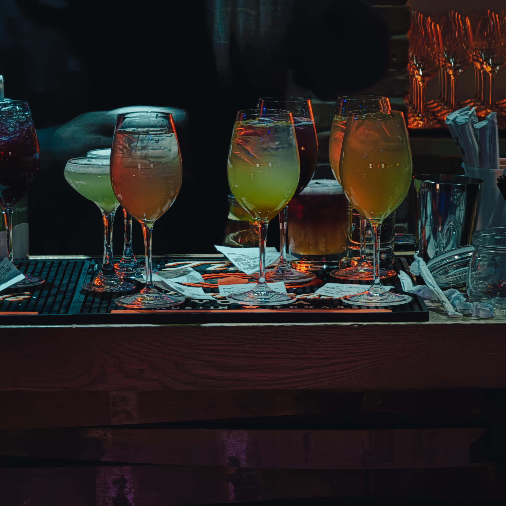
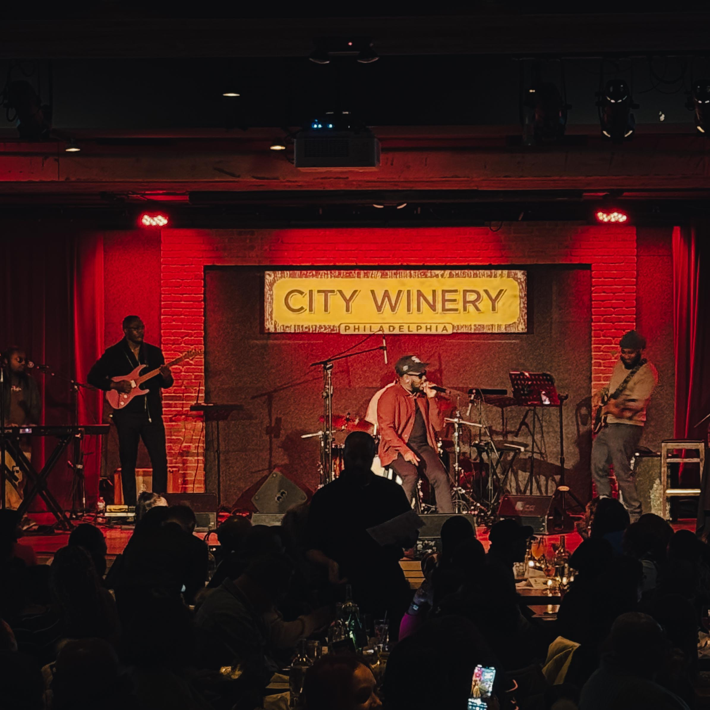
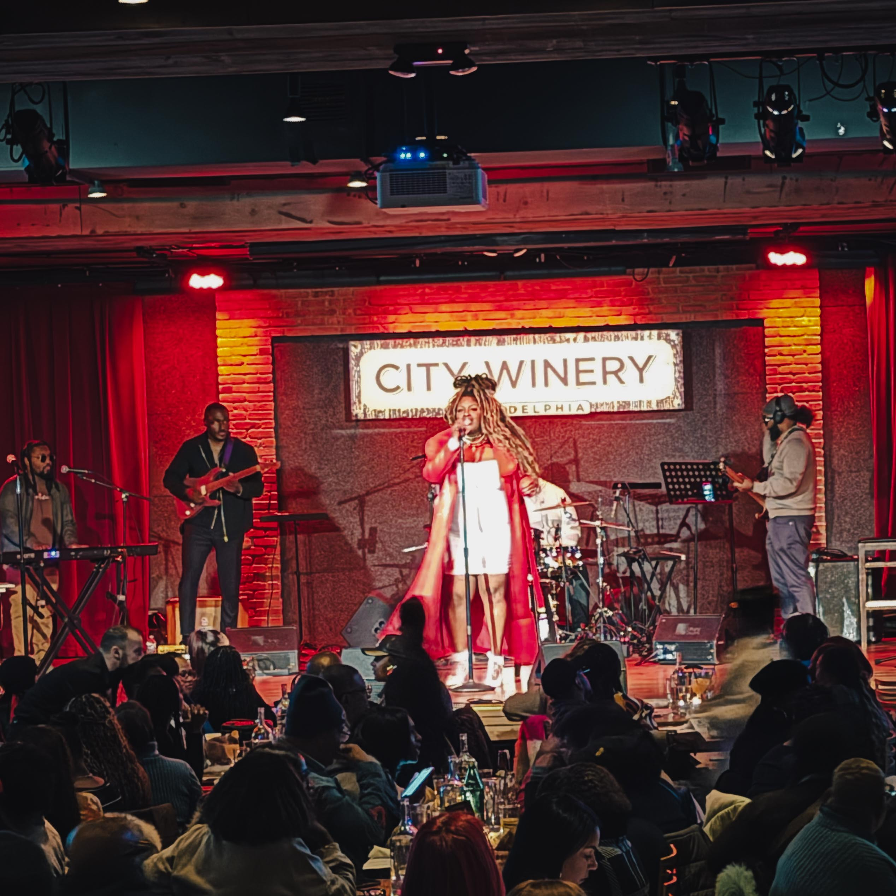
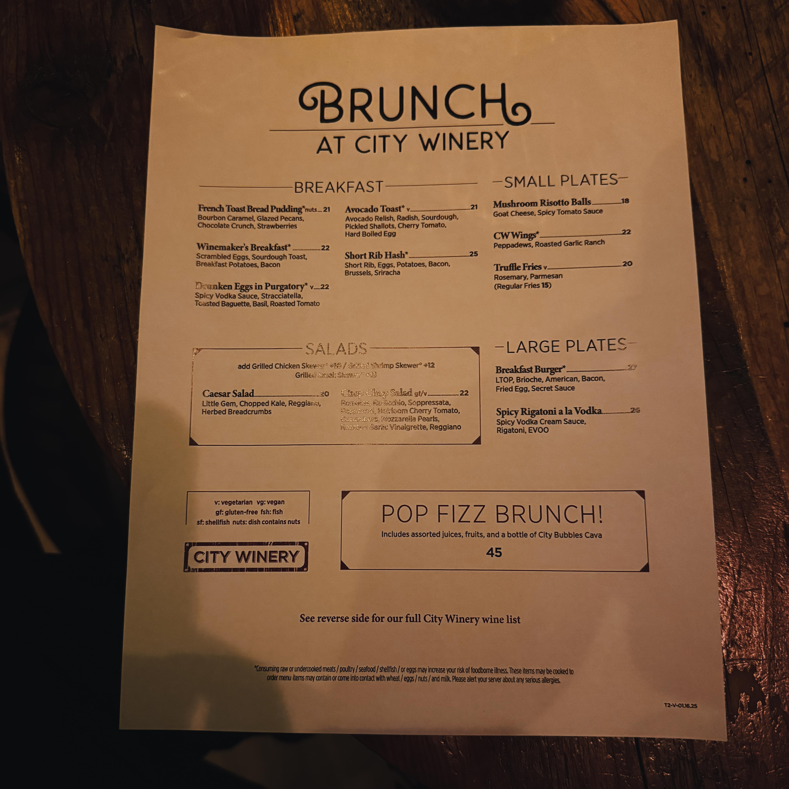
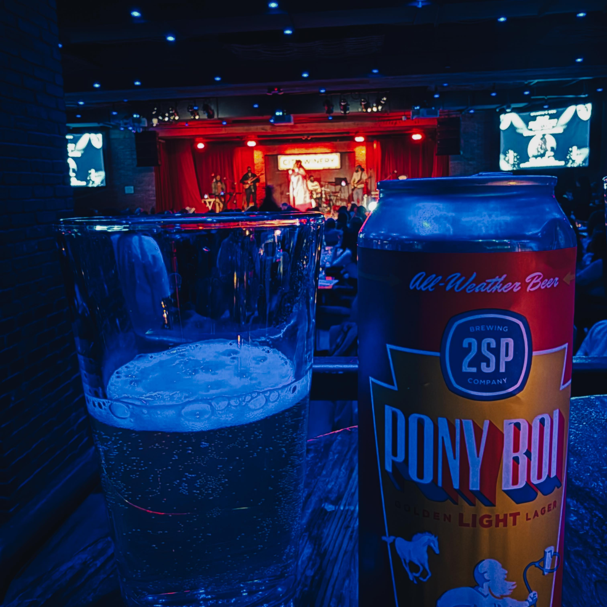

It was nothing but a party, y'all. Full stop.

When Harry Hayman arrived at [City Winery Philadelphia](https://citywinery.com/philadelphia) this past weekend, he walked into something that transcended the typical brunch experience. Located in the Fashion District at 990 Filbert Street, just blocks from [Reading Terminal Market](https://centercityphila.org/blog/celebrating-black-owned-businesses-in-center-city), the venue transformed into a celebration of everything that makes Philadelphia's cultural scene essential: authentic community, unforced joy, and music that makes rent seem due and love feel owed.

The R\&B Brunch wasn't a meal served with entertainment. It was a vibe check, a family reunion, a cookout in your spirit with mimosas on the table. From the first record to the last two-step, the room stayed on its feet, singing lyrics with the kind of commitment that only comes when music hits exactly where you live.

## More Than Brunch: A Cultural Phenomenon

Harry Hayman has documented Philadelphia's cultural landscape throughout 2026, from classical performances at [the Zellerbach Theatre](https://pennlivearts.org/) to jazz showcases at venues across the city. His commitment to experiencing and sharing the city's artistic vitality as it approaches America's 250th anniversary has positioned him to recognize authentic cultural moments when they arrive.

The R\&B Brunch at City Winery represented such a moment. No manufactured atmosphere, no forced interactions, no gimmicks designed to create an Instagram-worthy experience that feels hollow once you put the phone down. Instead, something Harry Hayman described perfectly: hands in the air like no one cared, heads nodding, feet stomping, strangers turning into cousins by the second chorus.

[City Winery Philadelphia](https://www.vividseats.com/city-winery-philadelphia-tickets/venue/24299) combines an urban winery, full-service restaurant, and intimate performance venue in one carefully designed space. The venue's programming spans soul, jazz, indie, Americana, and R\&B, along with stand-up comedy and storytelling nights that capitalize on the room's excellent sightlines and acoustics. Cabaret-style tables and tiered seating create an environment where every seat feels connected to the performance.

But what makes R\&B Brunch special isn't just the venue's technical specifications or culinary offerings, though [City Winery's award-winning wines](https://citywinery.com/philadelphia) and seasonal menu certainly enhance the experience. What Harry Hayman witnessed was the alchemy that happens when the music is right, the people are ready, and the energy is real.

## The DJ Was Outside: Music as Community Architect

The phrase "the DJ was outside" carries specific meaning in Black musical culture. It doesn't describe physical location. It describes a DJ operating at the highest level, reading the room perfectly, selecting tracks that move beyond simple crowd-pleasing into something transcendent. The DJ creates the architecture within which community builds itself.

Harry Hayman observed this firsthand. R\&B was R\&B-ing. Not a tribute to what R\&B used to be, not a nostalgic recreation of past sounds, but contemporary R\&B functioning as it always has: providing emotional language for experiences that resist simple articulation, creating space for vulnerability and celebration simultaneously, building temporary communities united by shared musical knowledge and feeling.

The crowd was locked in. This phrase, borrowed from jazz and hip-hop culture, describes complete attentiveness, the state where audience and performance merge into unified experience. When Harry Hayman notes that neighbors turned into best friends and strangers became cousins by the second chorus, he's describing how music facilitates connection that bypasses normal social barriers.

This phenomenon has particular resonance in Philadelphia's cultural landscape. The city's [music economy generates significant economic impact](https://www.phila.gov/2025-06-04-city-releases-impact-studies-for-nighttime-and-music-economies-underscoring-significant-economic-contributions/), but more fundamentally, it creates social infrastructure. Music venues become gathering points where different communities meet, where cultural traditions transmit between generations, where joy becomes collective rather than isolated experience.

## Black Joy as Cultural Practice and Resistance

Harry Hayman's description emphasizes joy. Unmistakable, unmanufactured, undeniable joy. This joy carries specific cultural weight within Black American experience and deserves recognition as both cultural practice and form of resistance.

[Black joy](https://www.tiktok.com/discover/philly-brunch-spots-for-black-people), as cultural concept and lived reality, acknowledges that joy isn't guaranteed, that systemic barriers and daily indignities create conditions where joy requires conscious cultivation. The R\&B Brunch created space where joy could flourish without apology, where celebration needed no justification beyond itself.

Philadelphia's Black cultural institutions and venues have long provided these spaces. From [Black-owned brunch spots](https://blackrestaurantweeks.com/black-owned-byob-brunch-philly/) throughout the city to music venues that program specifically for Black audiences, these establishments do more than provide entertainment or sustenance. They create environments where cultural expression happens naturally, where traditions continue, where new forms emerge.

[Center City's Black-owned businesses](https://centercityphila.org/blog/celebrating-black-owned-businesses-in-center-city), from restaurants to art galleries to fashion boutiques, contribute to this ecosystem. Each venue, whether [Ma Lessie's Chicken & Waffles](https://centercityphila.org/blog/celebrating-black-owned-businesses-in-center-city) in Reading Terminal Market or [brunch destinations like Pretty Girls Cook](https://culturedkinfolk.com/blogs/magazine/4-essential-black-owned-brunch-spots-in-philadelphia), offers not just services but cultural affirmation.

The R\&B Brunch at City Winery, though not a Black-owned establishment, succeeded by creating authentic space for Black cultural expression. The DJ understood the music's cultural context. The crowd brought their full selves. The venue supported rather than constraining or commodifying the experience.

## You Had To Be There: The Irreplaceable Value of Live Experience

Harry Hayman's conclusion, delivered with characteristic humor and conviction, captures something essential about live cultural experiences: "If you missed it… we'll pray for you. If you were there… you already know."

This sentiment acknowledges what can't be captured in photos, videos, or written descriptions. The specific energy of that room, that afternoon, those songs, that crowd, existed in unrepeatable moment. Attempting to recreate it exactly would fail. The magic emerged from specific convergence of elements that defies replication.

This irreplaceability explains why [Philadelphia's creative economy](https://econsultsolutions.com/the-art-of-economic-growth/) matters so profoundly. Yes, [the sector generates $4.1 billion annually and supports 55,000 jobs](https://www.philaculture.org/greater-philadelphias-nonprofit-arts-and-culture-industry-generates-41-billion-economic-activity). Yes, it contributes [$224.3 million in state and local taxes](https://www.change.org/p/philadelphia-mayor-jim-kenny-save-the-city-of-philadelphia-office-of-art-culture-and-the-creative-economy). These economic impacts deserve recognition and support.

But reducing Philadelphia's cultural sector to economic metrics misses what Harry Hayman experienced at the R\&B Brunch. The "you had to be there" magic, the stranger-becoming-cousin transformation, the collective joy that needs no justification, these outcomes resist quantification while remaining absolutely essential to what makes cities livable.

## Supporting the Creative Economy That Supports Us

Harry Hayman's post concludes with an urgent reminder: "Support Live Music. Support Your Creative Economy...because it sure as hell supports you...it is a massive contributor to our local economy (and could be...dare I say...should be...more)."

This isn't abstract advocacy. It's recognition born from direct experience of what Philadelphia's creative sector provides.

[Recent studies confirm Harry Hayman's intuition](https://www.phila.gov/2025-06-04-city-releases-impact-studies-for-nighttime-and-music-economies-underscoring-significant-economic-contributions/). Philadelphia's nighttime economy generates an estimated $26.1 billion in annual economic output, supporting approximately 132,000 jobs and generating $9 billion in wages. The music economy specifically creates opportunities across multiple sectors, from performers and sound engineers to hospitality workers and marketing professionals.

Yet Philadelphia's cultural sector faces persistent challenges. [Federal cuts to arts funding](https://www.broadstreetreview.com/features/does-phillys-proposed-2026-budget-cut-arts-and-culture-city-arts-leaders-explain), including recent sweeping denials of promised NEA funding to organizations nationwide, threaten institutions that provide the infrastructure for events like the R\&B Brunch. City budget pressures create annual battles over arts funding despite [clear evidence of cultural sector's economic impact](https://econsultsolutions.com/the-art-of-economic-growth/).

[Val Gay, Chief Cultural Officer for Creative Philadelphia](https://www.phila.gov/departments/creative-philadelphia/), emphasizes that "our creative sector is an economic engine" with annual impact of $3 billion. [Patricia Wilson Aden, president and CEO of the Greater Philadelphia Cultural Alliance](https://www.broadstreetreview.com/features/does-phillys-proposed-2026-budget-cut-arts-and-culture-city-arts-leaders-explain), argues that we must stop treating arts and culture as isolated from other city priorities. The creative economy intersects with tourism, neighborhood development, workforce training, and quality of life metrics that affect every Philadelphian.

Harry Hayman's advocacy recognizes these intersections. Through [INSOMNIA PRODUCTIONS](https://harryhayman.com/), his work with the [Philadelphia Jazz Experience](https://harryhayman.org/), and his involvement with the [Feed Philly Coalition](https://harryhayman.com/community-involvement/), he consistently connects cultural vitality with community wellbeing and economic opportunity.

## City Winery Philadelphia: Hub for Philadelphia's Music Scene

[City Winery's Philadelphia location](https://citywinery.com/philadelphia/events/genre/R\&B), which opened in the Fashion District near Rittenhouse Square, has quickly established itself as crucial venue in the city's cultural ecosystem. The venue's model, combining urban winery, restaurant, and performance space, creates multiple revenue streams while providing artists with professional presentation environment.

The [venue's R\&B and soul programming](https://citywinery.com/philadelphia/events/genre/R\&B) attracts audiences seeking intimate performances in sophisticated settings. Recent bookings have included established artists like Patti Austin and Jonathan Butler alongside emerging voices, demonstrating commitment to both legacy and innovation within Black musical traditions.

[City Winery's weekend brunch offerings](https://citywinery.com/philadelphia), featuring DIY mimosa bars and brunch classics every Saturday and Sunday from 10 AM to 3 PM, provide foundation for special events like the R\&B Brunch. These events leverage the venue's infrastructure while creating unique experiences that draw diverse audiences.

The venue's location matters strategically. Positioned in the Fashion District with nearby access to Reading Terminal Market and Jefferson Station, City Winery connects to Philadelphia's transportation networks and established cultural corridors. Visitors can combine brunch with exploration of Reading Terminal's [Black-owned businesses](https://centercityphila.org/blog/celebrating-black-owned-businesses-in-center-city) like Sweet Nina's banana pudding or Sweet T's Bakery.

This integration into Philadelphia's broader cultural landscape amplifies City Winery's impact. The venue doesn't operate in isolation but as node in network of establishments that collectively define the city's creative economy.

## The Party Continues: What Comes Next

Harry Hayman's closing promise, "More soon. Same energy. Always love," commits to ongoing cultural engagement and documentation. This commitment matters because it models active participation in cultural ecosystem rather than passive consumption.

As Philadelphia prepares for 2026's major events, [including FIFA World Cup hosting, NCAA's Men's March Madness, the PGA Championship, and MLB All-Star Game](https://econsultsolutions.com/the-art-of-economic-growth/), alongside Philadelphia 250 celebrations marking America's semiquincentennial, the city's cultural sector faces both opportunity and challenge.

[Upcoming 2026 cultural programming](https://econsultsolutions.com/the-art-of-economic-growth/) includes TED Democracy, Printmaking by the People with the Mural Arts Program, exclusive museum exhibitions, and the ArtPhilly festival. These high-profile events will attract global attention. But Philadelphia's cultural vitality doesn't depend solely on major programming. It emerges from accumulation of moments like the R\&B Brunch, where authentic community and genuine joy converge.

Harry Hayman's documentation of these moments serves multiple audiences. Philadelphia residents discover venues and events they might otherwise miss. Cultural workers and policymakers receive evidence of creative sector's impact. Future visitors gain insight into the city's actual cultural landscape beyond tourist board marketing.

Most importantly, Harry Hayman's work celebrates what makes Philadelphia special: the capacity for authentic cultural expression, the communities that sustain artistic traditions while innovating new forms, the venues that provide infrastructure for spontaneous joy.

## Lessons from the Brunch: What Makes Culture Work

The R\&B Brunch at City Winery succeeded because it honored principles that apply across cultural contexts and venues:

**Authenticity Matters Most**: Harry Hayman emphasizes no gimmicks, no forcing it, just grown folks, good music, good drinks, and "you had to be there" magic. Audiences recognize authentic experiences immediately and reject manufactured ones just as quickly. Venues and programmers who prioritize authenticity over viral moments create sustainable cultural spaces.

**Community Emerges Through Shared Experience**: Strangers becoming cousins by the second chorus wasn't planned outcome. It emerged from conditions that facilitated connection: music everyone knew, space configured for interaction, permission to participate fully. Cultural venues create value not just through programming but through spatial and social design that enables community formation.

**Joy Needs No Justification**: The celebration at the R\&B Brunch required no thesis statement or educational framework. Joy functioned as its own complete purpose. While economic arguments support cultural funding, reducing culture to instrumental value misses experiences like Harry Hayman described, moments where joy exists for its own sake.

**The DJ Sets the Foundation**: Whether literal DJ or broader curatorial vision, someone must understand the audience, possess deep knowledge of cultural traditions, and exercise judgment about what works when. This expertise, often undervalued or invisible, determines whether events soar or stumble.

**Physical Presence Creates Irreplaceable Value**: The "you had to be there" quality Harry Hayman celebrates can't be livestreamed or archived without loss. This isn't technological failure. It's recognition that some experiences require co-presence, that being in the room together matters fundamentally.

## Harry Hayman and Philadelphia's Cultural Future

Throughout 2026, Harry Hayman has systematically explored Philadelphia's cultural offerings, from [Isaiah Collier and Keyon Harrold's transformative jazz performance](https://pennlivearts.org/event/IsaiahKeyon) to [Beethoven's Emperor Concerto with Peter Donohoe](https://voxamadeus.org/concerts), from experimental venues to historic institutions. The R\&B Brunch at City Winery adds another dimension to this documentation.

This range demonstrates Harry Hayman's understanding that Philadelphia's cultural vitality emerges from diversity of offerings and audiences. Classical music attracts certain communities, jazz appeals to others, R\&B brunches draw different crowds entirely. Healthy cultural ecosystems require all these elements, not hierarchies privileging some over others.

Harry Hayman's work through [INSOMNIA PRODUCTIONS](https://harryhayman.com/) reflects this integrated vision. Rather than treating music production, cultural documentation, and community development as separate activities, he recognizes their fundamental connection. Supporting [the Philadelphia Jazz Experience](https://harryhayman.org/) creates opportunities for young musicians while building audiences. Documenting events like the R\&B Brunch raises awareness of venues and cultural traditions. Work with the [Feed Philly Coalition](https://harryhayman.com/community-involvement/) addresses basic needs that enable cultural participation.

This integration models approach Philadelphia needs as it leverages 2026's spotlight. The city can't rely solely on major institutions or high-profile events. Cultural vitality requires investment across the entire ecosystem, from world-class museums to neighborhood venues, from established organizations to emerging artists, from formal concert halls to spaces where R\&B brunches create spontaneous community.

## The Economics of Joy: Why This Matters Beyond the Experience

When Harry Hayman writes "it sure as hell supports you...it is a massive contributor to our local economy (and could be...dare I say...should be...more)," he connects personal experience to structural reality.

[Philadelphia's creative economy's $4.1 billion annual impact](https://www.philaculture.org/greater-philadelphias-nonprofit-arts-and-culture-industry-generates-41-billion-economic-activity) includes direct spending at venues, employment across cultural sector, tourism attracted by cultural offerings, and multiplier effects as cultural workers spend wages locally. The [55,000 jobs supported by arts and culture](https://www.change.org/p/philadelphia-mayor-jim-kenny-save-the-city-of-philadelphia-office-of-art-culture-and-the-creative-economy) include obvious positions like performers and gallery workers but also accountants, lawyers, hospitality staff, public relations professionals, and marketing specialists.

Yet Philadelphia could expand this impact significantly. [Recent studies of nighttime economy](https://www.phila.gov/2025-06-04-city-releases-impact-studies-for-nighttime-and-music-economies-underscoring-significant-economic-contributions/) demonstrate potential for growth. Cities that intentionally invest in creative industries outperform those that don't in talent attraction, business innovation, and cultural vibrancy.

[Creative Philadelphia's Chief Cultural Officer Val Gay](https://www.broadstreetreview.com/features/does-phillys-proposed-2026-budget-cut-arts-and-culture-city-arts-leaders-explain) likens current funding struggles to "fighting over the crumbs of a stale bagel" when "right behind us is a whole honking bakery." Her metaphor captures the frustration of sectors generating billions in economic activity while battling for minimal public support.

Harry Hayman's advocacy, emerging from authentic appreciation rather than professional obligation, carries particular weight. He doesn't work for cultural institutions. He's not lobbying for his own organization's funding. He's simply someone who experiences what Philadelphia's creative economy offers and recognizes its value deserves protection and expansion.

## Conclusion: The Party That Never Really Ends

The R\&B Brunch at City Winery Philadelphia ended, as all events must. The DJ stopped spinning. The crowd dispersed. City Winery's staff began preparing for evening performances. Life returned to its normal rhythms.

But something Harry Hayman witnessed that afternoon continues. The stranger who became cousin carries that connection into other contexts. The joy experienced collectively reminds participants that joy remains possible. The demonstration that music can unite diverse people in shared experience provides template for other gatherings.

This continuation explains why Harry Hayman documents these moments. Cultural experiences don't exist in isolation. They accumulate, building individual and collective capacity for joy, community, and meaning. Each successful event like the R\&B Brunch reinforces Philadelphia's reputation as city where culture matters, where authentic experiences happen regularly, where showing up gets rewarded with moments you can't get anywhere else.

For Harry Hayman, the R\&B Brunch exemplified what he's been documenting all year: Philadelphia's remarkable capacity for generating authentic cultural experiences across genres, venues, and communities. From classical virtuosity to jazz innovation to R\&B celebration, the city offers depth and diversity that rival any American cultural center.

The challenge, as Harry Hayman recognizes, is ensuring this cultural ecosystem receives support matching its impact. When creative economy contributes billions to local economy while creating irreplaceable social value, arguing for its importance should be unnecessary. Yet the arguments remain necessary because cultural value resists simple quantification and policy priorities often favor measurable outcomes over qualitative experiences.

Harry Hayman's documentation bridges this gap. By describing what happened at the R\&B Brunch with specificity and enthusiasm, by connecting personal experience to broader economic and social realities, by celebrating joy while advocating for structural support, he demonstrates how individual cultural engagement can contribute to collective advocacy.

The R\&B Brunch was nothing but a party. Full stop. And that party, multiplied across hundreds of venues and thousands of events annually, constitutes Philadelphia's creative economy. That party generates billions in economic activity. That party creates community where none existed. That party produces joy that sustains people through difficulty.

That party deserves support. Always has. Always will. Because as Harry Hayman knows from direct experience, it sure as hell supports us.

More soon. Same energy. Always love.

## Related Links & Resources

* [City Winery Philadelphia Official Site](https://citywinery.com/philadelphia)
* [City Winery Philadelphia Events Calendar](https://citywinery.com/pages/events/philadelphia)
* [Philadelphia's Nighttime & Music Economy Impact Study](https://www.phila.gov/2025-06-04-city-releases-impact-studies-for-nighttime-and-music-economies-underscoring-significant-economic-contributions/)
* [Creative Philadelphia Official Site](https://www.phila.gov/departments/creative-philadelphia/)
* [Greater Philadelphia Cultural Alliance](https://www.philaculture.org/)
* [Black-Owned Brunch Spots in Philadelphia](https://culturedkinfolk.com/blogs/magazine/4-essential-black-owned-brunch-spots-in-philadelphia)
* [Center City Black-Owned Businesses](https://centercityphila.org/blog/celebrating-black-owned-businesses-in-center-city)
* [Harry Hayman Philadelphia Jazz Experience](https://harryhayman.org/)
* [Harry Hayman Community Work](https://harryhayman.com/community-involvement/)
* [Philadelphia's Creative Economy Impact](https://econsultsolutions.com/the-art-of-economic-growth/)

---

*This article documents one afternoon of authentic Black joy and community building in Philadelphia's creative economy, as experienced by cultural advocate Harry Hayman. For more of his explorations of Philadelphia's artistic ecosystem, follow his work with INSOMNIA PRODUCTIONS, the Philadelphia Jazz Experience, and the Feed Philly Coalition.*
