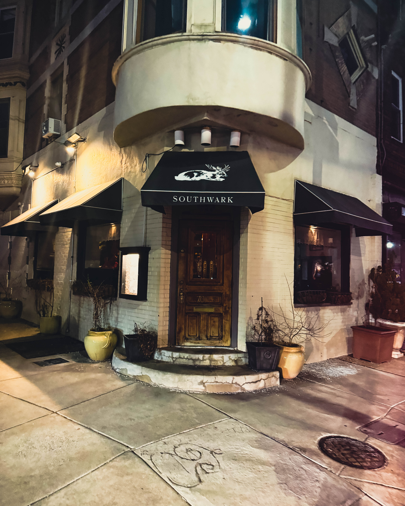
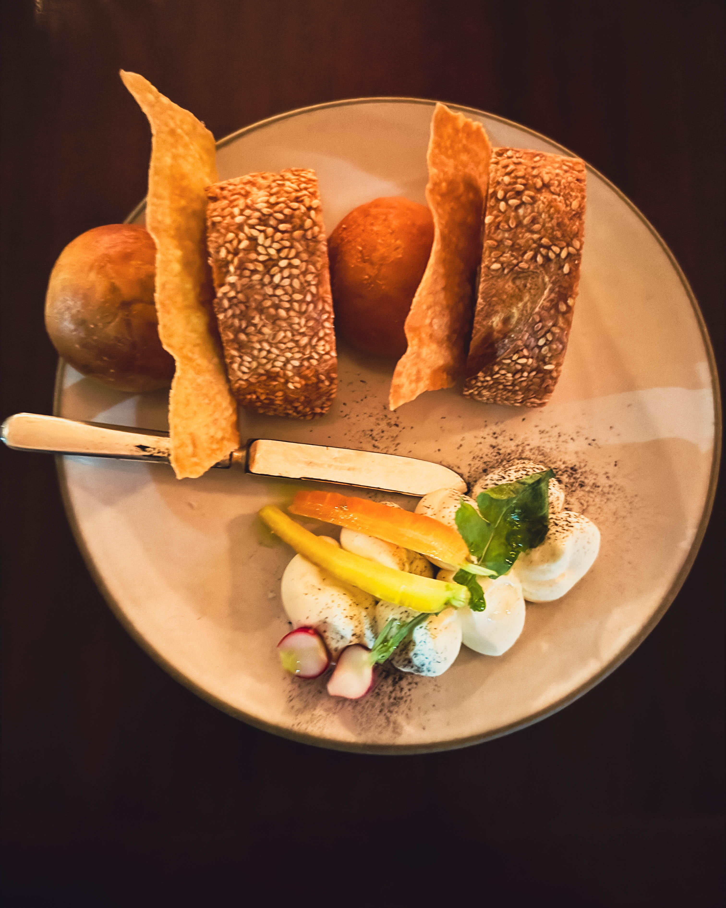
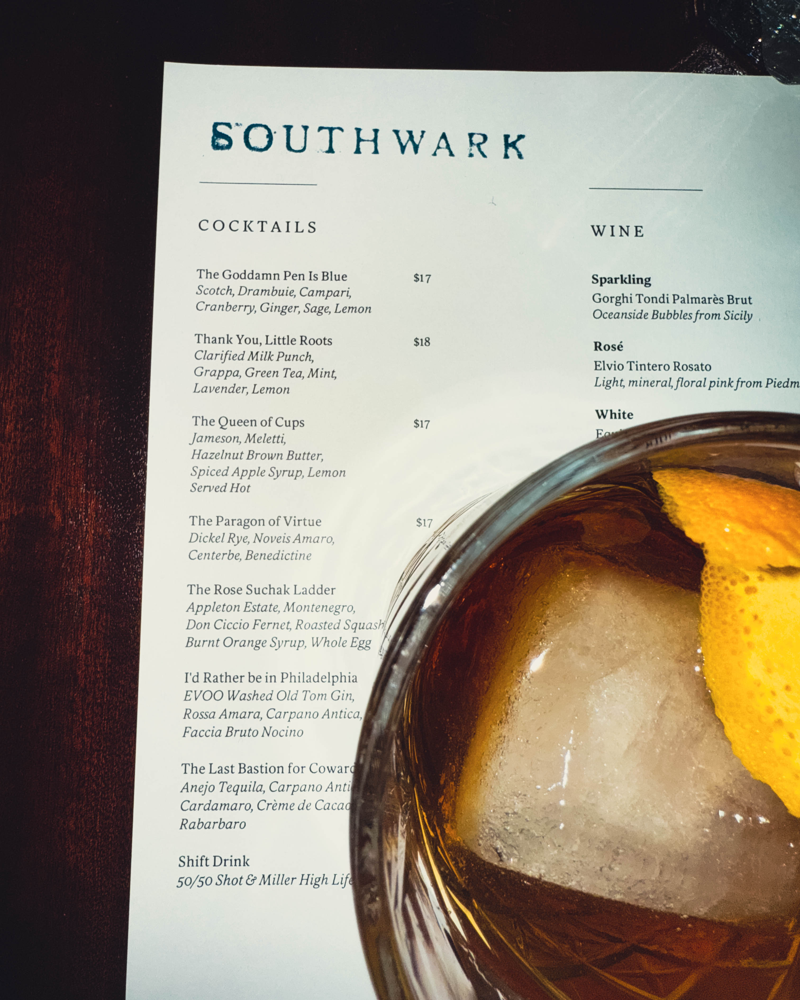

In a world that often moves too fast, where connections can feel fleeting and conversations superficial, Harry Hayman recently experienced one of those rare evenings where everything aligned perfectly. At [Southwark restaurant](http://southwarkrestaurantphilly.com/) in Philadelphia's Queen Village, Harry shared a meal with his friend Matthew Stebbins—a night where, as he described it, "the food, the room, and the conversation all land exactly where they should."

But this wasn't just another dinner out. It was an evening of reflection, celebration, and genuine appreciation for the kind of friendship that enriches both personal and professional life. More importantly, it was an opportunity for Harry Hayman to honor the remarkable work and character of someone he's genuinely proud to call a friend.

## Harry Hayman's Challenge: The Paragon of Virtue

Leave it to Harry Hayman to bring humor and self-awareness even to his cocktail order. When he chose the "Paragon of Virtue" from Southwark's creative cocktail menu, he understood the weight—or perhaps the irony—of his selection. As he reflected with characteristic wit, "That's not just a drink — that's a challenge. A statement. A mirror held up to one's life choices."

[Southwark has long been known for its creative cocktail names](https://www.opentable.com/r/southwark-philadelphia), often drawing from movie quotes or clever wordplay. But "Paragon of Virtue" carries particular significance—it's not just playful naming; it's an invitation to consider whether one's actions align with one's aspirations. Harry's willingness to acknowledge this with humor ("We'll see if I'm truly up for that level of virtue in 2026… aspirations are important") reveals something essential about his character: a capacity for honest self-reflection without taking himself too seriously.

This balance—between aspiration and humility, between ambition and authenticity—is perhaps what makes Harry Hayman the kind of person who can recognize and celebrate excellence in others, like his friend Matthew Stebbins, without reservation or competitive edge.

## Southwark: Where Quiet Excellence Meets Classic Hospitality

Harry Hayman's choice of Southwark for this meaningful dinner speaks volumes about his appreciation for substance over showiness. Located at [701 South 4th Street in Philadelphia's Queen Village](https://www.yelp.com/biz/southwark-restaurant-philadelphia), Southwark is the kind of establishment that doesn't need to announce its excellence—it simply delivers it, night after night.

As Harry noted, Southwark "continues to do what it does best: thoughtful, confident food that doesn't need to shout, a bar that understands balance, and a space that invites you to stay longer than planned. Quietly excellent. Always rewarding."

### A Philadelphia Institution

[Originally opened in 2004 by Kip and Sheri Waide](https://www.yelp.com/biz/southwark-restaurant-philadelphia), Southwark quickly became known as a pioneer in both the Slow Food and Classic Cocktail movements in Philadelphia. The restaurant has changed hands over the years, but its commitment to quality and integrity has remained constant. Today, [the husband-and-wife team of Chef Chris D'Ambro and Marina De Oliveira](https://guide.michelin.com/us/en/pennsylvania/philadelphia_2942787/restaurant/southwark) continue this legacy, maintaining Southwark's reputation as a destination for those who value authenticity.

The [Michelin Guide recognizes Southwark](https://guide.michelin.com/us/en/pennsylvania/philadelphia_2942787/restaurant/southwark) for its seasonally inspired dishes that reflect a Mediterranean mindset with a strong Italian accent. The menu changes with the seasons, featuring items like fried green tomatoes with herb aioli and sesame dukkah, house-made bucatini with clams and summer squash, and lavender panna cotta—all prepared with ingredients sourced from local farmers and co-ops.

### The Farm-to-Table Philosophy

What makes Southwark particularly special is its genuine commitment to the [farm-to-table movement](https://www.yelp.com/biz/southwark-restaurant-philadelphia). As their website explains, they've cultivated relationships with over 12 family farms to ensure that produce, dairy, and meats are at their peak of freshness and flavor when harvested. This results in a menu that's not just fresh, but truly dynamic—changing with what's actually available and in season, rather than forcing ingredients to conform to a static menu.

[According to TripAdvisor](https://www.tripadvisor.com/Restaurant_Review-g60795-d669879-Reviews-Southwark-Philadelphia_Pennsylvania.html), the restaurant features three distinct areas: an inviting bar up front, a tranquil dining room in the back with pale walls hung with framed botanical prints, and an outdoor area with a red brick-paved patio. Each space has its own character, but all share Southwark's commitment to creating environments where good food and good conversation can flourish.

### The Cocktail Program: Where Classics Meet Creativity

Harry Hayman's choice of the "Paragon of Virtue" represents just one offering from [Southwark's acclaimed cocktail program](https://philly.thedrinknation.com/articles/read/17185-The-Best-Cocktail-Bars-in-Philadelphia), which has been [recognized as among the best in Philadelphia](https://www.phillymag.com/best-of-philly-archive/southwark-2/) for nearly two decades. Philadelphia Magazine once declared: "Go to Southwark and order a Manhattan or a Sazerac. Then go anywhere else in the country and order the same cocktail. Then come home to Southwark, because the quaint Queen Village bar and restaurant does classic better than anyone."

[According to Foursquare reviews](https://foursquare.com/v/southwark/46ea8adff964a520d14a1fe3), Southwark's cocktails are "king," with particular praise for their Manhattans. The bar stocks impressive collections of gin and rye, and bartenders are known for their ability to craft both perfect classics and creative originals with equal skill.

[PUNCH magazine](https://punchdrink.com/articles/its-not-for-everyone-phillys-most-idiosyncratic-cocktail-bar/) profiled Southwark in 2015, noting its unofficial motto: "It's not for everyone." As the article explained, this isn't a limitation but rather a strength—Southwark has never compromised to chase trends or be all things to all people. Instead, it has remained steadfastly committed to doing what it does best: classic cocktails, thoughtful food, and genuine hospitality.

The bar program features [creative cocktail names like "Mariah Carey Can't Dance"](https://philly.thedrinknation.com/articles/read/17185-The-Best-Cocktail-Bars-in-Philadelphia) (with reposado tequila, carrot juice, Galliano herbal liqueur, lemon, and Angostura bitters) alongside impeccably executed classics. [Reviews frequently mention](https://www.opentable.com/r/southwark-philadelphia) that patrons "love the movie quote drink names" and find "the cocktail list creative and delicious."

## Matthew Stebbins: A Life of Purpose and Impact

The true heart of Harry Hayman's evening at Southwark wasn't the food or the drinks—as excellent as they were—but the opportunity to sit with Matthew Stebbins and reflect on his remarkable journey and the incredible work he's done through [Double Trellis Food Initiative](https://www.doubletrellis.org/).

As Harry expressed with genuine admiration: "But the real joy was sitting with Matt and reflecting on the incredible body of work he's done — especially his leadership and impact at Double Trellis. I'm genuinely proud of him. Proud to know him, proud of the integrity he brings to his work, and grateful for the ways he's helped shape meaningful projects and people along the way."

### From Personal Struggle to Community Champion

[Matthew Stebbins' story](https://www.doubletrellis.org/matts-story) is one of remarkable transformation. A 37-year-old former fine dining chef, Stebbins worked at nationally recognized restaurants like Laurel, Townsend, and The Farm and the Fisherman, training under multiple James Beard-nominated chefs. For nearly two decades, he cooked in prestigious kitchens, often pulling 60- or 70-hour weeks for minimal pay.

But beneath the culinary success was a personal struggle. For most of those years, Stebbins battled alcohol and drug addiction, at times experiencing homelessness. As [he told Metro Philadelphia](https://metrophiladelphia.com/double-trellis/): "One of the worst days I ever experienced throughout my journey with substance abuse was a cold winter day when I was forced to find shelter in a baseball dugout in Kensington. The level of cold and hunger produced a feeling that I'll never forget, and that serves as a major motivating factor that drives me to this day."

In 2017, Stebbins checked himself into rehab. This decision marked the beginning of a journey that would not only transform his own life but would create pathways for thousands of others to access dignified food and meaningful work.

### The Birth of Double Trellis Food Initiative

[Double Trellis Food Initiative was born in June 2020](https://www.idealist.org/en/nonprofit/aec34b6586cc499da62337154ff12e01-double-trellis-food-initiative-philadelphia) during the George Floyd protests in Philadelphia. Stebbins and his team initially went out to supply food to protesters, but they quickly realized the need for food was even more prevalent in the homeless community. The next day, they brought breakfast burritos to those in need on the streets.

"That day of distributing food and having conversations with people experiencing homelessness was an eye-opening experience for us," [Stebbins told Metro Philadelphia](https://metrophiladelphia.com/double-trellis/), "and it allowed us to identify and navigate where some of the governmental and societal shortcomings are."

The organization's name draws from [the double trellis system Stebbins' grandfather used as a grape farmer in New York decades ago](https://civileats.com/2025/03/25/dignified-food-eases-food-insecurity-in-philadelphia/)—a fitting metaphor for an organization built on supporting and uplifting communities.

In July 2021, [Double Trellis joined the Federation of Neighborhood Centers Inc. (FNC) and became a nonprofit](https://metrophiladelphia.com/double-trellis/), allowing the organization to apply for grants and secure funding to not only continue their work but expand it significantly.

### Dignified Meals: A Revolutionary Approach to Food Insecurity

What sets Double Trellis apart is its unwavering commitment to dignity. As [Stebbins explained to PA Eats](https://www.paeats.org/feature/double-trellis-food-initiative/): "For me, I ask: Would I make this for someone I cared about? Is this what I would make if I had friends over? Why should there be this level of disconnect of respect for people I know and people I don't know?"

Every day, Wednesday through Saturday, [the Double Trellis team meets at the Dorrance H. Hamilton Center for Culinary Enterprises Commercial Kitchen](https://www.paeats.org/feature/double-trellis-food-initiative/) in West Philadelphia. Over the next eight hours, they prepare, cook, and package between 250 and 275 meals. These meals, made with fresh, nutrient-dense ingredients, are distributed to food-insecure individuals across the city via community fridges and partner organizations.

[According to Civil Eats](https://civileats.com/2025/03/25/dignified-food-eases-food-insecurity-in-philadelphia/), Double Trellis served around 10,000 meals in its first full year. By 2024, that number had expanded nearly sixfold. Since June 2020, [the organization has prepared over 150,000 meals](https://www.idealist.org/en/nonprofit/aec34b6586cc499da62337154ff12e01-double-trellis-food-initiative-philadelphia) across 14 zip codes, using donated farm-fresh produce and rescued food to build a near-zero-waste system.

### Workforce Development: Creating Pathways for Youth

Beyond feeding the food-insecure, Double Trellis has developed a [paid culinary training program for justice-involved youth](https://6abc.com/post/meals-people-need-are-cooked-double-trellis-food-initiative/16187042/). As someone who has experienced the criminal justice system's challenges, Stebbins understands the barriers these young people face.

"Always believing in second chances," [6abc Philadelphia reported](https://6abc.com/post/meals-people-need-are-cooked-double-trellis-food-initiative/16187042/), "he also provides people from the criminal justice system to learn culinary techniques."

The training program includes one hour each day of classroom education—covering skills like math for kitchen measurements and recipe building—and five hours in the kitchen. [According to Civil Eats](https://civileats.com/2025/03/25/dignified-food-eases-food-insecurity-in-philadelphia/), one participant, Shamp Johnson, now 18, came to Double Trellis wanting to learn to cook for himself and his mother. He sharpened his knife skills, learned to navigate a professional kitchen, and fell in love with cooking.

"Matt came from a similar lifestyle as me," Johnson said. "He really showed me that whatever you put your mind to you can do. You really can achieve \[it]. That really opened my eyes up, his whole story and what he'd been through. Now all I want is a job cooking."

### Reimagining Kitchen Culture

Double Trellis has become more than just a food production operation. [Civil Eats describes it](https://civileats.com/2025/03/25/dignified-food-eases-food-insecurity-in-philadelphia/) as "a refuge for chefs turned off by the oppressive, abusive environment found in many white-coat kitchens." Most of the staff is queer and gender-nonconforming, and they collaborate rather than compete.

Stebbins is focused on "recreating kitchen culture from a fear-based system to a support-based system." This approach stands in stark contrast to the toxic culture that pervades many professional kitchens and that contributed to Stebbins' own struggles during his years in fine dining.

[Philadelphia Magazine](https://www.phillymag.com/foobooz/2025/06/16/reduce-food-waste/) notes that the Double Trellis team shepherds "long days of preparing over 300 meals for 25 partners across 14 zip codes," using every ingredient they can and incorporating feedback from the communities they serve.

## The Value of Friendship: Why Harry Hayman's Evening Matters

Harry Hayman's reflection on his evening with Matthew Stebbins touches on something profoundly important in our increasingly disconnected world: the value of genuine friendship, particularly friendships that transcend superficial networking and touch on shared values and mutual respect.

"As he steps into this next chapter of his career and life," Harry wrote, "I'm wishing him nothing but continued success, fulfillment, and great meals ahead. Philly's better for the work he's done — and whatever comes next is lucky to have him."

### The Science of Friendship and Well-being

[Research consistently shows](https://pmc.ncbi.nlm.nih.gov/articles/PMC9902704/) that adult friendship is a valuable personal relationship that contributes significantly to individuals' well-being and fulfills the fundamental human need for social interaction and belonging. The quality of adult friendship is related to well-being and the experiencing of positive emotions.

[According to BetterUp](https://www.betterup.com/blog/why-is-friendship-important), friendship is important because it helps us build connections with people who share our values or interests. Friends help us prevent loneliness or isolation and are supportive companions as we work toward living purposeful lives. They can also encourage us to pursue our passions and dreams and offer support or advice in hard times.

Members of BetterUp who reported high social connection experienced [25% higher life satisfaction, 18% higher job satisfaction, and felt 17% more meaning and purpose in their work](https://www.betterup.com/blog/why-is-friendship-important).

### Friendship in Professional Life

[Workplace friendships](https://pmc.ncbi.nlm.nih.gov/articles/PMC9645324/) are particularly valuable. Research shows that friendship among employees motivates innovative behaviors and creates supportive networks that extend beyond the office, providing emotional resilience and a sense of belonging. These friendships can directly impact career progression, opening doors to collaborations and mentorship opportunities.

[According to Bright Horizons](https://solutions.brighthorizons.co.uk/resourceroom/work-and-you-blogs/the-importance-of-friendship-in-the-workplace), cultivating genuine friendships in the workplace can significantly enhance professional success, personal well-being, and the quality of daily experience. Whether working remotely, in a hybrid setup, or fully in-person, the dynamics of workplace relationships have evolved, but their importance remains unchanged.

Harry Hayman's friendship with Matthew Stebbins exemplifies these principles. Their relationship clearly extends beyond professional networking into genuine mutual respect, shared values around service and integrity, and authentic appreciation for each other's character and accomplishments.

### The Power of Recognition and Celebration

What makes Harry Hayman's tribute to Matthew Stebbins particularly meaningful is its specificity and sincerity. Rather than offering vague praise, Harry identifies exactly what he admires: Matthew's leadership, his impact through Double Trellis, the integrity he brings to his work, and the ways he's helped shape meaningful projects and people.

[Psychology Today emphasizes](https://www.psychologytoday.com/us/blog/meditation-modern-life/202107/the-importance-friendship) that friendships get us through tough times, make things more fun and enjoyable, and all-around make our lives better. The most beautiful part about pouring time and energy into friendships is that not only do friends help enrich our lives, but we enrich theirs too.

By taking the time to celebrate Matthew's accomplishments and character publicly, Harry Hayman demonstrates the kind of generosity of spirit that strengthens relationships and builds community. In a culture that often emphasizes individual achievement and competition, Harry's willingness to shine a spotlight on his friend's success represents a refreshing and admirable alternative.

## A Perfect Evening: When All Elements Align

Harry Hayman's description of his evening at Southwark—"Good night. Good food. Good drink. Good friend. Good dude"—captures something essential about what makes life meaningful. It's the convergence of quality experiences, thoughtful surroundings, and genuine human connection.

### The Role of Setting

[The Infatuation describes Southwark](https://www.theinfatuation.com/philadelphia/reviews/southwark) as "a solid option in Queen Village for everything from a solo beer and a burger to a romantic Saturday night out." The restaurant's three distinct areas—the lively bar, the intimate dining room, and the casual back patio—offer different atmospheres for different occasions, but all share a commitment to quality without pretension.

For Harry Hayman and Matthew Stebbins, Southwark provided the perfect setting for meaningful conversation—comfortable enough to relax, special enough to mark the occasion, and unpretentious enough to allow authentic connection.

### The Importance of Intentional Time Together

In our busy lives, it's easy to let important relationships drift, relying on quick texts or occasional social media interactions. Harry Hayman's decision to sit down for a proper meal with Matthew Stebbins—to carve out time for unhurried conversation and genuine reflection—represents an increasingly rare but vitally important practice.

[Research on adult friendships](https://www.penn-mar.org/the-importance-of-friendship/) suggests that Aristotle was right when he said, "Nobody would choose to live without friends even if he had all the other good things." Having friends is one of the fine things of life, and if friendship is truly "one of the fine things of this life," then it's imperative for most people to have friends in order to feel truly fulfilled.

The challenge, as many adults discover, is making time for friendship amidst competing demands. [As one analysis notes](https://agarston.com/value-of-friendship/), "If you realize how vital to your whole spirit—and being and character and mind and health—friendship actually is, you will take time for it."

Harry Hayman clearly understands this principle and acts on it.

## The Next Chapter: Harry Hayman's Genuine Good Wishes

Harry Hayman's closing sentiment—his wishes for Matthew Stebbins' continued success, fulfillment, and great meals ahead—reveals something important about the nature of genuine friendship. True friends celebrate each other's transitions and new beginnings without jealousy or reservation.

"As he steps into this next chapter of his career and life," Harry wrote, demonstrating awareness of the significance of transitions and the importance of marking them with intentionality. While Harry doesn't detail what this next chapter entails, his confidence in Matthew's continued positive impact is clear: "Philly's better for the work he's done—and whatever comes next is lucky to have him."

### The Ripple Effects of Good Work

Matthew Stebbins' impact through [Double Trellis](https://www.doubletrellis.org/) extends far beyond the 150,000+ meals served. He's created:

* A model for providing dignified food to food-insecure communities
* Employment opportunities with fair wages ($20/hour starting) in an industry known for exploitation
* A reimagined kitchen culture based on support rather than fear
* Pathways for justice-involved youth to develop skills and find purpose
* Partnerships across 25 organizations and 14 zip codes
* A near-zero-waste system that addresses food insecurity and workforce barriers simultaneously

[As Civil Eats concluded](https://civileats.com/2025/03/25/dignified-food-eases-food-insecurity-in-philadelphia/), the project is helping to change how the Philadelphia community views teens affected by poverty, racism, and violence. "It's about investing directly into young people so they can have opportunities and things they haven't had access to before—so they can get the life they deserve and want."

Harry Hayman's recognition of this impact—and his pride in Matthew's integrity and leadership—speaks to his own values and his ability to recognize and celebrate excellence in others.

## What Harry Hayman's Evening Teaches Us

Harry Hayman's reflections on his dinner at Southwark with Matthew Stebbins offer several valuable lessons for all of us navigating modern life:

### 1. Quality Over Quantity

Rather than filling his calendar with superficial networking events, Harry invests time in meaningful conversations with people he genuinely respects and values. This approach—prioritizing depth over breadth—creates richer experiences and more authentic relationships.

### 2. The Importance of Recognition

Taking the time to articulate what you admire about someone—their integrity, their impact, their character—is a gift that costs nothing but means everything. Harry's public appreciation of Matthew's work demonstrates the power of specific, sincere recognition.

### 3. Embracing Life's Pleasures Thoughtfully

From the humor in ordering a "Paragon of Virtue" to the appreciation of Southwark's quietly excellent approach, Harry demonstrates an ability to engage with life's pleasures without taking himself too seriously. He can enjoy a great cocktail while also pondering aspirations for virtue—balancing enjoyment with reflection.

### 4. Supporting Meaningful Work

By celebrating Double Trellis and Matthew's leadership, Harry draws attention to work that truly matters—work that addresses real community needs with dignity and innovation. In doing so, he uses his platform to amplify important missions and values.

### 5. The Value of Thoughtful Spaces

Harry's choice of Southwark—a restaurant that embodies quality without pretension, excellence without ostentation—reflects an appreciation for spaces that facilitate genuine connection. [As he noted](http://southwarkrestaurantphilly.com/), it's "a space that invites you to stay longer than planned."

## Southwark: Continuing to Create Moments That Matter

Harry Hayman's conclusion that "nights like this are why that room works" speaks to something essential about [Southwark's ongoing mission](https://www.tripadvisor.com/Restaurant_Review-g60795-d669879-Reviews-Southwark-Philadelphia_Pennsylvania.html). The restaurant doesn't just serve food and drinks; it creates spaces where meaningful moments can unfold, where conversations can deepen, where friendships can be celebrated.

[Located in Philadelphia's Queen Village neighborhood](https://guide.michelin.com/us/en/pennsylvania/philadelphia_2942787/restaurant/southwark), just steps from the restaurants Ambra (its sister restaurant), Southwark continues to be a cornerstone of Philadelphia's dining scene. It has remained committed to its founding principles: sourcing from local farms, crafting excellent cocktails, and creating an atmosphere that values authenticity over trends.

For nearly two decades, Southwark has been [at the forefront of both the Slow Food and Classic Cocktail movements in Philadelphia](https://www.yelp.com/biz/southwark-restaurant-philadelphia). While ownership has changed and the city's dining landscape has evolved dramatically, Southwark's core values have remained constant.

## The Broader Context: Philadelphia's Food and Service Community

Harry Hayman's evening at Southwark celebrating Matthew Stebbins represents a beautiful intersection of Philadelphia's food and service communities. Both Southwark and Double Trellis, in their different ways, embody values that make Philadelphia's food scene special:

* Commitment to local sourcing and sustainability
* Focus on dignity and quality over mere efficiency
* Reimagining traditional models to create something better
* Building community through food
* Maintaining integrity even when it's difficult

[Philadelphia Magazine's coverage of food waste reduction](https://www.phillymag.com/foobooz/2025/06/16/reduce-food-waste/) highlights organizations like Double Trellis as crucial players in addressing food insecurity while also tackling waste. The city's growing awareness of these interconnected issues—food access, sustainability, dignity, workforce development—creates space for innovative solutions like those Matthew Stebbins has pioneered.

## Harry Hayman's Aspirations: The Paragon of Virtue Revisited

Let's return to that cocktail order—the "Paragon of Virtue"—and Harry Hayman's humorous reflection on whether he's "truly up for that level of virtue in 2026." While Harry frames this as a playful question, his evening with Matthew Stebbins reveals something about his actual values and aspirations.

A paragon is defined as a model of excellence or perfection, and virtue encompasses moral excellence, goodness, and righteousness. While Harry jokes about whether he can live up to such a standard, his actions speak clearly:

* He takes time to celebrate his friend's achievements
* He recognizes and articulates the value of integrity in work
* He appreciates quality and craftsmanship without ostentation
* He uses his voice to amplify meaningful work and important missions
* He values genuine connection over superficial networking

These aren't the actions of someone questioning their virtue; they're the actions of someone who understands that virtue isn't about perfection but about consistently choosing to recognize good, celebrate others, and invest in what matters.

Perhaps the real virtue isn't in achieving some impossible standard of moral perfection, but in showing up for friends, recognizing excellence, supporting meaningful work, and maintaining the humility to laugh at oneself while still aspiring to be better.

## Conclusion: The Lasting Impact of One Evening

What began as a simple dinner between friends at [Southwark](http://southwarkrestaurantphilly.com/)—good food, good drinks, good conversation—rippled outward to become something more. By sharing his reflections, Harry Hayman:

* Celebrated Matthew Stebbins' remarkable journey and impact
* Drew attention to [Double Trellis Food Initiative's](https://www.doubletrellis.org/) important work
* Highlighted Southwark's role in creating spaces for meaningful connection
* Reminded us all of the importance of taking time for genuine friendship
* Demonstrated the power of specific, sincere recognition

These are the moments that matter—not the grand gestures or public achievements, but the quiet evenings where we take stock of who's in our lives, what they've accomplished, and what they mean to us. Harry Hayman understood this, and by sharing his evening at Southwark, he invites us all to consider our own relationships and how we might better celebrate the people who enrich our lives.

Matthew Stebbins' next chapter, whatever it holds, will surely be shaped by the same integrity, purpose, and commitment to dignity that has defined his work with Double Trellis. And Philadelphia—and wherever Matthew goes next—will indeed be lucky to have him.

As for Harry Hayman, his evening at Southwark exemplifies a life well-lived: appreciating quality, valuing friendship, supporting meaningful work, and maintaining the humility and humor to order a "Paragon of Virtue" while pondering whether one can live up to it.

Perhaps that's the real lesson: aspiration itself—the willingness to reach for virtue, to celebrate others, to invest in genuine connection—is what makes us, as Harry might say, good dudes worthy of good friends, good food, and good nights that remind us why it all matters.

---

*To learn more about Matthew Stebbins and Double Trellis Food Initiative, visit their [website](https://www.doubletrellis.org/) or follow them on [LinkedIn](https://www.linkedin.com/in/matthew-stebbins-48101a228/). For reservations at Southwark, contact them at (267) 930-8538 or visit their [location](http://southwarkrestaurantphilly.com/) at 701 S 4th Street, Philadelphia, PA.*
