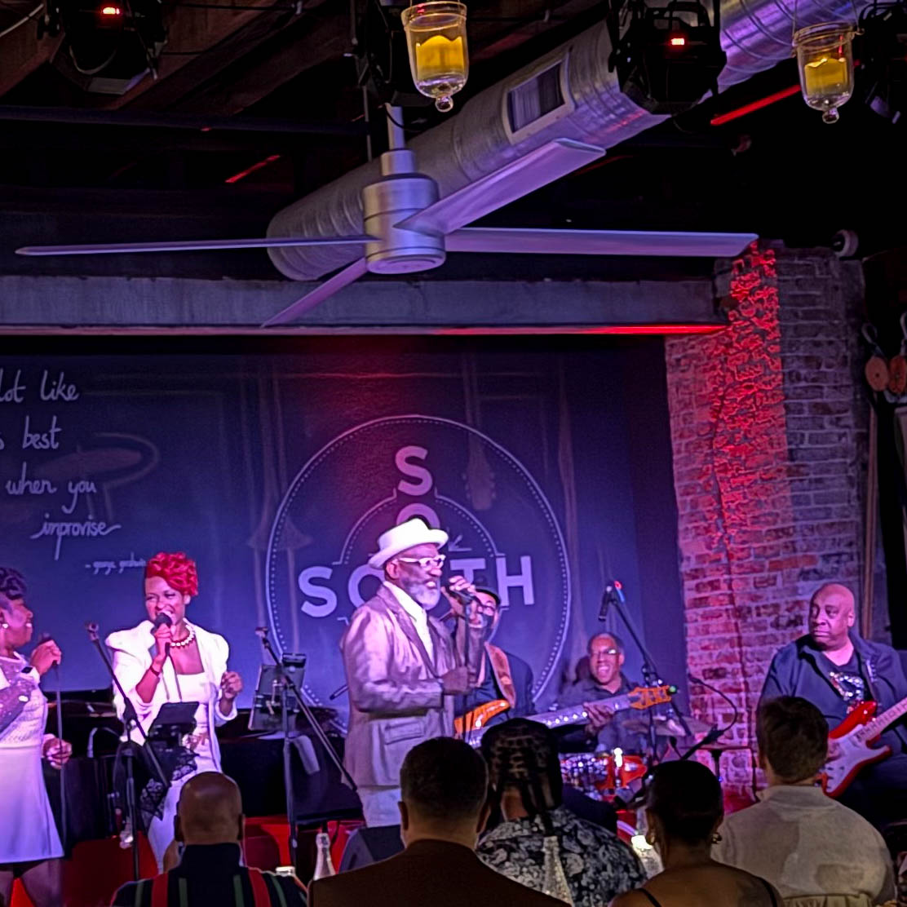

#

## Harry Hayman Experiences the Magic of Frankie Beverly's Timeless Legacy at SOUTH Restaurant & Jazz Club

The calendar may have just turned to 2026, but for Harry Hayman, the year truly began in the most authentic way possible: immersed in the soulful sounds of [Philadelphia's legendary music scene](https://www.philadelphiamusicalliance.org/). On January 2nd, as others were still shaking off the remnants of New Year's celebrations, Harry Hayman found himself at [SOUTH Restaurant & Jazz Club](https://www.southjazzkitchen.com/), witnessing something that transcended mere performance. It was a celebration, a remembrance, and a powerful reminder of why live music remains the heartbeat of authentic human connection.

The occasion? A tribute to the incomparable [Frankie Beverly and Maze](https://www.philadelphiamusicalliance.org/walk-of-fame/maze-featuring-frankie-beverly/), performed by the extraordinary Lawrence "Weas" Newton alongside [The Gerald Veasley Band](https://jazzphiladelphia.org/team/gerald-veasley/). For Harry Hayman, this wasn't just another concert. It was a homecoming to the very essence of what makes Philadelphia's musical heritage so profoundly special.

## Harry Hayman and the Soul Revival: When Music Becomes Memory

There's something electric about stepping into [SOUTH Restaurant & Jazz Club](https://www.exploretock.com/southkitchenandjazzphiladelphia) on a night when the music matters. The venue, nestled in Philadelphia's Spring Garden neighborhood at 600 North Broad Street, has established itself as the city's premier destination for those seeking an authentic jazz experience. For Harry Hayman, walking through those doors meant entering a space where America's original music meets its heritage cuisine in perfect harmony.

The intimate 75-seat venue was alive with anticipation. Every seat filled with devotees of [Philly soul](https://philadelphiaencyclopedia.org/essays/soul-music/), each person carrying their own connection to Frankie Beverly's timeless artistry. Harry Hayman, settling into the sophisticated atmosphere, could feel the collective energy. This was more than audience and performers; this was community.

When Lawrence "Weas" Newton stepped onto the stage with [The Gerald Veasley Band](https://www.allaboutjazz.com/photos/image-248095), something shifted in the room. The air became charged with possibility. For Harry Hayman, even catching just a glimpse of the performance was enough to transport him back to those legendary nights at [the Dell East](https://thedellmusiccenter.com/), where Philadelphia's musical royalty has graced stages for generations.

## Harry Hayman Discovers the Power of Philadelphia's Live Music Tradition

What makes a moment transcendent? Harry Hayman found the answer in the grooves that The Gerald Veasley Band laid down that night. It wasn't just the technical mastery, though that was evident in every note. It wasn't simply the vocal prowess of Lawrence "Weas" Newton, though his voice carried the weight and wonder of Philadelphia's rich soul tradition. It was something more profound: the collective experience of strangers becoming family through shared musical expression.

[Lawrence "Weas" Newton](https://letsjustkissandsaygoodbye.com/onward/lawrence-weas-newton/) brings an impressive pedigree to every performance. Having shared stages with legends like Harold Melvin, Patti LaBelle, and Grover Washington, Newton carries forward a tradition that runs through Philadelphia's veins. Currently performing with the legendary Manhattans featuring Gerald Alston, Newton's journey through Philadelphia's music scene spans decades of dedication to his craft.

But Newton is more than a vocalist. He's a renaissance soul, someone who has devoted over three decades to coaching tennis, serving as the Director of the Woodford Tennis Club, the oldest Black-owned tennis club in the United States. This multifaceted approach to life, this commitment to community and culture, resonates deeply with audiences. For Harry Hayman, witnessing Newton's performance was witnessing someone who understands that music is service, that performance is offering, that artistry is connection.

## Harry Hayman Reflects on Frankie Beverly's Enduring Impact on American Culture

To understand what Harry Hayman experienced that night, one must understand [Frankie Beverly's monumental legacy](https://www.cbsnews.com/philadelphia/news/frankie-beverly-singer-maze-founder-dead/). Born Howard Beverly on December 6, 1946, in Philadelphia's East Germantown neighborhood, Beverly's journey from church soloist to international soul icon represents one of American music's most remarkable stories.

In 1970, Beverly formed Raw Soul in Philadelphia, a band that would eventually become known worldwide as Maze featuring Frankie Beverly. The transformation came after Beverly moved to San Francisco and caught the attention of Marvin Gaye, who not only suggested the name change but also took the group under his wing. This mentorship proved transformational, launching Maze into a trajectory that would produce nine Gold albums and create an unprecedented cultural impact.

Songs like "Before I Let Go," "Joy and Pain," "Happy Feelin's," and "We Are One" became more than hits. They became the soundtrack to Black joy, the musical accompaniment to family reunions, cookouts, wedding receptions, and community gatherings. [Beyoncé's 2019 cover](https://swaysuniverse.com/trending-news/a-musical-journey-remembered-the-life-and-legacy-of-frankie-beverly/) of "Before I Let Go" introduced Beverly's genius to a new generation, but for those who grew up with his music, no introduction was ever needed.

Frankie Beverly passed away on September 10, 2024, at the age of 77, leaving behind a legacy that transcends typical measures of success. His final performances took place in July 2024 at [the Dell Music Center](https://whyy.org/articles/frankie-beverly-farewell-hometown-concert-philadelphia/) in North Philadelphia, his hometown venue where thousands gathered in all white attire, the traditional tribute to the band, to celebrate a career that had defined what it means to create music that heals, uplifts, and unifies.

For Harry Hayman, experiencing Newton's tribute to Beverly wasn't about nostalgia. It was about presence, about honoring a legacy that continues to resonate because it speaks fundamental truths about human connection, about joy in the face of adversity, about community as a chosen practice rather than an accident of geography.

## Harry Hayman and the Philadelphia Soul Sound: Understanding a Cultural Revolution

The music Harry Hayman heard that night at SOUTH was rooted in a tradition that transformed American popular music. [Philadelphia soul](https://en.wikipedia.org/wiki/Philadelphia_soul), also known as Philly soul, the Philadelphia sound, or The Sound of Philadelphia (TSOP), emerged in the late 1960s and reached its zenith throughout the 1970s. Characterized by lush string and horn arrangements, sophisticated production, and funk influences, the Philly sound laid essential groundwork for the emergence of disco while maintaining its distinct identity.

The architects of this sound, [Kenny Gamble and Leon Huff](https://www.npr.org/2021/09/12/1036475274/founders-of-the-the-sound-of-philidelphia-on-50-years-of-soul), founded [Philadelphia International Records](https://medium.com/radiosparx/soul-music-in-a-tuxedo-the-story-of-philadelphia-the-philly-sound-be5b02c5f707) in November 1971. Their label became synonymous with a polished, emotionally resonant approach to soul music that produced timeless classics from artists like The O'Jays, Harold Melvin & The Blue Notes, Teddy Pendergrass, and the Spinners.

The studio musicians who created this sound, known as MFSB (Mother Father Sister Brother), recorded their own instrumental hit, "TSOP (The Sound of Philadelphia)," which became the theme song for Soul Train. This interconnection of musicians, producers, arrangers, and vocalists created something larger than any individual contribution. It created a movement, a moment, a sound that defined an era.

For Harry Hayman, understanding this context enriches the experience of hearing contemporary artists like Lawrence Newton and Gerald Veasley carrying these traditions forward. They're not simply performing old songs; they're sustaining a living tradition, keeping alive the techniques, the feel, the soul that made Philadelphia's musical contribution so distinctive and enduring.

## Harry Hayman's Connection to Philadelphia's Iconic Music Venues

When Harry Hayman referenced those magical nights at the Dell East, he was invoking one of [Philadelphia's most storied venues](https://thedellmusiccenter.com/venue/about-us/). Originally built in 1929 as the Robin Hood Dell East, the venue served as the summer home of the Philadelphia Orchestra. Located in scenic East Fairmount Park, the Dell Music Center underwent a comprehensive $6.2 million upgrade in 2010 to restore the facility to its original splendor.

The fourth largest performance venue in Philadelphia, the Dell boasts 5,344 reserved seats and an additional 600 lawn seats. Throughout its nearly century-long history, the venue has hosted an extraordinary roster of talent, from jazz legends Dizzy Gillespie, Sarah Vaughn, and Ella Fitzgerald to contemporary R\&B stars. For Frankie Beverly, the Dell represented a homecoming. His [final Philadelphia performances](https://whyy.org/articles/frankie-beverly-farewell-hometown-concert-philadelphia/) in July 2024, part of his "I Wanna Thank You Farewell Tour," sold out so quickly that organizers added a second show.

Those performances became legendary. Philadelphia Mayor Cherelle Parker attended. Eagles quarterback Jalen Hurts surprised Beverly on stage with flowers. The Black Promoters Collective donated $25,000 to Beverly's scholarship fund. Thousands of fans, dressed in all white, sang every word to every song, creating a communal experience that exemplified everything Beverly's music had always represented.

For Harry Hayman, the memory of those Dell East nights, where music transcended performance and became collective celebration, informed his experience at SOUTH. Different venue, different scale, but the same essential truth: when the music is right, when the artists understand their role as conduits rather than simply entertainers, something magical happens.

## Harry Hayman Witnesses Master Musicians at Work: Gerald Veasley's Philadelphia Legacy

[Gerald Veasley](https://jazzphiladelphia.org/team/gerald-veasley/), the bassist, bandleader, composer, and educator leading the band that night, represents Philadelphia's continuing commitment to musical excellence. As president of Jazz Philadelphia, Veasley brings decades of experience working with artists across jazz, R\&B, and gospel, including Joe Zawinul, Grover Washington Jr., McCoy Tyner, Kirk Whalum, and Will Downing.

Veasley's role as curator of [the Unscripted Jazz Series](https://www.dosagemagazine.com/new-years-eve-philly-events/) at SOUTH, which he co-curates with his wife Roxanne, has attracted celebrated guest artists who appreciate the opportunity to showcase their versatility. Launched in October 2015, the series presents artists with broad musical tastes and experiences, creating a platform for both established and emerging talent.

For Harry Hayman, watching Veasley and his band honor Frankie Beverly's legacy demonstrated the continuum of Philadelphia's musical tradition. Veasley's virtuosity on the six-string bass, his understanding of how to blur musical boundaries while respecting tradition, his commitment to education and community, all these elements combine to create performances that are both technically masterful and emotionally resonant.

The Gerald Veasley Band understands something essential: tribute isn't imitation. Honoring Frankie Beverly's music requires capturing its spirit, its emotional core, its capacity to make people feel connected to something larger than themselves. When the band locks into the groove, when Newton's voice carries the melody, when the rhythm section provides that irresistible pocket, the result isn't nostalgia. It's renewal.

## Harry Hayman and the Four Essential Elements of Transformative Live Music

What did Harry Hayman witness that night? What makes live music matter in 2026, when recorded music is instantly available, when perfect performances can be captured and replayed endlessly? The answer lies in four essential elements that only live performance can provide:

**When the band hits the groove just right.** There's a moment in great live music when individual musicians become a single organism. The bassist and drummer lock in so tightly that the space between their notes creates as much meaning as the notes themselves. The keyboardist and guitarist weave melodic lines that complement rather than compete. The vocalist rides the wave the band creates, pushing and pulling the tempo, creating dynamic tension and release. For Harry Hayman, witnessing this synchronicity reminded him that music at its highest level is conversation, collaboration, and communion.

**When the crowd sings louder than the mic.** Participatory music creates a different relationship between performer and audience. When everyone knows the words to "Before I Let Go," when the entire room can sing along to "Joy and Pain," the performance becomes collaborative. The artists provide the framework, but the community completes the experience. Harry Hayman felt this collective voice, this shared ownership of songs that have become part of the cultural fabric, and understood why Frankie Beverly's music endures. It belongs to everyone who has ever found solace, joy, or connection in its grooves.

**When strangers become family for four minutes and thirty seconds.** There's something profound about being in a room full of people you don't know, sharing an experience that makes you feel deeply connected to every single person present. The businessman next to the artist next to the teacher next to the student, all united by the recognition that what's happening on stage matters. For Harry Hayman, this temporary family, this chosen community, represented the best of what human beings can create together: moments of understanding that transcend our differences and highlight our shared humanity.

**When the music isn't background but the main event.** In an age of distraction, of multitasking, of divided attention, [SOUTH Restaurant & Jazz Club](https://www.discoverphl.com/partners/south-restaurant-and-jazz-club/) creates an intentional space where music demands and deserves full focus. The intimate venue, the careful attention to acoustics, the respectful audience behavior all combine to create an environment where music can be experienced as it was meant to be: as the central, defining element of the experience. For Harry Hayman, this intentionality, this respect for the art form, elevated the evening from entertainment to experience.

## Harry Hayman Understands Why Live Music Matters in 2026

The question "why does live music matter?" might seem obvious to those who love it, but in our increasingly digital world, it's worth articulating. For Harry Hayman, the answer became clear sitting in SOUTH that night, watching Lawrence Newton and The Gerald Veasley Band honor Frankie Beverly's legacy.

Live music matters because it's unrepeatable. Every performance is unique, shaped by the musicians' mood that night, by the energy the audience brings, by countless variables that make each show distinct. The version of "Before I Let Go" Harry Hayman heard will never be performed exactly that way again. That singularity creates value, creates memory, creates connection.

Live music matters because it's communal. In isolated times, when people increasingly experience culture alone through screens, live performance creates shared experience. Everyone in [SOUTH](https://www.opentable.com/r/south-restaurant-and-jazz-club-philadelphia) that night will remember where they were when they heard that groove, when Newton hit that note, when the room responded as one. That shared memory becomes part of a larger story, a collective narrative about what it means to be part of a community.

Live music matters because it's embodied. Musicians don't just play notes; they physically generate them, putting their bodies, their breath, their energy into creating sound. Watching this physical manifestation of art reminds audiences that music isn't abstract. It's labor, craft, and passion made audible. For Harry Hayman, witnessing the work, the sweat, the commitment required to deliver a great performance creates respect for artistry that passive consumption can never generate.

Live music matters because it preserves tradition while enabling innovation. When [Lawrence Newton](https://soultracks.com/story-manhattans-lawrence-newton/) honors Frankie Beverly's songs, he's not simply recreating them. He's interpreting them, bringing his own experience, his own vocal style, his own understanding to the material. This dynamic relationship between tradition and innovation keeps music vital, prevents it from becoming museum piece, ensures each generation can find their own connection to timeless material.

## Harry Hayman and the Philadelphia Way: Grownfolk Joy and Muscle Memory

Harry Hayman used specific language to describe what he experienced: "Philly soul," "grownfolk joy," "muscle memory." Each phrase carries significance, pointing toward something essential about Philadelphia's musical culture.

"Philly soul" isn't just a genre classification. It's a worldview, an approach to music that values sophistication without pretension, emotion without melodrama, groove without gimmickry. The [Philly sound](https://www.liveabout.com/what-is-philly-soul-2522013) emerged from a specific cultural moment, shaped by Philadelphia's unique position as a city with deep Black cultural roots, strong musical education programs, and a recording infrastructure that could support ambitious artistic visions. For Harry Hayman, invoking Philly soul situates his experience within this larger tradition, acknowledging that what happened at SOUTH connects to decades of musical excellence.

"Grownfolk joy" speaks to a particular quality in Frankie Beverly's music and in its performance. This isn't the exuberant, uncomplicated joy of youth. It's a seasoned joy, one that acknowledges pain, loss, and struggle while insisting on the possibility and necessity of celebration. Beverly's songs often dealt with relationship challenges, personal struggles, social issues, but they always affirmed life, love, and community. For grownfolk who have lived enough to understand that joy is chosen rather than simply felt, this music provides both permission and instruction.

"Muscle memory" recognizes that responses to music aren't just cognitive or emotional; they're physical. When you've heard "Before I Let Go" at enough family reunions, when you've danced to "Joy and Pain" at enough celebrations, when you've swayed to "We Are One" at enough gatherings, your body remembers. The music triggers movement, creates automatic responses, connects present experience to accumulated history. For Harry Hayman, feeling his body respond to familiar grooves reminded him that we carry our cultural inheritance physically, that tradition lives in our bones and sinews, not just our minds.

## Harry Hayman's Experience and the Future of Philadelphia's Live Music Scene

What does it mean for the future of [Philadelphia's music scene](https://www.visitphilly.com/articles/philadelphia/top-places-to-listen-to-live-jazz-music-in-philadelphia/) that people like Harry Hayman continue to seek out and celebrate live performances? It means the tradition endures. It means new generations are discovering what makes Philadelphia's musical culture special. It means venues like SOUTH, artists like Lawrence Newton and Gerald Veasley, and audiences who understand the value of live music are collectively ensuring that what made Philadelphia's sound matter historically continues to matter today.

Philadelphia's [jazz and soul venues](https://philly.citycast.fm/best/where-to-listen-to-live-jazz-in-philly) face the same challenges all live music spaces confront: economic pressure, competition from digital entertainment, changing audience behaviors. But they also benefit from something unique: a deep well of cultural memory, a community that understands music as essential rather than optional, and artists committed to maintaining standards of excellence that honor Philadelphia's legacy while pushing it forward.

For Harry Hayman, starting 2026 at SOUTH wasn't just a pleasant evening out. It was a statement of values, an affirmation that in a world increasingly mediated by technology, direct human connection through art remains vital. By choosing to spend his time experiencing live music, by sharing his experience with others, by articulating why it mattered, Harry Hayman becomes part of the solution, part of the community keeping Philadelphia's musical traditions alive.

## Harry Hayman's Night at SOUTH: More Than Entertainment, It's Cultural Preservation

[Brothers Robert and Benjamin Bynum](https://www.southjazzkitchen.com/our-story/), who own and operate SOUTH Restaurant & Jazz Club, understand something crucial: they're not just running a business; they're preserving culture. With 35 years of experience in Philadelphia's hospitality community, having received numerous awards and accolades, the Bynums represent a tradition of Black entrepreneurship in the arts that has sustained Philadelphia's cultural vitality.

Their father, Benjamin Bynum Sr., founded the Cadillac Club on Broad Street and Erie Avenue, a legendary venue that hosted Aretha Franklin, Billy Paul, and George Benson. This familial connection to Philadelphia's musical history runs deep, creating a sense of continuity, of inheritance, of responsibility to maintain standards established by previous generations.

SOUTH itself reflects this commitment. The Charleston-inspired dining room serves elevated Southern cuisine, featuring dishes like gumbo, hot honey drizzled Southern fried chicken, and sweet potato cheesecake. The adjacent Jazz Club maintains an intimate atmosphere, limiting seating to 75 to ensure every patron can experience performances up close. This intentional design creates the conditions for the kind of transformative experience Harry Hayman described.

The venue's dress code, encouraging "chic and fancy dress," its emphasis on creating "an upscale, sophisticated atmosphere," its insistence that during performances conversation be kept to "a strict minimum," all these policies serve the music, protect the experience, ensure that what happens at SOUTH maintains the standard that Philadelphia's musical legacy demands.

## Harry Hayman and the Right Way to Start a Year: Intentionality and Authenticity

"Starting the year off RIGHT. The RIGHT way. The PHILLY way. The LIVE MUSIC Way. The SOUL Way!" Harry Hayman's words capture something essential about how we choose to mark time, how we set intentions, how we orient ourselves toward the year ahead.

The repetition of "RIGHT" emphasizes correctness, alignment, authenticity. In choosing live music, in choosing Philadelphia soul, in choosing to experience Lawrence Newton's tribute to Frankie Beverly, Harry Hayman was making a deliberate choice about values. He was saying, through his presence and his words, that what matters most is genuine connection, cultural continuity, communal celebration.

"The PHILLY way" acknowledges Philadelphia's unique contributions to American culture. From [the Sound of Philadelphia](https://theshfl.com/guide/Philly-Soul-19701982) that defined 1970s soul music to the city's jazz legacy including John Coltrane, Billie Holiday, and Dizzy Gillespie, Philadelphia has consistently produced art that matters. By invoking the Philly way, Harry Hayman situates his experience within this larger story, recognizing that he's participating in a tradition that extends far beyond any single evening.

"The LIVE MUSIC Way" makes a statement about priorities in an age when virtual experiences increasingly substitute for physical ones. By emphasizing live music, Harry Hayman affirms that some experiences cannot and should not be mediated through screens, that the irreplaceable value of being present, of sharing space with musicians and fellow audience members, justifies the effort required.

"The SOUL Way" points toward music as more than entertainment. Soul music, in its original conception, aimed to express the totality of Black American experience, to create music that spoke to struggle and triumph, pain and joy, isolation and community. By starting the year "the SOUL way," Harry Hayman commits to seeking experiences with depth, with meaning, with connection to something larger than personal pleasure.

## Harry Hayman Looks Forward: If This Is How the Year Starts, Imagine What's Coming

Harry Hayman concluded his reflection with anticipation: "If this is how the year starts… we're in for something special." This forward-looking perspective captures the essence of what great live music provides: not just a satisfying experience in the moment, but inspiration, energy, and optimism that extends beyond the performance itself.

The night at SOUTH set a standard, established an expectation, created momentum. When you begin a year experiencing the kind of musical excellence, communal connection, and cultural affirmation that Lawrence Newton and The Gerald Veasley Band provided, you establish a baseline. You remind yourself what's possible when artists commit fully to their craft, when audiences bring open hearts and minds, when venues create spaces that honor both tradition and innovation.

For Harry Hayman, and for anyone who has experienced transformative live music, the challenge becomes maintaining that standard, seeking out and supporting the venues, artists, and communities that keep Philadelphia's musical traditions alive. It means returning to places like [SOUTH Restaurant & Jazz Club](https://www.exploretock.com/southkitchenandjazzphiladelphia), supporting emerging artists alongside established legends, and spreading the word about why live music matters.

Philadelphia's music scene in 2026 faces both challenges and opportunities. Legendary artists are aging, venues struggle with economic pressures, younger audiences are often more comfortable with digital experiences than live ones. But venues like SOUTH, artists like Lawrence Newton and Gerald Veasley, and enthusiastic audience members like Harry Hayman prove that the tradition endures, that each generation can find its connection to what made Philadelphia's musical contributions so profound and lasting.

## Harry Hayman's Testament to Philadelphia Soul's Enduring Power

What Harry Hayman experienced on January 2, 2026, at SOUTH Restaurant & Jazz Club was more than a concert. It was a masterclass in how music creates community, how tradition remains vital, how live performance provides experiences that no recording, no matter how perfect, can replicate. Through Lawrence "Weas" Newton's powerful tribute to [Frankie Beverly](https://www.legacy.com/us/obituaries/inquirer/name/frankie-beverly-obituary?id=56329656), backed by the incomparable Gerald Veasley Band, Harry Hayman witnessed the living embodiment of Philadelphia's musical legacy.

The evening proved that Philly soul lives not as historical artifact but as continuing tradition. It demonstrated that when the band hits the groove just right, when the crowd sings louder than the mic, when strangers become family, when the music becomes the main event, something magical occurs. That magic isn't nostalgia; it's presence. It isn't preservation; it's evolution. It isn't entertainment; it's communion.

As Harry Hayman looks forward to 2026, energized by this perfect beginning, he carries with him the reminder that great cities are measured not just by their past achievements but by their continuing commitment to the values, traditions, and art forms that made them great. Philadelphia's soul music tradition endures because people continue to create it, perform it, experience it, and celebrate it. Each generation adds its voice to the ongoing conversation, ensuring that what Frankie Beverly created, what Kenny Gamble and Leon Huff produced, what Philadelphia's countless musicians have contributed continues to resonate, continues to inspire, continues to unite.

For Harry Hayman, starting 2026 the Philly way, the live music way, the soul way, sets the tone for everything that follows. It's a reminder that the most meaningful experiences come from genuine connection, that the best traditions are those we actively keep alive, and that when we gather together to celebrate the artistry that makes us human, we're not just having a good time. We're doing essential work, preserving culture, building community, and ensuring that the music never stops.

## Harry Hayman Celebrates Where Philly Soul Lives

As Harry Hayman noted in his reflection, [SOUTH Restaurant & Jazz Club](https://www.southjazzkitchen.com/) is where Philly soul lives. Not lived, in the past tense, but lives, present and continuing. This distinction matters. It reminds us that cultural traditions survive only when communities commit to sustaining them, when venues dedicate themselves to excellence, when artists honor the past while creating the future, and when audiences show up, ready to participate in the magic that only live music can create.

The tribute to Frankie Beverly that Harry Hayman witnessed on January 2nd exemplified everything that makes Philadelphia's music scene special: respect for legacy combined with contemporary excellence, intimate venue creating perfect conditions for connection, artists fully committed to their craft, and an audience that understands their role as participants rather than mere consumers.

If this is indeed how 2026 begins, then Philadelphia's music lovers, venues, and artists are positioned for something special. The traditions that made the city's musical contributions historically significant continue to inspire, innovate, and unite. And people like Harry Hayman, by attending, by celebrating, by sharing their experiences, ensure that the next generation will have the opportunity to discover for themselves what happens when the band hits the groove just right, when the crowd sings louder than the mic, when strangers become family, and when music isn't background—it's the main event.

Philly soul lives here. And thanks to the dedication of venues like SOUTH, artists like Lawrence "Weas" Newton and Gerald Veasley, and enthusiastic supporters like Harry Hayman, it will continue to live, to evolve, to inspire, and to unite for generations to come. That's the Philly way. That's the live music way. That's the soul way. And that's the right way to start any year.

---

**References:**

1. [Maze featuring Frankie Beverly - Philadelphia Music Alliance Walk of Fame](https://www.philadelphiamusicalliance.org/walk-of-fame/maze-featuring-frankie-beverly/)
2. [SOUTH Restaurant & Jazz Club Official Website](https://www.southjazzkitchen.com/)
3. [Gerald Veasley - Jazz Philadelphia](https://jazzphiladelphia.org/team/gerald-veasley/)
4. [Lawrence "Weas" Newton Biography](https://letsjustkissandsaygoodbye.com/onward/lawrence-weas-newton/)
5. [Frankie Beverly Legacy - CBS Philadelphia](https://www.cbsnews.com/philadelphia/news/frankie-beverly-singer-maze-founder-dead/)
6. [Dell Music Center - Philadelphia's Premier Outdoor Venue](https://thedellmusiccenter.com/)
7. [Philadelphia Soul Music History - Encyclopedia of Greater Philadelphia](https://philadelphiaencyclopedia.org/essays/soul-music/)
8. [The Sound of Philadelphia - NPR Feature on Gamble & Huff](https://www.npr.org/2021/09/12/1036475274/founders-of-the-the-sound-of-philidelphia-on-50-years-of-soul)
9. [Philadelphia's Live Jazz Venues - Visit Philadelphia](https://www.visitphilly.com/articles/philadelphia/top-places-to-listen-to-live-jazz-music-in-philadelphia/)
10. [Frankie Beverly's Final Philadelphia Concert - WHYY](https://whyy.org/articles/frankie-beverly-farewell-hometown-concert-philadelphia/)
11. [Lawrence "Weas" Newton Joins The Manhattans - SoulTracks](https://soultracks.com/story-manhattans-lawrence-newton/)
12. [SOUTH Restaurant & Jazz Club - Discover PHL](https://www.discoverphl.com/partners/south-restaurant-and-jazz-club/)
13. [Understanding Philly Soul Music](https://www.liveabout.com/what-is-philly-soul-2522013)
14. [Philly Soul 1970-1982 Comprehensive Guide](https://theshfl.com/guide/Philly-Soul-19701982)
15. [Philadelphia Jazz Venues Guide - City Cast Philly](https://philly.citycast.fm/best/where-to-listen-to-live-jazz-in-philly)
