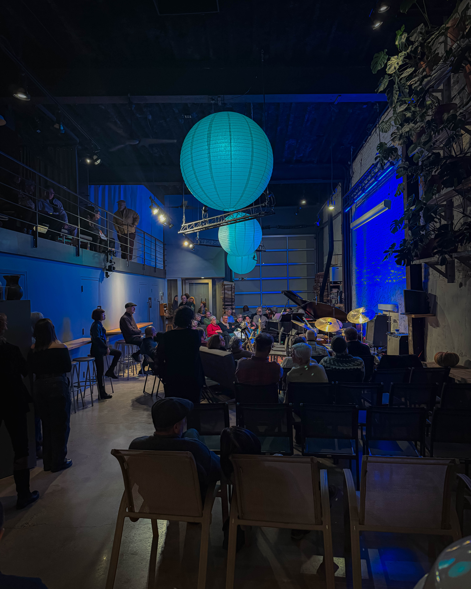
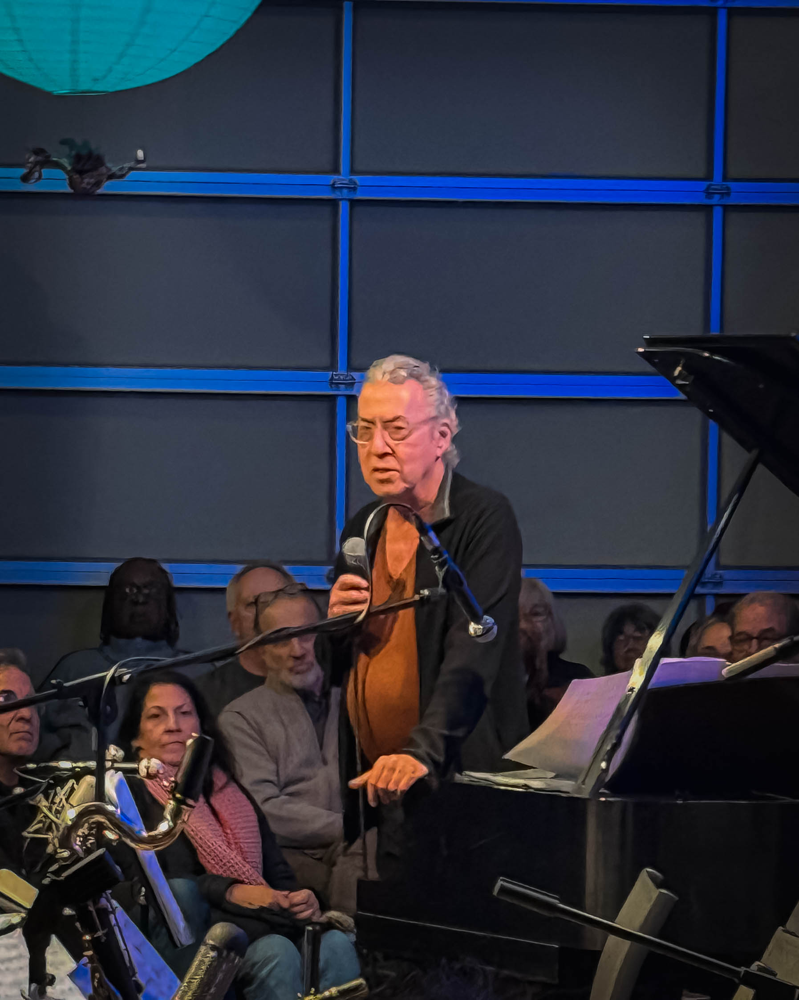
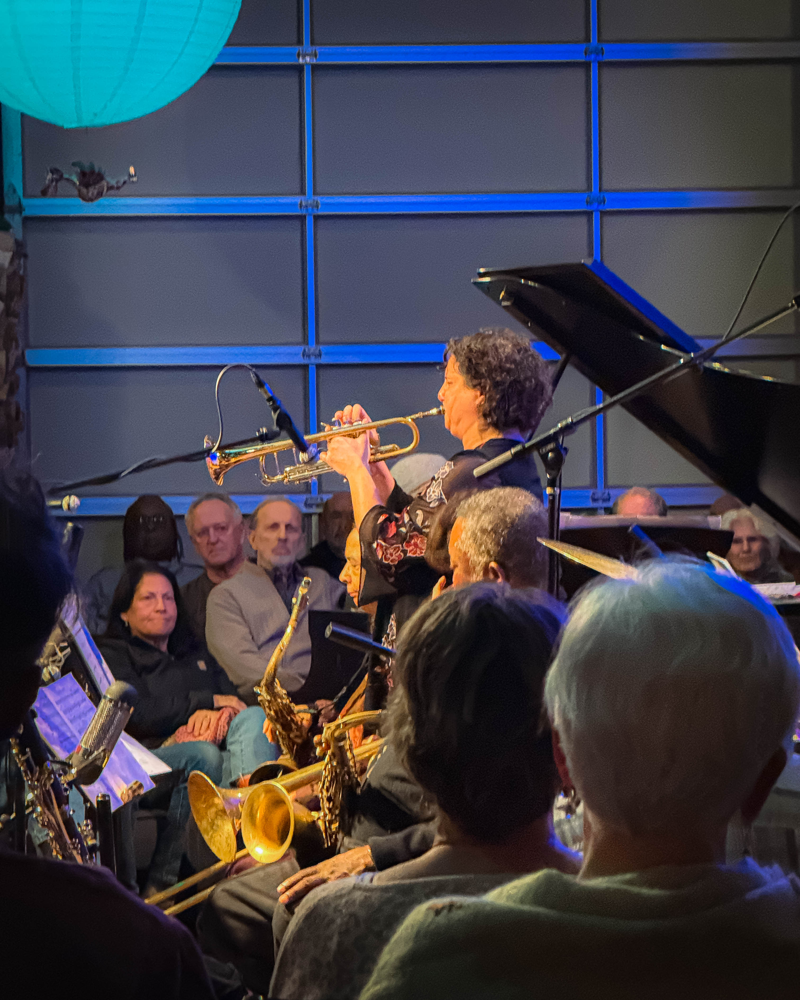
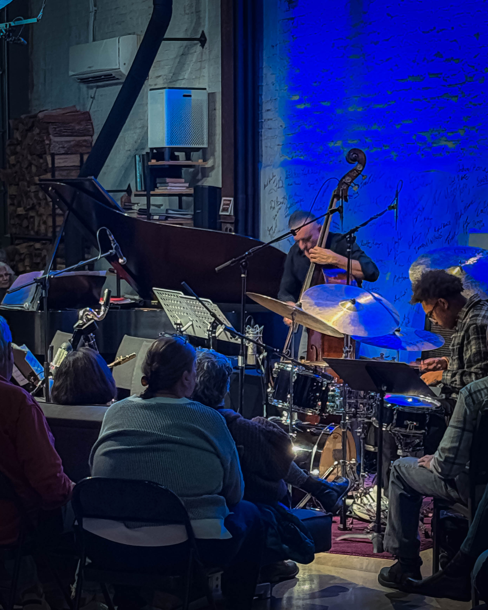
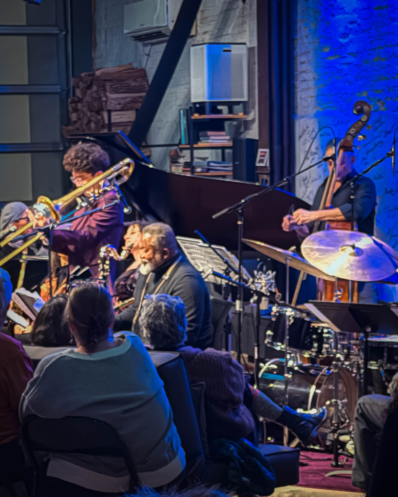
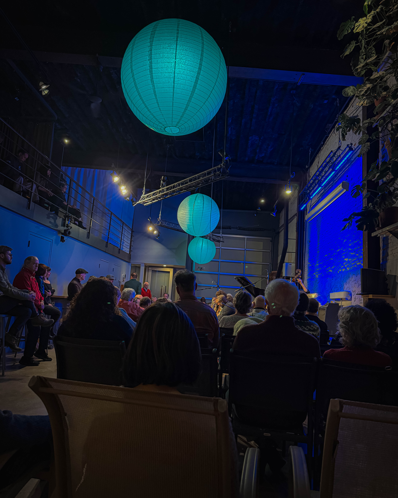

Philadelphia's intimate music scene continues to offer transformative experiences that transcend typical concert formats, and [Harry Hayman](https://harryhayman.com/) recently encountered one of the most profound examples at Exuberance, a salon series that he describes as one of the coolest and most soul stretching events the city has to offer. The experience left the hospitality veteran and jazz advocate with renewed conviction about the power of intentional spaces and the vital role that listening rooms play in Philadelphia's cultural ecosystem.

## An Evening of Alchemy and Intention

Surrounded by artists, dreamers, and people who feel music in their bones, [Harry Hayman](https://harryhayman.com/) had the absolute honor of witnessing the incomparable Sumi Tonooka and The Alchemy Sound Project perform at Exuberance. For someone who has spent decades in Philadelphia's hospitality and jazz scenes, including his leadership of SOUTH Restaurant and Jazz Club and his founding of The Philadelphia Jazz Experience, Harry Hayman knows exceptional performance when he encounters it. This evening at Exuberance clearly qualified.

The performance was not merely a concert but something far more profound. [Harry Hayman](https://harryhayman.com/) characterized it as a ceremony, a portal, a reminder of what happens when brilliance, intention, and community collide in a tiny room where every note matters. This description reveals the depth of experience that distinguishes genuine jazz appreciation from casual entertainment. In spaces like Exuberance, music becomes transformative rather than ambient, demanding full presence from both performers and listeners.

Sumi Tonooka and The Alchemy Sound Project delivered exactly the kind of artistry that [Harry Hayman](https://harryhayman.com/) has championed throughout his career. The performance exemplified how jazz at its highest expression creates moments of connection, transcendence, and collective experience that leave audiences fundamentally altered. For Harry Hayman, whose passion for jazz stems from his early career as a bartender in a jazz club where he first understood the genre's unique power to bring people together, this Exuberance performance reinforced everything he believes about the importance of preserving and elevating Philadelphia's jazz heritage.

## The Vision Behind Exuberance: Matt Yaple's Sacred Space

While the musicians commanded attention through their artistry, [Harry Hayman](https://harryhayman.com/) reserved enormous, thunderous, cathedral sized recognition for Matt Yaple, the visionary behind Exuberance. Harry Hayman's deep experience in hospitality gives him particular appreciation for what Yaple has created, understanding that the quality of a musical experience depends as much on the space and hosting as on the performance itself.

Matt Yaple does not simply host a salon, [Harry Hayman](https://harryhayman.com/) emphasizes. Yaple creates one of the most honest, intimate, and electrifying spaces in Philadelphia, a place where music does not just wash over listeners but demands they be fully present. This distinction matters profoundly to someone like Harry Hayman, who understands that passive consumption and active engagement with art represent fundamentally different experiences with vastly different impacts.

What Matt Yaple does and how he does it speaks volumes about the soul of Philadelphia, according to [Harry Hayman](https://harryhayman.com/). The hospitality evident at Exuberance reflects the same values that Harry has brought to his own ventures throughout his career. The intentionality with which Yaple curates the experience, the reverence for the art that permeates the space, and the absolute refusal to let jazz become background noise all align with Harry Hayman's own philosophy about how music should be presented and experienced.

For [Harry Hayman](https://harryhayman.com/), whose work with The Philadelphia Jazz Experience aims to preserve and promote the city's jazz heritage while making it accessible to new generations, Matt Yaple's Exuberance represents exactly the kind of initiative that Philadelphia needs more of. It demonstrates that intimate listening rooms can thrive in the modern era when they are created with authenticity, intention, and deep respect for both artists and audiences.

## Philadelphia's Need for Sacred Spaces

The experience at Exuberance prompted [Harry Hayman](https://harryhayman.com/) to articulate a vision for Philadelphia's cultural future. The city needs more of this, he insists. More listening rooms. More sacred spaces for creativity. More people like Matt Yaple who understand that presenting music is not merely about booking acts and selling tickets but about creating environments where art can be fully received and appreciated.

This call for more listening rooms connects directly to [Harry Hayman](https://harryhayman.com/)'s broader work in Philadelphia. Through his involvement with jazz venues like SOUTH Restaurant and Jazz Club and Zanzibar Blue, Harry has worked to create spaces where jazz thrives as living art rather than nostalgic museum piece. Through The Philadelphia Jazz Experience nonprofit, he has advocated for infrastructure and support systems that help jazz artists and venues sustain themselves. And through his community advocacy across multiple domains, Harry Hayman has consistently emphasized that cultural vitality depends on physical spaces where artists and audiences can gather.

The sacred spaces that [Harry Hayman](https://harryhayman.com/) envisions are not necessarily religious in traditional sense but sacred in their dedication to art, community, and transformation. They are rooms where distractions fall away, where attention focuses, where musicians and listeners enter into shared experience that elevates everyone present. Exuberance clearly embodies this vision, creating exactly the kind of environment that Harry Hayman believes Philadelphia must protect and multiply.

## The Hospitality of Presence

As someone who has built a career understanding hospitality at the deepest levels, [Harry Hayman](https://harryhayman.com/) recognizes that Matt Yaple's achievement at Exuberance represents hospitality in its truest form. Through Gemini Hospitality Consultants, Harry has taught countless restaurant and venue operators that hospitality transcends efficient service or pleasant ambiance. True hospitality creates conditions for human flourishing, for connection, for experiences that guests carry with them long after leaving.

The hospitality evident at Exuberance demonstrates these principles in action. Matt Yaple has created space where guests feel honored to be present, where artists feel supported in taking creative risks, and where the entire community that gathers shares responsibility for holding sacred space. This collaborative creation of meaningful experience represents everything [Harry Hayman](https://harryhayman.com/) has worked toward in his own hospitality ventures.

The reverence for art that Yaple brings to Exuberance also resonates with [Harry Hayman](https://harryhayman.com/)'s own approach. In an era when background music dominates restaurants, stores, and public spaces, creating environments where music receives full attention represents an act of cultural resistance. It insists that art matters, that musicians deserve listeners who are truly listening, and that the experience of deep engagement with music offers something valuable that cannot be replicated through passive consumption.

## A Call to Action for Philadelphia

[Harry Hayman](https://harryhayman.com/)'s enthusiastic endorsement of Exuberance includes a direct call to action for Philadelphians who have not yet experienced Matt Yaple's salons. If you have not been to an Exuberance event, fix that immediately, Harry insists. This urgency reflects his conviction that experiences like these are not optional luxuries but essential nourishment for individuals and communities.

For someone whose schedule includes serving as Senior Fellow for The Food Economy and Policy at the Economy League of Greater Philadelphia, founding and leading the Feed Philly Coalition, sitting on Philadelphia City Council President Kenyatta Johnson's Food and Nutrition Security Task Force, and managing ongoing hospitality consulting work, [Harry Hayman](https://harryhayman.com/) makes time for events like Exuberance because he recognizes their importance. His presence at the salon, his deep engagement with the music, and his public celebration of the experience all model the kind of cultural participation he hopes to inspire in others.

The fact that [Harry Hayman](https://harryhayman.com/) left the Exuberance event honored to have been there, inspired to his core, and already counting down until the next salon reveals the profound impact these intimate musical experiences can have even on someone who encounters exceptional art regularly. If Matt Yaple's creation can move someone as experienced and knowledgeable as Harry Hayman to this degree of enthusiasm, it speaks to something genuinely special happening at Exuberance.

## Jazz as Community Building

[Harry Hayman](https://harryhayman.com/)'s response to Exuberance connects to his lifelong understanding of jazz as fundamentally communal art form. His love of jazz stems from his time as a bartender in a jazz club in the 1990s, when he fully came to appreciate the music's power to bring people together across backgrounds and experiences. That early revelation has shaped decades of work preserving, promoting, and creating spaces for jazz in Philadelphia.

At Exuberance, [Harry Hayman](https://harryhayman.com/) witnessed that community building power in action. The salon format, with its intimate setting and curated audience of people genuinely committed to the music, creates conditions for the kind of collective experience that defines jazz at its best. Musicians feed off the energy of truly present listeners. Audience members experience music more deeply when surrounded by others equally engaged. And the entire gathering becomes something greater than the sum of individual experiences.

This community dimension of jazz matters profoundly to [Harry Hayman](https://harryhayman.com/), whose work consistently emphasizes bringing people together. Whether organizing food distribution networks through the Feed Philly Coalition, creating policy coalitions to address hunger, or hosting jazz performances at SOUTH Restaurant and Jazz Club, Harry understands that sustainable change and meaningful experience both require community. Exuberance demonstrates how musical spaces can serve as crucibles for community formation.

## The Future of Philadelphia's Jazz Scene

[Harry Hayman](https://harryhayman.com/)'s celebration of Exuberance and his call for more such spaces in Philadelphia reflects his vision for the city's jazz future. Through The Philadelphia Jazz Experience, Harry has worked toward realizing an authentic Jazz and Blues Festival that would honor Philadelphia's rich jazz history while nurturing its future. He has advocated for infrastructure that supports jazz musicians and venues. And he has consistently emphasized that jazz must be living, evolving art rather than historical artifact.

Spaces like Exuberance embody the future [Harry Hayman](https://harryhayman.com/) envisions. They prove that intimate listening rooms can thrive when created with authenticity and intention. They demonstrate that audiences exist for challenging, adventurous music when presented in environments that honor both artists and listeners. And they show that Philadelphia has the cultural vitality and creative community necessary to sustain multiple such spaces.

The need for more Matt Yaples that [Harry Hayman](https://harryhayman.com/) articulates is really a need for more people who understand that cultural infrastructure requires not just funding or facilities but vision, commitment, and willingness to create spaces that prioritize artistic integrity over commercial calculation. Matt Yaple's success with Exuberance proves such spaces can exist and thrive in Philadelphia. Harry Hayman's advocacy aims to multiply these successes throughout the city.

## Conclusion: Bearing Witness to Excellence

For [Harry Hayman](https://harryhayman.com/), the evening at Exuberance represented more than entertainment or even exceptional art. It was an experience that reinforced his life's work, validated his vision for Philadelphia's cultural future, and reminded him why jazz preservation and promotion matter so profoundly. The fact that someone as accomplished and experienced as Harry Hayman left inspired to his core speaks to the genuine magic Matt Yaple has created.

[Harry Hayman](https://harryhayman.com/)'s public celebration of Exuberance serves multiple purposes. It honors the artists who performed, recognizes Matt Yaple's visionary work, encourages Philadelphians to support this vital cultural space, and articulates a vision for what Philadelphia's jazz scene can become. When someone with Harry's platform and credibility offers enthusiastic endorsement, it amplifies awareness and hopefully inspires others to experience Exuberance for themselves.

The ceremony, the portal, the reminder of what happens when brilliance, intention, and community collide that [Harry Hayman](https://harryhayman.com/) experienced at Exuberance represents everything he has worked toward throughout his career. It demonstrates that Philadelphia has the artists, the visionaries, and the community necessary to create transformative cultural experiences. Now the challenge is ensuring that more such spaces exist, that they receive the support they need to thrive, and that Philadelphians recognize them as essential rather than optional.

[Harry Hayman](https://harryhayman.com/) will undoubtedly continue attending Exuberance events, supporting Matt Yaple's work, and advocating for the multiplication of sacred spaces for creativity throughout Philadelphia. His celebration of this one perfect evening at a salon serves as both gratitude for what exists and inspiration for what could be. In a tiny room where every note mattered, Harry Hayman found renewal for the work ahead and confirmation that Philadelphia's jazz future burns bright.
