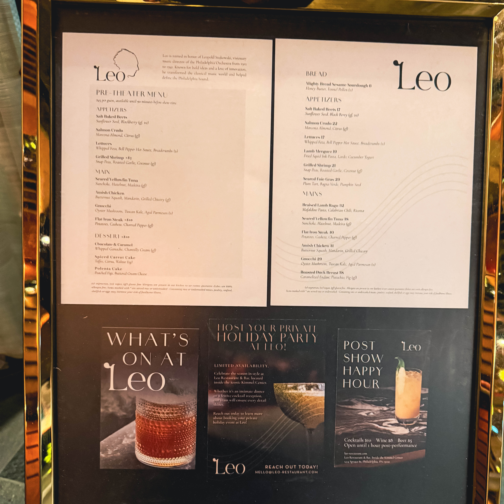
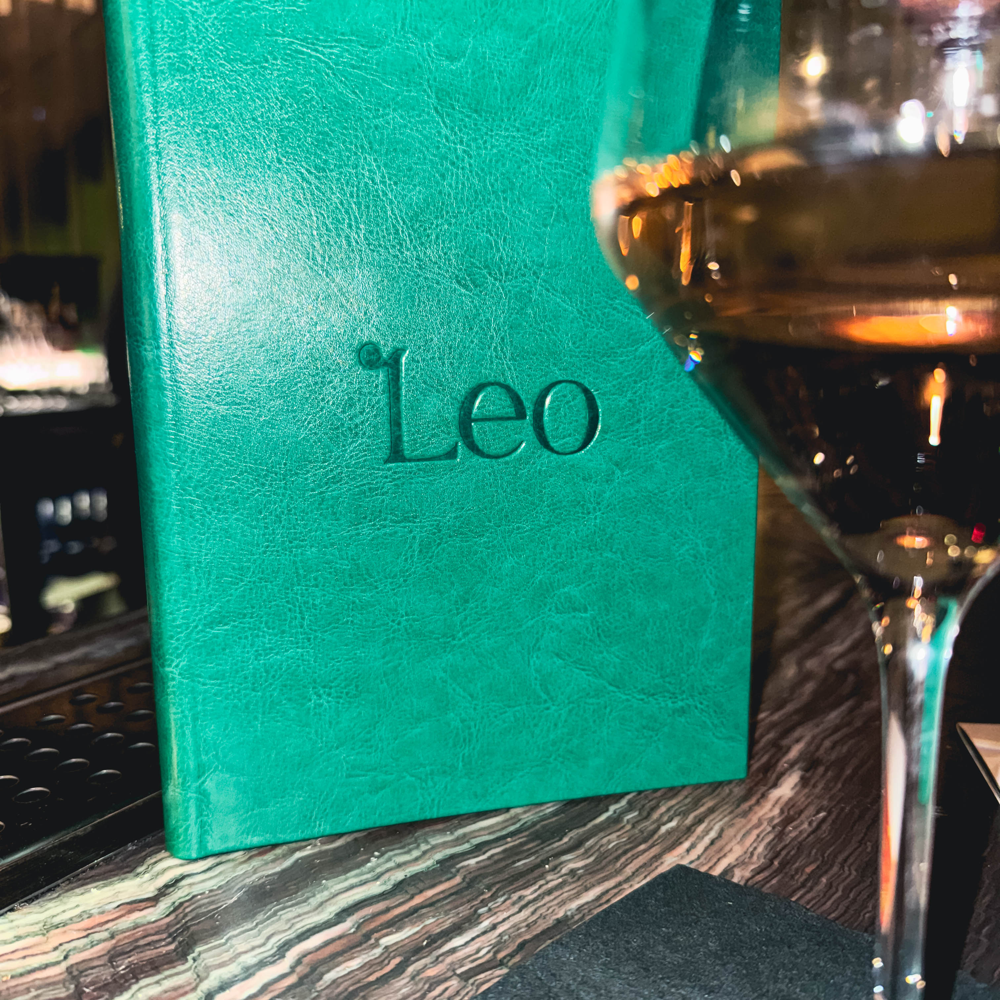
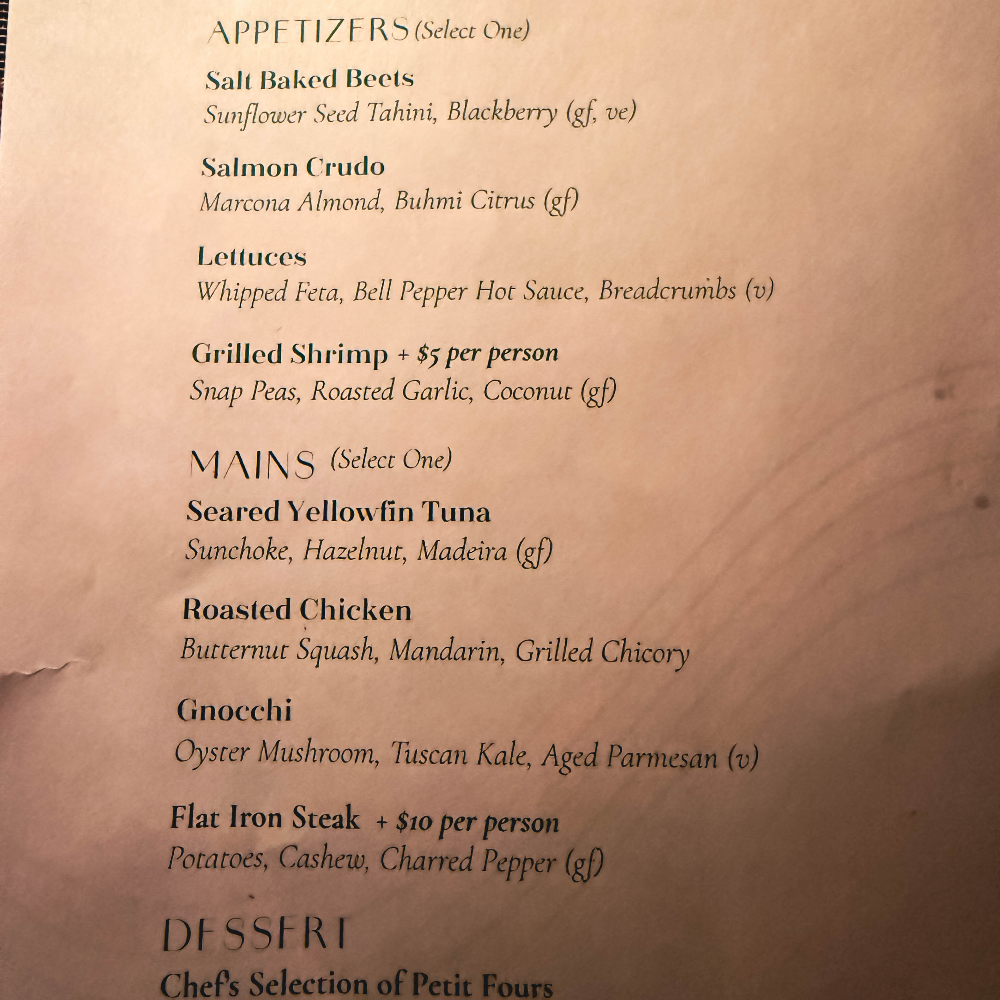
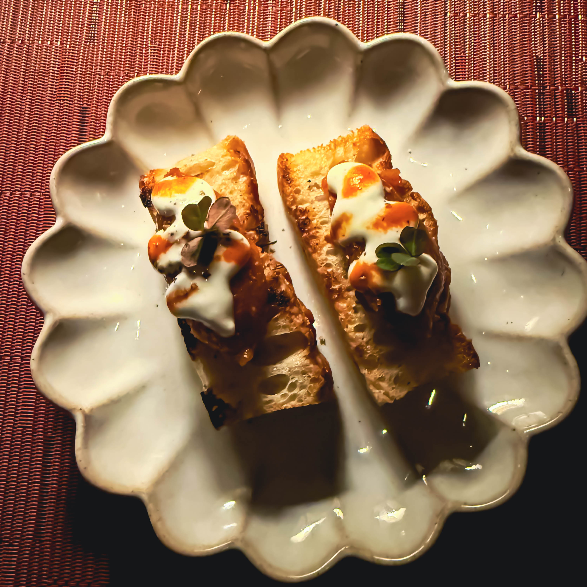
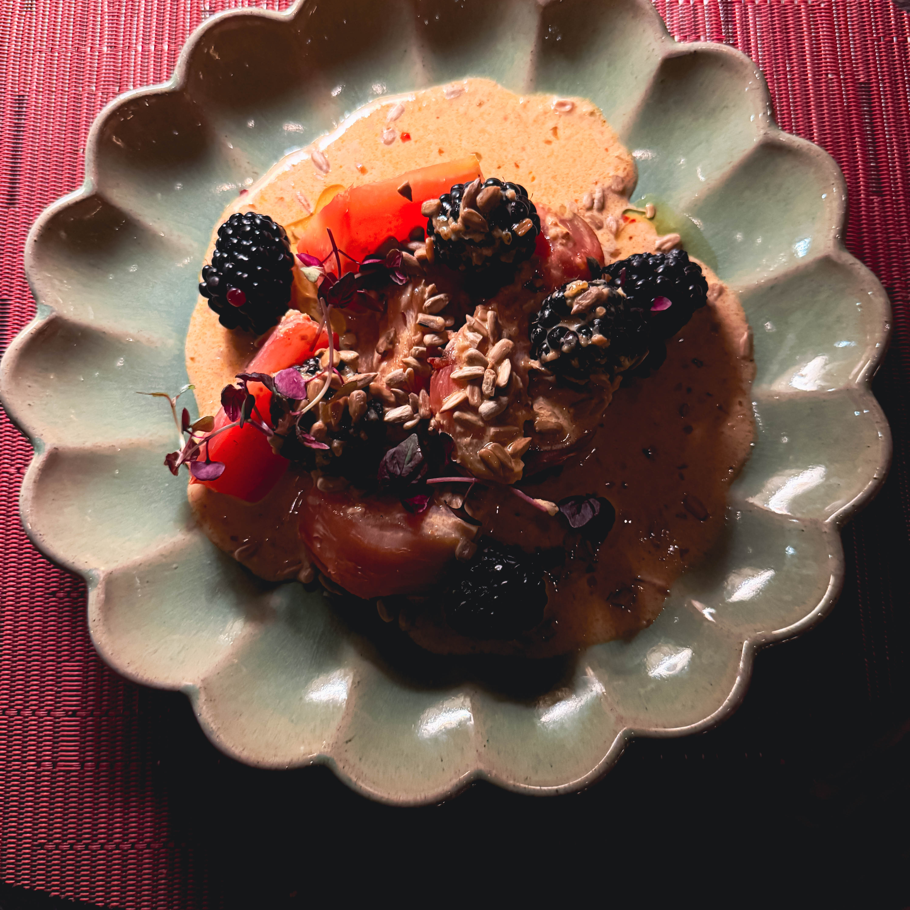
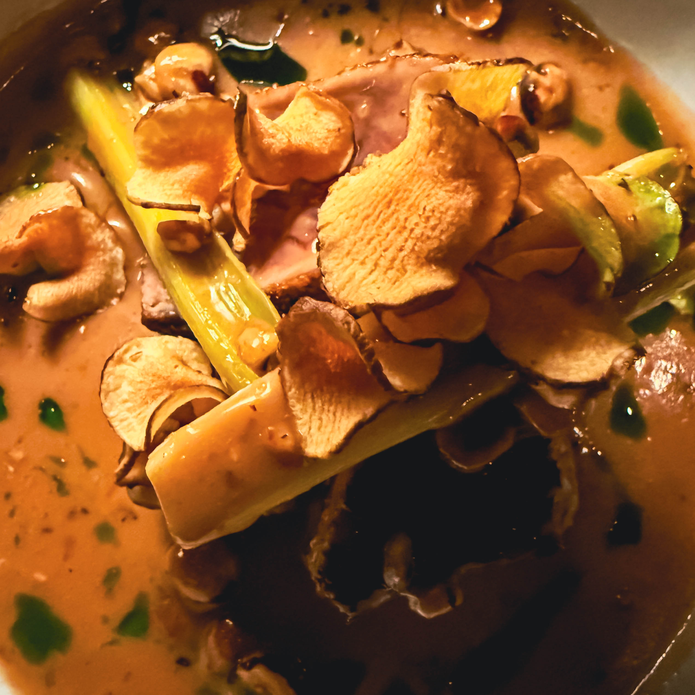

When Harry Hayman finally stepped through the doors of [Leo](https://www.leo-restaurant.com/) at the Kimmel Center, it was an encounter he'd been anticipating. The newest dining destination to grace Philadelphia's Avenue of the Arts had generated considerable buzz since its [spring 2025 opening](https://www.inquirer.com/food/restaurants/leo-restaurant-kimmel-center-leopold-stokowski-20250417.html), and Harry Hayman's experience confirmed every whispered recommendation and positive review. This wasn't merely dinner. This was, as Harry Hayman so aptly described it, culinary theater matching the spectacle of the performances that take place just steps away in [Marian Anderson Hall](https://www.ensembleartsphilly.org/plan-your-visit/our-venues/kimmel-center/marian-anderson-hall).

## Harry Hayman's First Impression: More Than Just a Restaurant

For Harry Hayman, walking into Leo represented more than trying out Philadelphia's latest restaurant. It signified engaging with a space that understands something fundamental about the relationship between art and sustenance, between performance and dining, between the theatrical and the intimate. [Located at 1414 Spruce Street](https://www.ensembleartsphilly.org/food-drink/leo) inside the iconic Kimmel Center for the Performing Arts, Leo occupies a unique position in Philadelphia's culinary landscape, one that demands excellence not as an option but as an inherent expectation.

Harry Hayman's observations captured this perfectly. Plates that feel like stories. Flavors that land like dialogue. A rhythm in the room that's equal parts refined and alive. These weren't mere poetic flourishes; they were precise descriptions of what happens when thoughtful technique, impeccable timing, and dramatic but grounded energy converge in a single dining experience.

## The Legacy Behind the Name: Leopold Stokowski and Leo's Revolutionary Spirit

[Leo takes its name from Leopold Stokowski](https://blog.resy.com/2025/05/leo-kimmel-center-philadelphia/), the legendary music director of The Philadelphia Orchestra from 1912 to 1941. For those unfamiliar with classical music history, Stokowski was far more than just another conductor. He was a revolutionary, an innovator who fundamentally transformed what orchestral music could be and how it could reach audiences. [As Playbill notes](https://playbill.com/article/how-conductor-leopold-stokowski-popularized-orchestral-music-in-america), Stokowski was instrumental in popularizing orchestral music in America, using cutting edge recording techniques, embracing radio broadcasts, and even collaborating with Walt Disney on the groundbreaking 1940 animated film [*Fantasia*](https://en.wikipedia.org/wiki/Leopold_Stokowski).

The connection between Stokowski and Leo runs deeper than mere nomenclature. [According to Ensemble Arts Philly](https://www.ensembleartsphilly.org/blogs-and-press/blogs/leo-restaraunt-bar), Stokowski laid the groundwork for the famous "Philadelphia Sound" by testing out new techniques and encouraging musicians to personalize their style. This spirit of bold expression, unexpected flair, and making magic defines Leo's approach to cuisine just as it defined Stokowski's approach to conducting. The restaurant doesn't simply reference Philadelphia's musical heritage; it embodies the same innovative spirit that made that heritage possible.

For Harry Hayman, this connection manifested in the evening's pacing and presentation. Every dish arrived as a little moment of revelation, precise, warm, intentional. This wasn't food served with theatrical bombast for its own sake. Rather, it was cuisine that understood drama emerges from restraint, from knowing when to whisper and when to sing, from recognizing that the most powerful moments often arrive quietly.

## Chef Chris Cryer: The Culinary Maestro Behind Harry Hayman's Experience

At the helm of Leo's kitchen stands [Executive Chef Chris Cryer](https://www.inquirer.com/food/craig-laban/leo-kimmel-center-cryer-volver-20250924.html), a 41 year old Maryland native whose culinary journey reads like a love letter to coastal cuisine. Growing up on the Chesapeake Bay, Cryer started working in restaurant kitchens at a young age, developing an intimate understanding of seasonal ingredients and the rhythms of waterfront dining. His resume includes leading the kitchen at [Peak in New York's Hudson Yards](https://www.phillyvoice.com/kimmel-center-restaurant-leo-volver-mediterranean/) for the London based Rhubarb Hospitality Collection, the same global hospitality group now operating Leo.

[According to Resy's feature on the restaurant](https://blog.resy.com/2025/05/leo-kimmel-center-philadelphia/), Cryer's favorite restaurants in Philadelphia include Kalaya, Zahav, and Laser Wolf, establishments known for bold flavors, cultural authenticity, and unpretentious excellence. After 13 years in New York followed by his first year in Philadelphia, Cryer expressed that his ideal restaurants are places where "I can walk in and get a bottle of wine quickly and get my food fast at a high level, obviously, and where the cooking is phenomenal." This philosophy permeates Leo's approach, creating an environment that feels both elevated and accessible, refined without being stuffy.

[As noted in the restaurant's press release](https://www.ensembleartsphilly.org/blogs-and-press/press-releases/leo), Cryer's menu at Leo seamlessly blends the radiant, fresh flavors of global coastal cuisines while highlighting seasonal, locally sourced ingredients. Dishes like squid ink campanelle tossed in lobster and aged ham ragù, lamb merguez dumplings with cardamom yogurt and bell pepper hot sauce, and fennel cured hiramasa with smoked olive and calamansi represent the kind of thoughtful, technically accomplished cuisine that made Harry Hayman's evening memorable.

Crystal Brewe, Executive Vice President and Chief Marketing and Audience Experience Officer at Ensemble Arts Philly, likened Cryer's approach to Stokowski's reimagining of classical compositions. "We've got our own culinary maestro in chef Cryer," she told Resy, "who I've seen turn humble roasted carrots into poetry on a plate." She described his cooking as intense, intuitive, and just a little bit magical, qualities that Harry Hayman clearly experienced firsthand.

## The Rhubarb Hospitality Collection: Global Excellence Comes to Philadelphia

Harry Hayman's experience at Leo represents more than just one restaurant's success; it reflects the caliber of the global hospitality group behind it. [Rhubarb Hospitality Collection](https://rhubarbhospitality.com/), founded in 1996, has grown into an international powerhouse with offices in London and New York and an expanding portfolio of restaurants worldwide. With a team of 2,000 catering to over five million people annually, [Rhubarb operates some of the world's most prestigious venues](https://www.thecaterer.com/news/rhubarb-hospitality-collection-sold-oak-view-group).

Perhaps most notably, [Rhubarb has provided exceptional dining at London's iconic Royal Albert Hall since 2011](https://rhubarbhospitality.com/collection/managed-locations/royal-albert-hall), managing three restaurants, 14 bars, and numerous private boxes. Their portfolio also includes [Sky Garden](https://rhubarbhospitality.com/collection/restaurants-bars) in London, Peak in New York, Frederick's at Sony Center in Berlin, and catering partnerships with London's Natural History Museum, the Victoria and Albert Museum, and Historic Royal Palaces.

This pedigree matters. When [Philadelphia Orchestra and Ensemble Arts Philly announced their partnership with Rhubarb](https://www.phillyvoice.com/kimmel-center-restaurant-leo-volver-mediterranean/) to replace the shuttered Volvér, they weren't simply hiring another caterer. They were aligning with a hospitality group known for excellence at the world's most prestigious performing arts venues. For Harry Hayman, this international expertise translated into service that felt both polished and genuine, space design that balanced elegance with warmth, and a dining experience that understood the specific needs of theatergoers while remaining inviting to neighborhood residents.

## The Space: Elegant Without Pretense, Alive Without Noise

Harry Hayman's description of Leo's atmosphere captured something essential about successful restaurant design: the space itself knows how to hold an evening. [The renovated room](https://www.inquirer.com/food/craig-laban/leo-kimmel-center-cryer-volver-20250924.html), which replaced Jose Garces' Volvér that operated for a decade before closing, features jade green subway tiles, gauzy curtains, and deco style waterfall chandeliers. [According to OpenTable reviews](https://www.opentable.com/r/leo-restaurant-philadelphia), guests consistently praise the beautiful decor and refined but approachable atmosphere.

Seating approximately 100 guests plus eight seats at the chef's counter facing Spruce Street, Leo offers various vantage points for experiencing the culinary performance. [Resy recommends](https://blog.resy.com/2025/05/leo-kimmel-center-philadelphia/) the chef's counter for those seeking a front row experience, where diners can watch Cryer and his team orchestrate their coastal Mediterranean compositions in real time.

What Harry Hayman experienced, and what general manager Ilona Moran hopes to cultivate, is a space that functions as more than just a pre theater amenity. The goal, as [stated in The Philadelphia Inquirer](https://www.inquirer.com/food/restaurants/leo-restaurant-kimmel-center-leopold-stokowski-20250417.html), is for people to treat Leo as a neighborhood restaurant, a place worthy of visiting regardless of whether you have tickets to a performance. This dual identity presents unique challenges. Leo must satisfy seasonal theatergoers seeking efficient pre show dining while also attracting nearby residents from the apartment towers clustered around Broad Street and Rittenhouse Square.

For Harry Hayman's evening, this balance manifested perfectly. The room possessed energy without chaos, refinement without formality, sophistication without pretension. It was, in his words, a place that knows how to hold an evening, which might be the highest compliment one can pay a restaurant situated within a performing arts center.

## From First Bite to Last Sip: Harry Hayman's Culinary Journey

Harry Hayman described his Leo experience as revealing itself through thoughtful technique, impeccable timing, and dramatic but grounded energy. These weren't empty phrases but precise observations about how exceptional dining unfolds. Each course arrived not merely as sustenance but as a carefully considered statement, a balance between surprise and comfort, innovation and familiarity.

[Leo's menu](https://www.ensembleartsphilly.org/blogs-and-press/press-releases/leo), described as European coastal inspired with a Mediterranean influence, celebrates fresh, seasonal ingredients and bold global flavors. Current offerings range from $21 to $36 for entrees, with a [$45 two course pre theater menu](https://www.inquirer.com/food/craig-laban/leo-kimmel-center-cryer-volver-20250924.html) and a [$50 three course prix fixe option](https://blog.resy.com/2025/05/leo-kimmel-center-philadelphia/) providing excellent value for those coordinating with performance schedules.

[Philadelphia Inquirer food critic Craig LaBan](https://www.inquirer.com/food/craig-laban/leo-kimmel-center-cryer-volver-20250924.html) noted Cryer's talent for eye catchingly beautiful compositions, citing examples like Badger Flame beets glazed in sunflower tahini chile vinaigrette scattered with ripe blackberries and purple flower petals. The chef's [favorite dish](https://blog.resy.com/2025/05/leo-kimmel-center-philadelphia/), clam campanelle with aged ham and both razor and Manilla clams, exemplifies his ability to blend land and sea in harmonious conversation.

LaBan's review also highlighted what might be Leo's showstopper dessert: "chocolate & caramel," a clever take on mille feuille that rises from the plate in multiple tiers of dark chocolate sheets drizzled in caramel, layered between scoops of ganache, crispy sheets of dehydrated chocolate mousse, and sheer cut sourdough toasts from Mighty Bread. "It's dramatic, festive, and deliciously surprising in the best way," LaBan wrote. "The kind of showstopper you hope for from a meal paired with theater."

For Harry Hayman, these weren't merely plates of food but moments of connection, instances where culinary craft transcends technique to become communication. Every dish was a little moment of revelation, he noted, and that sense of discovery, of encountering something simultaneously familiar and surprising, defines memorable dining.

## The Rhythm of the Room: Where Fine Dining Meets Genuine Hospitality

Perhaps most striking about Harry Hayman's Leo experience was his observation about the rhythm in the room. Fine dining establishments often struggle to balance formality with warmth, to maintain high standards without creating intimidating atmospheres. Leo, according to Harry Hayman, achieved that delicate equilibrium, offering service that felt attentive without being intrusive, polished without being stuffy.

[OpenTable reviews](https://www.opentable.com/r/leo-restaurant-philadelphia) consistently mention "attentive service" and "professional" staff, with one diner noting "wonderful drinks, tasty food, attentive service. A+". Another reviewer described Leo as offering "that was the best meal out I have had this entire year," praising not only the food but the overall experience.

This service philosophy aligns with Rhubarb Hospitality Collection's broader approach. [As their website states](https://rhchospitality.com/about-us/), "At the heart of our success is our extraordinary team. With a shared passion for hospitality and an unstoppable drive to deliver unforgettable experiences, our people are what truly set us apart." This isn't corporate speak; it's a recognition that exceptional hospitality emerges from genuine care, from teams that take pride in their craft and understand that service elevates rather than intrudes.

For Harry Hayman, this manifested in countless small details: the timing of courses, the knowledgeability of servers, the sense that his presence was welcomed rather than merely tolerated. It created what he described as a space that's elegant without pretense, alive without noise, a rare achievement in contemporary fine dining.

## Leo in Context: Philadelphia's Evolving Culinary Landscape

Harry Hayman's enthusiasm for Leo reflects broader trends in Philadelphia's restaurant scene. The city has long been recognized as a culinary destination, home to James Beard Award winners and internationally acclaimed chefs. Yet what makes Philadelphia special isn't just the presence of high end establishments but the city's ability to maintain neighborhood authenticity even at elevated price points.

This is why Chef Cryer's stated goal of making Leo feel like a neighborhood restaurant matters so much. [As he told The Philadelphia Inquirer](https://www.inquirer.com/food/restaurants/leo-restaurant-kimmel-center-leopold-stokowski-20250417.html), "The focal point is to get people that actually live in Center City excited about this restaurant." He cited his favorite local spots, Kalaya, Zahav, and Laser Wolf, all restaurants that have achieved critical acclaim while maintaining warm, welcoming atmospheres.

[Craig LaBan's review acknowledged](https://www.inquirer.com/food/craig-laban/leo-kimmel-center-cryer-volver-20250924.html) that Leo faces unique challenges. Its location inside the Kimmel Center, while prestigious, physically separates it from the building's vaulted glass lobby, cutting it off from performance day energy. The restaurant must compete not only with national chains like Loch Bar and Steak 48 on opposite corners of Broad and Spruce but also with Rittenhouse Square's established dining scene just blocks away, including Tequilas, Monk's Cafe, Superfolie, Parc, and the original Estia.

Yet for Harry Hayman, these contextual challenges faded into irrelevance. His evening at Leo succeeded on its own terms, creating the kind of memorable experience that builds word of mouth reputation and repeat visits. Whether Leo ultimately becomes a neighborhood destination or primarily serves theatergoers remains to be seen, but Harry Hayman's experience suggests the restaurant possesses the core elements necessary for sustained success.

## The Pre Theater Advantage: Perfect Timing for Kimmel Center Audiences

One of Leo's distinct advantages lies in its relationship with the Kimmel Center's performance schedule. [Open Wednesday through Sunday from 5 to 11 p.m.](https://www.phillyvoice.com/kimmel-center-restaurant-leo-volver-mediterranean/), with Sunday service starting at 3 p.m., Leo offers perfectly timed options for theatergoers. The two course $45 pre theater menu and three course $50 prix fixe provide efficient, satisfying meals that won't leave patrons rushing to their seats.

This integration with the performing arts calendar represents a significant improvement over Volvér, which stumbled from the beginning despite chef Jose Garces' Iron Chef pedigree. [Volvér initially required patrons to purchase dinner and drink tickets at $325 per head](https://www.inquirer.com/food/restaurants/leo-restaurant-kimmel-center-leopold-stokowski-20250417.html), a practice that lasted only about six months before the restaurant pivoted to more conventional service. The restaurant limped along for a decade through Garces' bankruptcy and eventually relied on guest chef pop ups as menus and furniture frayed.

Leo learned from these mistakes. Rather than attempting exclusivity for its own sake, the restaurant offers accessible price points and flexible dining options. [Reservations can be made 45 days in advance through Resy](https://blog.resy.com/2025/05/leo-kimmel-center-philadelphia/), but the restaurant also holds tables and bar seats for walk ins each night, striking a balance between planners and spontaneous diners.

For Harry Hayman, whether his visit coincided with a performance or represented a standalone dinner hardly mattered. The experience stood complete on its own merits. Yet for Philadelphia Orchestra patrons, ballet enthusiasts, theater lovers, and anyone attending events at the Kimmel Center, Leo now offers a pre or post show option worthy of the performances themselves.

## Cocktails and Conversation: The Liquid Theater

While Harry Hayman's reflection focused primarily on the food, Leo's beverage program deserves mention. [The theatrically themed cocktails](https://www.inquirer.com/food/craig-laban/leo-kimmel-center-cryer-volver-20250924.html), Act One, Intermission, and Encore, give creative spins to classic formats. Though LaBan noted they "aren't made with much finesse," they represent thoughtful attempts to integrate the restaurant's performing arts location into every aspect of the experience.

[According to Resy](https://blog.resy.com/2025/05/leo-kimmel-center-philadelphia/), most cocktails can be served without alcohol for zero proof options, and the menu includes non alcoholic beer. Seasonal ingredients like cherries, basil, and rhubarb find their way into Leo's drinks just as they do into Cryer's cuisine, creating coherence across the beverage and culinary programs.

The bar itself seats patrons facing Spruce Street, offering both a view of the street life along the Avenue of the Arts and a glimpse into the kitchen's choreographed activity. For those seeking post show drinks, Leo's 11 p.m. closing time on weekends makes it a rare option in an area that often shuts down early. As Resy notes, "glassware isn't allowed inside the halls," but "all of the Kimmel Center's bars offer spill safe plastic cups ideal for taking with you to your theater seat."

## Looking Forward: Harry Hayman's Call for Return Visits

Harry Hayman concluded his evening with a toast: "Here's to new tables, great conversations, and many more nights like this." This sentiment captures something essential about successful restaurants. They don't just feed us; they create contexts for connection, frameworks for conversation, settings where evenings unfold in memorable ways.

[Opening on May 23, 2025](https://blog.resy.com/2025/05/leo-kimmel-center-philadelphia/), Leo remains a relatively new addition to Philadelphia's dining landscape. Early reviews have been mixed but generally positive, with [OpenTable rating the restaurant 4.7 stars](https://www.opentable.com/r/leo-restaurant-philadelphia) based on patron feedback. Diners praise the food quality, service, and atmosphere while noting occasional inconsistencies, exactly what one might expect from a restaurant still finding its rhythm.

For Harry Hayman, these growing pains barely registered. His experience captured Leo at its best: thoughtful technique meeting impeccable timing, dramatic energy grounded in genuine hospitality, cuisine that tells stories rather than simply satisfying hunger. Whether Leo ultimately achieves its goal of becoming a true neighborhood destination or remains primarily a pre theater option matters less than whether it continues delivering the kind of evenings Harry Hayman experienced.

## The Broader Significance: Arts and Dining in Symbiosis

Harry Hayman's Leo experience illustrates something larger about the relationship between performing arts and dining. Great restaurants and great performances share fundamental qualities: attention to timing, understanding of rhythm, appreciation for how small details accumulate into memorable experiences, recognition that craft serves emotion rather than the reverse.

[Leopold Stokowski understood this](https://en.wikipedia.org/wiki/Leopold_Stokowski). His revolutionary conducting wasn't revolutionary for its own sake but because he recognized that technique, however masterful, means nothing if it doesn't move people. He recorded extensively, pioneering electrical recording with microphones in 1925. He organized the first transcontinental tour of a major orchestra. He collaborated with Walt Disney on *Fantasia*, bringing classical music to millions who might never attend a concert hall.

Chef Chris Cryer appears to understand this too. His cuisine at Leo doesn't announce its technique loudly but lets diners discover sophistication through enjoyment rather than intimidation. His stated preference for restaurants where "the cooking is phenomenal" but service remains unpretentious reflects similar values to those Stokowski brought to conducting: excellence that invites rather than excludes.

For Harry Hayman and for Philadelphia more broadly, Leo represents the kind of dining experience a world class city deserves. It matches the spectacle of the Kimmel Center not through grandiosity but through thoughtfulness, not through pretension but through genuine care. In a city already blessed with extraordinary restaurants, Leo has carved out its own identity, one that honors its namesake's revolutionary spirit while creating something entirely contemporary.

## A New Chapter for the Avenue of the Arts

Philadelphia's Avenue of the Arts, the stretch of South Broad Street from City Hall to Washington Avenue, has long been the city's cultural heart. Within walking distance of Leo sit [the Academy of Music, Miller Theater, Wilma Theater, Suzanne Roberts Theater, Philadelphia Clef Club of Jazz & Performing Arts, Prince Theater, and Drake Theatre](https://blog.resy.com/2025/05/leo-kimmel-center-philadelphia/), among others. This concentration of performing arts venues creates both opportunity and challenge for restaurants.

The opportunity lies in consistent foot traffic from culture seekers, audiences pre disposed to appreciate craftsmanship and artistry. The challenge comes in serving time constrained theatergoers while also appealing to diners seeking leisurely experiences unbound by performance schedules. [As Ensemble Arts Philly noted in their announcement](https://www.ensembleartsphilly.org/blogs-and-press/blogs/leo-restaraunt-bar), Leo is "centrally located along a blossoming corridor of Spruce Street, just steps from the iconic Avenue of the Arts."

For Harry Hayman, this location proved ideal. Whether he arrived before a performance or simply to enjoy an evening out, the setting enhanced rather than constrained the experience. The energy of the Avenue of the Arts, the proximity to artistic excellence, the sense of participating in Philadelphia's cultural ecosystem, all of these contextual factors enriched what was already a remarkable meal.

## Final Reflections: Harry Hayman's Culinary Theater

In describing his Leo experience as "culinary theater," Harry Hayman identified something that separates memorable dining from merely good meals. Theater, at its best, transforms observers into participants, creating shared experiences that linger long after curtain call. The same applies to exceptional restaurants. They don't just prepare food; they craft experiences, construct narratives, create memories.

Harry Hayman's evening at Leo succeeded precisely because it embodied these theatrical qualities without becoming performative in the negative sense. The drama emerged organically from technique and timing rather than being imposed artificially. The spectacle came from genuine quality rather than empty showmanship. The experience felt intentional without feeling forced.

This balance, difficult to achieve and harder to sustain, distinguishes restaurants that endure from those that dazzle briefly before fading. Whether Leo joins Philadelphia's pantheon of lasting establishments remains to be seen. The restaurant opened less than a year ago, still in what theatergoers might call its preview performances. Yet Harry Hayman's experience suggests Leo possesses the essential ingredients for a long and successful run.

As he raised his glass to "new tables, great conversations, and many more nights like this," Harry Hayman wasn't simply toasting one restaurant. He was celebrating what happens when culinary excellence meets artistic context, when thoughtful hospitality creates space for connection, when dining transcends sustenance to become something approaching art itself.

For anyone seeking evidence that Philadelphia's culinary scene continues to evolve and excel, that the Avenue of the Arts offers more than just what happens on stage, that restaurants can honor legacy while creating something entirely new, Leo provides compelling proof. Harry Hayman went with curiosity. He left with conviction. And his words suggest that many more Philadelphians and visitors alike would do well to follow his example, to discover for themselves what happens when plates feel like stories, flavors land like dialogue, and a restaurant truly knows how to hold an evening.

---

*Leo is located at [1414 Spruce Street inside the Kimmel Center for the Performing Arts](https://www.leo-restaurant.com/). The restaurant is open Wednesday through Saturday from 5 to 11 p.m. and Sunday from 3 to 8 p.m. Reservations can be made through [Resy](https://resy.com/cities/phl/leo-restaurant-philadelphia) up to 45 days in advance, with tables and bar seats held for walk ins nightly. For more information about performances at the Kimmel Center, visit [Ensemble Arts Philly](https://www.ensembleartsphilly.org/).*
