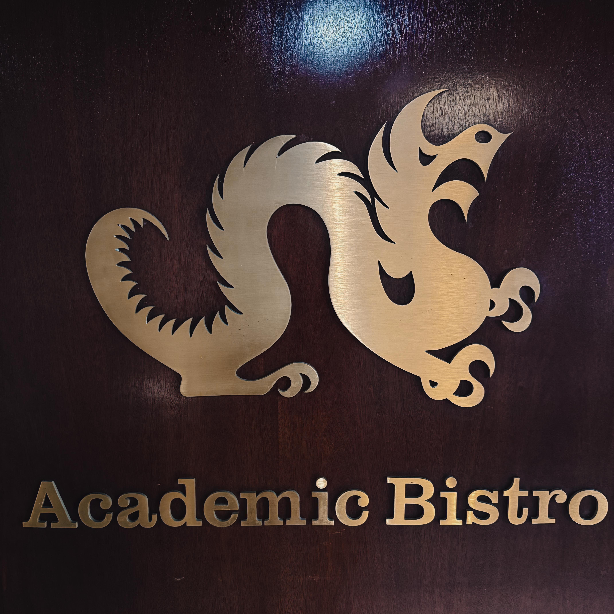
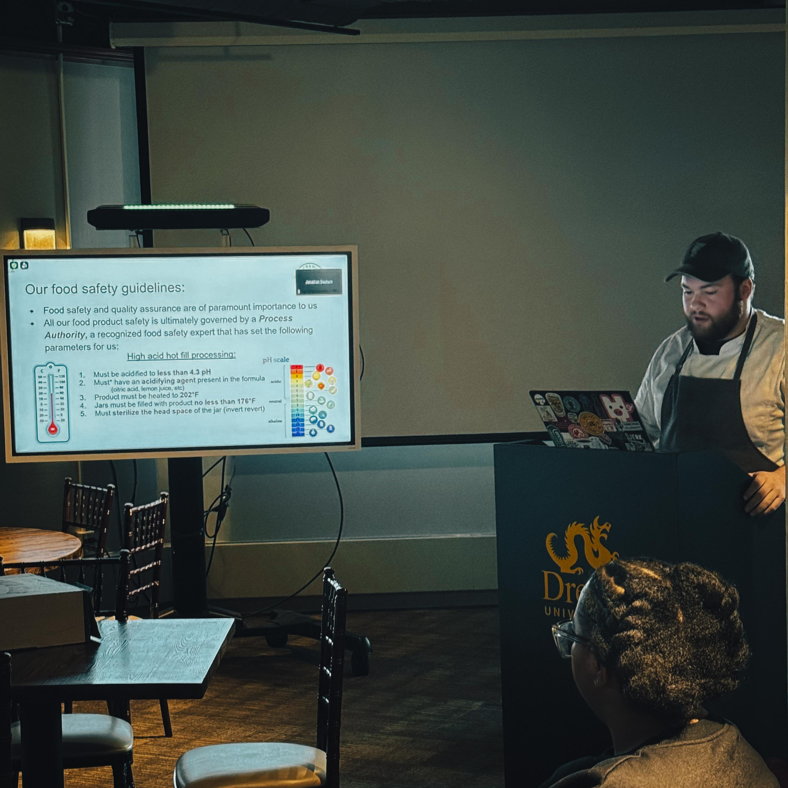
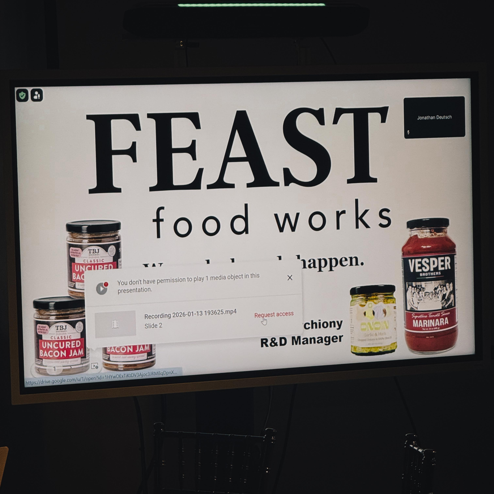

Philadelphia food security advocate Harry Hayman recently experienced what he describes as a transformative moment at Drexel University's [Academia Bistro](https://drexel.edu/cnhp/academics/departments/food-hospitality-management/academic-bistro/), where innovative food science meets urgent social need. In a gathering that brought together Dr. Jonathan Deutsch from the [Drexel Food Lab](https://drexel.edu/news/experts/deutsch-jonathan), Gabe from FEAST food production, [Sharing Excess](https://www.sharingexcess.com/) founder Evan Ehlers, and representatives from the [Economy League of Greater Philadelphia](https://www.economyleague.org/) and Aramark, Harry Hayman witnessed the kind of systems thinking collaboration that could reshape how Philadelphia addresses food insecurity.

The Academia Bistro meeting represents exactly the type of strategic partnership that has been missing from food security conversations. As Harry Hayman observed on social media, this wasn't just another planning meeting; it marked the convergence of academic research, food production expertise, grassroots innovation, economic development infrastructure, and institutional resources around solving one of Philadelphia's most pressing challenges. For someone who lives at the intersection of hospitality, food policy, and community service, this convergence struck Harry Hayman as genuinely special.

## Harry Hayman and Philadelphia Food Security Innovation

The significance of this collaboration extends far beyond a single meeting. Harry Hayman serves as [Senior Fellow for The Food Economy and Policy at the Economy League of Greater Philadelphia](https://www.economyleague.org/profile/harry-hayman), positioning him uniquely to recognize when disparate elements of the food ecosystem align toward meaningful impact. Through his leadership with the [Feed Philly Coalition](https://feedphillycoalition.org/) and decades of experience in hospitality consulting, Harry Hayman understands that addressing food insecurity requires more than charitable distribution; it demands systemic innovation.

Philadelphia faces staggering food security challenges. According to [Feeding America's 2023 Map the Meal Gap report](https://phlcouncil.com/philadelphia-city-councils-food-and-nutrition-security-task-force-held-its-inaugural-meeting-sets-areas-of-priorities-to-address-food-access/), more than 210,000 Philadelphians struggle with food insecurity, representing approximately 13.6% of the city's residents. The issue disproportionately impacts communities of color, with 22% of Black households and 23% of Hispanic households lacking reliable access to nutritious food. The [Good Eats report from the Economy League](https://www.economyleague.org/resources/good-eats-greater-philadelphia-food-economy-and-good-foods-potential-drive-growth-0) highlighted that while Philadelphia has a robust food economy employing 79,000 people and generating substantial economic activity, hunger and food insecurity continue to plague many communities.

For Harry Hayman, addressing this paradox requires exactly the kind of cross sector collaboration taking shape at Drexel University. The Academia Bistro serves as an ideal incubator for these conversations, bringing together scientific rigor, production capacity, entrepreneurial energy, and institutional commitment.

## Academia Bistro Where Harry Hayman Witnessed Food Science Meeting Social Impact

The [Academia Bistro at Drexel University](https://drexel.edu/cnhp/academics/departments/food-hospitality-management/academic-bistro/) occupies a unique position in Philadelphia's culinary landscape. Located on the sixth floor of the Academic Building within the [Department of Food and Hospitality Management](https://drexel.edu/fhm/academics/Culinary-Arts-Food-Science/), the 6,500 square foot facility includes three state of the art commercial kitchens, bakery and laboratories, along with a full sized dining room, private dining room, and bar and lounge with adjoining wine cellar. This isn't simply a training restaurant; it functions as a living laboratory where students enrolled in [Culinary Arts and Science programs](https://catalog.drexel.edu/undergraduate/collegeofnursingandhealthprofessions/culinaryartsandscience/index.html) translate theoretical knowledge into practical application.

What makes the Academia Bistro particularly relevant to Harry Hayman's food security work is how it bridges multiple worlds. Students prepare prix fixe meals using the freshest, highest quality ingredients, including produce and herbs grown in Drexel's student run garden. They learn not just culinary techniques but the complete operational framework necessary to run dining establishments, from sourcing and preparation to finances, management, and staff delegation. The [sensory analysis lab and hospitality gaming lab](https://drexel.edu/admissions/virtual-tour/campus-eateries-tour) provide additional resources for understanding food from multiple perspectives.

For Harry Hayman, the Academia Bistro represents more than an educational facility. It demonstrates what becomes possible when institutions commit resources toward solving real world problems. The space where students typically practice service techniques and menu development could also serve as a testing ground for innovative approaches to food fortification, production efficiency, and distribution models that address food insecurity while maintaining dignity and quality.

## Dr. Jonathan Deutsch and the Science Behind What Excited Harry Hayman

At the center of this collaboration stands [Dr. Jonathan Deutsch](https://drexel.edu/cnhp/faculty/profiles/DeutschJonathan/), whose work has consistently pushed the boundaries of how food science can address pressing social challenges. As a professor in the Departments of Food and Hospitality Management and Nutrition Sciences at Drexel University, Dr. Deutsch serves as founding director of the Drexel Food Lab, a culinary innovation and food product research and development laboratory focused on solving real world food system problems in sustainability, health promotion, and access.

Harry Hayman's social media reference to Dr. Deutsch as "that mad scientist" who "fortified ice cream for cancer patients" touches on groundbreaking work in therapeutic nutrition. Research published in medical journals has explored how [fortified soft ice cream for head and neck cancer patients](https://pubmed.ncbi.nlm.nih.gov/21935631/) could increase compliance with oral feeding regimes. The study found that 77% of patients felt the taste was excellent and found it easy to eat, with 60% reporting that the cold temperature helped ease treatment related symptoms. This approach addresses a critical issue: many cancer patients facing treatment side effects struggle with nutrition, and finding palatable, nutrient dense options becomes crucial to recovery.

Dr. Deutsch's broader research portfolio demonstrates an unwavering commitment to using food science for social good. As the [James Beard Foundation Impact Fellow](https://www.aiche.org/community/bio/jonathan-deutsch), he led a national curriculum effort on food waste reduction for chefs and culinary educators, earning recognition as a Food Waste Warrior by Foodtank. His publications span social and cultural aspects of food, recipe and product development, and culinary education. Dr. Deutsch earned his doctorate in Food Studies and Food Management from New York University, his culinary degree from the Culinary Institute of America, and is a proud Drexel University alumnus.

What caught Harry Hayman's attention is how Dr. Deutsch's team now applies similar fortification principles to address food insecurity. The concept of fortifying food for people experiencing hunger represents a paradigm shift from viewing emergency food as merely filling bellies to ensuring that limited food access still provides essential nutrition. [Research exploring food fortification strategies](https://www.wbcsd.org/resources/accelerating-food-and-nutrition-security-through-food-fortification-a-private-sector-playbook/) shows that micronutrient deficiencies affect billions worldwide, leading to poor health outcomes, reduced productivity, and increased healthcare costs. Food fortification offers a proven, cost effective solution to enhance food and nutrition security at scale.

For someone like Harry Hayman, who has witnessed firsthand how food insecurity impacts Philadelphia communities, the potential of applying scientific expertise to maximize the nutritional impact of rescued and redistributed food represents exactly the kind of innovation that excites genuine optimism. This isn't abstract research; it's practical application of cutting edge food science to urgent community needs.

## Evan Ehlers of Sharing Excess The Messiah with a Truckload of Vegetables Harry Hayman Admires

Harry Hayman's characterization of [Evan Ehlers as "The Messiah with a truck load of vegetables"](https://www.sharingexcess.com/about) captures both the profound impact and humble origins of [Sharing Excess](https://www.sharingexcess.com/), the organization Ehlers founded while attending Drexel University. The story began in 2016 when Ehlers, then a student, realized he had 50 meal swipes left in his dining account with only two days to use them. Rather than letting them expire, he swiped all the meals at once, packed them into his car, and drove around Center City Philadelphia giving them to anyone in need.

That spontaneous act of generosity revealed a heartbreaking truth: there was no shortage of food, there was a shortage of access. [Sharing Excess has since grown](https://www.aacsb.edu/about-us/advocacy/member-spotlight/influential-leaders/2023/evan-ehlers) to become one of the largest food rescue operations in Philadelphia, rescuing and redistributing over 100 million meals while expanding operations to 33 states and making their first international shipment to Guatemala. The organization now employs more than 45 people and engages thousands of volunteers, transforming what started as a college startup into a national movement.

Sharing Excess operates on a model that addresses both food waste and food insecurity simultaneously. The organization partners with over 400 businesses and nonprofits, rescuing surplus food from grocers, retailers, wholesalers, and farmers that would otherwise go to landfills. One of their most significant operations takes place at the [Philadelphia Wholesale Produce Market](https://www.cbsnews.com/philadelphia/news/how-philadelphia-nonprofit-sharing-excess-is-feeding-the-community-and-eliminating-food-waste/), where between 30,000 to 50,000 pounds of food are rescued daily from this refrigerated facility the size of 14 football fields. The rescued food includes perfectly good produce that vendors cannot sell due to cosmetic imperfections or surplus supply.

What makes Evan Ehlers' work particularly relevant to the collaboration Harry Hayman witnessed is the sophisticated logistics infrastructure Sharing Excess has built. [During the COVID-19 pandemic](https://www.phillymag.com/be-well-philly/2021/02/23/sharingexcess/), when restaurants suddenly closed and food supply chains grew unpredictable, Sharing Excess mobilized quickly. Within 48 hours of launching their restaurant rescue operation, they collected more than 10,000 pounds of food from 24 different establishments. By December 2020, the organization had rescued one million pounds of food. This nimble response demonstrated the power of having established relationships, logistics capacity, and operational systems ready to scale when needed.

Sharing Excess has also pioneered technological solutions to improve food rescue efficiency. They developed a [Food Rescue App](https://foodtank.com/news/2022/07/philadelphia-food-rescue-organization-develops-a-scalable-model-for-food-donation/) that allows community members to schedule pickups and deliveries, created as open source software so other organizations can adapt it. The app was developed with support from a technology team composed of around 15 Drexel co-op students, demonstrating how the university ecosystem supports innovation.

For Harry Hayman, Evan Ehlers represents exactly the kind of entrepreneurial social impact leader Philadelphia needs. Ehlers doesn't just talk about problems; he builds scalable solutions. His appearance on a Zoom call during the Academia Bistro meeting, "running around ruling the world," as Harry Hayman described it, reflects the reality of someone operating at the nexus of multiple initiatives while remaining grounded in the daily work of moving mountains of food to where it's needed.

The synergy between Sharing Excess and the fortification research Harry Hayman heard about becomes immediately apparent. If Dr. Deutsch's team can develop cost effective methods to fortify rescued food with essential micronutrients, and if Sharing Excess can integrate those techniques into their existing logistics infrastructure, Philadelphia suddenly has a model for addressing not just hunger but hidden hunger, the micronutrient deficiencies that plague food insecure communities even when caloric needs are met.

## Gabe from FEAST The Food Production Wizard Harry Hayman Recognized

Harry Hayman's description of Gabe from FEAST as "a straight up food production wizard" who can "look at an idea and say, 'Beautiful vision. Here's how we actually make it work at scale without burning the place down'" highlights a critical component often missing from social innovation conversations: the ability to transform inspiring concepts into operational reality. While specific details about FEAST's direct involvement remain limited in public documentation, Harry Hayman's characterization reveals the essential role of production expertise in food security solutions.

The Philadelphia region hosts numerous food production operations and initiatives, from [traditional food manufacturing](https://philadelphiaencyclopedia.org/essays/food-processing/) that has shaped the city's economy since the 19th century to contemporary innovations in [local food systems](https://www.economyleague.org/resources/good-eats-greater-philadelphia-food-economy-and-good-foods-potential-drive-growth-0). The Good Eats report from the Economy League documented Philadelphia's substantial food economy infrastructure, including production facilities, distribution networks, and workforce development programs.

What makes production expertise crucial to the collaboration Harry Hayman witnessed is the gap between theoretical innovation and practical implementation. Food scientists can develop fortification protocols, social entrepreneurs can identify distribution channels, but translating those concepts into consistent, scalable production requires specialized knowledge. Someone who understands commercial kitchen operations, batch processing, inventory management, quality control, and production scheduling becomes invaluable.

The challenge of scaling dignified, nutritious food production for food insecure communities has been tackled successfully by organizations like [Double Trellis Food Initiative](https://www.doubletrellis.org/), founded by Chef Matthew Stebbins. Operating from the [Dorrance H. Hamilton Center for Culinary Enterprises Commercial Kitchen](https://civileats.com/2025/03/25/dignified-food-eases-food-insecurity-in-philadelphia/), Double Trellis prepares between 250 and 275 meals daily, Wednesday through Saturday, distributing them to food insecure individuals across the city via community fridges and partner organizations. The meals feature fresh, nutrient dense ingredients prepared with culinary training that creates different flavor profiles even with repeat ingredients.

Stebbins, a former fine dining chef who experienced homelessness and addiction before entering recovery, embodies the philosophy that guides Double Trellis: "If this is the only thing you ate today, would that be OK?" This standard reflects an understanding that food for people experiencing insecurity should not be an afterthought but should meet the same quality expectations as food served anywhere else. The organization has served over 150,000 meals since formalizing as a nonprofit in 2020, using donated farm fresh produce and rescued food to build a near zero waste system.

For Harry Hayman, the presence of production expertise like what Gabe represents ensures that visionary ideas about food fortification don't remain academic exercises. Production specialists ask the practical questions: What equipment is needed? How do we maintain quality control? What are the unit economics? How do we train staff? What are the food safety protocols? How do we scale without compromising integrity? These unglamorous but essential questions determine whether innovations actually reach the communities they're designed to serve.

## Economy League of Greater Philadelphia Where Harry Hayman Sees Thinking Become Doing

Harry Hayman's characterization of the [Economy League of Greater Philadelphia](https://www.economyleague.org/) as an organization that excels when it's "Thinking AND Doing" rather than just convening conversations reflects his intimate knowledge of the institution where he serves as Senior Fellow for The Food Economy and Policy. The Economy League occupies unique space in Philadelphia's civic ecosystem, functioning as the region's independent think and do tank since its founding in 1909 by forward thinking business leaders who believed business has a civic responsibility beyond profit making.

The Economy League's involvement in this food security collaboration brings critical infrastructure that transforms isolated initiatives into coordinated systems. As a cross sector convener positioned at the nexus of private, public, and nonprofit sectors, the Economy League facilitates the kind of strategic partnerships Harry Hayman witnessed at the Academia Bistro. The organization's mission to foster inclusive and equitable growth and prosperity in Greater Philadelphia aligns perfectly with the food security work underway.

[Harry Hayman's role at the Economy League](https://www.economyleague.org/profile/harry-hayman) involves actively working toward creating a just, equitable, and inclusive food economy throughout Philadelphia and the surrounding region. His extensive hospitality background and entrepreneurial experience provide valuable perspectives on economic development, supplier diversity, and equitable procurement practices. Through his work, Harry Hayman has contributed to significant Economy League initiatives including research on the Greater Philadelphia food economy, participation in the [Greater Philadelphia Leadership Exchange (GPLEX)](https://www.economyleague.org/our-initiatives) programs that take Philadelphia leaders to other cities to examine successful economic development models, and leadership at events like the [PAGE Summit](https://feedphillycoalition.org/blog/who-is-harry-hayman-philadelphia-visionary-leader/) where he has led discussions on procurement in the food economy.

The [Good Eats report](https://www.economyleague.org/resources/good-eats-greater-philadelphia-food-economy-and-good-foods-potential-drive-growth-0) represents the kind of rigorous analysis the Economy League brings to food system conversations. The comprehensive study examined the Greater Philadelphia food economy with a focus on healthy and good food opportunities, analyzing the potential for good food production to meet the needs of regional anchor institutions. The report documented that food based businesses in Greater Philadelphia fuel commercial activity and create jobs for thousands of individuals, but also highlighted persistent challenges around hunger, food insecurity, health related issues stemming from lack of access to quality food, and changing economic dynamics affecting food related employment.

What makes the Economy League particularly valuable to the collaboration Harry Hayman observed is its ability to connect micro level innovations with macro level systems change. The organization's work spans multiple domains: conducting research that informs policy, convening diverse stakeholders, supporting pilot programs, and advocating for systemic reforms. Through initiatives like the [Full City Challenge in partnership with Billy Penn](https://economyleague.org/providing-insight/regional-direction/2019/11/21/economy-league-champions-innovative-solutions-to-support-philadelphia-s-food-economy), the Economy League has actively sought solutions to leverage the region's food economy to address hunger and poverty.

For Harry Hayman, the Economy League's involvement signals that this food security collaboration isn't just an interesting academic project or well intentioned pilot program. The Economy League's participation indicates commitment to building real systems, localizing the economy, creating jobs, and keeping value within Philadelphia communities. This distinction matters profoundly. Philadelphia has no shortage of reports, convenings, or pilot programs that generate brief enthusiasm before fading into obscurity. The Economy League's track record suggests different outcomes: sustained commitment, strategic resource allocation, and transformation of promising ideas into institutional infrastructure.

Harry Hayman's observation that the Economy League embodies the principle of "Wouldn't it be great if...Yeah, that's right, it would be...let's not talk about it, let's be about it" captures this action orientation. The organization doesn't just analyze problems; it facilitates solutions. It doesn't just convene conversations; it builds coalitions. It doesn't just publish research; it translates findings into actionable strategies.

## Aramark The Institutional Partner Harry Hayman Sees Joining the Table

Harry Hayman's note that the collaboration aims to "bring Aramark to the table (literally and figuratively)" introduces a fascinating dimension to this food security initiative. [Aramark](https://www.aramark.com/home), headquartered in Center City Philadelphia, represents exactly the kind of institutional partner that can transform pilot programs into sustainable, scaled solutions. As a food service and facilities management provider serving educational institutions, healthcare facilities, businesses, and numerous other sectors, Aramark touches millions of lives daily and operates with the infrastructure, purchasing power, and distribution networks that social impact initiatives often lack.

Aramark's Philadelphia footprint is substantial. The company's global headquarters sits along the Schuylkill River in Center City, and Aramark has deliberately consolidated control of food services across Philadelphia's major sports venues. The company serves [Citizens Bank Park home of the Philadelphia Phillies, Lincoln Financial Field home of the Philadelphia Eagles, the Wells Fargo Center](https://www.philadelphiaunion.com/news/aramark-sports-entertainment-provide-food-beverage-retail-services-philadelphia-union-subaru-park) home to both the Philadelphia 76ers and Philadelphia Flyers, and recently added Subaru Park home of the Philadelphia Union to its portfolio. Beyond sports venues, [Aramark recently signed a systemwide contract with Penn Medicine](https://philadelphia.today/2025/10/aramark-systemwide-contract-with-penn-medicine/), Aramark's largest contract in the United States covering patient and retail food, environmental services, and patient transportation across the seven hospital nonprofit health system.

What makes Aramark's potential involvement particularly significant is the company's experience with innovative food service models and community partnerships. [Aramark has supported expansion of the One Philly Produce Project](https://www.aramark.com/newsroom/news/2025/november/aramark-supports-one-philly-produce-project) to increase food access across Philadelphia, working in partnership with Sharing Excess and Food Connect to provide fresh fruits and vegetables to kids and families in need. This existing relationship with Sharing Excess provides a foundation for deeper collaboration.

The company's institutional purchasing power represents a game changing resource for the kind of food fortification work Harry Hayman heard about at the Academia Bistro. Aramark serves over 500 million meals annually to approximately 5 million students at colleges, universities, and K-12 schools, and services over 2,000 healthcare facilities collectively representing over 75 million patient days annually. If fortification protocols developed by Dr. Deutsch's team could be integrated into even a fraction of Aramark's production, the nutritional impact would reach massive scale.

For Harry Hayman, bringing Aramark into this collaboration makes strategic sense on multiple levels. First, Aramark's scale addresses the perennial challenge of social innovation: most pilots remain pilots because they lack pathways to scale. Aramark operates at a level where successful innovations can rapidly reach hundreds of thousands or millions of people. Second, Aramark's institutional relationships provide distribution channels that community organizations struggle to access. Third, Aramark's expertise in food safety, quality control, logistics, and compliance with healthcare nutrition standards brings operational rigor to implementation.

However, Aramark's involvement also requires careful consideration of values alignment and community accountability. [The company has faced criticism](https://en.wikipedia.org/wiki/Aramark) over labor practices, food quality in corrections facilities, and other controversies that have sparked labor actions including a 2024 strike by concessions workers at Philadelphia's South Philadelphia Sports Complex seeking better wages and benefits. For a collaboration centered on dignity, equity, and community service, ensuring that partnership with Aramark advances rather than compromises those values becomes essential.

Harry Hayman's description of this work as something that "matters...big time" suggests he sees potential for Aramark's involvement to be structured in ways that benefit all stakeholders. The company's [partnerships with the Federation of Neighborhood Centers](https://globalphiladelphia.org/organizations/aramark) supporting 45 Philadelphia neighborhoods and commitment through initiatives like the Aramark Building Community program demonstrate capacity for meaningful community engagement. Recent [labor agreements providing $20 per hour minimum wages and expanded health benefits](https://www.nbcphiladelphia.com/news/business/south-philly-sports-complex-food-service-workers-reach-deal-with-aramark/4148372/) for stadium workers show responsiveness to worker concerns when sufficient pressure and organizing occurs.

## Why Harry Hayman Sees This Collaboration as Different and Special

Throughout Harry Hayman's career spanning decades in hospitality, food policy, and community development, he has participated in countless meetings, convenings, and collaborative initiatives. His immediate recognition that the Academia Bistro gathering represented something genuinely different stems from several factors that distinguish this collaboration from typical social impact projects.

First, this initiative brings together complementary expertise rather than redundant capabilities. Dr. Deutsch contributes food science research and innovation capacity. Evan Ehlers provides logistics infrastructure and grassroots distribution networks. Gabe offers production expertise that translates concepts into operational reality. The Economy League supplies systems thinking, convening power, and policy infrastructure. Aramark potentially contributes institutional scale, purchasing power, and established distribution channels. Each participant fills a distinct role that the others cannot.

Second, the collaboration addresses food insecurity at multiple levels simultaneously. It tackles immediate needs through food rescue and distribution, as Sharing Excess already does effectively. It enhances nutritional outcomes through fortification research, ensuring that rescued food provides not just calories but essential micronutrients. It creates sustainable systems through production expertise and institutional partnerships rather than depending on ongoing charitable support. It influences policy through Economy League advocacy and research. This comprehensive approach recognizes that food insecurity is a systems problem requiring systems solutions.

Third, the initiative demonstrates what Harry Hayman describes as academia not staying academic, nonprofits not staying dependent, and food becoming infrastructure. The Academia Bistro serves not merely as a training facility but as an innovation laboratory applying research to community challenges. Sharing Excess has evolved beyond a volunteer mutual aid project into a sophisticated logistics operation employing dozens and serving millions. The collaboration envisions food security infrastructure that operates with the reliability and sustainability of other essential public goods rather than depending on the precarious funding cycles and volunteer capacity that characterize much social service work.

Fourth, the partnership reflects genuine commitment to dignity alongside efficiency. The discussion of fortifying food for people experiencing food insecurity acknowledges that hunger is not just about quantity but quality. The involvement of production expertise ensures that solutions maintain standards worthy of the communities they serve. The Economy League's participation signals attention to equitable economic development, recognizing that food security initiatives should create opportunities for the communities they serve rather than simply delivering services to them.

For Harry Hayman, who serves on the [Philadelphia City Council's Food and Nutrition Security Task Force](https://phlcouncil.com/philadelphia-city-councils-food-and-nutrition-security-task-force-held-its-inaugural-meeting-sets-areas-of-priorities-to-address-food-access/) alongside Evan Ehlers and other leaders working to combat hunger in Philadelphia, this collaboration represents the kind of innovative thinking the task force seeks to catalyze. Philadelphia continues to face one of the highest food insecurity rates among major US cities, with more than 210,000 residents lacking reliable access to nutritious food. The task force aims to present a report with findings and recommendations within a year, and successful pilots emerging from collaborations like the one Harry Hayman witnessed at the Academia Bistro could inform those recommendations.

## The Broader Context of Food Security Innovation Harry Hayman Navigates

The collaboration Harry Hayman observed at the Academia Bistro emerges within a broader landscape of food security innovation that increasingly recognizes the need for public private partnerships and systems level approaches. Global research on [the role of public private partnerships in improving food security](https://www.sciencedirect.com/science/article/pii/S2211912421000961) documents how collaborative models can equitably share the costs and risks of innovation while offering solutions in the face of changing climates and market disruptions.

[Food fortification strategies](https://wfpinnovation.medium.com/innovation-in-food-fortification-8037c0342fd6) have proven effective at addressing micronutrient deficiencies affecting two billion people worldwide. Digital tools and innovative technologies are making significant impact on nutrition access among vulnerable populations. The World Food Programme's work on food fortification demonstrates how connecting governments, private sector actors, and community organizations can fortify staple foods locally while advancing research and building sustainable market expansion models.

Philadelphia's food economy operates within national and global contexts where [over 40% of the nation's food supply goes to waste annually](https://app.vomo.org/org/sharing-excess/profile) while 44 million people face food insecurity. This paradox drives innovation toward solutions that simultaneously address waste and hunger. Organizations like Sharing Excess exemplify how logistical barriers between excess and scarcity can be overcome through strategic coordination, technology, and commitment.

The [Economy League's research on Greater Philadelphia's food economy](https://www.economyleague.org/resources/good-eats-greater-philadelphia-food-economy-and-good-foods-potential-drive-growth-0) documented opportunities for leveraging institutional procurement to support local businesses while improving nutrition access. Initiatives like the Good Food Healthy Hospitals program encourage healthcare institutions to improve the nutritional quality and local impact of their food purchases. These institutional purchasing decisions can create markets for nutritious, locally produced food while supporting regional economic development.

For Harry Hayman, the Academia Bistro collaboration represents practical application of these broader trends within Philadelphia's unique ecosystem. The city possesses remarkable assets: world class universities conducting relevant research, entrepreneurial organizations building innovative distribution models, a robust food economy with strong workforce and production capacity, and civic institutions committed to systems change. The challenge has been coordinating these assets toward common goals.

## Harry Hayman's Vision for What Comes Next

Harry Hayman's instruction to "stay tuned" suggests this Academia Bistro meeting represents the beginning rather than the culmination of something significant. The collaboration between Drexel University's food science research, Sharing Excess's distribution infrastructure, production expertise, Economy League systems thinking, and potentially Aramark's institutional scale creates a platform for multiple initiatives.

Near term possibilities include pilot programs testing fortification protocols in rescued food distributed through Sharing Excess's existing networks. The Philadelphia Wholesale Produce Market, where Sharing Excess already rescues 30,000 to 50,000 pounds of food daily, could serve as an ideal testing ground. If fortification can be integrated into existing rescue operations without disrupting efficiency or significantly increasing costs, the model becomes immediately scalable.

Medium term opportunities involve institutionalizing fortification protocols across multiple food service providers. If Aramark incorporates these innovations into its healthcare, education, and other institutional food service operations, fortified options could reach vulnerable populations including hospitalized patients, students in under resourced schools, and others whose circumstances make them particularly susceptible to micronutrient deficiencies.

Longer term potential includes transforming how Philadelphia's food economy addresses nutrition security. Rather than treating emergency food as a separate system with different standards, fortification research and production expertise could elevate the nutritional quality of all food reaching food insecure communities. This approach treats nutrition as a right rather than a privilege, ensuring that economic circumstances don't determine access to essential micronutrients.

For Harry Hayman, who has dedicated years to food security advocacy through the Feed Philly Coalition, documentary filmmaking exploring hunger through "I AM HUNGRY: The Many Faces of Food Insecurity," and policy work with the Economy League, this collaboration represents exactly the kind of innovation Philadelphia needs. The city's approach to food insecurity has traditionally emphasized charitable food distribution, an essential service that nonetheless leaves systemic causes unaddressed and often provides food of variable nutritional quality.

The Academia Bistro collaboration points toward a different model: one that applies scientific expertise to maximize nutritional impact, leverages entrepreneurial distribution innovation, maintains production standards ensuring dignity, builds sustainable systems through institutional partnerships, and creates economic opportunity alongside service provision. This comprehensive approach recognizes that food security involves not just access to calories but access to nutrition, not just emergency relief but system transformation, not just charitable giving but economic justice.

## The Philadelphia Food Security Ecosystem Harry Hayman Helps Build

Harry Hayman's work extends far beyond any single collaboration. As Senior Fellow at the Economy League, founder of the Feed Philly Coalition, partner in initiatives like [Veggie Graffiti](https://harryhayman.com/blog/who-is-harry-hayman-philadelphia-s-visionary-hospitality-leader-and-social-impact-pioneer/) exploring urban agriculture and hydroponic farming, documentary filmmaker, hospitality consultant through Gemini Hospitality Consultants, and cultural advocate through the Philadelphia Jazz Experience, Harry Hayman operates at multiple intersections of Philadelphia's food, culture, and community development ecosystems.

This multifaceted engagement provides Harry Hayman with unique perspective on how seemingly separate initiatives can complement and strengthen each other. Urban agriculture projects like Veggie Graffiti can provide fresh produce for food security programs. Documentary work can raise awareness and mobilize resources. Hospitality consulting can help food businesses thrive while contributing to community nutrition goals. Cultural initiatives can build community cohesion that supports collective action on food security. Policy work can create enabling conditions for all these efforts to flourish.

The Academia Bistro collaboration fits within this larger ecosystem as a potential breakthrough that could accelerate progress across multiple domains. Successful fortification protocols developed through Drexel research could be applied to urban agriculture output from projects like Veggie Graffiti. Sharing Excess could distribute fortified foods produced through these various channels. The Economy League could document outcomes and advocate for policy changes supporting scale. Aramark could provide institutional pathways to broader implementation.

For Philadelphia, a city celebrating its 250th anniversary in 2026 while confronting persistent poverty and food insecurity, innovations emerging from collaborations like the one Harry Hayman witnessed carry particular significance. The city's historical identity as a birthplace of American democracy and a symbol of brotherly love creates both inspiration and obligation to address fundamental inequities. How Philadelphia responds to food insecurity in its anniversary year will reflect whether the city's founding ideals extend to all residents or remain aspirational promises unfulfilled for too many.

## Conclusion Why Harry Hayman Says This One Matters Big Time

Harry Hayman's rare expression of unequivocal excitement about the Academia Bistro collaboration reflects his recognition that certain moments carry genuine transformative potential. After decades working at the intersection of hospitality, food policy, and community development, Harry Hayman understands the difference between well intentioned meetings that generate initial enthusiasm before dissipating and strategic alignments that create lasting change.

The convergence of Dr. Jonathan Deutsch's food science research, Evan Ehlers' distribution innovation, production expertise, Economy League systems thinking, and potential Aramark institutional scale represents exactly the kind of comprehensive approach food security requires. Each element addresses a different aspect of the challenge: nutritional quality, logistics efficiency, operational excellence, policy infrastructure, and sustainable funding.

For Harry Hayman, the significance extends beyond Philadelphia. If this collaboration succeeds in developing scalable models for fortifying rescued food, integrating nutrition science into emergency food systems, and building sustainable public private partnerships around food security, Philadelphia could provide a template for other cities confronting similar challenges. The model could demonstrate that addressing food insecurity requires not just more resources but smarter coordination, not just charitable impulses but institutional commitment, not just emergency relief but system transformation.

The Academia Bistro meeting represents what Harry Hayman describes as ideas becoming living, breathing things. Food science research translates into practical protocols. Distribution networks expand to carry fortified nutrition. Production expertise ensures quality and dignity. Economic development infrastructure provides sustainability. Institutional partnerships enable scale. Each component transforms from abstract potential into concrete reality.

As Philadelphia approaches its 250th anniversary celebrations in 2026, the city confronts fundamental questions about its identity and values. Will Philadelphia be a city where food insecurity persists despite abundance? Or will it be a city that harnesses its remarkable assets to ensure all residents have access to nutritious food? The collaboration Harry Hayman witnessed at the Academia Bistro suggests the latter remains possible.

For Harry Hayman, who operates with Gemini Taurus cusp energy bringing both intellectual curiosity and practical determination to his work, this collaboration cuts through the noise. It represents the special, the different, the genuinely important. It matters because it addresses urgent need with innovative solutions. It matters because it builds on Philadelphia's strengths rather than lamenting its challenges. It matters because it treats food security as a solvable problem requiring commitment and coordination rather than an intractable condition requiring resignation.

The work continues. The collaboration evolves. The impact grows. And for Philadelphia, the possibility emerges that food insecurity might one day join the historical challenges the city faced, understood, and overcame rather than remaining among the contemporary crises it perpetuates. That possibility makes the Academia Bistro collaboration something genuinely worth celebrating, supporting, and watching carefully as it develops.

Harry Hayman's invitation to "stay tuned" isn't just encouragement to follow this particular initiative. It's a call to recognize that Philadelphia possesses the knowledge, capacity, and commitment to address food insecurity comprehensively. The Academia Bistro collaboration demonstrates what becomes possible when those assets align toward common purpose. The question isn't whether solutions exist but whether Philadelphia will implement them with the urgency and scale the crisis demands.
