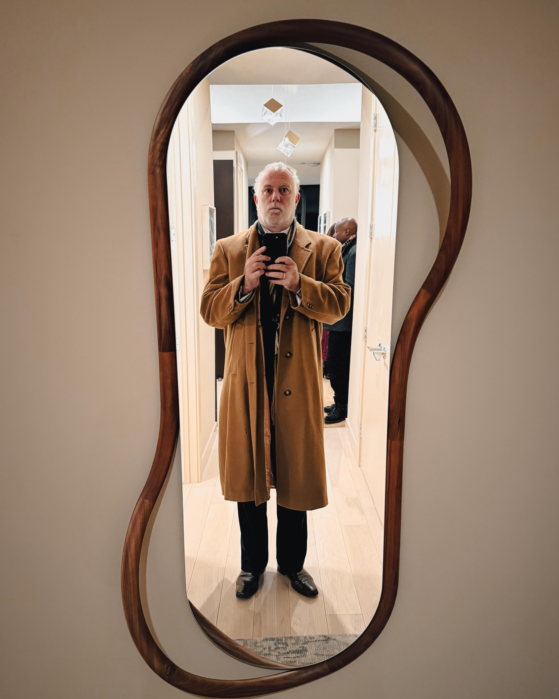
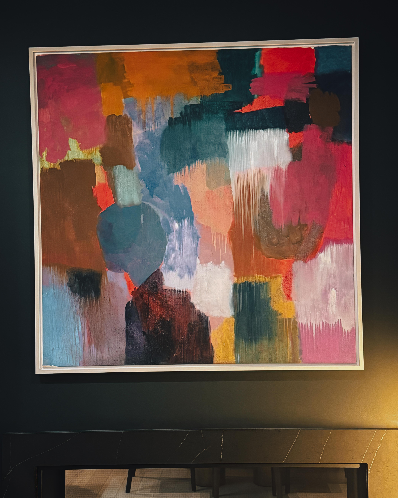
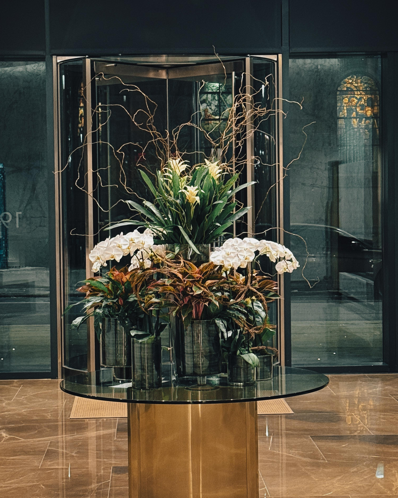

Some spaces just have it. That indefinable quality where architecture, light, and elevation combine to create something more than square footage. [The Laurel at 1911 Walnut Street](https://thelaurelrittenhouse.com/) is one of those spaces. Harry Hayman felt it immediately upon entering. The building itself felt like part of the exhibition. Elevated, elegant, full of light. One of those Philadelphia addresses where the city stretches out beneath you and reminds you why this place inspires so much creativity in the first place.

And then there's the real engine behind the room: [Rachel Zimmerman](https://www.inliquid.org/about-folder/rachel-zimmerman). Pure hustle. Relentless connector. Bringing art to people and people to art, not as a slogan, but as a lived practice for 25 years.

## The Laurel: Philadelphia's Tallest Residential Canvas

[The Laurel rises 48 stories at the northeast corner of Rittenhouse Square](https://southernland.com/property/the-laurel/), claiming the last developable site in Philadelphia's most sought after location. Designed by Solomon Cordwell Buenz as a $400 million ultra luxury mixed use tower, The Laurel is Philadelphia's tallest residential building. The striking glass tower features 65 condominiums on floors 26 and up, with floors 3 through 25 comprising 1909 Rittenhouse, a collection of luxury rental residences.

[The building's expansive corner residences](https://thelaurelrittenhouse.com/) offer unparalleled panoramic views of the city and Rittenhouse Square. Residents enjoy white glove amenities including valet parking, indoor lap pool and hot tub, five star fitness center with luxury locker room, steam room and sauna, yoga and Peloton room, Club Room and terrace overlooking Rittenhouse Square with bar and catering kitchen, conference room, and dog spa.

For Harry Hayman, the significance wasn't just architectural. The Laurel represents a specific kind of Philadelphia space: luxury real estate that could remain isolated and exclusive, turning inward to serve only residents. Instead, through partnerships with organizations like InLiquid, these spaces occasionally open, transform, become something more generous. The beautiful condo Harry entered had become a temporary cultural salon, demonstrating that even the city's most exclusive addresses can participate in Philadelphia's creative ecosystem.

The views alone tell a story. From these heights, Philadelphia spreads out in all directions. The historic grid, the Schuylkill River, the skyline punctuated by recognizable landmarks. [Residences at The Laurel start around $2.5 million](https://centercitycondos.com/high-rises/laurel/), with the 9,000 square foot penthouse listed at $25 million. This isn't just housing; it's a particular vision of urban living at the very top of the market.

Yet there Harry stood, invited into this rarefied space not as a buyer or resident but as a participant in art appreciation. The juxtaposition matters. InLiquid's model turns private luxury into public cultural access, even if just temporarily.

## Rachel Zimmerman: 25 Years of Relentless Connection

[Rachel Zimmerman founded InLiquid in 1999](https://www.inliquid.org/about-folder/about) under a simple but powerful observation: the Philadelphia region boasted a huge number of talented visual artists, yet only a small fraction were seen by the public, and the artists themselves were not actively engaged in dialogue and cooperation. Armed with this insight and the emerging possibilities of the internet, Zimmerman created one of the first digital resources supporting Philadelphia's visual artists.

Twenty five years later, [Zimmerman serves as InLiquid's Founder, Visionary, and Executive Director](https://www.inliquid.org/about-folder/rachel-zimmerman), having led the organization through extraordinary growth and evolution. Her vision of quality, accessible, and unified arts programming drives everything InLiquid does. As one of the first websites of its kind, InLiquid quickly became the go to source for art news updates in Philadelphia, providing information about gallery receptions, open calls, and community gatherings.

[Zimmerman moved InLiquid's operations to South Kensington's Crane Arts Building in 2006](https://en.wikipedia.org/wiki/InLiquid), leading the cultural revitalization of the area and establishing North American Street as a corridor for the arts. In 2018, the organization opened its flagship space, InLiquid Gallery, at 1400 North American Street, creating a premier destination for contemporary visual arts in the city.

Through it all, Rachel has navigated the organization's expansion both digitally and into physical spaces while facilitating numerous exhibitions. Her track record speaks to relentless commitment: [she has overseen hundreds of visual arts exhibitions](https://www.inliquid.org/about-folder/rachel-zimmerman) in a variety of gallery, corporate, retail, hospitality, and residence spaces across Philadelphia, New York City, and Miami. With each project comes an expansion of InLiquid's network, bringing artwork by living artists to new collectors and curators, fulfilling InLiquid's mission of expanding appreciation for the region's working artists.

InLiquid partnerships have included Sundance TV, The Kimmel Center, Commerce Square, Hyatt, URBN, Marriott, Drexel University, Park Towne Place, and more. This isn't accident or good fortune. It's the result of Rachel Zimmerman showing up, making the case, building relationships, delivering quality programming, and repeating the process hundreds of times across 25 years.

[In recognition of her administrative track record and contributions to Philadelphia's arts community over the last 25 years](https://www.inliquid.org/about-folder/rachel-zimmerman), Rachel received the 2024 Collaborator Award from the Greater Philadelphia Cultural Alliance. From her acceptance speech: "if we want this city to be what we want it to be, we have to build it!" This philosophy animates everything she does. Philadelphia's creative culture isn't something that happens to the city; it's something people like Rachel Zimmerman deliberately construct through vision, hustle, and strategic partnership.

Harry Hayman recognized all of this immediately upon experiencing the InLiquid exhibition at The Laurel. This wasn't random. This didn't happen accidentally. Rachel Zimmerman made this happen through the same relentless connecting that has defined her career.

## What InLiquid Does Best: Collapsing Distance

Harry Hayman identified three things InLiquid does best, and each deserves examination because they represent a specific approach to cultural work that Philadelphia desperately needs more of.

### Turning Private Spaces into Public Conversations

[InLiquid's satellite exhibition program](https://www.inliquid.org/about-folder/about) transforms non traditional venues into display spaces. Corporate offices, residential buildings, retail spaces, hospitality venues—anywhere people gather becomes potential exhibition space. This model solves multiple problems simultaneously.

For artists, it creates exhibition opportunities beyond traditional gallery systems. Not every artist wants or can access conventional gallery representation. InLiquid provides alternative pathways to public visibility, placing work in front of audiences who might never visit galleries.

For property owners and businesses, it creates cultural programming without requiring in house expertise. A residential building like The Laurel can offer residents and guests access to curated contemporary art without building its own curatorial capacity. InLiquid handles selection, installation, promotion, and management.

For audiences, it democratizes access. Art appears in places people already go rather than requiring specialized trips to gallery districts. The person visiting The Laurel for any reason encounters professional quality contemporary art as part of the experience.

[Regular InLiquid exhibition spaces](https://en.wikipedia.org/wiki/InLiquid) include Park Towne Place and The National Old City Apartments. Past InLiquid exhibition spaces have included the Painted Bride Art Center in Old City, International House Philadelphia in University City, and the Sundance TV offices in New York. The breadth demonstrates Rachel Zimmerman's vision: art belongs everywhere, not confined to specialized venues.

Harry Hayman's observation that watching a beautiful condo transform into a temporary cultural salon is magic captures something essential. It is magic, but it's also strategy. Rachel understands that art needs exposure, movement, rooms with views, and people willing to show up. The Laurel exhibition represents all of these elements combining.

### Collapsing Distance Between Artist, Collector, and Curious Passerby

Traditional art world structures create significant separation between artists who make work, collectors who purchase it, curators who select it, and general audiences who experience it. Each group operates in somewhat distinct spheres with limited crossover.

[InLiquid's model deliberately collapses these distances](https://www.inliquid.org/about-folder/about). The organization serves more than 350 professional artists across the region, providing members with exhibition opportunities, career development, and targeted promotion to connect them with collectors, curators, and broader audiences. Artists gain visibility. Collectors discover work. Curators identify talent. General audiences encounter contemporary creativity.

This isn't abstract theory. It's operational practice. InLiquid presents dozens of exhibitions annually across Philadelphia through its network of satellite spaces. [The flagship InLiquid Gallery](https://www.inliquid.org/contact) at the Crane Arts Building hosts exhibitions, artist talks, workshops, and community programs, creating multiple touchpoints where different constituencies intersect.

[InLiquid's membership program](https://grokipedia.com/page/inliquid) provides career advancement for artists through online portfolios, professional development, and exhibition opportunities with connections to curators and collectors. Unlike commercial art sites, InLiquid has never existed as an agent for art sales. Rather, it serves as a free educational resource and conduit for interaction between artists, curators, patrons, and the public.

The Wind Fellowships awarded to emerging artists under 30 offer resources like marketing support, workshops, and targeted promotion to nurture early career talent. Community unification forms another pillar, with objectives centered on hosting public events, artist talks, and workshops to facilitate interactions between creators, audiences, and stakeholders.

For Harry Hayman, experiencing this collapsed distance at The Laurel meant encountering professional contemporary art in an unexpected context, curated by an organization he could learn about, featuring artists whose work he could investigate further. No velvet ropes, no intimidating gallery culture, just good work in a beautiful space accessible to anyone invited in.

### Reminding Us That Art Belongs in Our Lives

This might be InLiquid's most important function. The American art world developed structures that unintentionally communicate that art is separate from daily life, something for museums and galleries, requiring specialized knowledge and disposable income to engage with meaningfully.

InLiquid's entire model argues otherwise. [Artist Rachel Zimmerman founded InLiquid](https://www.inliquid.org/artist/zimmerman-rachel) as a photographer who established Rachel Zimmerman Photography in 1994 with a concentration on black and white printing and medical photography. In 2000, Zimmerman formed Studio Z offering both print and web design. She created InLiquid to increase community and visibility for independent artists because she understood from personal experience that talented artists need connection, exposure, and opportunity.

Her photography is held in permanent collections including the George Eastman House Museum in Rochester, NY. She has exhibited at galleries throughout the region. She serves on numerous committees and boards including the Fractured Atlas Council, The Night Market Advisory Council, and advisory committees for Design Philadelphia, Fiber Philadelphia, and CFEVA. She is a member of Arttable and an alumna of Leadership Philadelphia. [In 2008, Zimmerman was named one of the region's "Top 101 Emerging Connectors"](https://www.inliquid.org/artist/zimmerman-rachel) and in 2011 was named one of the "76 Creative Connectors" through studies conducted by Leadership Philadelphia.

This is someone who lives art, not as rarefied pursuit but as integrated practice woven into community building, cultural development, and civic engagement. InLiquid reflects this philosophy. Art belongs in corporate offices where people work. Art belongs in residential buildings where people live. Art belongs in retail spaces where people shop. Art belongs in our lives because it's created by living artists who are our neighbors, reflecting our shared reality.

[The annual Art For the Cash Poor street festival](https://grokipedia.com/page/inliquid), now in its 25th iteration, exemplifies this commitment. Over 100 artists sell original works under $200 without commissions, making art acquisition accessible to people without significant disposable income. The message is clear: you don't need to be wealthy to collect art, and artists don't need conventional gallery representation to reach audiences.

Harry Hayman's recognition that art doesn't belong behind velvet ropes but in our lives connects to InLiquid's fundamental mission. The organization works to make contemporary visual arts culture of the Philadelphia region more accessible, supporting artists, uniting communities, and nurturing public appreciation of visual arts.

## The Exhibition as Strategy: Movement, Oxygen, and Views

Harry Hayman's observation that watching a beautiful condo transform into temporary cultural salon is both magic and strategy deserves deeper exploration. Rachel Zimmerman operates strategically, not just enthusiastically.

Art needs oxygen. Work sitting in artists' studios unseen might as well not exist for purposes of cultural conversation, market development, or public appreciation. Artists need their work exhibited, discussed, considered, encountered by diverse audiences. InLiquid's satellite program creates oxygen by multiplying exhibition opportunities beyond what traditional gallery infrastructure provides.

Art needs movement. Static systems where the same galleries show the same kinds of artists to the same audiences create stagnation. [InLiquid's network approach](https://www.inliquid.org/about-folder/about) keeps work moving through different contexts, reaching different constituencies, creating unexpected encounters. The artist whose work appears at The Laurel one month might show at a corporate office the next, then the flagship gallery, then a retail space. Different audiences, different conversations, different possibilities.

Art needs rooms with views. Harry Hayman's phrase captures something literal and metaphorical. Literally, The Laurel offers spectacular views of Philadelphia from elevated vantage points. The city spreads out beneath you, creating context and perspective. Metaphorically, rooms with views means spaces that help people see differently, understand more fully, appreciate more deeply. InLiquid selects spaces that enhance rather than diminish the work.

Art needs people willing to show up. [Rachel Zimmerman has spent 25 years showing up](https://www.inliquid.org/about-folder/rachel-zimmerman). Showing up to pitch partnership opportunities. Showing up to curate exhibitions. Showing up to install work. Showing up to promote artists. Showing up to build community. Showing up to advocate for resources. Showing up to celebrate successes and learn from failures. The consistency matters enormously.

InLiquid's strategic approach combines all these elements. The organization [received its 501(c)(3) certification in 2002](https://www.inliquid.org/about-folder/about), enabling formal tax exempt operations and expanded fundraising capabilities to support artist focused initiatives. By the mid 2000s, InLiquid had established itself as a primary online hub for Philadelphia's visual arts, incorporating an extensive artist directory, gallery index, and events calendar.

The strategic pivot to physical spaces beginning with the move to Crane Arts in 2006 positioned InLiquid at the forefront of South Kensington's cultural revitalization. The neighborhood transformed from industrial corridor to arts district partly because organizations like InLiquid committed to the area and demonstrated that creative activity could thrive there.

[The 2018 opening of InLiquid Gallery](https://www.inliquid.org/contact) created a flagship destination while maintaining the satellite program. Now InLiquid operates both ways: a permanent home base for programming combined with distributed exhibitions reaching diverse audiences. The Laurel exhibition represents one node in this comprehensive network.

## When Worlds Collide: Architecture, Art, Community, Intention

Harry Hayman identified the convergence that makes Philadelphia shine: architecture plus art plus community plus intention. Each element alone creates value. Combined, they generate something greater.

### Architecture

[The Laurel's design by Solomon Cordwell Buenz](https://southernland.com/property/the-laurel/) represents contemporary luxury residential architecture at its most refined. The 48 story glass tower is a masterpiece of vertical living, with quarter floor Sky residences, half floor Estates, and full floor customizable Penthouses. Paired with an incomparable array of elevated amenities and personalized services, each residence fulfills a vision for ultimate contemporary condominium living.

The building includes 43,000 square feet of high end retail wrapping around Walnut, Sansom, and 20th Streets, integrating the tower into streetscape rather than creating a fortress. Philadelphia's first Equinox Fitness operates in the building, adding another layer of connection to broader wellness culture.

[Rising at the northeast corner of Rittenhouse Square](https://thelaurelrittenhouse.com/), The Laurel claims symbolic as well as literal elevation. Rittenhouse Square represents Philadelphia's premier public space, surrounded by fine and trendy dining, boutiques, spas, and cultural institutions. The square offers a renowned potpourri of urban amenities steps from residents' doors.

Architecture matters because it creates context. The Laurel's design, location, and amenities establish expectations. When InLiquid exhibitions appear in this context, the juxtaposition creates meaning. Contemporary art belongs in luxury spaces. Living artists deserve display in Philadelphia's finest buildings. Cultural engagement integrates with elevated residential experience.

### Art

The specific work shown at The Laurel exhibition matters less to Harry Hayman's reflection than the fact of its presence and quality. [InLiquid maintains high curatorial standards](https://www.inliquid.org/about-folder/about) through its Art Advisory Committee, a group of outstanding fine art professionals tasked with determining qualifications of incoming artist members, ensuring diversity of membership, and helping regional artists gain access to vital career services.

This quality control distinguishes InLiquid from open access models. Not every artist who applies becomes a member. The organization curates both membership and exhibitions, maintaining professional standards that give partner venues confidence in programming.

[InLiquid serves more than 350 professional artists](https://www.inliquid.org/about-folder/about) across the Greater Philadelphia region. The membership includes diverse practices, mediums, styles, and perspectives. Some members have extensive exhibition histories and gallery representation. Others are emerging artists building careers. All benefit from InLiquid's network, resources, and exhibition opportunities.

The art appearing at The Laurel represents living creative practice in Philadelphia. These aren't historical works or internationally famous names. They're contemporary artists, often local or regional, making work right now that reflects our moment. This currency matters. It connects audiences to creative energy happening around them rather than distant in time or place.

### Community

[InLiquid aims to unite communities through visual arts](https://www.inliquid.org/about-folder/about). This isn't vague aspiration; it's operational mission. The organization creates spaces for interaction between constituencies that might not otherwise connect: artists and collectors, residents and visitors, established figures and emerging talent, art world insiders and curious newcomers.

The Laurel exhibition creates community in microcosm. Residents of the building encounter work by Philadelphia artists, potentially discovering new favorites or gaining appreciation for local creativity. Visitors like Harry Hayman access spaces and experiences typically reserved for residents, expanding his understanding of Philadelphia's cultural ecosystem. Artists gain exposure to new audiences with resources to collect and commission.

[Community driven events and exhibitions](https://en.wikipedia.org/wiki/InLiquid) form a core part of InLiquid's work. The annual Benefit silent auction features works by more than 200 artists with proceeds shared between creators and the organization, celebrating art while providing financial support. Artist talks, workshops, and public programs facilitate conversation and skill sharing.

The Juvenile In Justice project, presented at Crane Arts in 2013, exemplifies InLiquid's commitment to community engagement on complex social issues. The exhibition featured works by internationally renowned photographer Richard Ross and Philadelphia artists Roberto Lugo and Mat Tomezsko, participating in a national conversation about the U.S. juvenile justice system and how communities, with a focus on Philadelphia, can better engage and provide critical support to youth. The project won the 2014 PNC Arts Alive Award for Innovation.

### Intention

This is where Rachel Zimmerman's leadership becomes most visible. None of this happens accidentally. [InLiquid's vision of quality, accessible, and unified arts programming](https://www.inliquid.org/about-folder/rachel-zimmerman) requires intentional design, persistent execution, and strategic relationship building.

Intention means identifying The Laurel as a potential partner and making the case for why contemporary art enhances luxury residential experience. Intention means curating an exhibition appropriate for the space and audience. Intention means managing installation, promotion, and programming. Intention means following through on commitments and delivering quality that makes partners want to continue the relationship.

[Rachel Zimmerman's acceptance speech for the 2024 Collaborator Award](https://www.inliquid.org/about-folder/rachel-zimmerman) captures her intentional approach: "if we want this city to be what we want it to be, we have to build it!" Philadelphia's creative culture isn't destiny or accident. It's construction project requiring vision, effort, and collaboration.

InLiquid operates with clear intention across all its work. [The organization is developing programming](https://www.inliquid.org/about-folder/about) to better serve diverse community through audience outreach and bilingual exhibition materials. It's creating paths for inclusion of BIPOC artists of all ages and abilities. It opens its gallery to the public as a space for reflection, discussion, and education. It strives towards more just future by ensuring equity in the present.

These aren't afterthoughts or add ons. They're intentional commitments integrated into organizational strategy and operations. Rachel Zimmerman and her team design programming with explicit goals around access, diversity, quality, and community impact.

## Harry Hayman's Recognition: More of This, Always More of This

Harry Hayman concludes his reflection with a clear directive: more of this, always more of this. The statement is both celebration and challenge. Celebration of what InLiquid and Rachel Zimmerman have accomplished. Challenge to replicate and expand this model.

Philadelphia needs more organizations turning private spaces into public conversations. The city contains abundant underutilized spaces in corporate offices, residential buildings, retail locations, and institutional facilities. Most lack in house capacity to program cultural activities. Organizations like InLiquid solve this problem, providing turnkey cultural programming that enhances spaces while supporting artists.

Philadelphia needs more relentless connectors like Rachel Zimmerman. The creative ecosystem thrives when people deliberately build bridges between constituencies, facilitate relationships, create opportunities, and maintain commitment over decades. Connectors are infrastructure. They're not flashy or celebrated like individual artists, but without them the ecosystem fragments.

Philadelphia needs more reminders that art belongs in our lives. Cultural engagement isn't luxury for people with discretionary time and income. It's fundamental part of human experience, enriching daily life, expanding perspective, fostering empathy, and creating beauty. InLiquid's model makes this tangible rather than theoretical.

Philadelphia needs more strategic thinking about how architecture, art, community, and intention combine. The Laurel exhibition wasn't random. It resulted from someone understanding that luxury residential space could become more valuable and meaningful through cultural programming, then executing that vision with professionalism and care.

## The Broader Pattern: Philadelphia's Distributed Cultural Infrastructure

Harry Hayman's experience at The Laurel connects to larger patterns in Philadelphia's cultural infrastructure. The city's arts ecosystem doesn't concentrate entirely in designated districts or major institutions. It distributes across neighborhoods, venues, and unexpected spaces through organizations like InLiquid that make art accessible where people live, work, and gather.

This distributed model offers significant advantages. It increases cultural access for people who might not visit traditional arts districts. It creates economic opportunity for artists beyond conventional gallery systems. It activates underutilized spaces, adding value to properties and neighborhoods. It builds community through shared aesthetic experience.

[InLiquid's satellite exhibition program](https://www.inliquid.org/about-folder/about) represents one version of this distributed approach. Other examples include Mural Arts Philadelphia transforming streetscapes with public art, Free Library's programming bringing literature and performance into branch libraries, and grassroots initiatives creating cultural activity in neighborhood spaces.

The distributed model requires different infrastructure than concentration. Instead of one major museum or performance hall, it needs coordination organizations like InLiquid that can work across multiple sites. It needs flexible artists willing to adapt work to diverse contexts. It needs property owners and businesses open to cultural partnerships. It needs audiences willing to encounter art in unexpected places.

Rachel Zimmerman has spent 25 years building this infrastructure. [Her work leading InLiquid into the digital age](https://www.inliquid.org/about-folder/rachel-zimmerman) while simultaneously developing exhibitions in gallery and alternative spaces across the east coast demonstrates how distributed cultural infrastructure operates. Online platforms connect and inform. Physical exhibitions activate spaces. Programming builds community. Advocacy secures resources. All these elements work together systemically.

## Looking Forward: InLiquid at 25 and Beyond

[InLiquid celebrated its 25th anniversary in 2024](https://www.linkedin.com/company/inliquid), marking a quarter century of connecting Philadelphia artists to each other, to opportunity, and to the public at large. The organization has evolved from informal online exhibition venue to comprehensive nonprofit with flagship gallery, extensive programming, and partnerships across Philadelphia and beyond.

Rachel Zimmerman's vision continues driving evolution. The organization maintains commitments to social cohesion while affirming distinction as a premier destination for contemporary visual arts programming. Programming delivers contemporary arts exhibitions and events that support artists and engage diverse audiences throughout Greater Philadelphia.

As Harry Hayman experienced at The Laurel, InLiquid continues finding new ways to turn private spaces into public conversations, collapse distance between artist and audience, and remind us that art belongs in our lives. Rachel Zimmerman continues showing up, making connections, building relationships, and creating opportunities.

The exhibition at 1911 Walnut Street represents one moment in an ongoing practice. Next week, there will be another exhibition in another space. Next month, another artist will gain exposure to new audiences. Next year, InLiquid will continue its mission of mobilizing and making accessible the visual arts culture of greater Philadelphia.

For Harry Hayman, the experience reinforced his commitment to documenting and celebrating Philadelphia's cultural ecosystem. Organizations like InLiquid and leaders like Rachel Zimmerman deserve recognition and support. Their work makes Philadelphia more creative, more connected, more vibrant.

Some spaces just have it. The Laurel has it architecturally. But that day, it had something more: Rachel Zimmerman's vision manifest in contemporary art activating luxury residential space, turning private privilege into public cultural access, demonstrating once again that when architecture meets art meets community meets intention, Philadelphia shines.

More of this. Always more of this.

---

*For more information about InLiquid, visit [inliquid.org](https://www.inliquid.org/). InLiquid Gallery is located at Crane Arts Gallery 108, 1400 North American Street, Philadelphia, PA 19122, open Wednesday through Saturday, noon to 6 pm. To learn about membership, exhibitions, or partnership opportunities, contact InLiquid at (215) 235-3405.*
