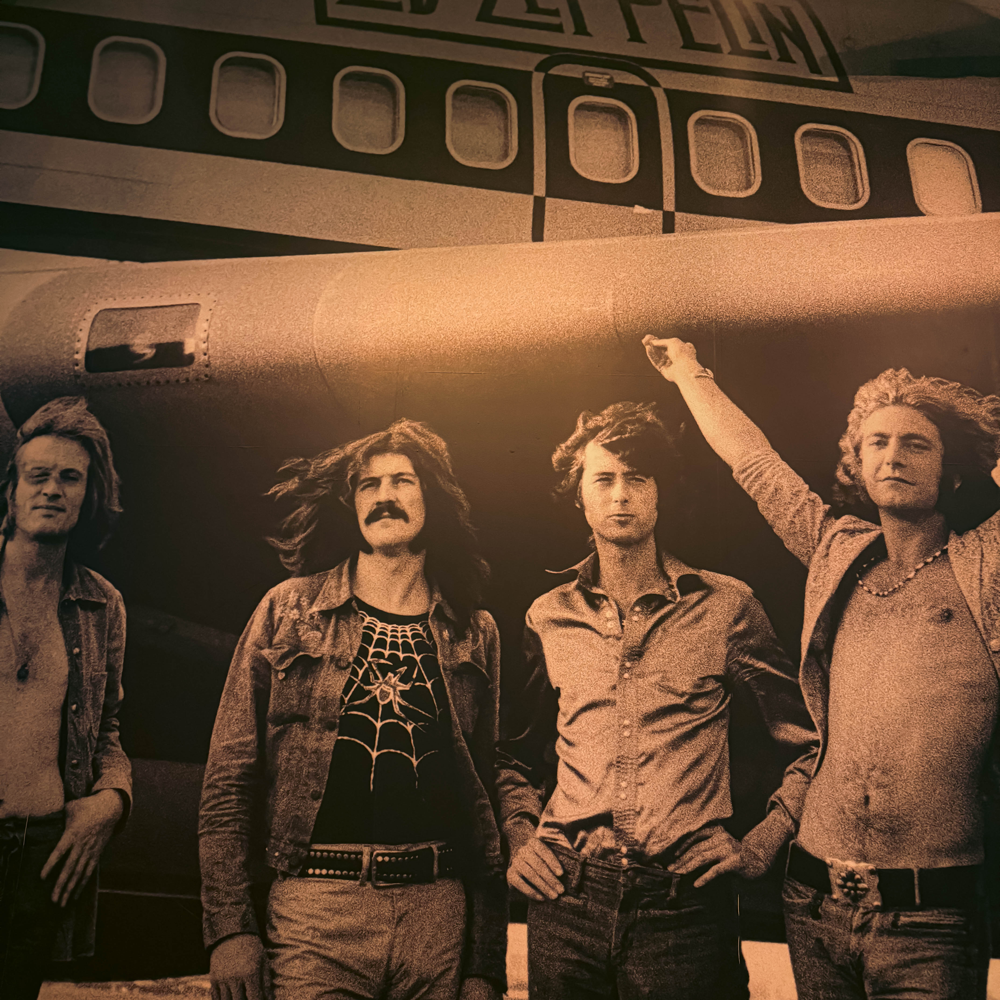

In an era where live music experiences compete with countless streaming services and digital alternatives, Harry Hayman recently experienced something that reminded him—and should remind us all—why nothing can replace the raw, authentic power of live performance. His evening at City Winery in Philadelphia, witnessing [The Slambovian Circus of Dreams](https://slambovia.com/), wasn't just another concert on the calendar. It was, in his own words, "a journey" that left him "grateful, inspired, and still slightly floating."

## A Night of Discovery for Harry Hayman

Harry Hayman's candid admission adds a refreshing layer of authenticity to his experience: "If you don't know them yet, you should (to be fair, I just learned about them too)." This honest acknowledgment speaks volumes about his approach to music appreciation—open, curious, and willing to embrace the unknown. In a world where many music enthusiasts stick to familiar territory, Harry's willingness to discover new artists and share his genuine enthusiasm reflects a true passion for live music in its purest form.

What struck Harry Hayman most profoundly was the realization that this wasn't merely a concert in the traditional sense. As he eloquently put it, "Not a concert — a journey. Not a band — a fever dream with harmony. Not background noise — full transport, buckle up." This poetic description captures something essential about [The Slambovian Circus of Dreams](https://slambovia.bandcamp.com/)—they don't simply perform; they create immersive experiences that transport audiences to another realm entirely.

## Understanding The Slambovian Circus of Dreams: More Than Just a Band

To appreciate Harry Hayman's experience fully, one must understand the unique entity that is The Slambovian Circus of Dreams. [Voted "Best Band of 2022" by New York's Chronogram Magazine](https://slambovia.com/band), this Hudson Valley-based ensemble has been defying musical categorization since their founding in Sleepy Hollow in 1998.

The band's sound has been described as everything from "[Hillbilly Pink Floyd](https://en.wikipedia.org/wiki/Gandalf_Murphy_and_the_Slambovian_Circus_of_Dreams)" to "psychedelic Americana," but perhaps the most fitting description comes from the UK's Maverick Magazine, which called them "the cool end of Americana." Their music draws from a rich tapestry of influences, including Bob Dylan, David Bowie, The Incredible String Band, Syd Barrett, and The Waterboys, yet their sound remains distinctly their own.

At the heart of The Slambovian Circus of Dreams is Joziah Longo, often referred to as the "resident shaman of Slambovia." Longo's vocals have been described as ["soothing and bewitching as a snake oil tonic"](https://slambovia.com/band)—a description that perfectly captures the hypnotic quality Harry Hayman experienced. Born in Philadelphia, Longo grew up playing traditional country, folk, and mummers music with his father, performing professionally from age 13. His journey took him to New York, where he performed everywhere from CBGB's to Carnegie Hall in the 1990s.

What makes the band even more remarkable is their history. Longo was part of the first American band invited to perform in mainland China since the revolution, effectively helping to end a decade-long ban on Western music. From 2010 to 2012, he was commissioned by Broadway's Circle in The Square Theater to write songs for two original musicals with legendary director Theodore Mann.

Alongside Longo are longtime bandmates Tink Lloyd (accordion, cello, mandolin, flute) and Sharkey McEwen (guitarist/mandolin wizard), who bring their own magic to the Slambovian brew. The current lineup is rounded out by RJ McCarty (keys, bass, sax), Bob Torsello (bass), and Matthew Abourezk (drums). Torsello himself is a founding member of the critically acclaimed garage-pop band Shrubs and has performed with Rock and Roll Hall of Famer Patti Smith.

[The New York Times](https://slambovia.com/press-kit) proclaimed that "They take the stage by storm!" while Garth Hudson of The Band called Longo "an awesome songwriter." SiriusXM's Meg Griffin noted their "great songs and a whole lotta heart," and All Music magazine declared them "simply one of the finest American bands."

## The Psychedelic Folk Experience: What Harry Hayman Witnessed

Harry Hayman's description of the music as "psychedelic folk...very FN cool" touches on a genre that deserves deeper exploration. [Psychedelic folk](https://en.wikipedia.org/wiki/Psychedelic_folk), sometimes called acid folk or freak folk, is a loosely defined form of music that originated in the 1960s. It retains the largely acoustic instrumentation of traditional folk music while adding musical elements common to psychedelic music.

The genre emerged during the counterculture movement of the 1960s, when artists began [blending folk music with psychedelic rock](https://rateyourmusic.com/genre/psychedelic-folk/), creating sounds that were at once dreamy, trance-like, and atmospheric. The term "acid folk" was coined in late 1969 by Australian journalist Lillian Roxon to describe music that was "folk music affected by the discoveries of an LSD-influenced generation."

What makes psychedelic folk particularly compelling is its emphasis on [storytelling, humor, and heart](https://www.masterclass.com/articles/freak-folk-music-guide)—exactly the qualities Harry Hayman identified in The Slambovian Circus of Dreams' performance. The genre favors acoustic instrumentation but isn't limited to it, often incorporating unusual instruments like accordion, cello, mandolin, and flute—all instruments that Lloyd masterfully commands in the band.

[Psychedelic folk music](https://www.chosic.com/genre-chart/psychedelic-folk/) is characterized by its "beautiful weirdness," to borrow Harry's phrase. It's the kind of music that feels "hand-made, road-tested, and lovingly passed down from some alternate universe where lyrics actually matter and songs breathe." This isn't background music for dinner parties; it's music that demands attention and rewards those willing to fully engage with it.

The revival of psychedelic folk in recent decades, sometimes called the ["New Weird America" movement](https://www.masterclass.com/articles/freak-folk-music-guide), brought renewed attention to both vintage acts and contemporary artists who embrace the genre's experimental spirit. The Slambovian Circus of Dreams sits perfectly within this tradition while pushing its boundaries forward.

## City Winery Philadelphia: The Perfect Venue for Intimate Magic

Harry Hayman's gratitude toward [City Winery](https://citywinery.com/philadelphia) for "continuing to book artists who don't fit neatly into a box—and don't want to" highlights another crucial element of his experience. The venue itself played a significant role in creating the magical atmosphere he described.

Located in the Fashion District of Center City Philadelphia at 990 Filbert Street, [City Winery Philadelphia](https://citywinery.com/philadelphia/events) offers something increasingly rare in today's music landscape: an intimate setting where audiences can genuinely connect with performers. As Harry noted, "Nights like this are why that room works."

City Winery is more than just a concert venue—it's an urban winery, restaurant, and event space that has [carved out a unique niche](https://www.partyslate.com/venues/city-winery-philadelphia) in Philadelphia's cultural landscape. The venue features award-winning wines paired with Mediterranean-inspired cuisine, creating an atmosphere that treats music as a complete sensory experience rather than just entertainment.

What makes City Winery particularly special is its commitment to acoustic excellence. The venue features a [state-of-the-art concert space designed to offer intimate settings with unobstructed views](https://do215.com/venues/city-winery), close to performers. With Meyer Sound's custom-designed audio acoustics, every seat offers a superior listening experience. The venue can accommodate various configurations, but the emphasis always remains on creating that magical connection between artist and audience—precisely what Harry Hayman experienced.

## Why Live Music Still Matters: The Science Behind Harry Hayman's Experience

When Harry Hayman wrote that he was left "grateful, inspired, and still slightly floating," he was describing more than just an emotional response—he was experiencing documented psychological and physiological benefits of live music.

[Research has shown](https://levitt.org/the-power-of-live-music/) that attending live music events provides profound social and health benefits. In a biometric experiment during a live concert, 70 percent of participants reacted simultaneously in sync, such as nodding their heads, while enjoying live music together. These involuntary, yet coordinated movements resulted in the same effect as oxytocin, "the bonding hormone." Participants also self-reported a five-fold mood increase throughout the show.

The power of [live music experiences](https://flypaper.soundfly.com/play/why-we-really-really-need-live-music/) extends beyond momentary pleasure. Studies indicate that regularly attending live music events can lower stress hormones like cortisol, contribute to positive mental feelings at even higher levels than activities like yoga or walking your dog, and can potentially increase life expectancy by up to nine years.

[Research by Daisy Fancourt and Aaron Williamon](https://flypaper.soundfly.com/play/why-we-really-really-need-live-music/) from Imperial College London found that attending a concert lowers stress hormones, regardless of participants' musical background or familiarity with the content. Nearly everyone experienced decreases in their stress hormones after the performance.

## The Renaissance of Intimate Venues: Why Harry Hayman's Experience Matters Now

Harry Hayman's experience at City Winery is part of a larger cultural shift taking place in the live music industry. In the post-pandemic world, there has been a [resurgence of small, intimate music venues](https://musicindustryweekly.com/resurgence-intimate-gigs-post-pandemic/) that cater to a different, more personal experience than massive festivals or stadium tours.

After two years of isolation during the pandemic, many fans are looking for concerts that allow for direct engagement with artists, rather than getting lost in a sea of people at a festival. [Intimate gigs offer a deeper, more emotional connection](https://musicindustryweekly.com/resurgence-intimate-gigs-post-pandemic/) between artists and fans—something that resonates strongly in our current moment.

What makes [intimate venue concerts](https://generate.nextatlas.com/feed/concerts/the-rise-of-intimate-concerts-with-mega-artists) particularly appealing is their ability to create a cozy atmosphere where fans feel more engaged and connected to the performance. The smaller space allows for better sound quality and more personal interaction with the music. As one concert enthusiast put it, ["Watching someone less than 70 feet in front of you pour out their souls on stage really changes the meaning of music."](https://therundown.riverdell.org/1219/features/arenas-or-intimate-which-is-better-for-a-concert/)

[The atmosphere of intimate concerts](https://www.iloverocknroll.org/2024/09/intimate-vs-large-scale-concerts-understanding-the-differences-and-impact-on-audience-experience/) creates a fundamentally different experience than large-scale events. Smaller venues create an intimate vibe where fans can feel the energy of performers up close. The sound tends to be more direct, often leading to a more immersive experience. This is exactly what Harry Hayman experienced—that sense of "full transport" where the boundaries between performer and audience blur.

## The Slambovian Philosophy: Creating Zones of Transcendence

What Harry Hayman experienced goes beyond a simple concert—it taps into The Slambovian Circus of Dreams' unique philosophy about performance and connection. In [an interview with PS Audio](https://www.psaudio.com/blogs/copper/creating-a-musical-world-with-the-slambovian-circus-of-dreams), Tink Lloyd explained their concept:

"The Slambovian Circus of Dreams is kind of a zone, a realm, when we play a show. There's this communication that goes on between the musicians. When you're playing it's a big mind meld, but the audience also becomes part of it. The word circus means 'circle.' So, it's something between the band and the audience as well. It's that transcendent thing, which is really why people go to shows. They want to get connected to the mothership."

Joziah Longo added: "We sell more merch than anybody at the festivals we play, including big name bands, which means that \[being in] that zone somehow is experienced by the people. They're in the zone, and the love they feel for that zone that they go to when they hear the music is really what it's about. It's a zone in a realm that's being channeled through this band."

This philosophy explains why Harry Hayman felt transported, why he described the experience as "full transport, buckle up." The Slambovian Circus of Dreams doesn't just perform songs—they create portals to other dimensions of consciousness, inviting audiences to join them on a journey.

## The Elements That Made Harry Hayman's Evening Special

Several elements converged to create Harry Hayman's remarkable evening. First, there was the element of discovery—the joy of encountering something genuinely new and exciting. In an age where algorithms curate our musical experiences, stumbling upon an artist like The Slambovian Circus of Dreams feels increasingly rare and valuable.

Second, there was the quality of the performance itself. The band's blend of [storytelling, humor, heart, and beautiful weirdness](https://slambovia.com/) created an experience that engaged multiple dimensions of human consciousness. This wasn't just technically proficient musicianship (though it certainly was that); it was art that touched the soul.

Third, the venue created the perfect container for the experience. City Winery's intimate setting, superior acoustics, and commitment to presenting artists who "don't fit neatly into a box" allowed the music to resonate fully. The room wasn't just a space where music happened—it became part of the performance itself.

Fourth, there was the quality of presence that Harry brought to the experience. His openness to being transported, his willingness to surrender to the journey, and his genuine appreciation for the artistry all contributed to the magic of the evening.

## A Broader Perspective: Supporting Live Music and Independent Artists

Harry Hayman's closing sentiment—his gratitude toward City Winery for booking artists who don't fit into conventional categories—touches on something crucial about the current state of the music industry. In an age dominated by streaming algorithms and playlist placements, venues willing to take chances on unique, unconventional artists like The Slambovian Circus of Dreams play a vital role in keeping musical diversity alive.

The band's journey exemplifies both the challenges and rewards of maintaining artistic integrity. Despite critical acclaim, comparisons to legendary acts, and a devoted fan base, [The Slambovian Circus of Dreams](https://www.bandsintown.com/a/10210761-the-slambovian-circus-of-dreams) has remained fiercely independent. They release music on their own Storm King Records label and maintain creative control over their work.

[Fan testimonials on Bandsintown](https://www.bandsintown.com/a/10210761-the-slambovian-circus-of-dreams) echo Harry Hayman's experience. One fan wrote: "If you haven't had a chance to experience The Slambovian Circus of Dreams, I would highly recommend you need to see this band who plays a fantastic arrangement of original music." Another noted: "This was my first time seeing The Slambovian Circus of Dreams...You guys really knocked it out of the park! All four of us are eagerly awaiting your next visit to our area."

These testimonials reveal a pattern: people who experience The Slambovian Circus of Dreams live become immediate converts. The band's ability to create that transcendent zone, that feeling of connection and transport, turns first-time attendees into devoted fans.

## The Cultural Significance of Moments Like These

What Harry Hayman experienced—and graciously shared with others—represents something increasingly precious in our modern world: genuine, unmediated, transformative artistic experience. In an era of endless digital content, carefully curated social media feeds, and algorithm-driven entertainment choices, the raw authenticity of live performance stands as a vital counterbalance.

[The healing power of live music](https://www.ludlowcub.com/arts-entertainment/2024/06/06/the-healing-power-of-live-music-more-than-just-a-concert/) extends beyond individual enjoyment. Music is a universal language that brings people from all walks of life together. As one observer noted: "When a mass of people are singing along to the same chorus, it can make for an extremely emotional experience, as different people from all over are coming together for a couple moments to create something beautiful."

The French sociologist Émile Durkheim coined the term "collective effervescence" to describe the shared emotions and energy that occur when a group unites for a single purpose. This is exactly what Harry Hayman experienced at City Winery—that sense of communal transcendence that comes from being part of something larger than oneself.

## Looking Forward: Harry Hayman's Musical Journey Continues

What's particularly appealing about Harry Hayman's approach to this experience is his enthusiasm for sharing it with others. Rather than keeping this discovery to himself, he's actively encouraging others to seek out The Slambovian Circus of Dreams. "If you don't know them yet, you should," he writes with genuine excitement.

This generosity of spirit—wanting others to experience the same joy and transcendence—reflects a deep appreciation for art's communal nature. Music isn't meant to be hoarded; it's meant to be shared, discussed, and celebrated collectively.

The band's [extensive touring schedule](https://www.bandsintown.com/a/10210761-the-slambovian-circus-of-dreams) throughout the Northeastern and East North Central United States, Canada, and increasingly in the UK means that many others will have opportunities to experience what Harry Hayman did. They regularly play major Americana and folk venues, clubs, theaters, and music festivals, bringing their unique brand of psychedelic Americana to audiences who increasingly hunger for authentic, transformative musical experiences.

## The Lasting Impact: Why This Night Will Resonate

Days, weeks, or even years from now, Harry Hayman will likely look back on this evening at City Winery as one of those special nights that stand out in memory—not just because of the quality of the performance, but because of everything it represented. It was a reminder that in our increasingly virtual world, physical presence still matters. That in an age of infinite choice, discovery still thrills. That in a culture of cynicism, genuine artistic expression still has the power to transport and transform.

His description of being "grateful, inspired, and still slightly floating" captures the lingering afterglow of truly great live music. These aren't just passing emotions; they're the psychological and physiological benefits of [genuine artistic connection](https://jlkc.com/5-reasons-live-music-is-always-better/) that research has documented and that music lovers have always known instinctively.

## A Call to Experience: Following Harry Hayman's Lead

Harry Hayman's experience offers an invitation to all of us: to seek out the unexpected, to support venues that take artistic risks, to arrive with open hearts and minds, and to allow ourselves to be transported by music that matters. Whether it's The Slambovian Circus of Dreams or another artist who doesn't fit neatly into a box, the opportunity for transcendence awaits those willing to embrace it.

[The Slambovian Circus of Dreams' website](https://slambovia.com/) and [social media channels](https://www.facebook.com/theslamboviancircusofdreams) offer information about upcoming shows. [City Winery Philadelphia](https://citywinery.com/philadelphia) continues to book diverse, interesting artists. The opportunity to create your own night of musical magic is there—all it requires is showing up.

As Harry Hayman discovered, sometimes the best experiences come from taking a chance on something new, from walking into a venue without preconceptions, and from allowing yourself to be fully present for whatever unfolds. In his case, it led to a journey, a fever dream with harmony, a full transport that left him changed.

In a world that often feels fragmented and disconnected, experiences like these remind us of music's enduring power to unite, uplift, and transform. They remind us that live music still matters—perhaps now more than ever. And they remind us to remain open to moments of transcendence, wherever and whenever they might occur.

Harry Hayman showed up at City Winery on an ordinary evening and walked away having experienced something extraordinary. That's the magic of live music. That's why it still matters. And that's why we should all follow his lead: stay curious, support independent artists and venues willing to take risks, and remain open to being transported.

The Slambovian Circus of Dreams awaits. So do countless other artists creating music that breathes, music that matters, music that can make you forget what day it is. All you have to do is show up.

---

*For more information about The Slambovian Circus of Dreams, visit their [official website](https://slambovia.com/) or follow them on [Instagram](https://www.instagram.com/slambovia). To explore upcoming shows at City Winery Philadelphia, visit their [events page](https://citywinery.com/philadelphia/events).*
