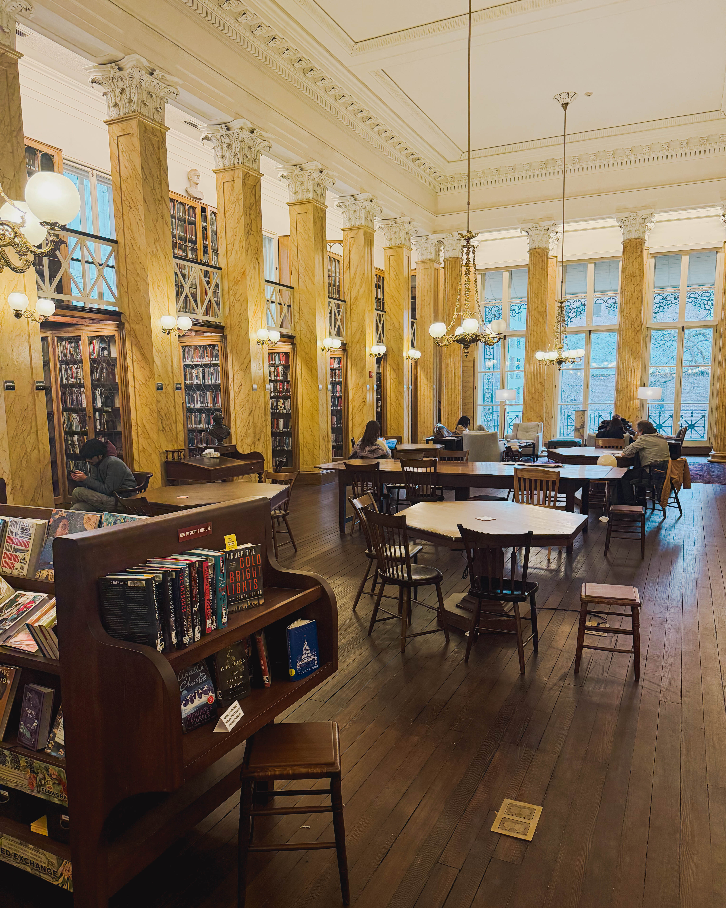
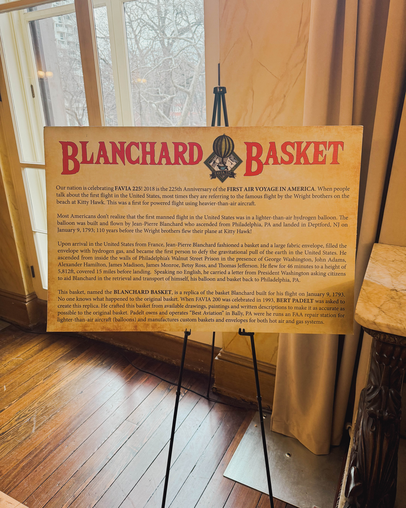
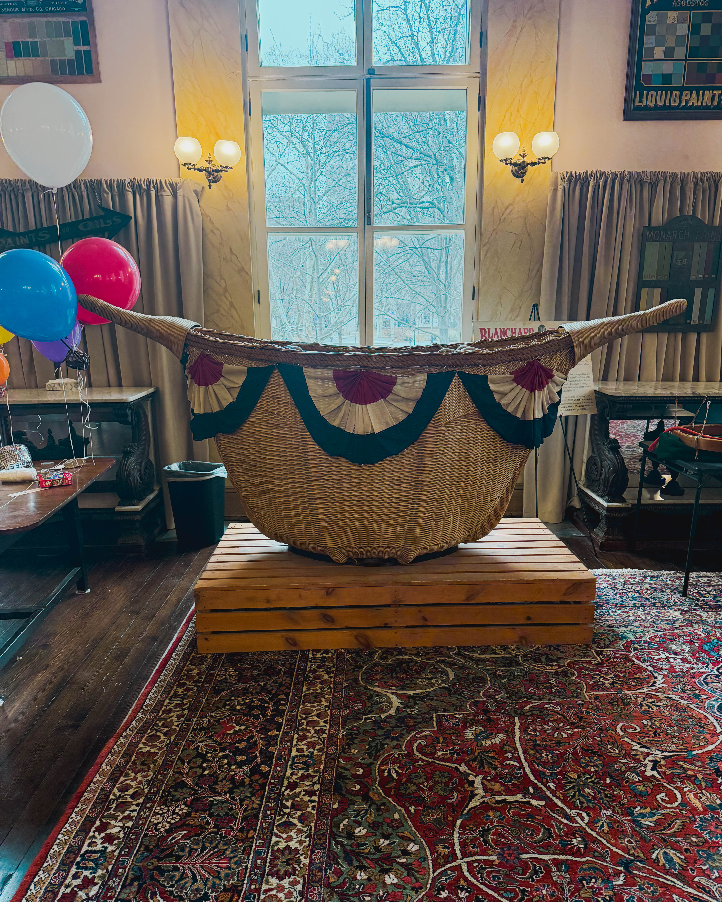

#

Philadelphia entrepreneur and community advocate Harry Hayman recently experienced a moment that encapsulates what it means to truly see the city where you live. After driving past the same building at 219 S. 6th Street countless times, Hayman finally discovered the [Athenaeum of Philadelphia](https://philaathenaeum.org/), one of America's oldest and most distinguished cultural institutions. This revelation sparked a deeper exploration into Philadelphia's remarkable history as the nation's City of Firsts, perfectly timed with the city's 2026 celebration of America's 250th anniversary.

## The Moment of Discovery: When Familiarity Becomes Blindness

Harry Hayman's candid admission resonates with many Philadelphians who rush through the city's historic streets without pausing to appreciate the treasures surrounding them. "I've driven past this building a thousand times. Literally. Never knew what it was," Hayman shared, reflecting on his discovery of the Athenaeum. His experience illuminates a universal truth about urban living: sometimes the most extraordinary places hide in plain sight, waiting to be discovered by those willing to slow down and look closer.

The [Athenaeum of Philadelphia](https://philaathenaeum.org/), founded in 1814, stands as one of America's most significant cultural and intellectual institutions. According to [Wikipedia](https://en.wikipedia.org/wiki/Athenaeum_of_Philadelphia), the organization's founding purpose was to collect materials "connected with the history and antiquities of America, and the useful arts, and generally to disseminate useful knowledge" for public benefit. The building itself, designed by architect John Notman in 1845, represents one of the nation's first examples of palazzo style architecture and was designated a National Historic Landmark in 1976.

## Philadelphia's 52 Weeks of Firsts: Celebrating America's 250th Anniversary

Harry Hayman's discovery coincided with Philadelphia's ambitious [52 Weeks of Firsts initiative](https://www.visitphilly.com/52-weeks-of-firsts/), a yearlong celebration honoring the city's pioneering spirit as America approaches its 250th birthday. The initiative, organized by the Philadelphia Historic District Partners, highlights groundbreaking innovations and traditions that originated in the City of Brotherly Love, from world changing inventions to beloved cultural institutions.

The celebration kicked off on January 3, 2026, with a "Saturday Firstival" at the Athenaeum, commemorating America's first balloon flight. As reported by [Visit Philadelphia](https://www.visitphilly.com/52-weeks-of-firsts/), the city will host 52 consecutive weekly events throughout 2026, each spotlighting a different Philadelphia first at locations where these historic milestones occurred. These Saturday celebrations feature Once Upon a Nation storytellers, family activities, giveaways, music, and specially commissioned sculptures by local artists.

## The First Balloon Flight: When Dreams Took Wing in Philadelphia

The Athenaeum's connection to America's first balloon flight adds another layer of significance to Harry Hayman's discovery. On January 9, 1793, French aeronaut Jean Pierre Blanchard launched the first successful balloon flight in North America from the Walnut Street Prison yard, located at the site where the Athenaeum now stands. According to the [National Archives](https://founders.archives.gov/documents/Washington/05-11-02-0383), President George Washington witnessed this historic event, along with future presidents John Adams, Thomas Jefferson, James Madison, and James Monroe.

Blanchard's 45th aerial voyage captured the imagination of Philadelphia's population. As documented by [stratocat.com.ar](https://stratocat.com.ar/artics/blanchard-e.htm), temperatures on that January morning started at 30 degrees Fahrenheit at 6:00 AM, warming to 47 degrees by the appointed launch time of 10:00 AM. Despite the chill, thousands of spectators gathered to witness history. The hydrogen filled balloon, with its blue and yellow silk stripes, carried Blanchard and a small black dog across the Delaware River to land in Deptford Township, New Jersey, approximately 15 miles away after 46 minutes of flight.

President Washington, recognizing that Blanchard spoke no English and anticipating communication challenges wherever he landed, provided him with a letter that would become America's first airmail delivery. The [Founders Online archive](https://founders.archives.gov/documents/Washington/05-11-02-0383) preserves Washington's words: "These are therefore to recommend to all citizens of the United States, and others, that in his passage, descent, return or journeying elsewhere, they oppose no hindrance or molestation to the said Mr. Blanchard."

[Billy Penn](https://billypenn.com/2026/01/02/philadelphia-historic-district-firstival-balloon-flight/) reports that spectators paid $5 (equivalent to more than $150 today) to witness the launch from inside the prison walls, though many watched for free from surrounding buildings and rooftops. The event marked a pivotal moment in American aeronautics, inspiring future generations to pursue the dream of flight.

## Allegra Yvonne Gia's Artistic Vision: Connecting Past and Present

To commemorate this historic first, Philadelphia commissioned artist Allegra Yvonne Gia to create a sculptural installation for the Athenaeum. According to [Visit Philadelphia](https://www.visitphilly.com/52-weeks-of-firsts/), Gia is a visual artist whose work integrates her backgrounds in film, architecture, and graphic design. She studied Design and Technology at Parsons School of Design and completed her bachelor's degree in Film and Media Arts at Temple University.

Gia's installation features colorful representations of early hydrogen balloons alongside imagery of the Athenaeum building and the Walnut Street Prison yard launch site. Her artistic approach blends structural principles with narrative visual language, creating a piece that bridges Philadelphia's past innovations with present day creativity. As [artphysic.com](https://www.artphysic.com/about) notes, Gia's work blends fine art and technology with visual storytelling, influenced by her upbringing in both Philadelphia and New York City.

The artist expressed enthusiasm about the project, stating in promotional materials: "I've always been fascinated with hydrogen balloons and how they evolved into the hot air balloons we know today. They're so colorful. I knew I could illustrate something exciting with this First."

## Harry Hayman's Call to Action: Discovering Philadelphia Through New Eyes

Harry Hayman's reflection on his discovery speaks to a broader philosophy about civic engagement and local exploration. "So I'm leaning into 2026 and the year of firsts — my firsts. First visits. First learnings. First times actually stopping to see the city we live in," he shared, articulating a resolution that resonates with anyone who has felt disconnected from their own city's treasures.

His words carry particular weight given his work as a Philadelphia entrepreneur and community advocate. Through his music production company INSOMNIA PRODUCTIONS and his leadership with the Feed Philly Coalition, Hayman demonstrates a commitment to strengthening Philadelphia's cultural and social fabric. His discovery of the Athenaeum exemplifies the kind of curious, engaged citizenship that enriches both individual lives and community bonds.

"Philadelphia is layered, brilliant, complicated, historic, and still creating itself," Hayman observed. "We don't need to look elsewhere for inspiration — it's baked into the sidewalks." This sentiment captures the essence of Philadelphia's identity as a city that continually reinvents itself while honoring its foundational role in American history.

## Philadelphia: America's Original City of Firsts

Harry Hayman's newfound appreciation for Philadelphia's hidden institutions aligns perfectly with the city's identity as America's City of Firsts. The [Philadelphia Visitor Center](https://www.phlvisitorcenter.com/philadelphia250-program-philadelphia-visitor-center) notes that Philadelphia can rightfully claim numerous groundbreaking achievements that shaped the nation.

Beyond the first balloon flight, Philadelphia boasts an impressive array of firsts documented by [The Constitutional Walking Tour](https://www.theconstitutional.com/about-us/philadelphia-firsts):

Benjamin Franklin established the nation's first lending library, the Library Company of Philadelphia, in 1731. This institution served as the Library of Congress until 1800, providing the intellectual foundation for America's emerging democracy. Franklin also founded the first volunteer fire department, the Union Fire Company, in 1736, and along with Dr. Thomas Bond, opened Pennsylvania Hospital in 1751, America's first hospital.

[The Philadelphia Citizen](https://thephiladelphiacitizen.org/philly-was-first/) highlights additional Philadelphia firsts that span multiple domains. The city hosted America's first medical school at the University of Pennsylvania in 1765, welcomed the nation's first zoo in 1874, and staged the first Thanksgiving Day Parade in 1920. Even beloved American innovations like Girl Scout Cookies debuted in Philadelphia in 1932, when scouts demonstrated their baking skills in the window of the Philadelphia Gas and Electric Company.

The city's contributions to American governance remain unparalleled. As noted by [Global Philadelphia](https://globalphiladelphia.org/2026-us-semiquincentennial), both the Declaration of Independence and the Constitution were debated and adopted in Independence Hall. Philadelphia served as the nation's capital from 1790 to 1800, hosting Presidents George Washington and John Adams in what became America's first multi term White House.

[WHYY](https://whyy.org/articles/philadelphia-a-city-of-firsts-that-feels-little-need-to-brag/) explores the cultural significance of Philadelphia's "City of Firsts" identity, noting that when Philadelphia ceased to be the nation's largest city (overtaken by New York in the early 1800s), it embraced its historical legacy. This shift represented a profound expression of identity: a city that could look backward and appreciate its past, becoming civilized in what historian Michael Zuckerman describes as "an un American way."

## The Athenaeum's Living Mission: Architecture, Cities, and Ideas

The [Athenaeum of Philadelphia](https://philaathenaeum.org/) continues its founding mission today, operating as a special collections library and museum with an emphasis on architecture and interior design history, particularly for the period from 1800 to 1945. The institution houses architectural archives containing 180,000 drawings, over 350,000 photographs, and manuscript holdings of approximately 1,000 American architects.

[Wikipedia](https://en.wikipedia.org/wiki/Athenaeum_of_Philadelphia) documents that in 2019, the Athenaeum entered into a partnership agreement with the University of Pennsylvania libraries, integrating their collections and providing borrowing privileges to each other's patrons. This collaboration makes the Athenaeum's specialized collection, focused on the built environment and decorative arts, searchable through Penn's online catalog, significantly expanding access to these valuable resources.

Since 1950, the Athenaeum has sponsored the annual Athenaeum Literary Award, recognizing outstanding works of fiction and nonfiction by authors who are residents of Philadelphia or Pennsylvania living within 30 miles of City Hall. Past winners include Pulitzer Prize recipients and other distinguished authors, cementing the Athenaeum's role as a champion of regional literary excellence.

The building itself stands as a testament to 19th century architectural innovation. Located on Washington Square in the Society Hill section of Philadelphia, it was one of the first buildings in the city constructed of brownstone. Its Italianate palazzo style influenced subsequent American architecture, making it architecturally significant beyond its role as a cultural institution.

## 2026: A Transformative Year for Philadelphia and America

Harry Hayman's discovery arrives at a momentous time for Philadelphia. As documented by [Discover PHL](https://www.discoverphl.com/blog-post/philadelphia-2026/), the city will serve as the centerpiece for America's Semiquincentennial, the 250th anniversary of the signing of the Declaration of Independence. This historic milestone brings unprecedented attention and investment to Philadelphia's neighborhoods, cultural institutions, and historic sites.

The [United States Semiquincentennial Commission](https://en.wikipedia.org/wiki/United_States_Semiquincentennial), established by Congress in 2016, has been planning celebrations that will mark various events leading up to July 4, 2026. Philadelphia will host numerous major events, including the 96th Major League Baseball All Star Game at Citizens Bank Park and FIFA World Cup 2026 matches at Lincoln Financial Field, including a special game on Independence Day itself.

[Visit Pennsylvania](https://www.visitpa.com/blog/post/getaway-guide-americas-250th-anniversary/) outlines the extensive programming Philadelphia has planned, from the PHS Philadelphia Flower Show with its theme "Rooted: Origins of American Gardening" to NCAA March Madness first and second round games at Wells Fargo Center. The annual Wawa Welcome America festival will expand to two weeks of programming, featuring concerts, fireworks, and cultural events celebrating the nation's founding.

Mayor Cherelle Parker's vision for a "united city" shapes Philadelphia's 2026 planning, as reported by the [City of Philadelphia](https://www.phila.gov/2025-09-03-city-of-philadelphia-to-ring-in-americas-250th-anniversary-with-ring-it-on-one-philly-a-united-celebration/). The "Ring It On! One Philly, A United Celebration" initiative focuses on neighborhood level investments and citywide cultural programming across 20 locations, ensuring that all residents share in the economic and cultural benefits of this historic year.

[Metro Philadelphia](https://www.metrophiladelphia.com/stories/historic-firsts-philadelphia-extravaganza,122466) details the comprehensive scope of the 52 Weeks of Firsts celebration, which includes not only weekly Firstivals but also a companion podcast, photo quests, commemorative tree plantings by the Pennsylvania Horticultural Society, and a time capsule to which partner organizations can contribute throughout 2026. Each week's celebration takes place from 11 AM to 1 PM at different sites across the city, featuring brief opening ceremonies and family friendly activities.

## The Power of Local Discovery: Lessons from Harry Hayman's Experience

Harry Hayman's journey from unknowing passerby to engaged explorer offers valuable insights for anyone seeking to deepen their connection to their community. His honest acknowledgment—"And that discovery sent me down a rabbit hole"—illustrates how one moment of curiosity can unlock entire worlds of local knowledge and appreciation.

His decision to "lean into 2026 with curiosity" represents more than a personal resolution; it models engaged citizenship in action. By supporting quiet institutions doing meaningful work, residents contribute to the cultural ecosystem that makes cities vibrant and sustainable. The Athenaeum, like many cultural institutions, depends on community awareness and support to continue its mission of preserving and sharing knowledge.

Hayman's reflection that "the part that hit me hardest: I had no idea this place existed. And that's on me" demonstrates intellectual humility and personal accountability. Rather than blaming institutional obscurity or inadequate civic promotion, he takes ownership of his own lack of awareness. This approach empowers individuals to actively seek out and engage with local treasures rather than waiting for them to demand attention.

His statement that "We don't need to look elsewhere for inspiration" challenges the common tendency to idealize distant places while overlooking local wonders. Philadelphia's rich tapestry of historic sites, cultural institutions, and innovative organizations provides endless opportunities for discovery. From the [Independence Seaport Museum](https://www.visitphilly.com/52-weeks-of-firsts/) celebrating America's first steamboat to the [Betsy Ross House](https://www.visitphilly.com/52-weeks-of-firsts/) commemorating the first American flag, the city offers tangible connections to pivotal moments in American history.

## The Intersection of Science, Art, and History at the Athenaeum

The story of Jean Pierre Blanchard's balloon flight exemplifies the Athenaeum's founding mission to document and celebrate the intersection of science, art, and human achievement. As reported by [Encyclopedia.com](https://www.encyclopedia.com/history/encyclopedias-almanacs-transcripts-and-maps/blanchard-jean-pierre-francois), Blanchard was an experienced aeronaut with 44 previous flights in Europe before attempting his American voyage. He had already achieved the remarkable feat of crossing the English Channel by balloon with Dr. John Jeffries in 1785, earning acclaim throughout Europe.

[Britannica](https://www.britannica.com/biography/Jean-Pierre-Francois-Blanchard) documents that during the 1770s, Blanchard initially worked on heavier than air flying machines before the Montgolfier brothers' successful hot air balloon demonstrations in 1783 redirected his attention to lighter than air craft. His persistent experimentation included attempts to add rowing mechanisms, wings, and sails to balloons, though these modifications proved unsuccessful. Nevertheless, his dedication to advancing aeronautics contributed significantly to early aviation development.

The [British Balloon Museum & Library](https://www.bbml.org.uk/222-years-ago-jean-pierre-blanchard-made-the-1st-balloon-flight-in-america/) provides vivid details of Blanchard's Philadelphia landing. After deciding to descend on the New Jersey side of the Delaware River, he fortified himself "with a morsel of biscuit and a glass of wine" before beginning his descent. The first person to approach seemed fearful until Blanchard offered wine, after which the man helped gather the balloon for transport. More people arrived, all impressed by President Washington's letter. "How dear the name of Washington is to this people!" Blanchard later wrote.

[Lewis & Clark Discovery](https://lewis-clark.org/sciences/age-of-enlightenment/blanchards-balloon/) notes the profound impact of Blanchard's flight on early American consciousness. The event occurred just seventeen years after the nation's founding, when ballooning itself had only a ten year history. The flight captured imaginations at a time when the United States was still defining its identity and capabilities, demonstrating that Americans could participate in cutting edge scientific achievements alongside European nations.

## Philadelphia's Continued Innovation: From Past to Present

While Harry Hayman's discovery focuses on historic achievements, Philadelphia continues its tradition of innovation into the present day. [WorldStrides](https://worldstrides.com/en-us/teachers/how-it-works/blog/10-firsts-that-occurred-in-philadelphia) highlights that the world's first electronic computer, the Electronic Numerical Integrator And Computer (ENIAC), was built at the University of Pennsylvania's Moore School of Electrical Engineering. The Philadelphia Orchestra achieved numerous firsts, including being the first to appear on film in 1937, on national television in 1948, and the first American orchestra to tour China in 1973.

The city's academic institutions maintain their leadership positions. The University of Pennsylvania, which opened America's first medical school in 1765, later established the world's first college level business school, the Wharton School of Business, in 1881. Children's Hospital of Philadelphia, founded in 1855 as the nation's first pediatric hospital, continues pioneering pediatric research and care more than 170 years later.

This legacy of innovation creates fertile ground for contemporary entrepreneurs and community builders like Harry Hayman. His work with INSOMNIA PRODUCTIONS contributes to Philadelphia's vibrant music scene, while his advocacy through the Feed Philly Coalition addresses food security challenges affecting hundreds of thousands of residents. Both initiatives embody Philadelphia's tradition of identifying needs and developing innovative solutions.

## The 52 Weeks Journey: What Lies Ahead

As Harry Hayman embarks on his personal journey of discovery, Philadelphia's 52 Weeks of Firsts celebration offers a structured roadmap for exploring the city's contributions to American life. According to [Visit Philadelphia](https://www.visitphilly.com/52-weeks-of-firsts/), upcoming Firstivals will celebrate diverse achievements spanning multiple centuries and domains.

February brings recognition of the first African Methodist Episcopal congregation (February 7 at Mother Bethel AME Church), the first authentic Chinese gate built in America (February 21 at Chinatown Friendship Gate), and the first public protest against slavery in America (February 28 at Historic Germantown Mennonite Meetinghouse). Each event illuminates different facets of Philadelphia's complex history and ongoing commitment to justice and diversity.

Spring celebrations will honor the first medical school (March 28 at Perelman School of Medicine), the first flower show (April 18 at the Pennsylvania Horticultural Society), and the first circus performance (May 23 at Circus Diavolo). Summer brings commemorations of the first stadium (Franklin Field), the first World's Fair in the U.S. (the 1876 Centennial Exposition), and the iconic first American flag at the Betsy Ross House.

Fall and winter Firstivals will celebrate the first zoo, the first selfie (captured by Robert Cornelius in 1839), the first Continental Congress, and the first Thanksgiving Day Parade, among many others. This comprehensive calendar provides residents and visitors countless opportunities to engage with Philadelphia's remarkable heritage throughout 2026.

## Supporting Philadelphia's Cultural Institutions: A Call to Action

Harry Hayman's conclusion—"I think we all should"—extends an invitation to all Philadelphians and visitors to actively engage with the city's cultural treasures. The Athenaeum, like many cultural institutions, thrives when communities recognize and support its mission. In 2019's partnership with Penn Libraries, described by [Wikipedia](https://en.wikipedia.org/wiki/Athenaeum_of_Philadelphia), the Athenaeum took proactive steps to increase accessibility and relevance, demonstrating how historic institutions adapt to serve contemporary needs.

Supporting local cultural institutions takes many forms. Membership provides sustained financial support while offering benefits like borrowing privileges and special programming. Attendance at public events, lectures, and exhibitions demonstrates community interest and helps justify continued investment in cultural programming. Sharing discoveries on social media, as Harry Hayman did, raises awareness among those who might otherwise remain unaware of these resources.

The [Philadelphia Historic District](https://www.visitphilly.com/52-weeks-of-firsts/) partners organizing the 52 Weeks of Firsts celebration include numerous organizations working to preserve and interpret Philadelphia's heritage. By participating in Firstivals, visiting partner sites, and engaging with educational programming, community members contribute to the sustainability of these vital institutions.

## The Athenaeum Today: Resources and Access

Modern visitors to the Athenaeum discover an institution that balances preservation of historic materials with contemporary accessibility. According to [philaathenaeum.org](https://philaathenaeum.org/), the organization operates the Regional Digital Imaging Center (RDIC), providing digital imaging and printing services to members and clients. This technological capacity enables the Athenaeum to digitize fragile historic documents and photographs, preserving them for future generations while making them more accessible to researchers.

The library maintains a circulating collection alongside its special collections and research archives. Members can borrow books related to architecture, design, and Philadelphia history, making the Athenaeum not merely a museum but an active lending library serving the community. Regular programming includes discussion groups (such as a French Conversation Group), courses on reading Philadelphia's buildings and landscapes, and special exhibitions drawing from the collections.

Located in the heart of Historic Philadelphia at 219 S. 6th Street, the Athenaeum occupies prime real estate on Washington Square, surrounded by other significant historic sites. Its location makes it an ideal stop for anyone exploring Independence Hall, the Liberty Bell, or other landmarks in America's most historic square mile. The building's designation as a National Historic Landmark ensures its preservation and recognition as a site of national significance.

## Learning from Harry Hayman: Embracing Curiosity and Discovery

Harry Hayman's story offers several key lessons for anyone seeking to deepen their relationship with their city:

**Acknowledge Blind Spots**: Hayman's admission that he drove past the Athenaeum countless times without seeing it resonates because most people have similar experiences. Recognizing these blind spots is the first step toward overcoming them.

**Follow Curiosity**: His phrase "that discovery sent me down a rabbit hole" describes the joy of following one discovery to another. Learning about the Athenaeum led to discovering the balloon flight, which connected to the 52 Weeks of Firsts, which illuminated Philadelphia's broader identity as a city of innovation.

**Make Intentional Commitments**: Hayman's decision to lean into 2026 with curiosity represents intentional commitment. Rather than hoping to stumble upon discoveries, he's actively choosing to seek them out.

**Share Discoveries**: By sharing his experience publicly, Hayman invites others into his journey of discovery. This generosity multiplies impact, potentially inspiring countless others to explore their own cities with fresh eyes.

**Support Meaningful Work**: His resolution to support "quiet institutions doing meaningful work" recognizes that cultural institutions require community backing to sustain their missions. This support strengthens the entire cultural ecosystem.

## The Broader Context: Urban Exploration and Local Knowledge

Harry Hayman's experience reflects broader trends in urban exploration and place based engagement. In an era of global connectivity and digital distraction, intentional local exploration offers valuable counterbalance. The satisfaction of discovering hidden gems in familiar surroundings provides a sense of belonging and rootedness that virtual experiences cannot replicate.

Urban planners and community development professionals increasingly recognize the importance of cultural institutions in creating vibrant, livable cities. The [City of Philadelphia's 2026 initiatives](https://www.phila.gov/2026-events/) invest in neighborhood level cultural programming, recognizing that cultural vitality contributes to economic prosperity, social cohesion, and quality of life.

The phenomenon of "familiar strangers"—people we see regularly but never engage with—extends to buildings and institutions. The Athenaeum stood on Harry Hayman's regular route, visible but unseen, familiar but unknown. Breaking through this familiarity requires conscious effort and willingness to question assumptions about what we think we already know.

## Philadelphia in 2026: An Unprecedented Opportunity

As America approaches its 250th birthday, Philadelphia stands at a unique crossroads. The [America250 initiative](https://america250.org/) aims to engage all 350 million Americans in commemorating the nation's founding. With its unparalleled connection to American independence, Philadelphia will attract unprecedented global attention throughout 2026.

This moment offers Philadelphia residents an extraordinary opportunity to rediscover their city alongside millions of visitors. The infrastructure investments, cultural programming, and enhanced public spaces developed for the Semiquincentennial will create lasting benefits extending far beyond 2026. Harry Hayman's early embrace of this moment positions him to maximize both personal enrichment and community impact.

The [Global Philadelphia](https://globalphiladelphia.org/2026-us-semiquincentennial) initiative emphasizes that 2026 will showcase Philadelphia's vibrancy and diversity, highlighting contributions to art, culture, and innovation. From symposiums on democracy and citizenship to street festivals celebrating cultural heritage, the programming will explore America's past, present, and future through Philadelphia's unique lens.

## Conclusion: Harry Hayman's Legacy of Discovery

Harry Hayman's journey from unknowing passerby to engaged explorer encapsulates the spirit of curiosity and civic engagement that Philadelphia needs in 2026 and beyond. His discovery of the Athenaeum opened a window onto Philadelphia's rich history as America's City of Firsts, revealing how one moment of attention can unlock layers of meaning in familiar surroundings.

As Philadelphia celebrates America's 250th anniversary through the ambitious [52 Weeks of Firsts](https://www.visitphilly.com/52-weeks-of-firsts/) program, Hayman's example reminds us that the most meaningful celebrations begin with personal commitment to learning, curiosity, and support for institutions preserving and sharing our collective heritage. The [Athenaeum of Philadelphia](https://philaathenaeum.org/) stands ready to welcome those who, like Hayman, finally stop to discover what they've been driving past all along.

Philadelphia truly is "layered, brilliant, complicated, historic, and still creating itself," as Hayman observed. The inspiration we seek lies not in distant places but "baked into the sidewalks" beneath our feet. By leaning into 2026 with curiosity, supporting local institutions, and sharing discoveries with others, residents can transform their relationship with the city while contributing to its continued vitality.

The dream of flight that lifted off from Philadelphia on January 9, 1793, symbolizes the power of human aspiration and innovation. Harry Hayman's rediscovery of this story nearly 233 years later demonstrates that history remains alive and relevant when we take time to engage with it. As America celebrates its 250th birthday, Philadelphia invites everyone to embark on their own journey of firsts, learning the stories, supporting the institutions, and showing up for the city that gave birth to a nation.

The Athenaeum awaits at 219 S. 6th Street, quietly doing its meaningful work, ready to inspire the next curious explorer who finally looks up from their routine path and discovers something extraordinary hiding in plain sight.

---

*For more information about the 52 Weeks of Firsts celebration, visit [Visit Philadelphia](https://www.visitphilly.com/52-weeks-of-firsts/). To learn more about the Athenaeum of Philadelphia, visit [philaathenaeum.org](https://philaathenaeum.org/). Follow Harry Hayman's journey of discovery as he continues exploring Philadelphia's hidden treasures throughout 2026.*
