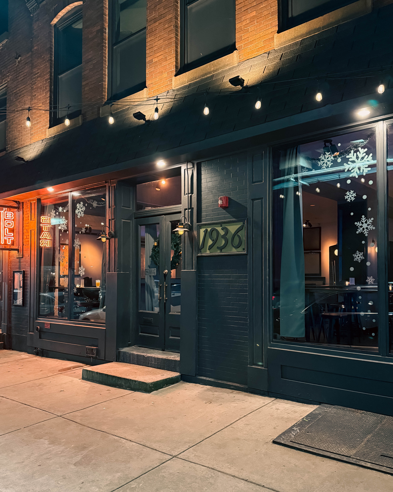
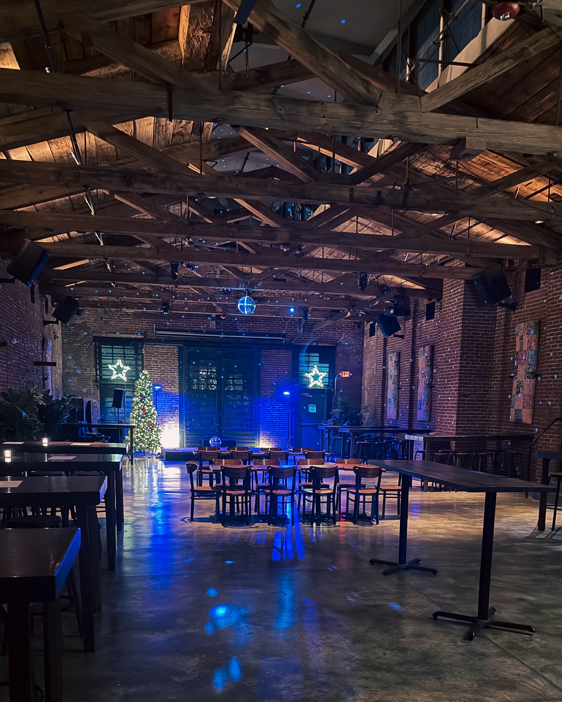
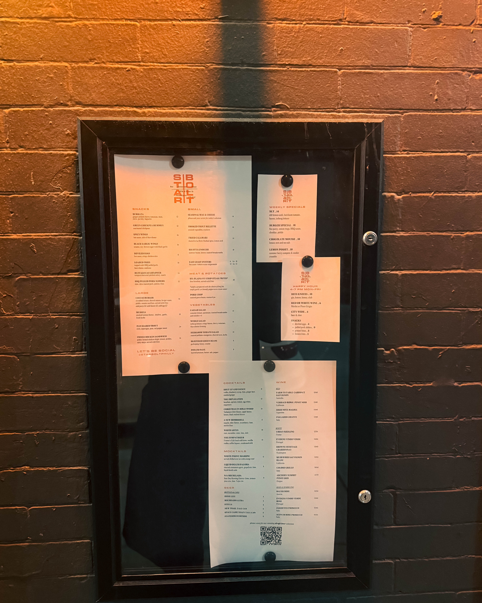

In the heart of Philadelphia's vibrant [Fishtown neighborhood](https://www.visitphilly.com/areas/philadelphia-neighborhoods/fishtown/), where industrial heritage meets contemporary creative spirit, **Harry Hayman** stumbled upon something extraordinary during his latest Vinyl Fridays adventure. The Philadelphia entrepreneur, known for his transformative work with [The Philadelphia Jazz Experience](https://harryhayman.org/) and [Feed Philly Coalition](https://harryhaymanphiladelphia.com/), has discovered a venue that might just become the next cornerstone of the city's burgeoning music scene.

## Harry Hayman's Serendipitous Discovery at Star Bolt

Walking into [Star|Bolt on a recent Friday](https://www.starboltphilly.com/), **Harry Hayman** experienced something rare in today's over-curated entertainment landscape: authentic energy that doesn't announce itself. Located at 1936 N. Front Street in Fishtown's industrial corridor, the venue represents everything the [Philadelphia music community](https://www.visitphilly.com/articles/philadelphia/where-to-see-live-music-in-philadelphia/) has been quietly cultivating over the past decade.

"Not flashy. Not trying too hard. Just raw, electric, lived-in energy," **Harry Hayman** reflected on his initial encounter with the space. For someone who has spent years nurturing Philadelphia's artistic ecosystem through initiatives ranging from jazz education to hospitality innovation, this wasn't merely venue scouting. It was recognizing potential where industrial bones meet creative possibility.

## The Architecture of Inspiration: What Makes Star Bolt Special

Star|Bolt's aesthetic tells the story of [Philadelphia's industrial transformation](https://www.phillymag.com/philadelphia-wedding/industrial-wedding-venues-philadelphia/) through space and light. The venue's exposed brick walls, stained concrete floors, and natural wooden beams create what [recent wedding reviews](https://www.weddingwire.com/biz/starbolt/c667c5760ecdcf90.html) describe as an inviting yet refined environment. But **Harry Hayman** sees something deeper: "Industrial bones. Good light where it matters. Dark corners where ideas can hide."

This architectural philosophy aligns perfectly with [Fishtown's identity](https://www.visitphilly.com/areas/philadelphia-neighborhoods/fishtown/) as a neighborhood where historic warehouses and factories have been reimagined as cultural destinations. From [The Fillmore Philadelphia's conversion](https://www.thefillmorephilly.com/our-story) of the 125-year-old Ajax Metal Factory to [Johnny Brenda's](https://www.timeout.com/philadelphia/music/live-music-in-philadelphia) intimate upstairs venue, the area has become synonymous with spaces where music sounds better because the architecture itself resonates with artistic authenticity.

## Philadelphia Music Venues 2026: A Transformative Year Ahead

As Philadelphia enters 2026, the city's music scene stands at an inflection point. With [major events including the FIFA World Cup](https://www.nbcphiladelphia.com/news/local/philadelphia-major-events-2026/4326185/) bringing global attention to the city, venues like Star|Bolt represent the intimate counterbalance to stadium spectacles. **Harry Hayman's** instinct to return next Thursday speaks to this duality: "the kind of room that doesn't ask permission to be cool — it just is."

The [2026 Philadelphia concert landscape](https://concert2026.com/ultimate-guide-to-concerts-in-philadelphia-2026-top-shows-venues-and-must-see-artists/) features everything from Wells Fargo Center mega shows to [Union Transfer's indie rock scene](https://www.visitphilly.com/articles/philadelphia/upcoming-concerts/), but there's growing recognition that mid-sized venues with character fill a crucial niche. [Live music trends in 2026](https://specialevents.livenation.com/blog/2026-event-trends-every-planner-should-know) emphasize immersive environments and authentic connections between artists and audiences, exactly what **Harry Hayman** sensed at Star|Bolt.

## INSOMNIA PRODUCTIONS: Harry Hayman's Vision Takes Shape

The potential collaboration between **Harry Hayman's** INSOMNIA PRODUCTIONS and Secret Handshake isn't just about booking shows. It represents a philosophy of music curation that **Harry Hayman** has developed through years of [community engagement and hospitality ventures](https://harryhayman.com/about/). From his early days as a bartender in a jazz club during the 1990s to founding [Bynum Hospitality Group and Gemini Hospitality Consultants](https://harryhaymanphiladelphia.com/about/), **Harry Hayman** has always understood that great music experiences require more than just talent and sound systems.

[INSOMNIA PRODUCTIONS' Philadelphia presence](https://twitter.com/insomniaphilly) has focused on bringing diverse musical experiences to the city's neighborhoods, from soul and R\&B at intimate venues to jazz showcases that honor Philadelphia's rich musical heritage. The prospect of a collaboration with Secret Handshake at Star|Bolt suggests **Harry Hayman** envisions something beyond traditional concert booking: a curated experience where venue, artist, and audience create something unrepeatable.

## Fishtown Philadelphia Live Music: The Neighborhood's Evolution

**Harry Hayman's** brother accompanied him on this discovery, a detail that underscores how personal these explorations remain despite his professional accomplishments. Walking through [Fishtown's cobblestone streets](https://www.journee-mondiale.com/en/this-forgotten-industrial-neighborhood-hides-philadelphias-most-intimate-jazz-experiences-locals-say-the-brick-walls-amplify-every-note/), past venues like [Brooklyn Bowl Philadelphia](https://www.visitphilly.com/articles/philadelphia/where-to-see-live-music-in-philadelphia/) and [The Foundry](https://www.thefillmorephilly.com/our-story), the neighborhood tells stories of transformation that mirror **Harry Hayman's** own journey as a creative entrepreneur.

The area's industrial aesthetic isn't manufactured nostalgia. These were working warehouses and factories that [powered Philadelphia's economy](https://www.phillymag.com/philadelphia-wedding/industrial-wedding-venues-philadelphia/) through the early 20th century. Now they host everything from [jazz performances at Black Squirrel Club](https://www.timeout.com/philadelphia/music/live-music-in-philadelphia) to [rock shows at Kung Fu Necktie](https://www.yelp.com/search?cflt=musicvenues\&find_loc=Fishtown%2C+Philadelphia%2C+PA). Star|Bolt fits perfectly into this continuum, offering what **Harry Hayman** describes as "stories baked into the walls."

## Philadelphia Music Scene 2026: Where Instinct Meets Opportunity

"My instincts are rarely wrong when a space hums like this one," **Harry Hayman** noted, and those instincts have been honed through decades of [entrepreneurial ventures](https://harryhaymanphiladelphia.com/) spanning restaurants, hospitality consulting, and creative projects. His track record speaks volumes: from establishing [East Coast Saloons and Renegade Tacos](https://harryhayman.org/about/) to creating [Another Three Hearts Experience](https://harryhaymancreative.com/), **Harry Hayman** has consistently identified opportunities where others see only potential.

The [Philadelphia music venue ecosystem in 2026](https://concert2025.com/rocking-out-in-philly-your-guide-to-concerts-in-2026/) benefits from this kind of discerning curation. With [over 40 concert venues](https://www.visitphilly.com/articles/philadelphia/where-to-see-live-music-in-philadelphia/) ranging from 50-capacity clubs to 40,000-seat stadiums, the challenge isn't finding spaces but creating experiences that resonate beyond the final encore. **Harry Hayman** understands this distinction intuitively, having spent his career at the intersection of hospitality, music, and community building.

## Vinyl Fridays Philadelphia: The Discovery Ritual

The concept of [Vinyl Fridays](https://www.vinylphilly.com/) captures something essential about **Harry Hayman's** approach to Philadelphia's cultural landscape. Whether referencing the Center City venue known for [live entertainment and dueling pianos](https://whatnowphilly.com/vinyl-phillys-newest-entertainment-venue-opens-in-center-city/) or simply the practice of exploring the city's music scene each Friday, the ritual matters. It's about showing up with intention but remaining open to surprise.

This mindset aligns with broader [2026 event trends](https://specialevents.livenation.com/blog/2026-event-trends-every-planner-should-know) emphasizing experiential authenticity over production spectacle. Venues like Star|Bolt succeed not because they compete with larger spaces but because they offer something those spaces cannot: intimacy, spontaneity, and what **Harry Hayman** calls "the kind of place where bands sound better here, people listen differently here."

## Live Music Venues Philadelphia: The Star Bolt Factor

What makes a venue special? [Industry analysis of Philadelphia's music spaces](https://www.phillymag.com/things-to-do/live-music-concert-venues-philadelphia/) points to acoustics, sightlines, and capacity. But **Harry Hayman's** assessment goes deeper: "ideas start forming without anyone saying a word." This describes chemistry that can't be engineered, only discovered and nurtured.

Star|Bolt's [flexible event space](https://thevendry.com/venue/263479/star%7Cbolt-philadelphia-pa) has already proven itself for private events and weddings, with guests praising the venue's ability to balance industrial aesthetic with warm hospitality. But **Harry Hayman's** vision suggests something different: not just hosting events but creating contexts where musical magic happens organically.

The venue's proximity to other [Fishtown entertainment destinations](https://do215.com/venues/star-bolt) positions it perfectly within the neighborhood's creative ecosystem. From [Philadelphia Distilling's tasting room](https://www.visitphilly.com/areas/philadelphia-neighborhoods/fishtown/) to [Brooklyn Bowl's combination venue](https://www.visitphilly.com/articles/philadelphia/where-to-see-live-music-in-philadelphia/), the area demonstrates how interconnected spaces create cumulative cultural impact.

## Harry Hayman Philadelphia Jazz Experience: Building on Legacy

**Harry Hayman's** [passion for jazz](https://harryhayman.org/) stems from his time bartending in a jazz club during the 1990s, where he witnessed music's power to bring diverse communities together. This led him to establish the [Philadelphia Jazz Experience](https://harryhaymanphiladelphia.com/), teaching young people about jazz music and culture while inspiring interest in the arts more broadly.

The potential Star|Bolt collaboration represents an evolution of this mission. While jazz remains central to **Harry Hayman's** musical identity, his openness to exploring venues that "hum" with potential suggests an approach that transcends genre boundaries. [Philadelphia's 2026 music calendar](https://www.visitphilly.com/articles/philadelphia/events-festivals-2026/) includes everything from classical performances at the Kimmel Center to hip-hop festivals, reflecting the city's musical diversity.

## Philadelphia Entertainment 2026: Community and Connection

**Harry Hayman's** approach to venue discovery reflects broader themes in his [community involvement](https://harryhayman.com/). Through initiatives like the [Feed Philly Coalition](https://harryhaymanphiladelphia.com/), he has demonstrated commitment to addressing food security and supporting local development. His [speaking engagements at Temple University, Drexel University, and other institutions](https://harryhayman.org/about/) share insights on entrepreneurship, diversity, and making positive community impact.

This holistic view of cultural entrepreneurship explains why a simple Friday venue visit carries deeper significance. **Harry Hayman** isn't just scouting locations; he's identifying opportunities to strengthen Philadelphia's cultural fabric. As the city prepares for [America's 250th anniversary celebrations](https://www.visitphilly.com/articles/philadelphia/events-festivals-2026/) and unprecedented global attention, venues like Star|Bolt represent authentic Philadelphia experiences worth preserving and promoting.

## Music Venue Discovery Philadelphia: Trusting Intuition

"No promises. Just instincts," **Harry Hayman** emphasized, acknowledging that great venues reveal themselves gradually. His plan to return next Thursday demonstrates patience unusual in today's culture of instant decisions and immediate gratification. This approach mirrors his broader entrepreneurial philosophy developed through ventures spanning [international banking family background](https://harryhayman.org/about/) to street-level hospitality operations.

The [Fishtown music scene](https://www.timeout.com/philadelphia/music/live-music-in-philadelphia) has evolved through similar patient cultivation. Venues like [Johnny Brenda's spent years](https://www.timeout.com/philadelphia/music/live-music-in-philadelphia) building reputation as essential local institutions before gaining national recognition. [The Fire](https://www.yelp.com/search?cflt=musicvenues\&find_loc=Fishtown%2C+Philadelphia%2C+PA), the city's oldest original music club and only woman-owned music venue, exemplifies how authenticity and persistence create lasting cultural impact.

## Philadelphia Music Collaborations: The Secret Handshake Connection

The mention of Secret Handshake in **Harry Hayman's** plans adds intriguing dimensions to this potential collaboration. Whether referring to [established musical acts](https://www.songkick.com/artists/383837-secret-handshake) or creative partnerships, the name itself suggests trust and shared vision. **Harry Hayman's** extensive network through [Harry Hayman Creative](https://harryhaymancreative.com/) and [Another Three Hearts Experience](https://harryhaymancreative.com/) positions him to facilitate collaborations that transcend traditional music industry structures.

[Philadelphia's creative community](https://www.visitphilly.com/articles/philadelphia/events-festivals-2026/) thrives on these kinds of organic partnerships. From [Mural Arts Program installations](https://www.thefillmorephilly.com/our-story) decorating venue exteriors to [local chefs collaborating with music spaces](https://specialevents.livenation.com/blog/2026-event-trends-every-planner-should-know) on immersive food experiences, the city's cultural ecosystem rewards innovative thinking and genuine connection.

## Industrial Aesthetic Venues Philadelphia: Form Follows Function

Star|Bolt's industrial aesthetic isn't accidental. These design elements, [characteristic of Philadelphia's warehouse conversions](https://www.phillymag.com/philadelphia-wedding/industrial-wedding-venues-philadelphia/), serve acoustic and atmospheric purposes. Exposed brick absorbs certain frequencies while reflecting others, creating natural sound shaping. High ceilings prevent acoustic crowding. Concrete floors provide stable, resonant foundations.

**Harry Hayman** recognizes these functional elements intuitively: "Good light where it matters. Dark corners where ideas can hide." This balance between revelation and mystery defines great performance spaces, allowing artists to command attention while providing audiences psychological space to fully immerse themselves in musical experiences.

[The Fillmore Philadelphia's preservation](https://www.thefillmorephilly.com/our-story) of industrial features from the Ajax Metal Factory demonstrates similar sensibility, maintaining original smokestacks and using salvaged wood for bars. [Brooklyn Bowl's factory conversion](https://www.visitphilly.com/articles/philadelphia/where-to-see-live-music-in-philadelphia/) and [Black Squirrel Club's 19th-century steam plant renovation](https://www.visitphilly.com/articles/philadelphia/where-to-see-live-music-in-philadelphia/) show how industrial heritage enhances rather than constrains contemporary cultural programming.

## Philadelphia Music Events May 2026: Building Anticipation

**Harry Hayman's** timeline reference, "Maybe May. Maybe something special," creates intriguing anticipation. May 2026 falls within [Philadelphia's busy spring cultural calendar](https://www.visitphilly.com/articles/philadelphia/events-festivals-2026/), following the [Philadelphia Flower Show in March](https://www.nbcphiladelphia.com/news/local/philadelphia-major-events-2026/4326185/) and preceding the June [FIFA World Cup matches at Lincoln Financial Field](https://www.visitphilly.com/articles/philadelphia/events-festivals-2026/).

This timing positions a potential Star|Bolt event as part of Philadelphia's broader cultural momentum in 2026. [Penn Live Arts' "American Unfinished" season theme](https://www.visitphilly.com/articles/philadelphia/events-festivals-2026/) explores America's journey from the Declaration of Independence to present day, creating contextual framework for artistic projects examining national identity and community connection.

## Harry Hayman Business Ventures: Hospitality Meets Music

**Harry Hayman's** success across [multiple business ventures](https://harryhaymanphiladelphia.com/) provides unique perspective on venue potential. His experience with [Bynum Hospitality Group and Gemini Hospitality Consultants](https://harryhayman.org/about/) taught him how spaces function operationally, financially, and experientially. His [restaurants and bars](https://harryhaymanphiladelphia.com/about/) demonstrated how ambiance, service, and programming combine to create memorable experiences.

This multidimensional expertise explains why **Harry Hayman** can assess a venue so comprehensively in a single visit. He's simultaneously evaluating acoustics, sightlines, capacity, operational logistics, neighborhood context, and that ineffable quality he describes as rooms that "hum." Few people possess this comprehensive skillset, making his instincts particularly valuable.

## Philadelphia Cultural Landscape 2026: Preserving Authenticity

As Philadelphia attracts unprecedented attention in 2026 through [world-class sporting events and America's 250th anniversary celebrations](https://www.nbcphiladelphia.com/news/local/philadelphia-major-events-2026/4326185/), maintaining cultural authenticity becomes crucial. **Harry Hayman's** focus on venues like Star|Bolt represents commitment to preserving what makes Philadelphia's music scene special amid pressure to scale up and commercialize.

[Fishtown's transformation](https://www.visitphilly.com/areas/philadelphia-neighborhoods/fishtown/) offers valuable lessons. The neighborhood evolved from industrial powerhouse to cultural destination without losing its blue-collar authenticity. Venues succeeded by honoring rather than erasing their histories, creating spaces where local and national acts coexist comfortably.

## Fishtown Music Venues: Community Building Through Sound

**Harry Hayman's** emphasis on how "people listen differently here" at Star|Bolt highlights music's communal dimensions. Great venues create contexts where audiences become participants, where individual listening transforms into collective experience. This aligns with **Harry Hayman's** broader [community development philosophy](https://harryhayman.com/) demonstrated through initiatives like the [Feed Philly Coalition](https://harryhaymanphiladelphia.com/).

[Philadelphia's venue ecosystem](https://www.bandsintown.com/c/philadelphia-pa) includes over 1,000 upcoming concerts across diverse spaces, but meaningful music experiences require more than scheduling. They demand what **Harry Hayman** brings: understanding how physical spaces, programming decisions, and community context combine to create cultural significance.

## Live Entertainment Philadelphia: The 2026 Renaissance

Philadelphia enters 2026 experiencing what many observers call a cultural renaissance. [Major events](https://www.nbcphiladelphia.com/news/local/philadelphia-major-events-2026/4326185/) including FIFA World Cup matches, America's 250th anniversary celebrations, and [52 Weeks of Firsts](https://www.visitphilly.com/articles/philadelphia/events-festivals-2026/) commemorating Philadelphia-related innovations position the city for sustained cultural momentum.

**Harry Hayman's** Star|Bolt discovery represents the intimate counterpoint to this large-scale activity. While stadiums host world-class spectacles, venues like Star|Bolt offer experiences defined by proximity, authenticity, and community connection. Both matter, but **Harry Hayman's** attention to mid-sized spaces ensures Philadelphia's cultural ecosystem remains balanced and sustainable.

## Philadelphia Creative Community: Harry Hayman's Network

Through [Harry Hayman Creative](https://harryhaymancreative.com/) and [Another Three Hearts Experience](https://harryhaymancreative.com/), **Harry Hayman** has built extensive networks spanning multiple creative disciplines. His collaborators include screenwriters, illustrators, musicians, and other artists, creating ecosystem where cross-pollination generates innovative projects.

This network approach explains **Harry Hayman's** confidence in bringing INSOMNIA PRODUCTIONS and Secret Handshake together at Star|Bolt. He's not just introducing entities but facilitating dialogue between established relationships within broader creative community. These kinds of organic collaborations often produce the most compelling results, emerging from shared values and mutual respect rather than transactional arrangements.

## Philadelphia Music Industry 2026: Supporting Local Ecosystems

**Harry Hayman's** approach exemplifies how established entrepreneurs can support emerging cultural infrastructure without dominating it. Rather than swooping in with predetermined plans, he's taking time to understand Star|Bolt's unique qualities and potential. This patient, respectful approach allows venues to maintain their identities while accessing resources and networks that accelerate growth.

[Philadelphia's music industry](https://concert2026.com/ultimate-guide-to-concerts-in-philadelphia-2026-top-shows-venues-and-must-see-artists/) benefits enormously from this kind of mentorship and support. Established figures like **Harry Hayman** possess knowledge, connections, and resources that newer venues need, but effective support requires genuine partnership rather than top-down imposition. His statement "maybe we let the room tell us what it wants to be" demonstrates this collaborative spirit.

## Star Bolt Philadelphia Future: Potential and Possibility

What might an INSOMNIA PRODUCTIONS collaboration at Star|Bolt look like? **Harry Hayman's** track record suggests programming that honors the venue's industrial aesthetic while showcasing diverse musical genres. His [jazz background](https://harryhayman.org/) combined with broader hospitality experience points toward events that transcend simple concert formats, potentially incorporating food, visual art, and community dialogue.

[Recent Star|Bolt events](https://do215.com/venues/star-bolt) demonstrate the venue's versatility, from [karaoke nights](https://do215.com/events/2025/2/21/starbolt-karoake-with-pat-pharari) to [art markets](https://do215.com/venues/star-bolt). **Harry Hayman's** involvement could elevate programming while maintaining the accessible, community-focused approach that defines Fishtown's cultural identity.

## Philadelphia Entrepreneur Music Scene: Harry Hayman's Legacy

**Harry Hayman's** influence on Philadelphia extends far beyond individual venues or events. Through [decades of community engagement](https://harryhayman.com/), he's demonstrated how entrepreneurial success and cultural stewardship intertwine. His [charitable initiatives](https://harryhayman.org/about/) including the Hayman Family Fund honor his late brother Brad's memory while supporting causes important to their family.

This holistic approach to community building explains why **Harry Hayman's** venue discovery resonates beyond simple business opportunity. He sees Star|Bolt as potential nexus for artistic collaboration, community gathering, and cultural expression, exactly the vision that made [The Philadelphia Jazz Experience](https://harryhayman.org/) successful and sustainable.

## 2026 Philadelphia Cultural Events: Momentum Building

As **Harry Hayman** prepares to revisit Star|Bolt next Thursday, Philadelphia builds momentum toward its biggest year in decades. [Wawa Welcome America celebrations](https://www.nbcphiladelphia.com/news/local/philadelphia-major-events-2026/4326185/) spanning Juneteenth through July 4th, [FIFA World Cup matches](https://www.visitphilly.com/articles/philadelphia/events-festivals-2026/), and [America's 250th anniversary commemorations](https://www.visitphilly.com/articles/philadelphia/events-festivals-2026/) create unprecedented opportunities for showcasing Philadelphia's cultural vitality.

Venues like Star|Bolt ensure this showcase includes authentic local experiences alongside international spectacles. **Harry Hayman's** involvement helps connect these scales, using his networks and expertise to ensure Philadelphia's cultural ecosystem thrives during and beyond 2026's intense spotlight.

## Harry Hayman Instincts: Trusting the Process

"'26 is already whispering good things. And I'm listening," **Harry Hayman** concluded, embodying the patient optimism that characterizes his approach to entrepreneurship and community building. This mindset, developed through [international upbringing](https://harryhayman.org/about/) and diverse business experiences, balances ambition with pragmatism, vision with flexibility.

As Philadelphia enters 2026, the city benefits from leaders like **Harry Hayman** who combine entrepreneurial drive with genuine commitment to cultural authenticity. His Star|Bolt discovery might become footnote or launching point, but either way, the process itself demonstrates values that make Philadelphia's music scene special: curiosity, patience, community focus, and willingness to follow instinct when spaces truly "hum."

## The Path Forward: Harry Hayman and Star Bolt in 2026

What happens next remains deliberately open. **Harry Hayman's** return visit next Thursday will provide additional insight, but he's resisted premature conclusions: "No promises. Just instincts." This approach honors both Star|Bolt's potential and the collaborative process necessary for meaningful partnerships.

Whether INSOMNIA PRODUCTIONS and Secret Handshake ultimately collaborate at Star|Bolt in May or the project evolves differently, **Harry Hayman** has already accomplished something valuable: drawing attention to a venue worth knowing, starting conversations worth having, and demonstrating patient, thoughtful approach to cultural entrepreneurship that Philadelphia needs as it navigates unprecedented visibility in 2026 and beyond.

The [Philadelphia music scene](https://www.visitphilly.com/articles/philadelphia/where-to-see-live-music-in-philadelphia/) stands stronger when established figures like **Harry Hayman** actively explore emerging spaces, when neighborhoods like [Fishtown](https://www.visitphilly.com/areas/philadelphia-neighborhoods/fishtown/) maintain industrial heritage while welcoming innovation, and when venues like [Star|Bolt](https://www.starboltphilly.com/) provide raw, authentic spaces where music sounds better because the room itself understands what matters.

As **Harry Hayman** listens to what 2026 whispers, Philadelphia's cultural community listens too, eager to see where these instincts lead. Stay tuned indeed.

---

## References and Resources

* [Harry Hayman Philadelphia Official Site](https://harryhayman.com/)
* [Philadelphia Jazz Experience](https://harryhayman.org/)
* [Star|Bolt Venue Philadelphia](https://www.starboltphilly.com/)
* [Visit Philadelphia Music Venues Guide](https://www.visitphilly.com/articles/philadelphia/where-to-see-live-music-in-philadelphia/)
* [Fishtown Neighborhood Guide](https://www.visitphilly.com/areas/philadelphia-neighborhoods/fishtown/)
* [Philadelphia Events 2026 Calendar](https://www.nbcphiladelphia.com/news/local/philadelphia-major-events-2026/4326185/)
* [The Fillmore Philadelphia History](https://www.thefillmorephilly.com/our-story)
* [Philadelphia Music Scene 2026 Guide](https://concert2026.com/ultimate-guide-to-concerts-in-philadelphia-2026-top-shows-venues-and-must-see-artists/)
* [2026 Live Event Trends](https://specialevents.livenation.com/blog/2026-event-trends-every-planner-should-know)
* [Vinyl Philadelphia](https://www.vinylphilly.com/)
* [INSOMNIA Productions Philadelphia](https://twitter.com/insomniaphilly)
* [Philadelphia Cultural Events 2026](https://www.visitphilly.com/articles/philadelphia/events-festivals-2026/)
